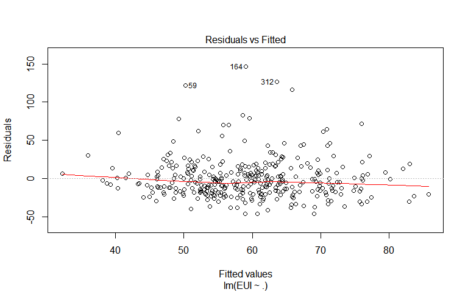
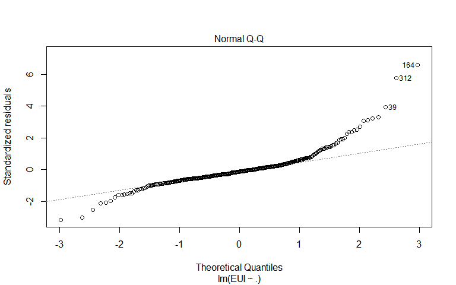
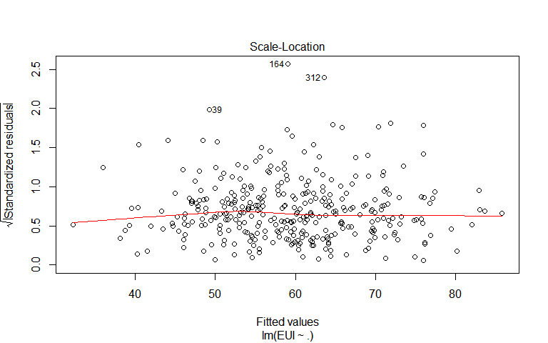
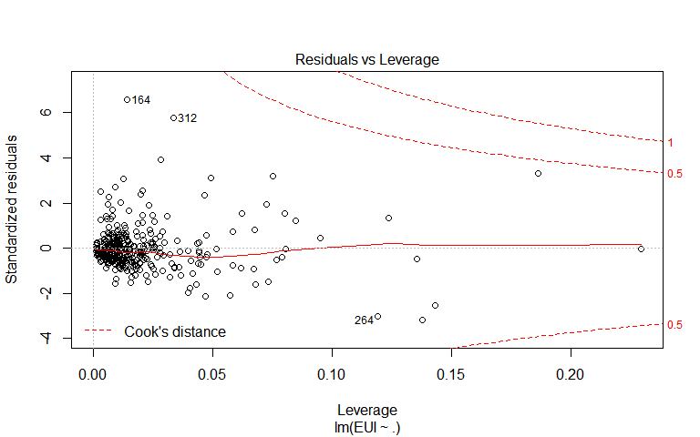
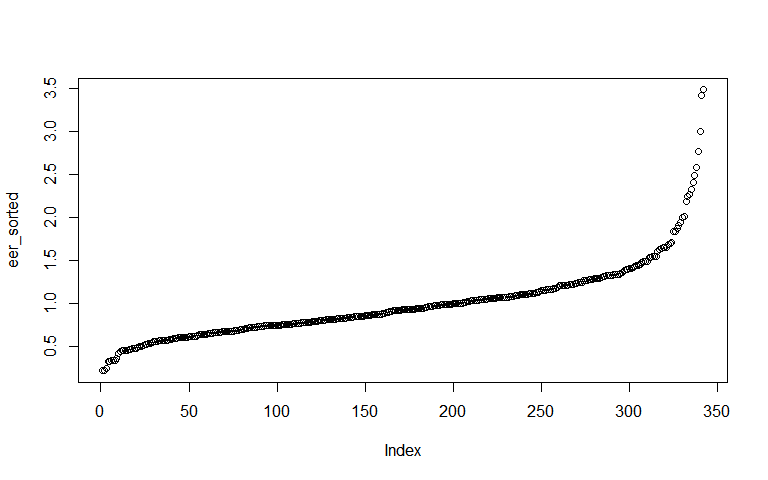
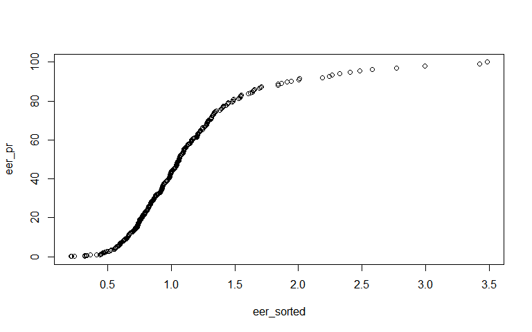
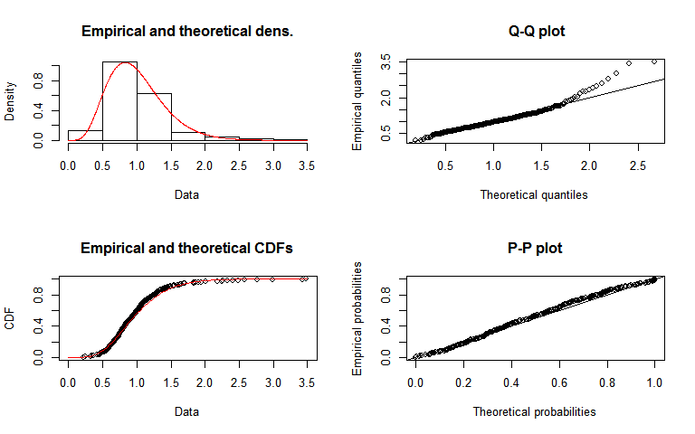
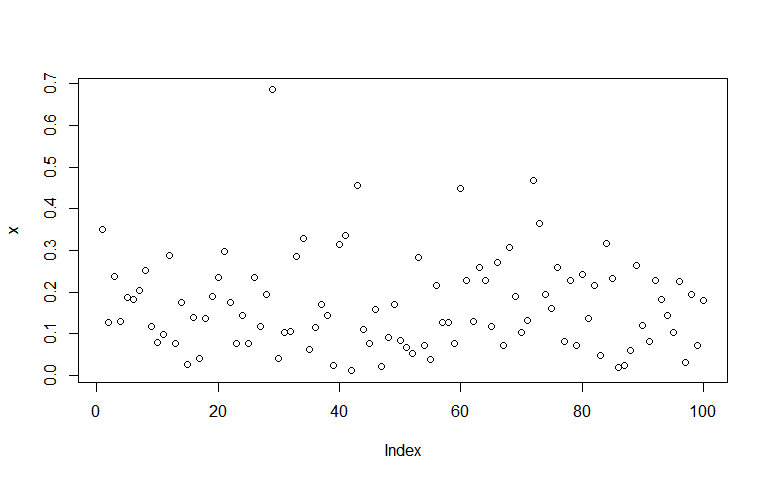
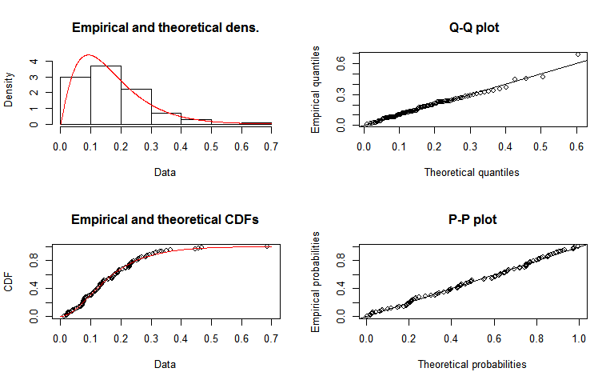

---
output:
  word_document: default
  pdf_document: default
  html_document: default
---
Implementation of ENERGY STAR Score for K-12 Schools
================

-   [Include required packages](#include-required-packages)
-   [Load the CBECS 2012 survey micro dataset](#load-the-cbecs-2012-survey-micro-dataset)
-   [Filter the data for K-12 schools](#filter-the-data-for-k-12-schools)
-   [Prepare training dataset](#prepare-training-dataset)
-   [Fit Regression model and calculate Energy Efficiency Ratio](#fit-regression-model-and-calculate-energy-efficiency-ratio)

This is a replication of ENERGY STAR Score implimentation for K-12 school buildings, as described in <https://www.energystar.gov/buildings/tools-and-resources/energy-star-score-k-12-schools>

#### Include required packages

``` r
library(readxl)
library(readr)
library(dplyr)
library(rpart)
library(rpart.plot)
library(rpart.utils)
library(sfa)
library(frontier)
library(likert)
library(mosaic)
library(ggpubr)
library(stringr)
library(ggridges)
library(egg) # same width for legends
library(stringi)
library(caret)
library(ipred)
library(fitdistrplus)   # fitting distributions, e.g. gamma
```

#### Load the CBECS 2012 survey micro dataset

``` r
cbecs = read_csv("data/2012_public_use_data_aug2016.csv")

cols = c( "PBAPLUS",
          "MFBTU", 
          "FINALWT",
          #"ELBTU", "NGBTU", "FKBTU", "DHBTU",
          "ONEACT", "ACT1", "ACT2", "ACT3", "ACT1PCT", "ACT2PCT", "ACT3PCT",
          "PRAMTC", "PRUNIT",
          "CWUSED", "WOUSED", "COUSED", "SOUSED",
          #"NWKER", "RFGWIN", "EDSEAT",
          #"HDD65", "CDD65", "HEATP", "COOLP",
          "SQFT",       "NFLOOR",   "NELVTR",   "NESLTR",   "EDSEAT",   "COURT",
          "MONUSE", "OPNWE",    "WKHRS",    "NWKER",    "COOK",     "HEATP",
          "COOLP",  "SNACK",    "FASTFD",   "CAF",      "FDPREP",   "KITCHN",
          "BREAKRM",    "OTFDRM",   "LABEQP",   "POOL",     "HTPOOL",   "RFGRES",
          "RFGCOMPN",   "RFGWIN",   "RFGOPN",   "RFGCLN",   "RFGVNN",   "RFGICN",
          "PCTERMN",    "LAPTPN",   "PRNTRN",   "SERVERN",  "TRNGRM",   "STDNRM",
          "WBOARDS",    "TVVIDEON", "RGSTRN",   "COPIERN",  "HDD65",    "CDD65")
cbecs1 = cbecs[, cols]
```

#### Filter the data for K-12 schools

-   Filter by school type (elementary/middle/high schools), minimum total working hours (atleast 30 hours per week), months in use (at least 8 months per year), workers (atleast 1 worker), and seats (at least 1 seat).

``` r
# VERFIFY MFBTU = sum("ELBTU", "NGBTU", "FKBTU", "DHBTU")
#df1 = cbecs1[, 3:6]
#rs = rowSums(df1, na.rm = T)
#df2 = data.frame(btu = cbecs1$MFBTU, rs)
#df2["diff"] = df2$btu - df2$rs
#df3 = df2[df2$diff > 0, ]

cbecs2 = cbecs1 %>% 
  #distinct() %>%
  filter(PBAPLUS == 28 | PBAPLUS == 29 ) %>%
  filter(WKHRS  >= 30) %>% 
  filter(MONUSE >= 8) %>%
  filter(NWKER  >= 1) %>%
  filter(EDSEAT >= 1)
print (paste("Total rows :", nrow(cbecs2)))
```

    ## [1] "Total rows : 517"

-   Filter by higherest single activity as education.

if ONEACT=1, then primary activity of this building is 75% or more. if ONEACT=2, then the sub activities on this building are defined in ACT1, ACT2, and ACT3, and their corresponding percentage is defined in ACT1PCT, ACT2PCT, and ACT3PCT, respectively.

ACTx should be 17 (education) and its corresponding ACTxPCT &gt;= 50 to qualify for single highest activity as educational building.

Note: There is some problem here as act21 should contain only 2 rows (as per original document) but we have 4. So the final rows may differ.

``` r
act1 = cbecs2 %>% filter(ONEACT == 1)  # 75% or more the buildings
act2 = cbecs2 %>% filter(ONEACT == 2)  # then, activities are defiend in ACT1, ACT2, ACT3
act21 = act2 %>% 
  filter( (ACT1 == 17 & ACT1PCT > 50) | (ACT2 == 17 & ACT2PCT > 50) | (ACT3 == 17 & ACT3PCT > 50))

cbecs2 = rbind(act1, act21)
print (paste("Total rows :", nrow(cbecs2)))
```

    ## [1] "Total rows : 515"

-   Filter by square foot (&lt;= 1,000,000) and propane used amount (&lt; 1000)

``` r
cbecs3 = cbecs2
cbecs3 = cbecs3 %>% filter(!is.na(MFBTU))
cbecs3 = cbecs3 %>% filter(SQFT <= 1000000)
cbecs3 = cbecs3 %>% filter(is.na(PRAMTC) | PRAMTC == 1 | PRAMTC == 2 | PRAMTC == 3 )
print (paste("Total rows :", nrow(cbecs3)))
```

    ## [1] "Total rows : 498"

-   Filter untracked energy usages (must not use chilled water, wood, coal, or solar)

``` r
#must not use chilled water, wood, coal, or solar
cbecs4 = cbecs3
cbecs4 = cbecs4 %>% 
  filter(CWUSED == 2) %>%
  filter(WOUSED == 2) %>% 
  filter(COUSED == 2) %>% 
  filter(SOUSED == 2)
print (paste("Total rows :", nrow(cbecs4)))
```

    ## [1] "Total rows : 459"

-   Filter by EUI (&lt; 250)

Note that the annual major fuel consumption (MFBTU), is the sum of annual electricity (ELBTU), natural gas (NGBTU), fuel oil (FKBTU), and district heat (DHBTU) consumption. So we use MFBTU as the total source energy for calculating soure EUI.

Note: Filtred rows differ from original document.

``` r
cbecs5 = cbecs4
#cbecs5["EUI"] = round(cbecs5$MFBTU / cbecs5$SQFT, 1)
cbecs5["EUI"] = round(cbecs5$MFBTU / cbecs5$SQFT * 2.80, 1)

cbecs5 = cbecs5 %>%
  mutate(SOURCE_ENERGY = ELBTU*2.80 + NGBTU*1.05 + FKBTU*1.01 + DHBTU) %>% 
  mutate(SOURCE_EUI = round(SOURCE_ENERGY/SQFT, 2)) %>%
  mutate(SITE_EUI = round(MFBTU/SQFT, 2))
  

cbecs5 = cbecs5 %>% 
  filter(SOURCE_EUI <= 250)
print (paste("Total rows :", nrow(cbecs5)))
```

    ## [1] "Total rows : 456"

-   Filter by maximum allowed workers (&lt; 1.9 per 1000 sqft), walk-in refrigeration (&lt; 0.06 per 1000 sqft), seats (17 per sqft), and operational hours ( &lt; 140 per week).

``` r
#"NWKER", "RFGWIN", "EDSEAT",
cbecs6 = cbecs5
cbecs6 = cbecs6 %>% 
  filter(NWKER  / SQFT * 1000 <= 1.9) %>% 
  filter(is.na(RFGWIN) | (RFGWIN / SQFT * 1000 < 0.06)) %>% 
  filter(EDSEAT / SQFT * 1000 <= 17) %>%
  filter(WKHRS <= 140)
write_csv(cbecs6, "data/cbecs_k12school_filtered.csv")
print (paste("Total rows :", nrow(cbecs6)))
```

    ## [1] "Total rows : 361"

#### Prepare training dataset

``` r
FINALWT     = cbecs6$FINALWT
EUI         = cbecs6$EUI 
NWKER_SQFT  = round(cbecs6$NWKER / cbecs6$SQFT * 1000, 2)
HDD_HEATP   = cbecs6$HDD65 * cbecs6$HEATP / 100
CDD_COOLP   = cbecs6$CDD65 * cbecs6$COOLP / 100
COOK        = cbecs6$COOK
OPNWE       = cbecs6$OPNWE
ISHC        = as.numeric(cbecs6$PBAPLUS == 29)
# convert 2's (NO) to 0s
COOK[COOK == 2] = 0
OPNWE[OPNWE == 2] = 0

train = data.frame(EUI, NWKER_SQFT, HDD_HEATP, CDD_COOLP, COOK, OPNWE, ISHC, FINALWT)
train = na.omit(train)

summary(train)
```

    ##       EUI           NWKER_SQFT       HDD_HEATP      CDD_COOLP      
    ##  Min.   : 11.20   Min.   :0.1200   Min.   : 115   Min.   :  12.76  
    ##  1st Qu.: 40.30   1st Qu.:0.5200   1st Qu.:2623   1st Qu.: 650.35  
    ##  Median : 54.50   Median :0.6800   Median :4017   Median :1215.33  
    ##  Mean   : 59.02   Mean   :0.7409   Mean   :3892   Mean   :1389.72  
    ##  3rd Qu.: 69.75   3rd Qu.:0.9100   3rd Qu.:5306   3rd Qu.:1897.00  
    ##  Max.   :205.70   Max.   :1.8800   Max.   :7932   Max.   :4883.00  
    ##       COOK            OPNWE             ISHC           FINALWT       
    ##  Min.   :0.0000   Min.   :0.0000   Min.   :0.0000   Min.   :  15.95  
    ##  1st Qu.:1.0000   1st Qu.:0.0000   1st Qu.:0.0000   1st Qu.: 125.65  
    ##  Median :1.0000   Median :0.0000   Median :0.0000   Median : 207.13  
    ##  Mean   :0.8099   Mean   :0.3596   Mean   :0.2836   Mean   : 272.02  
    ##  3rd Qu.:1.0000   3rd Qu.:1.0000   3rd Qu.:1.0000   3rd Qu.: 356.20  
    ##  Max.   :1.0000   Max.   :1.0000   Max.   :1.0000   Max.   :2293.59

``` r
write_csv(train, "data/cbecs_k12school_train.csv")
print (paste("Total rows :", nrow(train)))
```

    ## [1] "Total rows : 342"

#### Fit Regression model and calculate Energy Efficiency Ratio

``` r
train1 = train
#train1$NWKER_SQFT = train1$NWKER_SQFT - mean(train1$NWKER_SQFT)
#train1$HDD_HEATP = train1$HDD_HEATP - mean(train1$HDD_HEATP)
#train1$CDD_COOLP = train1$CDD_COOLP - mean(train1$CDD_COOLP)

lmfit = lm(EUI ~ ., data = train1[, -c(8)], weights = train1$FINALWT)
print(summary(lmfit))
```

    ## 
    ## Call:
    ## lm(formula = EUI ~ ., data = train1[, -c(8)], weights = train1$FINALWT)
    ## 
    ## Weighted Residuals:
    ##     Min      1Q  Median      3Q     Max 
    ## -1329.7  -230.3   -57.7   118.1  2945.2 
    ## 
    ## Coefficients:
    ##              Estimate Std. Error t value Pr(>|t|)    
    ## (Intercept) 21.260522   8.563848   2.483 0.013532 *  
    ## NWKER_SQFT  10.157047   4.733185   2.146 0.032597 *  
    ## HDD_HEATP    0.004257   0.001233   3.454 0.000624 ***
    ## CDD_COOLP    0.004112   0.002020   2.035 0.042601 *  
    ## COOK         3.016396   3.361850   0.897 0.370234    
    ## OPNWE        5.986215   3.445547   1.737 0.083240 .  
    ## ISHC        12.963069   3.635995   3.565 0.000416 ***
    ## ---
    ## Signif. codes:  0 '***' 0.001 '**' 0.01 '*' 0.05 '.' 0.1 ' ' 1
    ## 
    ## Residual standard error: 450.4 on 335 degrees of freedom
    ## Multiple R-squared:  0.1056, Adjusted R-squared:  0.0896 
    ## F-statistic: 6.593 on 6 and 335 DF,  p-value: 1.337e-06

``` r
plot(lmfit)
```



-   Calculate energy efficiency ratio

``` r
lmPred = predict(lmfit, train1[, -c(8)])
eer = train1$EUI / lmPred
#plot(eer)
eer_sorted = sort(eer)
plot(eer_sorted)
```



-   Plot cumaltive percentage for energy efficiency ratio

``` r
eer_cs = cumsum(eer_sorted)
eer_pr = cumsum(eer_sorted) / sum(eer_sorted) * 100
plot(eer_sorted,eer_pr)
```



-   Fit gamma distribution to energy efficiency ratio

``` r
fit.gamma <- fitdist(eer, distr = "gamma")
summary(fit.gamma)
```

    ## Fitting of the distribution ' gamma ' by maximum likelihood 
    ## Parameters : 
    ##       estimate Std. Error
    ## shape 5.828674  0.4335739
    ## rate  5.841804  0.4538215
    ## Loglikelihood:  -162.6337   AIC:  329.2674   BIC:  336.9371 
    ## Correlation matrix:
    ##           shape      rate
    ## shape 1.0000000 0.9575363
    ## rate  0.9575363 1.0000000

``` r
plot(fit.gamma)
```



##### Test code

``` r
set.seed(2017)
x <- rgamma(100,2,11) + rnorm(100,0,.01)
plot(x)
```



``` r
library(fitdistrplus)
fit.gamma <- fitdist(x, distr = "gamma", method = "mle")
summary(fit.gamma)
```

    ## Fitting of the distribution ' gamma ' by maximum likelihood 
    ## Parameters : 
    ##        estimate Std. Error
    ## shape  2.185415  0.2885935
    ## rate  12.850432  1.9066390
    ## Loglikelihood:  91.41958   AIC:  -178.8392   BIC:  -173.6288 
    ## Correlation matrix:
    ##           shape      rate
    ## shape 1.0000000 0.8900242
    ## rate  0.8900242 1.0000000

``` r
plot(fit.gamma)
```



``` r
fit.gamma <- fitdist(x, distr = "gamma", method = "mle")
summary(fit.gamma)
```

    ## Fitting of the distribution ' gamma ' by maximum likelihood 
    ## Parameters : 
    ##        estimate Std. Error
    ## shape  2.185415  0.2885935
    ## rate  12.850432  1.9066390
    ## Loglikelihood:  91.41958   AIC:  -178.8392   BIC:  -173.6288 
    ## Correlation matrix:
    ##           shape      rate
    ## shape 1.0000000 0.8900242
    ## rate  0.8900242 1.0000000
