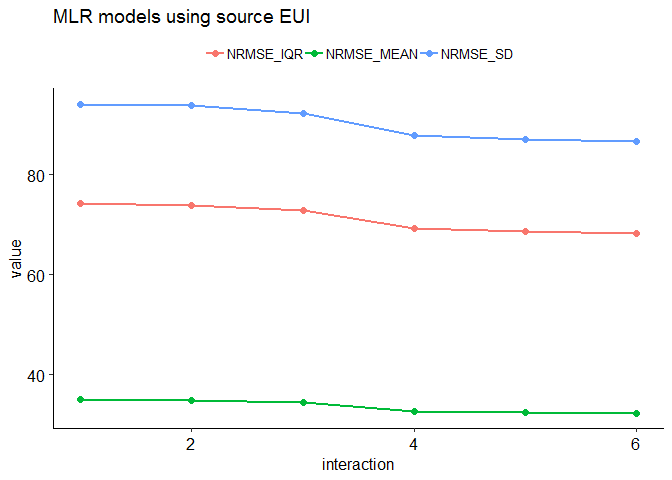
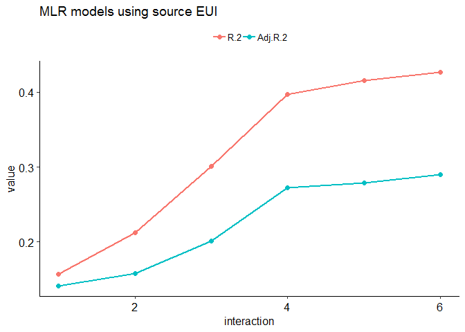
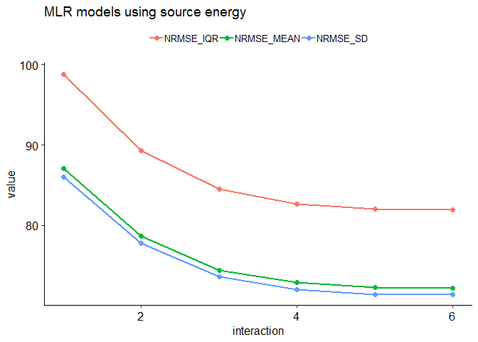

Benchmarking K-12 Schools
================
Pandarasamy Arjunan
3 June 2019

-   [Load dataset](#load-dataset)
-   [Apply filters](#apply-filters)
-   [Prepare features](#prepare-features)
-   [Descriptive statistics](#descriptive-statistics)
    -   [Data Frame Summary](#data-frame-summary)
-   [Build predictive models](#build-predictive-models)
    -   [Multiple Linear Regression (MLR)](#multiple-linear-regression-mlr)
    -   [Multiple Linear Regression (MLR) with Interaction terms](#multiple-linear-regression-mlr-with-interaction-terms)
    -   [Comparision of MLR models](#comparision-of-mlr-models)

Load dataset
------------

``` r
building_type = "k12school"

filtered_dir = './data/cbecs/filtered/'
dir.create(filtered_dir, recursive = T, showWarnings = F)

features_dir = './data/cbecs/features/'
dir.create(features_dir, recursive = T, showWarnings = F)

results_dir = './results/cbecs/'
dir.create(results_dir, recursive = T, showWarnings = F)
```

``` r
cbecs = read.csv("data/cbecs/2012_public_use_data_aug2016.csv")

var1 = c( 'SQFT', 'NFLOOR', 'NELVTR', 'NESLTR', 'EDSEAT',
          'COURT', 'MONUSE', 'OPNWE', 'WKHRS', 'NWKER',
          'COOK',  'HEATP',   'COOLP',  'SNACK', 'FASTFD',
          'CAF',   'FDPREP',   'KITCHN', 'BREAKRM', 'OTFDRM',
          'LABEQP', 'POOL',   'HTPOOL', 'RFGRES', 'RFGCOMPN',
          'RFGWIN', 'RFGOPN', 'RFGCLN', 'RFGVNN', 'RFGICN',
          'PCTERMN', 'LAPTPN', 'PRNTRN', 'SERVERN', 'TRNGRM',
          'STDNRM',  'WBOARDS', 'TVVIDEON', 'RGSTRN', 'COPIERN',
          'HDD65',  'CDD65')

var2 = c( "PBAPLUS", "PBA", "FINALWT",
          "MFBTU", 
          "ELBTU", "NGBTU", "FKBTU", "DHBTU",
          "ONEACT", "ACT1", "ACT2", "ACT3", "ACT1PCT", "ACT2PCT", "ACT3PCT",
          "PRAMTC", "PRUNIT",
          "CWUSED", "WOUSED", "COUSED", "SOUSED", "PRUSED")

schools = cbecs[, c(var1, var2)]
```

Apply filters
-------------

As per Energy Star's technical document [ENERGY STAR Score for K-12 Schools](https://www.energystar.gov/buildings/tools-and-resources/energy-star-score-k-12-schools), following filters are applied to define the peer group and to remove any outliers.

After applying each filter, the number of remaining buildings in the dataset (*Number Remaining: X*) and any difference (*Difference: X*) in count from the original Energy Star's technical documentation is also given.

1.  **Calculate source energy and source EUI**

    ``` r
    ## convert electricity, natural gas, fuel oil, and district heat to source energy
    s0 = schools %>% 
      mutate(ELBTU0 = ELBTU*2.80) %>%
      mutate(NGBTU0 = NGBTU*1.05) %>%
      mutate(FKBTU0 = FKBTU*1.01) %>%
      mutate(DHBTU0 = DHBTU*1.20) %>%
      mutate(SOURCE_ENERGY = rowSums(dplyr::select(., c(ELBTU0,NGBTU0,FKBTU0,DHBTU0)), na.rm = T)) %>% 
      mutate(SOURCE_EUI = round(SOURCE_ENERGY/SQFT, 2)) %>%
      mutate(SITE_EUI = round(MFBTU/SQFT, 2)) %>%
      mutate(NGBTU_PERCENT = round(NGBTU / SOURCE_ENERGY * 100, 2)) %>% 
      mutate(SUMBTU = rowSums(dplyr::select(., c(ELBTU,NGBTU,FKBTU,DHBTU)), na.rm = T))

    #Is MFBTU the sum of ELBTU,NGBTU,FKBTU,DHBTU? YES.
    #summary(o14$MFBTU - o14$SUMBTU)
    ```

2.  **PBAPLUS = 28 or 29** <br/>Building Type Filter – CBECS defines building types according to the variable “PBAPLUS.” Elementary/Middle Schools are coded as PBAPLUS=28; High Schools are coded as PBAPLUS=29. <br/>Number Remaining: 539. <br/>Difference: 0.

    ``` r
    s1 = s0 %>% filter(PBAPLUS %in% c(28, 29))
    ```

3.  **Must operate for at least 30 hours per week** <br/>EPA Program Filter – Baseline condition for being a full time K-12 school. <br/>Number Remaining: 523. <br/>Difference: 0.

    ``` r
    s2 = s1 %>% filter(WKHRS >= 30)
    ```

4.  **Must operate for at least 8 months per year** <br/>EPA Program Filter – Baseline condition for being a full time K-12 school. <br/>Number Remaining: 517. <br/>Difference: 0.

    ``` r
    s3 = s2 %>% filter(MONUSE >= 8)
    ```

5.  **Must have at least 1 worker** <br/>EPA Program Filter – Baseline condition for being a full time K-12 school. <br/>Number Remaining: 517. <br/>Difference: 0.

    ``` r
    s4 = s3 %>% filter(NWKER >= 1)
    ```

6.  **Must have at least 1 classroom seat** <br/>EPA Program Filter – Baseline condition for being a full time K-12 school. <br/>Number Remaining: 517. <br/>Difference: 0.

    ``` r
    s5 = s4 %>% filter(EDSEAT >= 1)
    ```

7.  **A single activity must characterize greater than 50% of the floor space** <br/>EPA Program Filter – In order to be considered part of the K-12 school peer group, more than 50% of the building must be defined as elementary/middle school or high school. This filter is applied by a set of screens. If the variable ONEACT=1, then one activity occupies 75% or more of the building. If the variable ONEACT=2, then the activities in the building are defined by ACT1, ACT2, and ACT3. One of these activities must be coded as education (PBAX=17), with a corresponding percent (ACT1PCT, ACT2PCT, ACT3PCT) that is greater than 50. <br/>Number Remaining: 513. <br/>Difference: 0.

    ``` r
    s6 = s5 %>% 
      filter( (ONEACT == 1) |
            (ONEACT == 2 & 
               ((ACT1 == 17 & ACT1PCT > 50) | 
                  (ACT1 == 17 & ACT2PCT > 50) | 
                  (ACT1 == 17 & ACT2PCT > 50) )))
    ```

8.  **Must report energy usage** <br/>EPA Program Filter – Baseline condition for being a full time K-12 school. <br/>Number Remaining: 513. <br/>Difference: 0.

    ``` r
    s7 = s6 %>% filter(!is.na(MFBTU))
    ```

9.  **Must be less than or equal to 1,000,000 square feet** <br/>Data Limitation Filter – CBECS masks surveyed properties at or above above 1,000,000 square feet by applying regional averages. <br/>Number Remaining: 513. <br/>Difference: 0.

    ``` r
    s8 = s7 %>% filter(SQFT <= 1000000)
    ```

10. **If propane is used, the amount category (PRAMTC) must equal 1, 2, or 3** Data Limitation Filter – Cannot estimate propane use if the quantity is “greater than 1000” or unknown. <br/>Number Remaining: 496. <br/>Difference: 0.

    ``` r
    s9 = s8 %>% filter(is.na(PRAMTC) | PRAMTC %in% c(1,2,3))
    ```

11. **If propane is used, the unit (PRUNIT) must be known** <br/>Data Limitation Filter – Cannot estimate propane use if the unit is unknown. <br/>Number Remaining: 496. <br/>Difference: 0.

    ``` r
    s10 = s9 %>% filter(is.na(PRUNIT) | PRUNIT %in% c(1,2))
    ```

12. **If propane is used, the maximum estimated propane amount must be 10% or less of the total source energy** <br/>Data Limitation Filter – Because propane values are estimated from a range, propane is restricted to 10% of the total source energy. <br/>Number Remaining: 490. <br/>Difference: -6.

    ``` r
    s11 = s10 %>% 
      filter( PRUSED == 2 | is.na(NGBTU_PERCENT) == T | 
            ( PRUSED == 1 & NGBTU_PERCENT <= 10))
    ```

13. **must not use chilled water, wood, coal, or solar** <br/>Data Limitation Filter – CBECS does not collect quantities of chilled water, wood, coal, or solar. <br/>Number Remaining: 451. <br/>Difference: -6.

    ``` r
    s12 = s11 %>% 
      filter(CWUSED == 2 & WOUSED == 2 & COUSED == 2 & SOUSED == 2)
    ```

14. **Must have Source EUI no greater than 250 kBtu/ft2** <br/>Analytical Filter – Values determined to be statistical outliers. <br/>Number Remaining: 429. <br/>Difference: -6.

    ``` r
    s13 = s12 %>% filter(SOURCE_EUI <= 250)
    ```

15. **Must have no more than 1.9 workers per 1,000 square feet** <br/>Analytical Filter – Values determined to be statistical outliers. <br/>Number Remaining: 405. <br/>Difference: -6.

    ``` r
    s14 = s13 %>% filter(NWKER  / SQFT * 1000 <= 1.9)
    ```

16. **Must have no more than 0.06 walk-in refrigeration per 1,000 square feet** <br/>Analytical Filter – Values determined to be statistical outliers. <br/>Number Remaining: 396. <br/>Difference: -6.

    ``` r
    s15 = s14 %>% filter(is.na(RFGWIN) | (RFGWIN / SQFT * 1000 <= 0.06)) 
    ```

17. **Must have no more than 17 classroom seats per 1,000 square feet** <br/>Analytical Filter – Values determined to be statistical outliers. <br/>Number Remaining: 349. <br/>Difference: -6.

    ``` r
    s16 = s15 %>% filter(EDSEAT / SQFT * 1000 <= 17)
    ```

18. **Must operate no more than 140 hours per week** <br/>Analytical Filter – Values determined to be statistical outliers. <br/>Number Remaining: 344. <br/>Difference: -6.

    ``` r
    s17 = s16 %>% filter(WKHRS <= 140)
    ```

**Save the filtered dataset**

``` r
write.csv(s17, paste0(filtered_dir, building_type, ".csv"), row.names = F)
```

Prepare features
----------------

The final regression equation includes the following variables:  - Number of Workers per 1,000 Square Feet - Heating Degree Days times Percent of the Building that is Heated - Cooling Degree Days times Percent of the Building that is Cooled - Whether there is Energy Used for Cooking (1 = yes, 0 = no) - Whether the School is Open on Weekends (1 = yes, 0 = no) - Whether the School is a High School (1 = yes, 0 = no)

``` r
k12school = read.csv(paste0(filtered_dir, building_type, ".csv"))

data = k12school %>%
  mutate(NWKER_SQFT = NWKER/SQFT * 1000) %>%
  mutate(CDD65_COOLP = CDD65 * COOLP / 100) %>%
  mutate(HDD65_HEATP = HDD65 * HEATP / 100) %>%
  mutate(IsCooking = ifelse(COOK == 1, "Yes", "No")) %>%
  mutate(IsOpenWeekends = ifelse(OPNWE == 1, "Yes", "No")) %>%
  mutate(IsHighSchool = ifelse(PBAPLUS == 29, "Yes", "No")) %>% 
  mutate_if(is.numeric, round, 3)

ivars = c(
  #"SQFT", 
          "NWKER_SQFT", "HDD65_HEATP",
          "CDD65_COOLP", "IsCooking",
          "IsOpenWeekends", "IsHighSchool")

dvars  = c("SOURCE_EUI", "SOURCE_ENERGY", "FINALWT")

features = data[, c(ivars, dvars)]
features = features %>% na.omit()

write.csv(features, 
          paste0(features_dir, building_type, ".csv"), 
          row.names = F)
#write.csv(features, paste0(save_dir2, "k12school.csv"), row.names = F)
```

Descriptive statistics
----------------------

``` r
features1 = features

features1 = features1 %>% dplyr::select(-one_of('SOURCE_ENERGY', 'FINALWT'))

summarytools::descr(features1, stats = "common", 
                    transpose = TRUE, 
                    headings = FALSE)
```

    Non-numerical variable(s) ignored: IsCooking, IsOpenWeekends, IsHighSchool

|                  |     Mean|  Std.Dev|     Min|   Median|      Max|  N.Valid|  Pct.Valid|
|-----------------:|--------:|--------:|-------:|--------:|--------:|--------:|----------:|
|  **CDD65\_COOLP**|  1402.62|  1043.28|   12.76|  1234.80|  4883.00|   327.00|     100.00|
|  **HDD65\_HEATP**|  3853.59|  1847.05|  115.00|  3949.00|  7932.00|   327.00|     100.00|
|   **NWKER\_SQFT**|     0.74|     0.33|    0.12|     0.68|     1.88|   327.00|     100.00|
|   **SOURCE\_EUI**|   114.75|    42.75|   29.88|   109.62|   241.85|   327.00|     100.00|

``` r
dfSummary(features1, plain.ascii = FALSE, style = "grid", 
          graph.magnif = 0.75, valid.col = FALSE)
```

    text graphs are displayed; set 'tmp.img.dir' parameter to activate png graphs

### Data Frame Summary

**features1**
**Dimensions:** 327 x 7
**Duplicates:** 0

<table>
<colgroup>
<col width="4%" />
<col width="16%" />
<col width="28%" />
<col width="20%" />
<col width="20%" />
<col width="9%" />
</colgroup>
<thead>
<tr class="header">
<th>No</th>
<th>Variable</th>
<th>Stats / Values</th>
<th>Freqs (% of Valid)</th>
<th>Graph</th>
<th>Missing</th>
</tr>
</thead>
<tbody>
<tr class="odd">
<td><p>1</p></td>
<td><p>NWKER_SQFT<br />
[numeric]</p></td>
<td><p>Mean (sd) : 0.7 (0.3)<br />
min &lt; med &lt; max:<br />
0.1 &lt; 0.7 &lt; 1.9<br />
IQR (CV) : 0.4 (0.4)</p></td>
<td><p>249 distinct values</p></td>
<td><p><br />
    : .<br />
    : :<br />
  : : : :<br />
  : : : : :<br />
: : : : : : . . .</p></td>
<td><p>0<br />
(0%)</p></td>
</tr>
<tr class="even">
<td><p>2</p></td>
<td><p>HDD65_HEATP<br />
[numeric]</p></td>
<td><p>Mean (sd) : 3853.6 (1847.1)<br />
min &lt; med &lt; max:<br />
115 &lt; 3949 &lt; 7932<br />
IQR (CV) : 2762.5 (0.5)</p></td>
<td><p>317 distinct values</p></td>
<td><p><br />
    :   : :<br />
    : : : :<br />
  : : : : : :<br />
: : : : : : :<br />
: : : : : : : :</p></td>
<td><p>0<br />
(0%)</p></td>
</tr>
<tr class="odd">
<td><p>3</p></td>
<td><p>CDD65_COOLP<br />
[numeric]</p></td>
<td><p>Mean (sd) : 1402.6 (1043.3)<br />
min &lt; med &lt; max:<br />
12.8 &lt; 1234.8 &lt; 4883<br />
IQR (CV) : 1255.7 (0.7)</p></td>
<td><p>318 distinct values</p></td>
<td><dl>
<dt></dt>
<dd>  :<br />

</dd>
<dd>: : .<br />

</dd>
<dd>: : : .<br />

</dd>
<dd>: : : :<br />

</dd>
<dd>: : : : . : : .
</dd>
</dl></td>
<td><p>0<br />
(0%)</p></td>
</tr>
<tr class="even">
<td><p>4</p></td>
<td><p>IsCooking<br />
[character]</p></td>
<td><p>1. No<br />
2. Yes</p></td>
<td><p>62 (19.0%)<br />
265 (81.0%)</p></td>
<td><p>III<br />
IIIIIIIIIIIIIIII</p></td>
<td><p>0<br />
(0%)</p></td>
</tr>
<tr class="odd">
<td><p>5</p></td>
<td><p>IsOpenWeekends<br />
[character]</p></td>
<td><p>1. No<br />
2. Yes</p></td>
<td><p>211 (64.5%)<br />
116 (35.5%)</p></td>
<td><p>IIIIIIIIIIII<br />
IIIIIII</p></td>
<td><p>0<br />
(0%)</p></td>
</tr>
<tr class="even">
<td><p>6</p></td>
<td><p>IsHighSchool<br />
[character]</p></td>
<td><p>1. No<br />
2. Yes</p></td>
<td><p>237 (72.5%)<br />
90 (27.5%)</p></td>
<td><p>IIIIIIIIIIIIII<br />
IIIII</p></td>
<td><p>0<br />
(0%)</p></td>
</tr>
<tr class="odd">
<td><p>7</p></td>
<td><p>SOURCE_EUI<br />
[numeric]</p></td>
<td><p>Mean (sd) : 114.7 (42.8)<br />
min &lt; med &lt; max:<br />
29.9 &lt; 109.6 &lt; 241.8<br />
IQR (CV) : 54.2 (0.4)</p></td>
<td><p>325 distinct values</p></td>
<td><p><br />
    . :<br />
    : : :<br />
  . : : : :<br />
  : : : : : .<br />
: : : : : : : . : .</p></td>
<td><p>0<br />
(0%)</p></td>
</tr>
</tbody>
</table>

**Extract R code from Rmd document**

``` r
#knitr::purl("k12school.Rmd", output = "k12school.R", documentation = 2)
```

Build predictive models
-----------------------

``` r
source("models.R")
source("metrics.R")

data = read.csv(paste0(features_dir, building_type, ".csv"))

cat(colnames(data))
```

NWKER\_SQFT HDD65\_HEATP CDD65\_COOLP IsCooking IsOpenWeekends IsHighSchool SOURCE\_EUI SOURCE\_ENERGY FINALWT

``` r
allMetrics = NULL
```

### Multiple Linear Regression (MLR)

#### Using SOURCE\_EUI as dependent variable

``` r
y = "SOURCE_EUI"
w = "FINALWT"
o = c("SOURCE_ENERGY", "SQFT")
x = setdiff(colnames(data), c(y, w, o))
wt = data[, w]
intr = 1

mlrFit = MLR(data, x, y, w, interaction = intr)

obs  = data[, y]
pred = as.numeric(predict(mlrFit))

mlrMetrics1 = getMLRmetrics(mlrFit, obs, pred, wt)
mlrMetrics1 = data.frame(
  "model" = "MLR",
  "dependent" = y,
  "interaction" = intr,
  "transform" = "meanCent",
  mlrMetrics1)

allMetrics = rbind(allMetrics, mlrMetrics1)

knitr::kable(mlrMetrics1, row.names = F)
```

| model | dependent   |  interaction| transform |  obs|  rank|  coef|    R.2|  Adj.R.2|       mse|    rmse|     mae|   mape|  nrmse\_iqr|  nrmse\_range|  nrmse\_mean|  nrmse\_sd|
|:------|:------------|------------:|:----------|----:|-----:|-----:|------:|--------:|---------:|-------:|-------:|------:|-----------:|-------------:|------------:|----------:|
| MLR   | SOURCE\_EUI |            1| meanCent  |  327|     7|     7|  0.157|    0.141|  1619.832|  40.247|  31.896|  0.331|      74.222|        18.987|       35.075|     94.142|

#### Using SOURCE\_ENERGY as dependent variable\*\*

``` r
y = "SOURCE_ENERGY"
w = "FINALWT"
o = c("SOURCE_EUI")
x = setdiff(colnames(data), c(y, w, o))
wt = data[, w]
intr = 1

mlrFit = MLR(data, x, y, w, interaction = intr)

obs  = data[, y]
pred = as.numeric(predict(mlrFit))

mlrMetrics2 = getMLRmetrics(mlrFit, obs, pred, wt)
mlrMetrics2 = data.frame(
  "model" = "MLR",
  "dependent" = y,
  "interaction" = intr,
  "transform" = "meanCent",
  mlrMetrics2)
allMetrics = rbind(allMetrics, mlrMetrics2)
knitr::kable(allMetrics, row.names = F)
```

| model | dependent      |  interaction| transform |  obs|  rank|  coef|    R.2|  Adj.R.2|           mse|          rmse|          mae|   mape|  nrmse\_iqr|  nrmse\_range|  nrmse\_mean|  nrmse\_sd|
|:------|:---------------|------------:|:----------|----:|-----:|-----:|------:|--------:|-------------:|-------------:|------------:|------:|-----------:|-------------:|------------:|----------:|
| MLR   | SOURCE\_EUI    |            1| meanCent  |  327|     7|     7|  0.157|    0.141|  1.619832e+03|        40.247|       31.896|  0.331|      74.222|        18.987|       35.075|     94.142|
| MLR   | SOURCE\_ENERGY |            1| meanCent  |  327|     7|     7|  0.301|    0.288|  1.344743e+14|  11596306.583|  6835185.379|  0.994|      98.802|        12.156|       87.043|     86.040|

### Multiple Linear Regression (MLR) with Interaction terms

#### Using SOURCE\_EUI as dependent variable

``` r
y = "SOURCE_EUI"
w = "FINALWT"
o = c("SOURCE_ENERGY", "SQFT")
x = setdiff(colnames(data), c(y, w, o))
wt = data[, w]

intr_depth = length(x)

for (intr in 2:intr_depth) {
  
  mlrFit = MLR(data, x, y, w, interaction = intr)
  obs  = data[, y]
  pred = as.numeric(predict(mlrFit))
  
  mlrMetrics = getMLRmetrics(mlrFit, obs, pred, wt)
  mlrMetrics = data.frame(
    "model" = paste0("MLRi", intr),
    "dependent" = y,
    "interaction" = intr,
    "transform" = "meanCent",
    mlrMetrics)
  
  allMetrics = rbind(allMetrics, mlrMetrics)
}

allMetrics0 = allMetrics %>% filter(dependent == y)
knitr::kable(allMetrics0, row.names = F)
```

| model | dependent   |  interaction| transform |  obs|  rank|  coef|    R.2|  Adj.R.2|       mse|    rmse|     mae|   mape|  nrmse\_iqr|  nrmse\_range|  nrmse\_mean|  nrmse\_sd|
|:------|:------------|------------:|:----------|----:|-----:|-----:|------:|--------:|---------:|-------:|-------:|------:|-----------:|-------------:|------------:|----------:|
| MLR   | SOURCE\_EUI |            1| meanCent  |  327|     7|     7|  0.157|    0.141|  1619.832|  40.247|  31.896|  0.331|      74.222|        18.987|       35.075|     94.142|
| MLRi2 | SOURCE\_EUI |            2| meanCent  |  327|    22|    22|  0.212|    0.158|  1609.821|  40.123|  32.079|  0.324|      73.994|        18.929|       34.967|     93.852|
| MLRi3 | SOURCE\_EUI |            3| meanCent  |  327|    42|    42|  0.301|    0.201|  1558.871|  39.483|  31.516|  0.320|      72.813|        18.627|       34.409|     92.355|
| MLRi4 | SOURCE\_EUI |            4| meanCent  |  327|    57|    57|  0.397|    0.272|  1413.994|  37.603|  29.189|  0.296|      69.346|        17.740|       32.770|     87.957|
| MLRi5 | SOURCE\_EUI |            5| meanCent  |  327|    63|    63|  0.416|    0.279|  1388.745|  37.266|  28.547|  0.290|      68.725|        17.581|       32.477|     87.169|
| MLRi6 | SOURCE\_EUI |            6| meanCent  |  327|    64|    64|  0.427|    0.290|  1372.966|  37.054|  28.003|  0.284|      68.334|        17.481|       32.292|     86.673|

#### Using SOURCE\_ENERGY as dependent variable\*\*

``` r
y = "SOURCE_ENERGY"
w = "FINALWT"
o = c("SOURCE_EUI")
x = setdiff(colnames(data), c(y, w, o))
wt = data[, w]
intr_depth = length(x)

for (intr in 2:intr_depth) {
  
  mlrFit = MLR(data, x, y, w, interaction = intr)
  obs  = data[, y]
  pred = as.numeric(predict(mlrFit))
  
  mlrMetrics = getMLRmetrics(mlrFit, obs, pred, wt)
  mlrMetrics = data.frame(
    "model" = paste0("MLRi", intr),
    "dependent" = y,
    "interaction" = intr,
    "transform" = "meanCent",
    mlrMetrics)
  
  allMetrics = rbind(allMetrics, mlrMetrics)
}

write.csv(allMetrics, 
          paste0(results_dir, building_type, ".csv"), 
          row.names = F)

allMetrics0 = allMetrics %>% filter(dependent == y)
knitr::kable(allMetrics0, row.names = F)
```

| model | dependent      |  interaction| transform |  obs|  rank|  coef|    R.2|  Adj.R.2|           mse|      rmse|      mae|   mape|  nrmse\_iqr|  nrmse\_range|  nrmse\_mean|  nrmse\_sd|
|:------|:---------------|------------:|:----------|----:|-----:|-----:|------:|--------:|-------------:|---------:|--------:|------:|-----------:|-------------:|------------:|----------:|
| MLR   | SOURCE\_ENERGY |            1| meanCent  |  327|     7|     7|  0.301|    0.288|  1.344743e+14|  11596307|  6835185|  0.994|      98.802|        12.156|       87.043|     86.040|
| MLRi2 | SOURCE\_ENERGY |            2| meanCent  |  327|    22|    22|  0.459|    0.422|  1.097948e+14|  10478303|  6186774|  0.728|      89.276|        10.984|       78.651|     77.745|
| MLRi3 | SOURCE\_ENERGY |            3| meanCent  |  327|    42|    42|  0.528|    0.460|  9.830430e+13|   9914853|  5944744|  0.650|      84.476|        10.394|       74.422|     73.564|
| MLRi4 | SOURCE\_ENERGY |            4| meanCent  |  327|    57|    57|  0.585|    0.499|  9.418347e+13|   9704817|  5646421|  0.589|      82.686|        10.173|       72.845|     72.006|
| MLRi5 | SOURCE\_ENERGY |            5| meanCent  |  327|    63|    63|  0.593|    0.497|  9.262940e+13|   9624417|  5522105|  0.564|      82.001|        10.089|       72.242|     71.409|
| MLRi6 | SOURCE\_ENERGY |            6| meanCent  |  327|    64|    64|  0.594|    0.497|  9.256253e+13|   9620942|  5491284|  0.554|      81.971|        10.085|       72.216|     71.384|

### Comparision of MLR models

#### MLR plots using Source EUI

``` r
mytheme = theme(legend.title = element_blank(),
           legend.text=element_text(size=12),
           axis.text=element_text(size=12),
           text=element_text(size=12))

plotR2 <- function(df, titl) {
  
  df1 = melt(df, measure.vars = c("R.2", "Adj.R.2"))
  
  plot <- ggplot(df1, aes(x = interaction, y=value, 
                          group=variable, col=variable)) + 
  geom_point(size=2) + geom_line(size=1) +
    ggtitle(titl) + 
    theme_pubr(base_size=12) +
    theme(legend.position="top", legend.title = element_blank())
  
  return(plot)
}

plotNRMSE <- function(df, titl) {
  
  df1 = melt(df, measure.vars = c("nrmse_iqr", "nrmse_mean", 
                                        "nrmse_sd"))
  df1$variable = toupper(df1$variable)
  
  plot <- ggplot(df1, aes(x = interaction, y=value, 
                          group=variable, col=variable)) + 
  geom_point(size=2) + geom_line(size=1) +
    ggtitle(titl) + 
    theme_pubr(base_size=12) +
    theme(legend.position="top", legend.title = element_blank())
    
  
  return(plot)
}  
```

``` r
allMetrics0 = allMetrics %>%
  filter(stringr::str_detect(model, "MLR")) %>%
  filter(dependent == "SOURCE_EUI")

plot1 = plotR2(allMetrics0, "MLR models using source EUI")
plot2 = plotNRMSE(allMetrics0, "MLR models using source EUI")

print(plot1)
```


``` r
print(plot2)
```



#### MLR plots using Source Energy

``` r
allMetrics0 = allMetrics %>%
  filter(stringr::str_detect(model, "MLR")) %>%
  filter(dependent == "SOURCE_ENERGY")

plot1 = plotR2(allMetrics0, "MLR models using source energy")
plot2 = plotNRMSE(allMetrics0, "MLR models using source energy")

print(plot1)
```



``` r
print(plot2)
```


