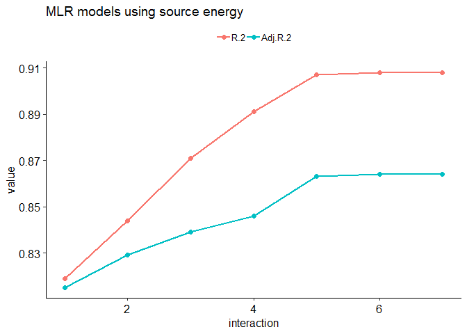
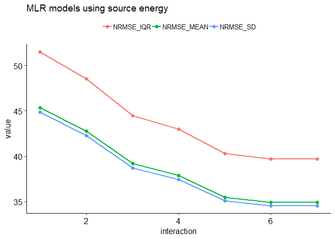
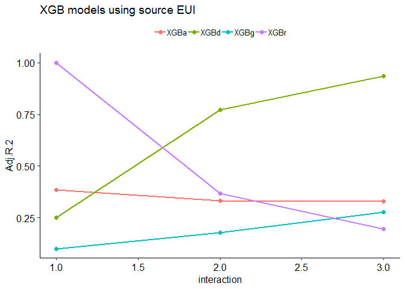
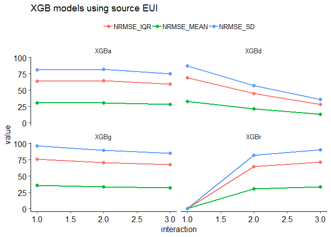
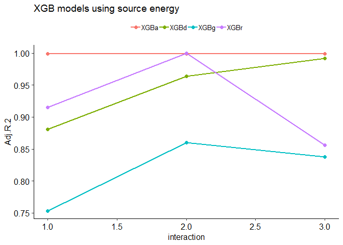
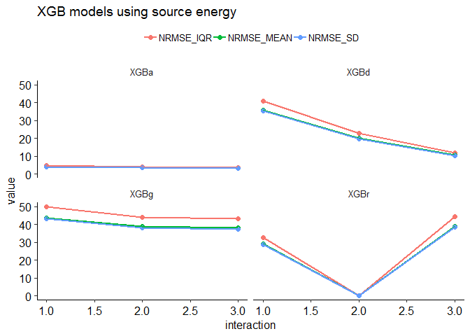
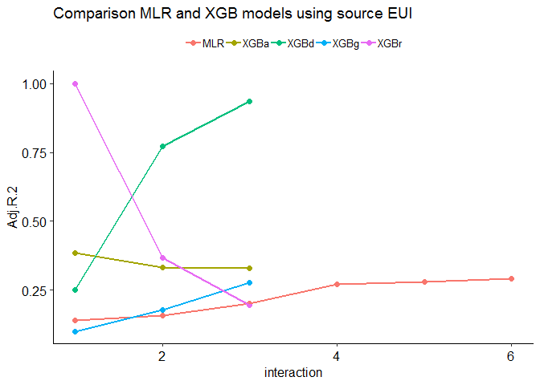
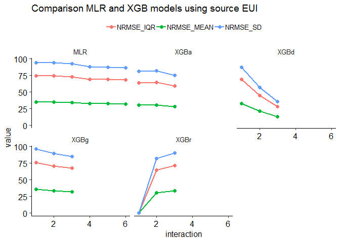
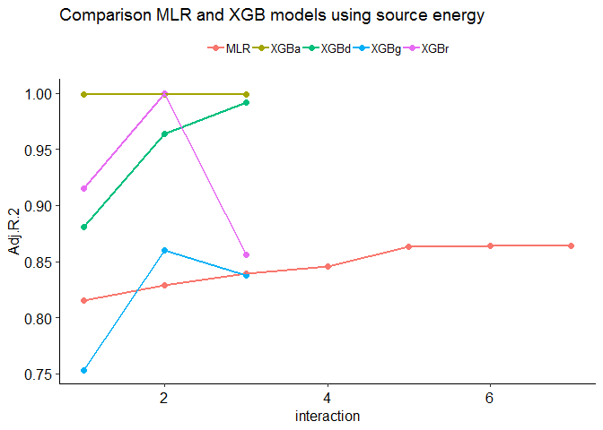
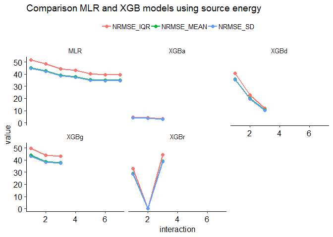

Benchmarking K-12 Schools
================
Pandarasamy Arjunan
3 June 2019

-   [Load dataset](#load-dataset)
-   [Apply filters](#apply-filters)
-   [Prepare features](#prepare-features)
-   [Descriptive statistics](#descriptive-statistics)
    -   [Data Frame Summary](#data-frame-summary)
-   [Build predictive models](#build-predictive-models)
    -   [Multiple Linear Regression (MLR)](#multiple-linear-regression-mlr)
    -   [Multiple Linear Regression (MLR) with Interaction terms](#multiple-linear-regression-mlr-with-interaction-terms)
    -   [Comparision of MLR models](#comparision-of-mlr-models)
    -   [Gradient Boosted Trees (XGBoost)](#gradient-boosted-trees-xgboost)
    -   [Comparision of XGB models](#comparision-of-xgb-models)
    -   [Comparision between MLR and XGB models](#comparision-between-mlr-and-xgb-models)

Load dataset
------------

``` r
building_type = "k12school"

filtered_dir = './data/cbecs/filtered/'
dir.create(filtered_dir, recursive = T, showWarnings = F)

features_dir = './data/cbecs/features/'
dir.create(features_dir, recursive = T, showWarnings = F)

results_dir = './results/cbecs/'
dir.create(results_dir, recursive = T, showWarnings = F)
```

``` r
cbecs = read.csv("data/cbecs/2012_public_use_data_aug2016.csv")

var1 = c( 'SQFT', 'NFLOOR', 'NELVTR', 'NESLTR', 'EDSEAT',
          'COURT', 'MONUSE', 'OPNWE', 'WKHRS', 'NWKER',
          'COOK',  'HEATP',   'COOLP',  'SNACK', 'FASTFD',
          'CAF',   'FDPREP',   'KITCHN', 'BREAKRM', 'OTFDRM',
          'LABEQP', 'POOL',   'HTPOOL', 'RFGRES', 'RFGCOMPN',
          'RFGWIN', 'RFGOPN', 'RFGCLN', 'RFGVNN', 'RFGICN',
          'PCTERMN', 'LAPTPN', 'PRNTRN', 'SERVERN', 'TRNGRM',
          'STDNRM',  'WBOARDS', 'TVVIDEON', 'RGSTRN', 'COPIERN',
          'HDD65',  'CDD65')

var2 = c( "PBAPLUS", "PBA", "FINALWT",
          "MFBTU", 
          "ELBTU", "NGBTU", "FKBTU", "DHBTU",
          "ONEACT", "ACT1", "ACT2", "ACT3", "ACT1PCT", "ACT2PCT", "ACT3PCT",
          "PRAMTC", "PRUNIT",
          "CWUSED", "WOUSED", "COUSED", "SOUSED", "PRUSED")

schools = cbecs[, c(var1, var2)]
```

Apply filters
-------------

As per Energy Star's technical document [ENERGY STAR Score for K-12 Schools](https://www.energystar.gov/buildings/tools-and-resources/energy-star-score-k-12-schools), following filters are applied to define the peer group and to remove any outliers.

After applying each filter, the number of remaining buildings in the dataset (*Number Remaining: X*) and any difference (*Difference: X*) in count from the original Energy Star's technical documentation is also given.

1.  **Calculate source energy and source EUI**

    ``` r
    ## convert electricity, natural gas, fuel oil, and district heat to source energy
    s0 = schools %>% 
      mutate(ELBTU0 = ELBTU*2.80) %>%
      mutate(NGBTU0 = NGBTU*1.05) %>%
      mutate(FKBTU0 = FKBTU*1.01) %>%
      mutate(DHBTU0 = DHBTU*1.20) %>%
      mutate(SOURCE_ENERGY = rowSums(dplyr::select(., c(ELBTU0,NGBTU0,FKBTU0,DHBTU0)), na.rm = T)) %>% 
      mutate(SOURCE_EUI = round(SOURCE_ENERGY/SQFT, 2)) %>%
      mutate(SITE_EUI = round(MFBTU/SQFT, 2)) %>%
      mutate(NGBTU_PERCENT = round(NGBTU / SOURCE_ENERGY * 100, 2)) %>% 
      mutate(SUMBTU = rowSums(dplyr::select(., c(ELBTU,NGBTU,FKBTU,DHBTU)), na.rm = T))

    #Is MFBTU the sum of ELBTU,NGBTU,FKBTU,DHBTU? YES.
    #summary(o14$MFBTU - o14$SUMBTU)
    ```

2.  **PBAPLUS = 28 or 29** <br/>Building Type Filter – CBECS defines building types according to the variable “PBAPLUS.” Elementary/Middle Schools are coded as PBAPLUS=28; High Schools are coded as PBAPLUS=29. <br/>Number Remaining: 539. <br/>Difference: 0.

    ``` r
    s1 = s0 %>% filter(PBAPLUS %in% c(28, 29))
    ```

3.  **Must operate for at least 30 hours per week** <br/>EPA Program Filter – Baseline condition for being a full time K-12 school. <br/>Number Remaining: 523. <br/>Difference: 0.

    ``` r
    s2 = s1 %>% filter(WKHRS >= 30)
    ```

4.  **Must operate for at least 8 months per year** <br/>EPA Program Filter – Baseline condition for being a full time K-12 school. <br/>Number Remaining: 517. <br/>Difference: 0.

    ``` r
    s3 = s2 %>% filter(MONUSE >= 8)
    ```

5.  **Must have at least 1 worker** <br/>EPA Program Filter – Baseline condition for being a full time K-12 school. <br/>Number Remaining: 517. <br/>Difference: 0.

    ``` r
    s4 = s3 %>% filter(NWKER >= 1)
    ```

6.  **Must have at least 1 classroom seat** <br/>EPA Program Filter – Baseline condition for being a full time K-12 school. <br/>Number Remaining: 517. <br/>Difference: 0.

    ``` r
    s5 = s4 %>% filter(EDSEAT >= 1)
    ```

7.  **A single activity must characterize greater than 50% of the floor space** <br/>EPA Program Filter – In order to be considered part of the K-12 school peer group, more than 50% of the building must be defined as elementary/middle school or high school. This filter is applied by a set of screens. If the variable ONEACT=1, then one activity occupies 75% or more of the building. If the variable ONEACT=2, then the activities in the building are defined by ACT1, ACT2, and ACT3. One of these activities must be coded as education (PBAX=17), with a corresponding percent (ACT1PCT, ACT2PCT, ACT3PCT) that is greater than 50. <br/>Number Remaining: 513. <br/>Difference: 0.

    ``` r
    s6 = s5 %>% 
      filter( (ONEACT == 1) |
            (ONEACT == 2 & 
               ((ACT1 == 17 & ACT1PCT > 50) | 
                  (ACT1 == 17 & ACT2PCT > 50) | 
                  (ACT1 == 17 & ACT2PCT > 50) )))
    ```

8.  **Must report energy usage** <br/>EPA Program Filter – Baseline condition for being a full time K-12 school. <br/>Number Remaining: 513. <br/>Difference: 0.

    ``` r
    s7 = s6 %>% filter(!is.na(MFBTU))
    ```

9.  **Must be less than or equal to 1,000,000 square feet** <br/>Data Limitation Filter – CBECS masks surveyed properties at or above above 1,000,000 square feet by applying regional averages. <br/>Number Remaining: 513. <br/>Difference: 0.

    ``` r
    s8 = s7 %>% filter(SQFT <= 1000000)
    ```

10. **If propane is used, the amount category (PRAMTC) must equal 1, 2, or 3** Data Limitation Filter – Cannot estimate propane use if the quantity is “greater than 1000” or unknown. <br/>Number Remaining: 496. <br/>Difference: 0.

    ``` r
    s9 = s8 %>% filter(is.na(PRAMTC) | PRAMTC %in% c(1,2,3))
    ```

11. **If propane is used, the unit (PRUNIT) must be known** <br/>Data Limitation Filter – Cannot estimate propane use if the unit is unknown. <br/>Number Remaining: 496. <br/>Difference: 0.

    ``` r
    s10 = s9 %>% filter(is.na(PRUNIT) | PRUNIT %in% c(1,2))
    ```

12. **If propane is used, the maximum estimated propane amount must be 10% or less of the total source energy** <br/>Data Limitation Filter – Because propane values are estimated from a range, propane is restricted to 10% of the total source energy. <br/>Number Remaining: 490. <br/>Difference: -6.

    ``` r
    s11 = s10 %>% 
      filter( PRUSED == 2 | is.na(NGBTU_PERCENT) == T | 
            ( PRUSED == 1 & NGBTU_PERCENT <= 10))
    ```

13. **must not use chilled water, wood, coal, or solar** <br/>Data Limitation Filter – CBECS does not collect quantities of chilled water, wood, coal, or solar. <br/>Number Remaining: 451. <br/>Difference: -6.

    ``` r
    s12 = s11 %>% 
      filter(CWUSED == 2 & WOUSED == 2 & COUSED == 2 & SOUSED == 2)
    ```

14. **Must have Source EUI no greater than 250 kBtu/ft2** <br/>Analytical Filter – Values determined to be statistical outliers. <br/>Number Remaining: 429. <br/>Difference: -6.

    ``` r
    s13 = s12 %>% filter(SOURCE_EUI <= 250)
    ```

15. **Must have no more than 1.9 workers per 1,000 square feet** <br/>Analytical Filter – Values determined to be statistical outliers. <br/>Number Remaining: 405. <br/>Difference: -6.

    ``` r
    s14 = s13 %>% filter(NWKER  / SQFT * 1000 <= 1.9)
    ```

16. **Must have no more than 0.06 walk-in refrigeration per 1,000 square feet** <br/>Analytical Filter – Values determined to be statistical outliers. <br/>Number Remaining: 396. <br/>Difference: -6.

    ``` r
    s15 = s14 %>% filter(is.na(RFGWIN) | (RFGWIN / SQFT * 1000 <= 0.06)) 
    ```

17. **Must have no more than 17 classroom seats per 1,000 square feet** <br/>Analytical Filter – Values determined to be statistical outliers. <br/>Number Remaining: 349. <br/>Difference: -6.

    ``` r
    s16 = s15 %>% filter(EDSEAT / SQFT * 1000 <= 17)
    ```

18. **Must operate no more than 140 hours per week** <br/>Analytical Filter – Values determined to be statistical outliers. <br/>Number Remaining: 344. <br/>Difference: -6.

    ``` r
    s17 = s16 %>% filter(WKHRS <= 140)
    ```

**Save the filtered dataset**

``` r
write.csv(s17, paste0(filtered_dir, building_type, ".csv"), row.names = F)
```

Prepare features
----------------

The final regression equation includes the following variables: ï‚· - Number of Workers per 1,000 Square Feet - Heating Degree Days times Percent of the Building that is Heated - Cooling Degree Days times Percent of the Building that is Cooled - Whether there is Energy Used for Cooking (1 = yes, 0 = no) - Whether the School is Open on Weekends (1 = yes, 0 = no) - Whether the School is a High School (1 = yes, 0 = no)

``` r
k12school = read.csv(paste0(filtered_dir, building_type, ".csv"))

data = k12school %>%
  mutate(NWKER_SQFT = NWKER/SQFT * 1000) %>%
  mutate(CDD65_COOLP = CDD65 * COOLP / 100) %>%
  mutate(HDD65_HEATP = HDD65 * HEATP / 100) %>%
  mutate(IsCooking = ifelse(COOK == 1, "Yes", "No")) %>%
  mutate(IsOpenWeekends = ifelse(OPNWE == 1, "Yes", "No")) %>%
  mutate(IsHighSchool = ifelse(PBAPLUS == 29, "Yes", "No")) %>% 
  mutate_if(is.numeric, round, 3)

ivars = c(
  "SQFT", 
          "NWKER_SQFT", "HDD65_HEATP",
          "CDD65_COOLP", "IsCooking",
          "IsOpenWeekends", "IsHighSchool")

dvars  = c("SOURCE_EUI", "SOURCE_ENERGY", "FINALWT")

features = data[, c(ivars, dvars)]
features = features %>% na.omit()

write.csv(features, 
          paste0(features_dir, building_type, ".csv"), 
          row.names = F)
#write.csv(features, paste0(save_dir2, "k12school.csv"), row.names = F)
```

Descriptive statistics
----------------------

``` r
features1 = features

features1 = features1 %>% dplyr::select(-one_of('SOURCE_ENERGY', 'FINALWT'))

summarytools::descr(features1, stats = "common", 
                    transpose = TRUE, 
                    headings = FALSE)
```

    Non-numerical variable(s) ignored: IsCooking, IsOpenWeekends, IsHighSchool

|                  |       Mean|   Std.Dev|      Min|    Median|        Max|  N.Valid|  Pct.Valid|
|-----------------:|----------:|---------:|--------:|---------:|----------:|--------:|----------:|
|  **CDD65\_COOLP**|    1402.62|   1043.28|    12.76|   1234.80|    4883.00|   327.00|     100.00|
|  **HDD65\_HEATP**|    3853.59|   1847.05|   115.00|   3949.00|    7932.00|   327.00|     100.00|
|   **NWKER\_SQFT**|       0.74|      0.33|     0.12|      0.68|       1.88|   327.00|     100.00|
|   **SOURCE\_EUI**|     114.75|     42.75|    29.88|    109.62|     241.85|   327.00|     100.00|
|          **SQFT**|  113923.10|  95118.50|  1500.00|  81000.00|  500001.00|   327.00|     100.00|

``` r
dfSummary(features1, plain.ascii = FALSE, style = "grid", 
          graph.magnif = 0.75, valid.col = FALSE)
```

    text graphs are displayed; set 'tmp.img.dir' parameter to activate png graphs

### Data Frame Summary

**features1**
**Dimensions:** 327 x 8
**Duplicates:** 0

<table style="width:100%;">
<colgroup>
<col width="4%" />
<col width="16%" />
<col width="30%" />
<col width="19%" />
<col width="19%" />
<col width="9%" />
</colgroup>
<thead>
<tr class="header">
<th>No</th>
<th>Variable</th>
<th>Stats / Values</th>
<th>Freqs (% of Valid)</th>
<th>Graph</th>
<th>Missing</th>
</tr>
</thead>
<tbody>
<tr class="odd">
<td><p>1</p></td>
<td><p>SQFT<br />
[numeric]</p></td>
<td><p>Mean (sd) : 113923.1 (95118.5)<br />
min &lt; med &lt; max:<br />
1500 &lt; 81000 &lt; 500001<br />
IQR (CV) : 90500 (0.8)</p></td>
<td><p>161 distinct values</p></td>
<td><p><br />
  :<br />
. :<br />
: : .<br />
: : :<br />
: : : : : .</p></td>
<td><p>0<br />
(0%)</p></td>
</tr>
<tr class="even">
<td><p>2</p></td>
<td><p>NWKER_SQFT<br />
[numeric]</p></td>
<td><p>Mean (sd) : 0.7 (0.3)<br />
min &lt; med &lt; max:<br />
0.1 &lt; 0.7 &lt; 1.9<br />
IQR (CV) : 0.4 (0.4)</p></td>
<td><p>249 distinct values</p></td>
<td><p><br />
    : .<br />
    : :<br />
  : : : :<br />
  : : : : :<br />
: : : : : : . . .</p></td>
<td><p>0<br />
(0%)</p></td>
</tr>
<tr class="odd">
<td><p>3</p></td>
<td><p>HDD65_HEATP<br />
[numeric]</p></td>
<td><p>Mean (sd) : 3853.6 (1847.1)<br />
min &lt; med &lt; max:<br />
115 &lt; 3949 &lt; 7932<br />
IQR (CV) : 2762.5 (0.5)</p></td>
<td><p>317 distinct values</p></td>
<td><p><br />
    :   : :<br />
    : : : :<br />
  : : : : : :<br />
: : : : : : :<br />
: : : : : : : :</p></td>
<td><p>0<br />
(0%)</p></td>
</tr>
<tr class="even">
<td><p>4</p></td>
<td><p>CDD65_COOLP<br />
[numeric]</p></td>
<td><p>Mean (sd) : 1402.6 (1043.3)<br />
min &lt; med &lt; max:<br />
12.8 &lt; 1234.8 &lt; 4883<br />
IQR (CV) : 1255.7 (0.7)</p></td>
<td><p>318 distinct values</p></td>
<td><dl>
<dt></dt>
<dd>  :<br />

</dd>
<dd>: : .<br />

</dd>
<dd>: : : .<br />

</dd>
<dd>: : : :<br />

</dd>
<dd>: : : : . : : .
</dd>
</dl></td>
<td><p>0<br />
(0%)</p></td>
</tr>
<tr class="odd">
<td><p>5</p></td>
<td><p>IsCooking<br />
[character]</p></td>
<td><p>1. No<br />
2. Yes</p></td>
<td><p>62 (19.0%)<br />
265 (81.0%)</p></td>
<td><p>III<br />
IIIIIIIIIIIIIIII</p></td>
<td><p>0<br />
(0%)</p></td>
</tr>
<tr class="even">
<td><p>6</p></td>
<td><p>IsOpenWeekends<br />
[character]</p></td>
<td><p>1. No<br />
2. Yes</p></td>
<td><p>211 (64.5%)<br />
116 (35.5%)</p></td>
<td><p>IIIIIIIIIIII<br />
IIIIIII</p></td>
<td><p>0<br />
(0%)</p></td>
</tr>
<tr class="odd">
<td><p>7</p></td>
<td><p>IsHighSchool<br />
[character]</p></td>
<td><p>1. No<br />
2. Yes</p></td>
<td><p>237 (72.5%)<br />
90 (27.5%)</p></td>
<td><p>IIIIIIIIIIIIII<br />
IIIII</p></td>
<td><p>0<br />
(0%)</p></td>
</tr>
<tr class="even">
<td><p>8</p></td>
<td><p>SOURCE_EUI<br />
[numeric]</p></td>
<td><p>Mean (sd) : 114.7 (42.8)<br />
min &lt; med &lt; max:<br />
29.9 &lt; 109.6 &lt; 241.8<br />
IQR (CV) : 54.2 (0.4)</p></td>
<td><p>325 distinct values</p></td>
<td><p><br />
    . :<br />
    : : :<br />
  . : : : :<br />
  : : : : : .<br />
: : : : : : : . : .</p></td>
<td><p>0<br />
(0%)</p></td>
</tr>
</tbody>
</table>

**Extract R code from Rmd document**

``` r
#knitr::purl("k12school.Rmd", output = "k12school.R", documentation = 2)
```

Build predictive models
-----------------------

``` r
#source("models.R")
source("metrics.R")

data = read.csv(paste0(features_dir, building_type, ".csv"))

allMetrics = NULL

sourceEUI_attributes = setdiff(colnames(data),
                               c("SQFT", "FINALWT", "SOURCE_EUI", "SOURCE_ENERGY"))

sourceEnergy_attributes = setdiff(colnames(data), 
                               c("FINALWT", "SOURCE_EUI", "SOURCE_ENERGY"))
#cat(colnames(data))
knitr::kable(colnames(data), col.names = NULL)
```

    Warning in kable_markdown(x, padding = padding, ...): The table should have
    a header (column names)

|                |
|:---------------|
| SQFT           |
| NWKER\_SQFT    |
| HDD65\_HEATP   |
| CDD65\_COOLP   |
| IsCooking      |
| IsOpenWeekends |
| IsHighSchool   |
| SOURCE\_EUI    |
| SOURCE\_ENERGY |
| FINALWT        |

### Multiple Linear Regression (MLR)

``` r
MLR.fit <- function(data, 
                    x, 
                    y, 
                    w, 
                    interaction,
                    centering = TRUE 
                    ) {
  
  if(centering == TRUE){
    data = mean_center_data(data, x)  
  }
  
  if(interaction == 1) {  ### ordinary model
    model = paste(y, "~", paste(x, collapse = " + "))  
  } else {  ### interaction model
    allvars = paste(x, collapse = " + ")
    model = paste(y, "~ (", allvars, ") ^", interaction )
  }
  
  fit = lm(model, data = data, weights = data[, w])
  return (fit)
}

MLR.predict <- function(data, x, y, w, i) {
  
  mlrFit = MLR.fit(data, x, y, w, i)
  
  wt   = data[, w]
  obs  = data[, y]
  pred = as.numeric(predict(mlrFit))
  
  mlrMetrics = getMLRmetrics(mlrFit, obs, pred, wt)
  mlrMetrics = data.frame(
    "model" = "MLR",
    "dependent" = y,
    "interaction" = i,
    "transform" = "meanCent",
    mlrMetrics)
  
  return(mlrMetrics)
}
```

#### Using SOURCE\_EUI as dependent variable

``` r
x = sourceEUI_attributes
y = "SOURCE_EUI"
w = "FINALWT"
interaction = 1

mlrMetrics = MLR.predict(data, x, y, w, interaction)

allMetrics = rbind(allMetrics, mlrMetrics)

knitr::kable(allMetrics, row.names = F)
```

| model | dependent   |  interaction| transform |  obs|  rank|  coef|    R.2|  Adj.R.2|       mse|    rmse|     mae|   mape|  nrmse\_iqr|  nrmse\_range|  nrmse\_mean|  nrmse\_sd|
|:------|:------------|------------:|:----------|----:|-----:|-----:|------:|--------:|---------:|-------:|-------:|------:|-----------:|-------------:|------------:|----------:|
| MLR   | SOURCE\_EUI |            1| meanCent  |  327|     7|     7|  0.157|    0.141|  1619.832|  40.247|  31.896|  0.331|      74.222|        18.987|       35.075|     94.142|

#### Using SOURCE\_ENERGY as dependent variable

``` r
x = sourceEnergy_attributes
y = "SOURCE_ENERGY"
w = "FINALWT"
interaction = 1

mlrMetrics = MLR.predict(data, x, y, w, interaction)

allMetrics = rbind(allMetrics, mlrMetrics)

knitr::kable(allMetrics, row.names = F)
```

| model | dependent      |  interaction| transform |  obs|  rank|  coef|    R.2|  Adj.R.2|           mse|         rmse|          mae|   mape|  nrmse\_iqr|  nrmse\_range|  nrmse\_mean|  nrmse\_sd|
|:------|:---------------|------------:|:----------|----:|-----:|-----:|------:|--------:|-------------:|------------:|------------:|------:|-----------:|-------------:|------------:|----------:|
| MLR   | SOURCE\_EUI    |            1| meanCent  |  327|     7|     7|  0.157|    0.141|  1.619832e+03|       40.247|       31.896|  0.331|      74.222|        18.987|       35.075|     94.142|
| MLR   | SOURCE\_ENERGY |            1| meanCent  |  327|     8|     8|  0.819|    0.815|  3.653040e+13|  6044038.541|  3618392.877|  0.426|      51.496|         6.336|       45.367|     44.844|

### Multiple Linear Regression (MLR) with Interaction terms

#### Using SOURCE\_EUI as dependent variable

``` r
x = sourceEUI_attributes
y = "SOURCE_EUI"
w = "FINALWT"

intr_depth = length(x)

for (interaction in 2:intr_depth) {
  mlrMetrics = MLR.predict(data, x, y, w, interaction)
  allMetrics = rbind(allMetrics, mlrMetrics)
}

write.csv(allMetrics, 
          paste0(results_dir, building_type, ".csv"), 
          row.names = F)

allMetrics0 = allMetrics %>% filter(dependent == y)
knitr::kable(allMetrics0, row.names = F)
```

| model | dependent   |  interaction| transform |  obs|  rank|  coef|    R.2|  Adj.R.2|       mse|    rmse|     mae|   mape|  nrmse\_iqr|  nrmse\_range|  nrmse\_mean|  nrmse\_sd|
|:------|:------------|------------:|:----------|----:|-----:|-----:|------:|--------:|---------:|-------:|-------:|------:|-----------:|-------------:|------------:|----------:|
| MLR   | SOURCE\_EUI |            1| meanCent  |  327|     7|     7|  0.157|    0.141|  1619.832|  40.247|  31.896|  0.331|      74.222|        18.987|       35.075|     94.142|
| MLR   | SOURCE\_EUI |            2| meanCent  |  327|    22|    22|  0.212|    0.158|  1609.821|  40.123|  32.079|  0.324|      73.994|        18.929|       34.967|     93.852|
| MLR   | SOURCE\_EUI |            3| meanCent  |  327|    42|    42|  0.301|    0.201|  1558.871|  39.483|  31.516|  0.320|      72.813|        18.627|       34.409|     92.355|
| MLR   | SOURCE\_EUI |            4| meanCent  |  327|    57|    57|  0.397|    0.272|  1413.994|  37.603|  29.189|  0.296|      69.346|        17.740|       32.770|     87.957|
| MLR   | SOURCE\_EUI |            5| meanCent  |  327|    63|    63|  0.416|    0.279|  1388.745|  37.266|  28.547|  0.290|      68.725|        17.581|       32.477|     87.169|
| MLR   | SOURCE\_EUI |            6| meanCent  |  327|    64|    64|  0.427|    0.290|  1372.966|  37.054|  28.003|  0.284|      68.334|        17.481|       32.292|     86.673|

#### Using SOURCE\_ENERGY as dependent variable\*\*

``` r
x = sourceEnergy_attributes
y = "SOURCE_ENERGY"
w = "FINALWT"

intr_depth = length(x)

for (interaction in 2:intr_depth) {
  mlrMetrics = MLR.predict(data, x, y, w, interaction)
  allMetrics = rbind(allMetrics, mlrMetrics)
}

write.csv(allMetrics, 
          paste0(results_dir, building_type, ".csv"), 
          row.names = F)

allMetrics0 = allMetrics %>% filter(dependent == y)
knitr::kable(allMetrics0, row.names = F)
```

| model | dependent      |  interaction| transform |  obs|  rank|  coef|    R.2|  Adj.R.2|           mse|     rmse|      mae|   mape|  nrmse\_iqr|  nrmse\_range|  nrmse\_mean|  nrmse\_sd|
|:------|:---------------|------------:|:----------|----:|-----:|-----:|------:|--------:|-------------:|--------:|--------:|------:|-----------:|-------------:|------------:|----------:|
| MLR   | SOURCE\_ENERGY |            1| meanCent  |  327|     8|     8|  0.819|    0.815|  3.653040e+13|  6044039|  3618393|  0.426|      51.496|         6.336|       45.367|     44.844|
| MLR   | SOURCE\_ENERGY |            2| meanCent  |  327|    29|    29|  0.844|    0.829|  3.243511e+13|  5695183|  3484357|  0.366|      48.524|         5.970|       42.749|     42.256|
| MLR   | SOURCE\_ENERGY |            3| meanCent  |  327|    64|    64|  0.871|    0.839|  2.724721e+13|  5219886|  3143099|  0.326|      44.474|         5.472|       39.181|     38.729|
| MLR   | SOURCE\_ENERGY |            4| meanCent  |  327|    98|    99|  0.891|    0.846|  2.547997e+13|  5047769|  2961030|  0.289|      43.008|         5.291|       37.889|     37.452|
| MLR   | SOURCE\_ENERGY |            5| meanCent  |  327|   105|   120|  0.907|    0.863|  2.235240e+13|  4727832|  2779423|  0.268|      40.282|         4.956|       35.488|     35.079|
| MLR   | SOURCE\_ENERGY |            6| meanCent  |  327|   106|   127|  0.908|    0.864|  2.168410e+13|  4656619|  2771400|  0.268|      39.675|         4.881|       34.953|     34.550|
| MLR   | SOURCE\_ENERGY |            7| meanCent  |  327|   106|   128|  0.908|    0.864|  2.168410e+13|  4656619|  2771400|  0.268|      39.675|         4.881|       34.953|     34.550|

### Comparision of MLR models

#### MLR plots using Source EUI

``` r
mytheme = theme(legend.title = element_blank(),
           legend.text=element_text(size=12),
           axis.text=element_text(size=12),
           text=element_text(size=12))

plotR2 <- function(df, titl) {
  
  df1 = melt(df, measure.vars = c("R.2", "Adj.R.2"))
  
  plot <- ggplot(df1, aes(x = interaction, y=value, 
                          group=variable, col=variable)) + 
  geom_point(size=2) + geom_line(size=1) +
    ggtitle(titl) + 
    theme_pubr(base_size=12) +
    theme(legend.position="top", legend.title = element_blank())
  
  return(plot)
}

plotNRMSE <- function(df, titl) {
  
  df1 = melt(df, measure.vars = c("nrmse_iqr", "nrmse_mean", 
                                        "nrmse_sd"))
  df1$variable = toupper(df1$variable)
  
  plot <- ggplot(df1, aes(x = interaction, y=value, 
                          group=variable, col=variable)) + 
  geom_point(size=2) + geom_line(size=1) +
    ggtitle(titl) + 
    theme_pubr(base_size=12) +
    theme(legend.position="top", legend.title = element_blank())
    
  
  return(plot)
}  
```

``` r
allMetrics0 = allMetrics %>%
  filter(stringr::str_detect(model, "MLR")) %>%
  filter(dependent == "SOURCE_EUI")

plot1 = plotR2(allMetrics0, "MLR models using source EUI")
plot2 = plotNRMSE(allMetrics0, "MLR models using source EUI")

print(plot1)
```


``` r
print(plot2)
```


#### MLR plots using Source Energy

``` r
allMetrics0 = allMetrics %>%
  filter(stringr::str_detect(model, "MLR")) %>%
  filter(dependent == "SOURCE_ENERGY")

plot1 = plotR2(allMetrics0, "MLR models using source energy")
plot2 = plotNRMSE(allMetrics0, "MLR models using source energy")

print(plot1)
```



``` r
print(plot2)
```



### Gradient Boosted Trees (XGBoost)

``` r
tuneXGBoost <- function(x,
                        y,
                        sample_weights,
                        search = "default",
                        tree_height = 2
                        ) {
  
  N = 10  # N-fold CV
  R = 2   # and R repeats
  
  tcDefault  <- trainControl(method = "repeatedcv", 
                            number = N, 
                            repeats = R)
  
  tcRandom   <- trainControl(method = "repeatedcv", 
                            search = "random",
                            number = N, 
                            repeats = R)
  
  tcAdaptive <- trainControl(method = "adaptive_cv", 
                            search = "random",
                            number = N, 
                            repeats = R,
                            adaptive = list(min = 5, 
                                            alpha = 0.05, 
                                            method = "gls",
                                            complete = TRUE))
  
  default_param = expand.grid(
    nrounds = 100,
    max_depth = tree_height,
    eta = 0.3,
    gamma = 0,
    colsample_bytree = 1,
    min_child_weight = 1,
    subsample = 1)
  
  # from https://github.com/topepo/caret/blob/master/models/files/xgbTree.R
  len = 10
  grid_param <- expand.grid(
    nrounds = floor((1:len) * 10),
    max_depth = tree_height,
    eta = c(.3, .4),
    gamma = 0,
    colsample_bytree = c(.6, .8),
    min_child_weight = c(1),
    subsample = seq(.25, 1, length = len))
  
  tuned = switch(search,
                 "default" = train(x, y,
                                   weights = sample_weights,
                                   method = "xgbTree", 
                                   tuneGrid = default_param,
                                   trControl = tcDefault,
                                   verbose = TRUE),
                 
                 "grid"     = train(x, y, 
                                   weights = sample_weights,
                                   method = "xgbTree", 
                                   tuneGrid = grid_param,
                                   trControl = tcDefault,
                                   verbose = TRUE),

                 "random"  = train(x, y, 
                                   weights = sample_weights,
                                   method = "xgbTree", 
                                   trControl = tcRandom,
                                   verbose = TRUE),
                 
                 "adaptive" = train(x, y, 
                                   weights = sample_weights,
                                   method = "xgbTree", 
                                   trControl = tcAdaptive,
                                   verbose = TRUE)
                 )
  
  return(tuned$finalModel)
}

XGBoost <- function( xdata, 
                     ydata,
                     sample_weights,
                     search = "default",
                     interaction = 2
                     ) {
  
  model = paste(y, "~", paste(x, collapse = " + "))
  dummy = dummyVars(model, data = data, fullRank = T)
  
  xdata = as.data.frame(predict(dummy, data))
  ydata = data[, y]
  
  xgfit = tuneXGBoost(xdata, ydata, 
                      sample_weights,
                      search, 
                      tree_height = interaction)
  return(xgfit)
} 


XGBoost.predict <- function(data, x, y, w, search) {

  model = paste(y, "~", paste(x, collapse = " + "))
  dummy = dummyVars(model, data = data, fullRank = T)
  xdata = as.data.frame(predict(dummy, data))
  ydata = data[, y]
  wt = data[, w]
  
  intr_depth = 3
  
  xgbMetricsAll = NULL
  
  for (intr in 1:intr_depth) {
    
    cat(paste(Sys.time(), "xgboost", search, y, intr, "\n"))
    
    xgfit = XGBoost(xdata, ydata, wt, 
                    search = search, 
                    interaction = intr)
    
    pred = as.numeric(predict(xgfit, as.matrix(xdata)))
    
    xgbMetrics = getXgboostmetrics(xgfit, xdata, ydata, pred, wt)
    
    xgbMetrics = data.frame(
      "model" = paste0("XGB", substr(search, 1,1), intr),
      "dependent" = y, 
      "interaction" = intr, 
      "transform" = "None",
      xgbMetrics)
    
    xgbMetricsAll = rbind(xgbMetricsAll, xgbMetrics)
  }
  
  return(xgbMetricsAll)
}
```

``` r
# y = "SOURCE_EUI"
# w = "FINALWT"
# o = c("SOURCE_ENERGY", "SQFT")
# x = setdiff(colnames(data), c(y, w, o))
# wt = data[, w]
# 
# model = paste(y, "~", paste(x, collapse = " + "))
# dummy = dummyVars(model, data = data, fullRank = T)
# xdata = as.data.frame(predict(dummy, data))
# ydata = data[, y]
# intr_depth = 3
# 
# for (intr in 1:intr_depth) {
#   
#   print(paste(Sys.time(), "xgboost default search", y, intr, "\n"))
#   
#   xgfit = XGBoost(xdata, ydata, wt, 
#                   search = "default", 
#                   interaction = intr)
#   
#   pred = as.numeric(predict(xgfit, as.matrix(xdata)))
#   
#   xgbMetrics = getXgboostmetrics(xgfit, xdata, ydata, pred, wt)
#   
#   xgbMetrics = data.frame(
#     "model" = paste0("XGBd", intr),
#     "dependent" = y, 
#     "interaction" = intr, 
#     "transform" = "None",
#     xgbMetrics)
#   
#   allMetrics = rbind(allMetrics, xgbMetrics)
# }
# knitr::kable(allMetrics, row.names = F)
```

#### Using SOURCE\_EUI as dependent variable

``` r
library(doParallel)
ncore = 4
registerDoParallel(cores = ncore)
```

##### Using default search

``` r
x = sourceEUI_attributes
y = "SOURCE_EUI"
w = "FINALWT"
search = "default"

xgbMetrics = XGBoost.predict(data, x, y, w, search)
```

2019-06-10 15:26:14 xgboost default SOURCE\_EUI 1 2019-06-10 15:26:36 xgboost default SOURCE\_EUI 2 2019-06-10 15:26:39 xgboost default SOURCE\_EUI 3

``` r
allMetrics = rbind(allMetrics, xgbMetrics)

knitr::kable(xgbMetrics, row.names = F)
```

| model | dependent   |  interaction| transform |  obs|  rank|  coef|    R.2|  Adj.R.2|       mse|    rmse|     mae|   mape|  nrmse\_iqr|  nrmse\_range|  nrmse\_mean|  nrmse\_sd|
|:------|:------------|------------:|:----------|----:|-----:|-----:|------:|--------:|---------:|-------:|-------:|------:|-----------:|-------------:|------------:|----------:|
| XGBd1 | SOURCE\_EUI |            1| None      |  327|     6|     6|  0.261|    0.249|  1387.792|  37.253|  29.336|  0.304|      68.701|        17.575|       32.465|     87.139|
| XGBd2 | SOURCE\_EUI |            2| None      |  327|     6|     6|  0.775|    0.771|   590.486|  24.300|  18.678|  0.189|      44.813|        11.464|       21.177|     56.840|
| XGBd3 | SOURCE\_EUI |            3| None      |  327|     6|     6|  0.937|    0.936|   231.078|  15.201|  10.704|  0.107|      28.033|         7.171|       13.247|     35.557|

##### Using grid search

``` r
x = sourceEUI_attributes
y = "SOURCE_EUI"
w = "FINALWT"
search = "grid"

xgbMetrics = XGBoost.predict(data, x, y, w, search)
```

2019-06-10 15:26:42 xgboost grid SOURCE\_EUI 1 2019-06-10 15:27:26 xgboost grid SOURCE\_EUI 2 2019-06-10 15:28:26 xgboost grid SOURCE\_EUI 3

``` r
allMetrics = rbind(allMetrics, xgbMetrics)

knitr::kable(xgbMetrics, row.names = F)
```

| model | dependent   |  interaction| transform |  obs|  rank|  coef|    R.2|  Adj.R.2|       mse|    rmse|     mae|   mape|  nrmse\_iqr|  nrmse\_range|  nrmse\_mean|  nrmse\_sd|
|:------|:------------|------------:|:----------|----:|-----:|-----:|------:|--------:|---------:|-------:|-------:|------:|-----------:|-------------:|------------:|----------:|
| XGBg1 | SOURCE\_EUI |            1| None      |  327|     5|     5|  0.110|    0.099|  1682.373|  41.017|  32.003|  0.322|      75.642|        19.350|       35.746|     95.943|
| XGBg2 | SOURCE\_EUI |            2| None      |  327|     6|     6|  0.190|    0.177|  1469.429|  38.333|  29.853|  0.300|      70.692|        18.084|       33.407|     89.665|
| XGBg3 | SOURCE\_EUI |            3| None      |  327|     6|     6|  0.287|    0.276|  1325.183|  36.403|  28.222|  0.286|      67.133|        17.174|       31.725|     85.151|

##### Using adaptive search

``` r
x = sourceEUI_attributes
y = "SOURCE_EUI"
w = "FINALWT"
search = "adaptive"

xgbMetrics = XGBoost.predict(data, x, y, w, search)
```

2019-06-10 15:29:46 xgboost adaptive SOURCE\_EUI 1 2019-06-10 15:29:54 xgboost adaptive SOURCE\_EUI 2 2019-06-10 15:30:12 xgboost adaptive SOURCE\_EUI 3

``` r
allMetrics = rbind(allMetrics, xgbMetrics)

knitr::kable(xgbMetrics, row.names = F)
```

| model | dependent   |  interaction| transform |  obs|  rank|  coef|    R.2|  Adj.R.2|       mse|    rmse|     mae|   mape|  nrmse\_iqr|  nrmse\_range|  nrmse\_mean|  nrmse\_sd|
|:------|:------------|------------:|:----------|----:|-----:|-----:|------:|--------:|---------:|-------:|-------:|------:|-----------:|-------------:|------------:|----------:|
| XGBa1 | SOURCE\_EUI |            1| None      |  327|     6|     6|  0.393|    0.383|  1202.252|  34.673|  27.398|  0.285|      63.943|        16.358|       30.217|     81.104|
| XGBa2 | SOURCE\_EUI |            2| None      |  327|     6|     6|  0.342|    0.332|  1221.240|  34.946|  27.747|  0.289|      64.446|        16.486|       30.455|     81.742|
| XGBa3 | SOURCE\_EUI |            3| None      |  327|     6|     6|  0.340|    0.329|  1036.500|  32.195|  24.703|  0.216|      59.373|        15.188|       28.057|     75.308|

##### Using random search

``` r
x = sourceEUI_attributes
y = "SOURCE_EUI"
w = "FINALWT"
search = "random"

xgbMetrics = XGBoost.predict(data, x, y, w, search)
```

2019-06-10 15:30:25 xgboost random SOURCE\_EUI 1 2019-06-10 15:30:53 xgboost random SOURCE\_EUI 2 2019-06-10 15:31:10 xgboost random SOURCE\_EUI 3

``` r
allMetrics = rbind(allMetrics, xgbMetrics)

write.csv(allMetrics, 
          paste0(results_dir, building_type, ".csv"), 
          row.names = F)

allMetrics0 = allMetrics %>% filter(dependent == y)
knitr::kable(allMetrics0, row.names = F)
```

| model | dependent   |  interaction| transform |  obs|  rank|  coef|    R.2|  Adj.R.2|       mse|    rmse|     mae|   mape|  nrmse\_iqr|  nrmse\_range|  nrmse\_mean|  nrmse\_sd|
|:------|:------------|------------:|:----------|----:|-----:|-----:|------:|--------:|---------:|-------:|-------:|------:|-----------:|-------------:|------------:|----------:|
| MLR   | SOURCE\_EUI |            1| meanCent  |  327|     7|     7|  0.157|    0.141|  1619.832|  40.247|  31.896|  0.331|      74.222|        18.987|       35.075|     94.142|
| MLR   | SOURCE\_EUI |            2| meanCent  |  327|    22|    22|  0.212|    0.158|  1609.821|  40.123|  32.079|  0.324|      73.994|        18.929|       34.967|     93.852|
| MLR   | SOURCE\_EUI |            3| meanCent  |  327|    42|    42|  0.301|    0.201|  1558.871|  39.483|  31.516|  0.320|      72.813|        18.627|       34.409|     92.355|
| MLR   | SOURCE\_EUI |            4| meanCent  |  327|    57|    57|  0.397|    0.272|  1413.994|  37.603|  29.189|  0.296|      69.346|        17.740|       32.770|     87.957|
| MLR   | SOURCE\_EUI |            5| meanCent  |  327|    63|    63|  0.416|    0.279|  1388.745|  37.266|  28.547|  0.290|      68.725|        17.581|       32.477|     87.169|
| MLR   | SOURCE\_EUI |            6| meanCent  |  327|    64|    64|  0.427|    0.290|  1372.966|  37.054|  28.003|  0.284|      68.334|        17.481|       32.292|     86.673|
| XGBd1 | SOURCE\_EUI |            1| None      |  327|     6|     6|  0.261|    0.249|  1387.792|  37.253|  29.336|  0.304|      68.701|        17.575|       32.465|     87.139|
| XGBd2 | SOURCE\_EUI |            2| None      |  327|     6|     6|  0.775|    0.771|   590.486|  24.300|  18.678|  0.189|      44.813|        11.464|       21.177|     56.840|
| XGBd3 | SOURCE\_EUI |            3| None      |  327|     6|     6|  0.937|    0.936|   231.078|  15.201|  10.704|  0.107|      28.033|         7.171|       13.247|     35.557|
| XGBg1 | SOURCE\_EUI |            1| None      |  327|     5|     5|  0.110|    0.099|  1682.373|  41.017|  32.003|  0.322|      75.642|        19.350|       35.746|     95.943|
| XGBg2 | SOURCE\_EUI |            2| None      |  327|     6|     6|  0.190|    0.177|  1469.429|  38.333|  29.853|  0.300|      70.692|        18.084|       33.407|     89.665|
| XGBg3 | SOURCE\_EUI |            3| None      |  327|     6|     6|  0.287|    0.276|  1325.183|  36.403|  28.222|  0.286|      67.133|        17.174|       31.725|     85.151|
| XGBa1 | SOURCE\_EUI |            1| None      |  327|     6|     6|  0.393|    0.383|  1202.252|  34.673|  27.398|  0.285|      63.943|        16.358|       30.217|     81.104|
| XGBa2 | SOURCE\_EUI |            2| None      |  327|     6|     6|  0.342|    0.332|  1221.240|  34.946|  27.747|  0.289|      64.446|        16.486|       30.455|     81.742|
| XGBa3 | SOURCE\_EUI |            3| None      |  327|     6|     6|  0.340|    0.329|  1036.500|  32.195|  24.703|  0.216|      59.373|        15.188|       28.057|     75.308|
| XGBr1 | SOURCE\_EUI |            1| None      |  327|     6|     6|  1.000|    1.000|     0.015|   0.121|   0.067|  0.001|       0.223|         0.057|        0.105|      0.283|
| XGBr2 | SOURCE\_EUI |            2| None      |  327|     6|     6|  0.378|    0.368|  1232.922|  35.113|  27.664|  0.286|      64.754|        16.565|       30.600|     82.133|
| XGBr3 | SOURCE\_EUI |            3| None      |  327|     6|     6|  0.206|    0.194|  1492.017|  38.627|  30.913|  0.320|      71.235|        18.223|       33.663|     90.353|

#### Using SOURCE\_ENERGY as dependent variable

##### Using default search

``` r
x = sourceEnergy_attributes
y = "SOURCE_ENERGY"
w = "FINALWT"
search = "default"

xgbMetrics = XGBoost.predict(data, x, y, w, search)
```

2019-06-10 15:31:40 xgboost default SOURCE\_ENERGY 1 2019-06-10 15:31:42 xgboost default SOURCE\_ENERGY 2 2019-06-10 15:31:44 xgboost default SOURCE\_ENERGY 3

``` r
allMetrics = rbind(allMetrics, xgbMetrics)

knitr::kable(xgbMetrics, row.names = F)
```

| model | dependent      |  interaction| transform |  obs|  rank|  coef|    R.2|  Adj.R.2|           mse|     rmse|        mae|   mape|  nrmse\_iqr|  nrmse\_range|  nrmse\_mean|  nrmse\_sd|
|:------|:---------------|------------:|:----------|----:|-----:|-----:|------:|--------:|-------------:|--------:|----------:|------:|-----------:|-------------:|------------:|----------:|
| XGBd1 | SOURCE\_ENERGY |            1| None      |  327|     7|     7|  0.884|    0.881|  2.288950e+13|  4784298|  3017469.6|  0.313|      40.763|         5.015|       35.911|     35.498|
| XGBd2 | SOURCE\_ENERGY |            2| None      |  327|     7|     7|  0.965|    0.964|  7.043492e+12|  2653958|  1826098.3|  0.204|      22.612|         2.782|       19.921|     19.691|
| XGBd3 | SOURCE\_ENERGY |            3| None      |  327|     7|     7|  0.992|    0.992|  1.946581e+12|  1395199|   894511.7|  0.108|      11.887|         1.463|       10.472|     10.352|

##### Using grid search

``` r
x = sourceEnergy_attributes
y = "SOURCE_ENERGY"
w = "FINALWT"
search = "grid"

xgbMetrics = XGBoost.predict(data, x, y, w, search)
```

2019-06-10 15:31:47 xgboost grid SOURCE\_ENERGY 1 2019-06-10 15:32:23 xgboost grid SOURCE\_ENERGY 2 2019-06-10 15:33:14 xgboost grid SOURCE\_ENERGY 3

``` r
allMetrics = rbind(allMetrics, xgbMetrics)

knitr::kable(xgbMetrics, row.names = F)
```

| model | dependent      |  interaction| transform |  obs|  rank|  coef|    R.2|  Adj.R.2|           mse|     rmse|      mae|   mape|  nrmse\_iqr|  nrmse\_range|  nrmse\_mean|  nrmse\_sd|
|:------|:---------------|------------:|:----------|----:|-----:|-----:|------:|--------:|-------------:|--------:|--------:|------:|-----------:|-------------:|------------:|----------:|
| XGBg1 | SOURCE\_ENERGY |            1| None      |  327|     6|     6|  0.757|    0.753|  3.401061e+13|  5831861|  3544145|  0.563|      49.688|         6.113|       43.775|     43.270|
| XGBg2 | SOURCE\_ENERGY |            2| None      |  327|     7|     7|  0.863|    0.860|  2.657789e+13|  5155374|  3320602|  0.419|      43.924|         5.404|       38.697|     38.251|
| XGBg3 | SOURCE\_ENERGY |            3| None      |  327|     7|     7|  0.841|    0.838|  2.553260e+13|  5052980|  3117449|  0.385|      43.052|         5.297|       37.928|     37.491|

##### Using adaptive search

``` r
x = sourceEnergy_attributes
y = "SOURCE_ENERGY"
w = "FINALWT"
search = "adaptive"

xgbMetrics = XGBoost.predict(data, x, y, w, search)
```

2019-06-10 15:34:23 xgboost adaptive SOURCE\_ENERGY 1 2019-06-10 15:34:59 xgboost adaptive SOURCE\_ENERGY 2 2019-06-10 15:36:09 xgboost adaptive SOURCE\_ENERGY 3

``` r
allMetrics = rbind(allMetrics, xgbMetrics)

knitr::kable(xgbMetrics, row.names = F)
```

| model | dependent      |  interaction| transform |  obs|  rank|  coef|    R.2|  Adj.R.2|           mse|      rmse|       mae|   mape|  nrmse\_iqr|  nrmse\_range|  nrmse\_mean|  nrmse\_sd|
|:------|:---------------|------------:|:----------|----:|-----:|-----:|------:|--------:|-------------:|---------:|---------:|------:|-----------:|-------------:|------------:|----------:|
| XGBa1 | SOURCE\_ENERGY |            1| None      |  327|     7|     7|  0.999|    0.999|  290296304592|  538791.5|  411145.9|  0.059|       4.591|         0.565|        4.044|      3.998|
| XGBa2 | SOURCE\_ENERGY |            2| None      |  327|     7|     7|  0.999|    0.999|  230011178337|  479594.8|  298498.0|  0.037|       4.086|         0.503|        3.600|      3.558|
| XGBa3 | SOURCE\_ENERGY |            3| None      |  327|     7|     7|  0.999|    0.999|  166616536404|  408186.9|  260120.0|  0.035|       3.478|         0.428|        3.064|      3.029|

##### Using random search

``` r
x = sourceEnergy_attributes
y = "SOURCE_ENERGY"
w = "FINALWT"
search = "random"

xgbMetrics = XGBoost.predict(data, x, y, w, search)
```

2019-06-10 15:36:23 xgboost random SOURCE\_ENERGY 1 2019-06-10 15:36:48 xgboost random SOURCE\_ENERGY 2 2019-06-10 15:37:39 xgboost random SOURCE\_ENERGY 3

``` r
allMetrics = rbind(allMetrics, xgbMetrics)

write.csv(allMetrics, 
          paste0(results_dir, building_type, ".csv"), 
          row.names = F)

allMetrics0 = allMetrics %>% filter(dependent == y)
knitr::kable(allMetrics0, row.names = F)
```

| model | dependent      |  interaction| transform |  obs|  rank|  coef|    R.2|  Adj.R.2|           mse|         rmse|         mae|   mape|  nrmse\_iqr|  nrmse\_range|  nrmse\_mean|  nrmse\_sd|
|:------|:---------------|------------:|:----------|----:|-----:|-----:|------:|--------:|-------------:|------------:|-----------:|------:|-----------:|-------------:|------------:|----------:|
| MLR   | SOURCE\_ENERGY |            1| meanCent  |  327|     8|     8|  0.819|    0.815|  3.653040e+13|  6044038.541|  3618392.88|  0.426|      51.496|         6.336|       45.367|     44.844|
| MLR   | SOURCE\_ENERGY |            2| meanCent  |  327|    29|    29|  0.844|    0.829|  3.243511e+13|  5695183.015|  3484357.48|  0.366|      48.524|         5.970|       42.749|     42.256|
| MLR   | SOURCE\_ENERGY |            3| meanCent  |  327|    64|    64|  0.871|    0.839|  2.724721e+13|  5219885.782|  3143098.93|  0.326|      44.474|         5.472|       39.181|     38.729|
| MLR   | SOURCE\_ENERGY |            4| meanCent  |  327|    98|    99|  0.891|    0.846|  2.547997e+13|  5047768.500|  2961030.44|  0.289|      43.008|         5.291|       37.889|     37.452|
| MLR   | SOURCE\_ENERGY |            5| meanCent  |  327|   105|   120|  0.907|    0.863|  2.235240e+13|  4727832.393|  2779422.58|  0.268|      40.282|         4.956|       35.488|     35.079|
| MLR   | SOURCE\_ENERGY |            6| meanCent  |  327|   106|   127|  0.908|    0.864|  2.168410e+13|  4656618.511|  2771399.56|  0.268|      39.675|         4.881|       34.953|     34.550|
| MLR   | SOURCE\_ENERGY |            7| meanCent  |  327|   106|   128|  0.908|    0.864|  2.168410e+13|  4656618.511|  2771399.56|  0.268|      39.675|         4.881|       34.953|     34.550|
| XGBd1 | SOURCE\_ENERGY |            1| None      |  327|     7|     7|  0.884|    0.881|  2.288950e+13|  4784297.718|  3017469.64|  0.313|      40.763|         5.015|       35.911|     35.498|
| XGBd2 | SOURCE\_ENERGY |            2| None      |  327|     7|     7|  0.965|    0.964|  7.043492e+12|  2653957.868|  1826098.34|  0.204|      22.612|         2.782|       19.921|     19.691|
| XGBd3 | SOURCE\_ENERGY |            3| None      |  327|     7|     7|  0.992|    0.992|  1.946581e+12|  1395199.251|   894511.72|  0.108|      11.887|         1.463|       10.472|     10.352|
| XGBg1 | SOURCE\_ENERGY |            1| None      |  327|     6|     6|  0.757|    0.753|  3.401061e+13|  5831861.353|  3544144.97|  0.563|      49.688|         6.113|       43.775|     43.270|
| XGBg2 | SOURCE\_ENERGY |            2| None      |  327|     7|     7|  0.863|    0.860|  2.657789e+13|  5155374.395|  3320602.43|  0.419|      43.924|         5.404|       38.697|     38.251|
| XGBg3 | SOURCE\_ENERGY |            3| None      |  327|     7|     7|  0.841|    0.838|  2.553260e+13|  5052979.723|  3117448.96|  0.385|      43.052|         5.297|       37.928|     37.491|
| XGBa1 | SOURCE\_ENERGY |            1| None      |  327|     7|     7|  0.999|    0.999|  2.902963e+11|   538791.522|   411145.90|  0.059|       4.591|         0.565|        4.044|      3.998|
| XGBa2 | SOURCE\_ENERGY |            2| None      |  327|     7|     7|  0.999|    0.999|  2.300112e+11|   479594.806|   298497.98|  0.037|       4.086|         0.503|        3.600|      3.558|
| XGBa3 | SOURCE\_ENERGY |            3| None      |  327|     7|     7|  0.999|    0.999|  1.666165e+11|   408186.889|   260119.99|  0.035|       3.478|         0.428|        3.064|      3.029|
| XGBr1 | SOURCE\_ENERGY |            1| None      |  327|     7|     7|  0.917|    0.915|  1.480228e+13|  3847373.605|  2642735.81|  0.302|      32.780|         4.033|       28.879|     28.546|
| XGBr2 | SOURCE\_ENERGY |            2| None      |  327|     7|     7|  1.000|    1.000|  1.240052e+07|     3521.438|     1847.32|  0.000|       0.030|         0.004|        0.026|      0.026|
| XGBr3 | SOURCE\_ENERGY |            3| None      |  327|     7|     7|  0.858|    0.856|  2.689361e+13|  5185905.376|  3498054.48|  0.428|      44.184|         5.436|       38.926|     38.477|

### Comparision of XGB models

``` r
plotXgbR2 <- function(df, titl) {
  
  plot <- ggplot(df, aes(x = interaction, y=Adj.R.2, 
                          group=model, col=model)) + 
    geom_point(size=2) + geom_line(size=1) +  
    ggtitle(titl) + 
    theme_pubr(base_size=12) +
    theme(legend.position="top", legend.title = element_blank()) 

  return(plot)
}

plotXgbNRMSE <- function(df, titl) {
  
  df1 = melt(df, measure.vars = c("nrmse_iqr", "nrmse_mean", 
                                        "nrmse_sd"))
  df1$variable = toupper(df1$variable)
  plot <- ggplot(df1, aes(x = interaction, y=value, 
                          group=variable, col=variable)) + 
  geom_point(size=2) + geom_line(size=1) +
    facet_wrap(. ~ model, scales = "fixed", nrow=2) + 
    ggtitle(titl) + 
    theme_pubr(base_size=12) +
    theme(legend.position="top", legend.title = element_blank()) + 
    theme(strip.placement = "outside", strip.background = element_blank())
  
  return(plot)
}
```

#### XGB plots using Source EUI

``` r
allMetrics0 = allMetrics %>%
  mutate(model = substr(model, 1, 4)) %>%
  filter(stringr::str_detect(model, "XGB")) %>%
  filter(dependent == "SOURCE_EUI")

plot1 = plotXgbR2(allMetrics0, "XGB models using source EUI")
plot2 = plotXgbNRMSE(allMetrics0, "XGB models using source EUI")

print(plot1)
```



``` r
print(plot2)
```



#### XGB plots using Source Energy

``` r
allMetrics0 = allMetrics %>%
  mutate(model = substr(model, 1, 4)) %>%
  filter(stringr::str_detect(model, "XGB")) %>%
  filter(dependent == "SOURCE_ENERGY")

plot1 = plotXgbR2(allMetrics0, "XGB models using source energy")
plot2 = plotXgbNRMSE(allMetrics0, "XGB models using source energy")

print(plot1)
```



``` r
print(plot2)
```



### Comparision between MLR and XGB models

#### MLR and XGB plots using Source EUI

``` r
allMetrics0 = allMetrics %>%
  mutate(model = substr(model, 1, 4)) %>%
  #filter(stringr::str_detect(model, "XGB")) %>%
  filter(dependent == "SOURCE_EUI")

plot1 = plotXgbR2(allMetrics0, "Comparison MLR and XGB models using source EUI")
plot2 = plotXgbNRMSE(allMetrics0, "Comparison MLR and XGB models using source EUI")

print(plot1)
```



``` r
print(plot2)
```



#### MLR and XGB plots using Source Energy

``` r
allMetrics0 = allMetrics %>%
  mutate(model = substr(model, 1, 4)) %>%
  #filter(stringr::str_detect(model, "XGB")) %>%
  filter(dependent == "SOURCE_ENERGY")

plot1 = plotXgbR2(allMetrics0, "Comparison MLR and XGB models using source energy")
plot2 = plotXgbNRMSE(allMetrics0, "Comparison MLR and XGB models using source energy")

print(plot1)
```



``` r
print(plot2)
```


