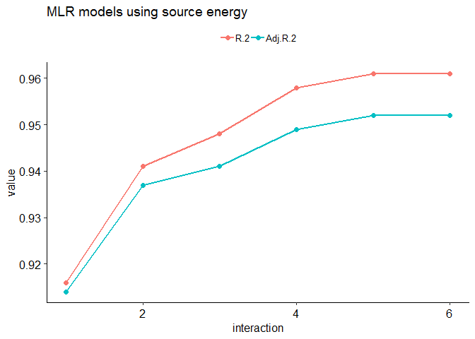
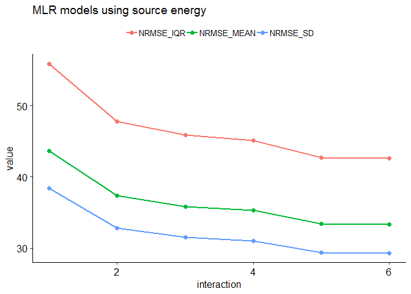
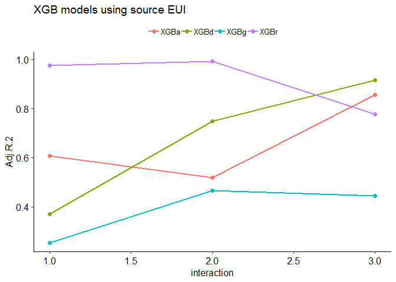
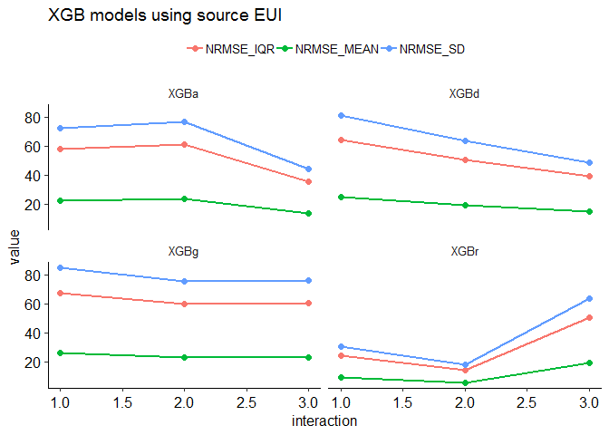
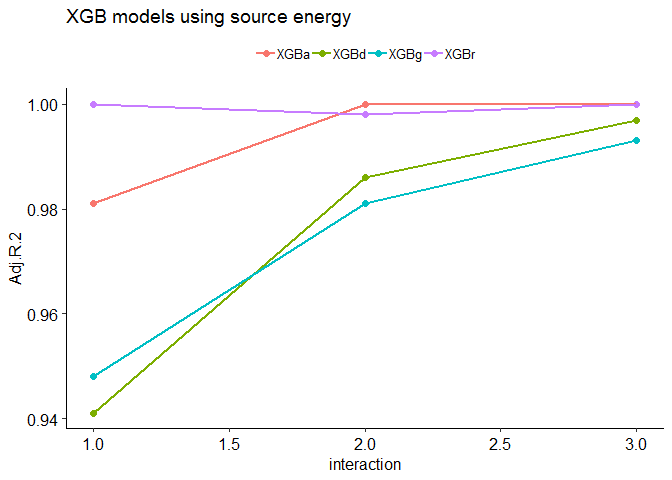
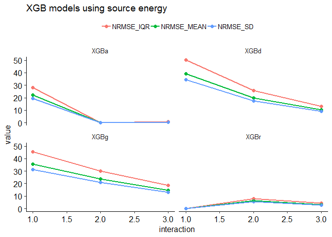
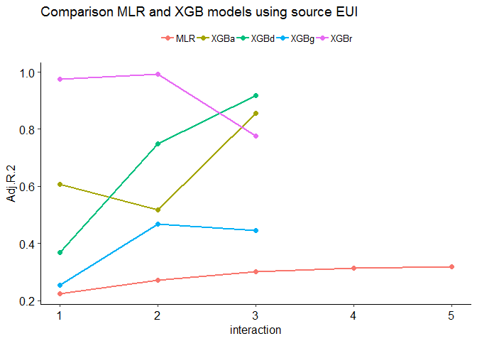
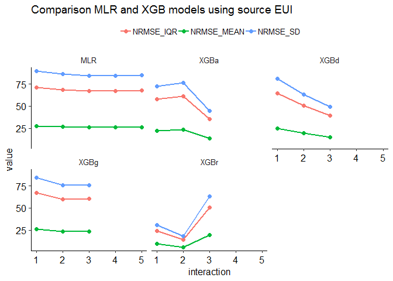
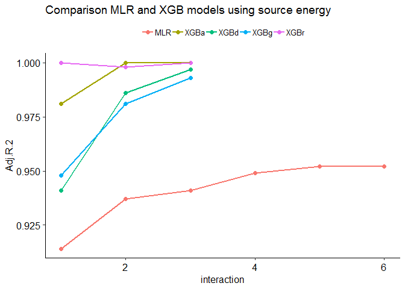
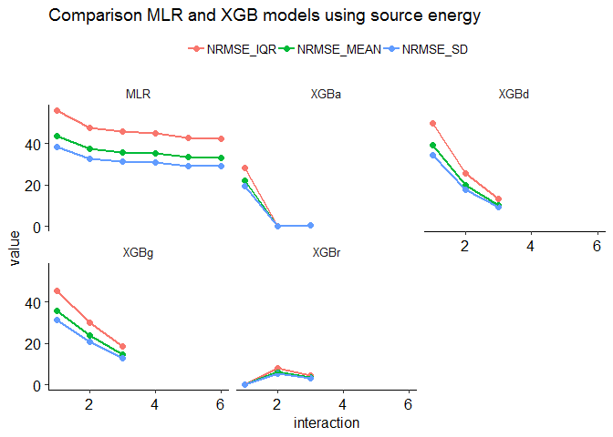

Benchmarking Multifamily Houses
================
Pandarasamy Arjunan
3 June 2019

-   [Load dataset](#load-dataset)
-   [Apply filters](#apply-filters)
-   [Prepare features](#prepare-features)
-   [Descriptive statistics](#descriptive-statistics)
    -   [Data Frame Summary](#data-frame-summary)
-   [Build predictive models](#build-predictive-models)
    -   [Multiple Linear Regression (MLR)](#multiple-linear-regression-mlr)
    -   [Multiple Linear Regression (MLR) with Interaction terms](#multiple-linear-regression-mlr-with-interaction-terms)
    -   [Comparision of MLR models](#comparision-of-mlr-models)
    -   [Gradient Boosted Trees (XGBoost)](#gradient-boosted-trees-xgboost)
    -   [Comparision of XGB models](#comparision-of-xgb-models)
    -   [Comparision between MLR and XGB models](#comparision-between-mlr-and-xgb-models)

Load dataset
------------

``` r
building_type = "multifamily"

filtered_dir = './data/cbecs/filtered/'
dir.create(filtered_dir, recursive = T, showWarnings = F)

features_dir = './data/cbecs/features/'
dir.create(features_dir, recursive = T, showWarnings = F)

results_dir = './results/cbecs/'
dir.create(results_dir, recursive = T, showWarnings = F)
```

The reference data used to establish the peer building population in the United States is Fannie Mae’s Multifamily Energy and Water Market Research Survey.

``` r
multifamily = read_csv("data/cbecs/FannieMae/mewmr-survey-database_data.csv")
```

    Parsed with column specification:
    cols(
      .default = col_character(),
      `Property ID` = col_double(),
      CDD = col_double(),
      HDD = col_double(),
      `Total amount of irrigated areas` = col_number(),
      `Total gross floor area` = col_number(),
      `Common Area Floor Area` = col_number(),
      `Total gross rentable retail and commercial floor area` = col_number(),
      `Total open parking floor area` = col_number(),
      `Total non-enclosed parking floor area` = col_number(),
      `Total enclosed parking floor area` = col_number(),
      `Parking hours per week` = col_double(),
      `Number of buildings this applies to` = col_double(),
      `Number of floors above existing grade plan` = col_double(),
      `Number of floors below existing grade plan` = col_double(),
      `Number of units per building` = col_double(),
      `Number of buildings this applies to_1` = col_double(),
      `Number of floors above existing grade plan_1` = col_double(),
      `Number of floors below existing grade plan_1` = col_double(),
      `Number of units per building_1` = col_double(),
      `Number of buildings this applies to_2` = col_double()
      # ... with 88 more columns
    )

    See spec(...) for full column specifications.

``` r
## remove all special chars 
cols = names(multifamily)
cols <- gsub("[^0-9A-Za-z// ]","" , cols ,ignore.case = TRUE)
cols = gsub("  ", "", cols, fixed = TRUE)
names(multifamily) = make.names(cols, unique = T)

cols = c( "Total.gross.floor.area",
           "Total.number.of.units",
           "Unit.Density",
           "Bedrooms.Unit",
           "Number.of.BRs",
           "CDD", 
           "HDD",
           "Building.Type.Property.Level",
           "Total.SOURCE.kBtu",
           "Total.SITE.kBtu",
           "Source.EUI.using.Total.gross.floor.area",
           "Site.EUIusing.Total.gross.floor.area",
           "Survey.Weights.for.ENERGY.STAR.score.analysis")
```

Apply filters
-------------

As per Energy Star's technical document [ENERGY STAR Score for Multifamily Housing in the United States](https://www.energystar.gov/buildings/tools-and-resources/energy_star_score_multifamily_housing_united_states), following filters are applied to define the peer group and to remove any outliers.

After applying each filter, the number of remaining buildings in the dataset (*Number Remaining: X*) and any difference (*Difference: X*) in count from the original Energy Star's technical documentation is also given.

1.  **Must have complete data for whole-property energy use and operating characteristics** <br/>EPA Program Filter – Complete data is necessary for analysis. <br/>Number Remaining: 357 <br/>Difference: +7.

    ``` r
    m0a = multifamily %>% 
      filter(Energy.Space.Served == "Whole property") %>%
      filter(X12.months.of.energy.data.provided == "Y") %>%
      #filter(Survey.Weights.for.ENERGY.STAR.score.analysis > 0) %>% 
      filter(Total.gross.floor.area > 0) %>% 
      filter(Total.number.of.units > 0) %>%
      filter(Unit.Density > 0) %>% 
      filter(Number.of.BRs > 0) %>%
      filter(Bedrooms.Unit > 0) %>%
      filter(CDD > 0) %>% 
      filter(HDD > 0) %>% 
      filter(Building.Type.Property.Level != "Not Provided")

    m0b = m0a %>% 
      filter(Total.SOURCE.kBtu > 0) %>%
      filter(Total.SITE.kBtu > 0) %>%
      filter(Source.EUI.using.Total.gross.floor.area > 0)

    m0c = m0b %>% filter( Total.number.of.units > 0 &
                        Unit.Density > 0 & 
                        Bedrooms.Unit > 0 & 
                        CDD > 0 & 
                        HDD > 0 )
    ```

2.  **Must have at least 20 units** <br/>Analytical filter – Analysis could not model behavior for buildings with fewer than 20 units, due to limited data. <br/>Number Remaining: 351. <br/>Difference: +9

    ``` r
    m1 = m0c %>% filter(Total.number.of.units >= 20)
    ```

3.  **Source EUI must be less than 290 kBtu/ft2** <br/>Analytical filter – Values determined to be data entry errors or statistical outliers. <br/>Number Remaining: 347. <br/>Difference: +14.

    ``` r
    m2 = m1 %>% filter(Source.EUI.using.Total.gross.floor.area > 0 & 
                     Source.EUI.using.Total.gross.floor.area < 290)
    ```

4.  **Gross Floor area must be no more than 2,000,000 ft2** <br/>Analytical filter – Values determined to be data entry errors or statistical outliers. <br/>Number Remaining: 346 <br/>Difference: +14.

    ``` r
    m3 = m2 %>% filter(Total.gross.floor.area <= 2000000)
    ```

5.  **Unit density must be less than 2.75 units per 1,000 square feet** <br/>Analytical filter – Values determined to be data entry errors or statistical outliers. <br/>Number Remaining: 338. <br/>Difference: +11.

    ``` r
    m4 = m3 %>% filter(Unit.Density < 2.75)
    ```

6.  **Bedroom Density must be more than 0.5 and less than 3.5 bedrooms per 1,000 square feet** <br/>Analytical filter – Values determined to be data entry errors or statistical outliers. <br/>Number Remaining: 336 <br/>Difference: +12.

    ``` r
    m5 = m4 %>% filter(Bedrooms.Unit > 0.5 & Bedrooms.Unit < 3.5)
    ```

7.  **Other filters - Survey weights should be positive** <br/>Number Remaining: 321 <br/>Difference: -1.

    ``` r
    m6 = m5 %>% filter(Unit.Density > 0 & 
                     Bedrooms.Unit > 0 & 
                     CDD > 0 & 
                     HDD > 0 & 
                     Survey.Weights.for.ENERGY.STAR.score.analysis > 0)
    ```

**Save the filtered dataset**

``` r
m7 = m6[, cols]
write.csv(m7, paste0(filtered_dir, building_type, ".csv"), row.names = F)
```

Prepare features
----------------

The final regression equation includes the following variables: ï‚· ï‚· - Number of Units per 1,000 square feet - Number of Bedrooms per Unit - Total Heating Degree Days - Total Cooling Degree Days - Low-Rise building (yes/no)

``` r
multifamily = read.csv(paste0(filtered_dir, building_type, ".csv"))

data = multifamily %>% 
  mutate(IsLowRise = 
           ifelse(Building.Type.Property.Level == "Low-rise", "Yes", "No")) 

ivars = c( "Total.gross.floor.area",
           "Unit.Density",
           "Bedrooms.Unit",
           "CDD", 
           "HDD", 
           "IsLowRise")

dvars = c("Total.SITE.kBtu",
          "Total.SOURCE.kBtu",
          "Site.EUIusing.Total.gross.floor.area",
          "Source.EUI.using.Total.gross.floor.area",
          "Survey.Weights.for.ENERGY.STAR.score.analysis")

features = data %>% 
  dplyr::select(c(ivars, dvars)) %>%
  dplyr::rename(SQFT = Total.gross.floor.area) %>%
  dplyr::rename(SITE_ENERGY = Total.SITE.kBtu) %>%
  dplyr::rename(SOURCE_ENERGY = Total.SOURCE.kBtu) %>%
  dplyr::rename(SITE_EUI = Site.EUIusing.Total.gross.floor.area) %>%
  dplyr::rename(SOURCE_EUI = Source.EUI.using.Total.gross.floor.area) %>%
  dplyr::rename(FINALWT = Survey.Weights.for.ENERGY.STAR.score.analysis) %>%
  dplyr::select(-c(SITE_EUI, SITE_ENERGY))

#summary(features)
features = features %>% na.omit()

write.csv(features, 
          paste0(features_dir, building_type, ".csv"), 
          row.names = F)
```

Descriptive statistics
----------------------

``` r
features1 = features
features1 = features1 %>% dplyr::select(-one_of('SOURCE_ENERGY', 'FINALWT'))

summarytools::descr(features1, stats = "common", 
                    transpose = TRUE, 
                    headings = FALSE)
```

    Non-numerical variable(s) ignored: IsLowRise

|                   |       Mean|    Std.Dev|       Min|    Median|         Max|  N.Valid|
|------------------:|----------:|----------:|---------:|---------:|-----------:|--------:|
|  **Bedrooms.Unit**|       1.29|       0.40|      1.00|      1.10|        3.00|   321.00|
|            **CDD**|    1333.97|     842.99|     30.00|   1272.00|     4602.00|   321.00|
|            **HDD**|    4355.78|    1370.61|    429.00|   4423.00|     8326.00|   321.00|
|    **SOURCE\_EUI**|     131.20|      40.27|     28.80|    127.90|      272.70|   321.00|
|           **SQFT**|  140518.16|  157627.68|  12730.00|  82091.00|  1258958.00|   321.00|
|   **Unit.Density**|       1.13|       0.36|      0.27|      1.13|        2.50|   321.00|

|                   |  Pct.Valid|
|------------------:|----------:|
|  **Bedrooms.Unit**|     100.00|
|            **CDD**|     100.00|
|            **HDD**|     100.00|
|    **SOURCE\_EUI**|     100.00|
|           **SQFT**|     100.00|
|   **Unit.Density**|     100.00|

``` r
dfSummary(features1, plain.ascii = FALSE, style = "grid", 
          graph.magnif = 0.75, valid.col = FALSE)
```

    text graphs are displayed; set 'tmp.img.dir' parameter to activate png graphs

### Data Frame Summary

**features1**
**Dimensions:** 321 x 7
**Duplicates:** 0

<table style="width:100%;">
<colgroup>
<col width="4%" />
<col width="15%" />
<col width="31%" />
<col width="19%" />
<col width="20%" />
<col width="8%" />
</colgroup>
<thead>
<tr class="header">
<th>No</th>
<th>Variable</th>
<th>Stats / Values</th>
<th>Freqs (% of Valid)</th>
<th>Graph</th>
<th>Missing</th>
</tr>
</thead>
<tbody>
<tr class="odd">
<td><p>1</p></td>
<td><p>SQFT<br />
[integer]</p></td>
<td><p>Mean (sd) : 140518.2 (157627.7)<br />
min &lt; med &lt; max:<br />
12730 &lt; 82091 &lt; 1258958<br />
IQR (CV) : 108041 (1.1)</p></td>
<td><p>317 distinct values</p></td>
<td><p><br />
:<br />
:<br />
:<br />
:<br />
: : . .</p></td>
<td><p>0<br />
(0%)</p></td>
</tr>
<tr class="even">
<td><p>2</p></td>
<td><p>Unit.Density<br />
[numeric]</p></td>
<td><p>Mean (sd) : 1.1 (0.4)<br />
min &lt; med &lt; max:<br />
0.3 &lt; 1.1 &lt; 2.5<br />
IQR (CV) : 0.5 (0.3)</p></td>
<td><p>128 distinct values</p></td>
<td><p><br />
      . :<br />
    : : :<br />
    : : : .<br />
  . : : : :<br />
: : : : : : : .</p></td>
<td><p>0<br />
(0%)</p></td>
</tr>
<tr class="odd">
<td><p>3</p></td>
<td><p>Bedrooms.Unit<br />
[numeric]</p></td>
<td><p>Mean (sd) : 1.3 (0.4)<br />
min &lt; med &lt; max:<br />
1 &lt; 1.1 &lt; 3<br />
IQR (CV) : 0.5 (0.3)</p></td>
<td><p>26 distinct values</p></td>
<td><p><br />
:<br />
:<br />
:<br />
:<br />
: : . . .</p></td>
<td><p>0<br />
(0%)</p></td>
</tr>
<tr class="even">
<td><p>4</p></td>
<td><p>CDD<br />
[integer]</p></td>
<td><p>Mean (sd) : 1334 (843)<br />
min &lt; med &lt; max:<br />
30 &lt; 1272 &lt; 4602<br />
IQR (CV) : 665 (0.6)</p></td>
<td><p>153 distinct values</p></td>
<td><p><br />
    :<br />
    :<br />
  . :<br />
. : : .<br />
: : : : . . . .</p></td>
<td><p>0<br />
(0%)</p></td>
</tr>
<tr class="odd">
<td><p>5</p></td>
<td><p>HDD<br />
[integer]</p></td>
<td><p>Mean (sd) : 4355.8 (1370.6)<br />
min &lt; med &lt; max:<br />
429 &lt; 4423 &lt; 8326<br />
IQR (CV) : 1438 (0.3)</p></td>
<td><p>148 distinct values</p></td>
<td><p><br />
        :<br />
        :<br />
        : :<br />
    .   : :<br />
  . : : : : :</p></td>
<td><p>0<br />
(0%)</p></td>
</tr>
<tr class="even">
<td><p>6</p></td>
<td><p>IsLowRise<br />
[character]</p></td>
<td><p>1. No<br />
2. Yes</p></td>
<td><p>214 (66.7%)<br />
107 (33.3%)</p></td>
<td><p>IIIIIIIIIIIII<br />
IIIIII</p></td>
<td><p>0<br />
(0%)</p></td>
</tr>
<tr class="odd">
<td><p>7</p></td>
<td><p>SOURCE_EUI<br />
[numeric]</p></td>
<td><p>Mean (sd) : 131.2 (40.3)<br />
min &lt; med &lt; max:<br />
28.8 &lt; 127.9 &lt; 272.7<br />
IQR (CV) : 50.5 (0.3)</p></td>
<td><p>295 distinct values</p></td>
<td><p><br />
      : :<br />
      : :<br />
    : : : :<br />
  . : : : : .<br />
. : : : : : : : .</p></td>
<td><p>0<br />
(0%)</p></td>
</tr>
</tbody>
</table>

**Extract R code from Rmd document**

``` r
#knitr::purl("multifamily.Rmd", output = "multifamily.R", documentation = 2)
```

Build predictive models
-----------------------

``` r
#source("models.R")
source("metrics.R")

data = read.csv(paste0(features_dir, building_type, ".csv"))

allMetrics = NULL

sourceEUI_attributes = setdiff(colnames(data),
                               c("SQFT", "FINALWT", "SOURCE_EUI", "SOURCE_ENERGY"))

sourceEnergy_attributes = setdiff(colnames(data), 
                               c("FINALWT", "SOURCE_EUI", "SOURCE_ENERGY"))
#cat(colnames(data))
knitr::kable(colnames(data), col.names = NULL)
```

    Warning in kable_markdown(x, padding = padding, ...): The table should have
    a header (column names)

|                |
|:---------------|
| SQFT           |
| Unit.Density   |
| Bedrooms.Unit  |
| CDD            |
| HDD            |
| IsLowRise      |
| SOURCE\_ENERGY |
| SOURCE\_EUI    |
| FINALWT        |

### Multiple Linear Regression (MLR)

``` r
MLR.fit <- function(data, 
                    x, 
                    y, 
                    w, 
                    interaction,
                    centering = TRUE 
                    ) {
  
  if(centering == TRUE){
    data = mean_center_data(data, x)  
  }
  
  if(interaction == 1) {  ### ordinary model
    model = paste(y, "~", paste(x, collapse = " + "))  
  } else {  ### interaction model
    allvars = paste(x, collapse = " + ")
    model = paste(y, "~ (", allvars, ") ^", interaction )
  }
  
  fit = lm(model, data = data, weights = data[, w])
  return (fit)
}

MLR.predict <- function(data, x, y, w, i) {
  
  mlrFit = MLR.fit(data, x, y, w, i)
  
  wt   = data[, w]
  obs  = data[, y]
  pred = as.numeric(predict(mlrFit))
  
  mlrMetrics = getMLRmetrics(mlrFit, obs, pred, wt)
  mlrMetrics = data.frame(
    "model" = "MLR",
    "dependent" = y,
    "interaction" = i,
    "transform" = "meanCent",
    mlrMetrics)
  
  return(mlrMetrics)
}
```

#### Using SOURCE\_EUI as dependent variable

``` r
x = sourceEUI_attributes
y = "SOURCE_EUI"
w = "FINALWT"
interaction = 1

mlrMetrics = MLR.predict(data, x, y, w, interaction)

allMetrics = rbind(allMetrics, mlrMetrics)

knitr::kable(allMetrics, row.names = F)
```

| model | dependent   |  interaction| transform |  obs|  rank|  coef|    R.2|  Adj.R.2|       mse|    rmse|     mae|   mape|  nrmse\_iqr|  nrmse\_range|  nrmse\_mean|  nrmse\_sd|
|:------|:------------|------------:|:----------|----:|-----:|-----:|------:|--------:|---------:|-------:|-------:|------:|-----------:|-------------:|------------:|----------:|
| MLR   | SOURCE\_EUI |            1| meanCent  |  321|     6|     6|  0.237|    0.224|  1297.766|  36.025|  27.787|  0.252|      71.337|         14.77|       27.459|     89.453|

#### Using SOURCE\_ENERGY as dependent variable

``` r
x = sourceEnergy_attributes
y = "SOURCE_ENERGY"
w = "FINALWT"
interaction = 1

mlrMetrics = MLR.predict(data, x, y, w, interaction)

allMetrics = rbind(allMetrics, mlrMetrics)

knitr::kable(allMetrics, row.names = F)
```

| model | dependent      |  interaction| transform |  obs|  rank|  coef|    R.2|  Adj.R.2|           mse|         rmse|          mae|   mape|  nrmse\_iqr|  nrmse\_range|  nrmse\_mean|  nrmse\_sd|
|:------|:---------------|------------:|:----------|----:|-----:|-----:|------:|--------:|-------------:|------------:|------------:|------:|-----------:|-------------:|------------:|----------:|
| MLR   | SOURCE\_EUI    |            1| meanCent  |  321|     6|     6|  0.237|    0.224|  1.297766e+03|       36.025|       27.787|  0.252|      71.337|        14.770|       27.459|     89.453|
| MLR   | SOURCE\_ENERGY |            1| meanCent  |  321|     7|     7|  0.916|    0.914|  6.109136e+13|  7816096.384|  4254972.703|  0.304|      55.885|         5.368|       43.669|     38.404|

### Multiple Linear Regression (MLR) with Interaction terms

#### Using SOURCE\_EUI as dependent variable

``` r
x = sourceEUI_attributes
y = "SOURCE_EUI"
w = "FINALWT"

intr_depth = length(x)

for (interaction in 2:intr_depth) {
  mlrMetrics = MLR.predict(data, x, y, w, interaction)
  allMetrics = rbind(allMetrics, mlrMetrics)
}

write.csv(allMetrics, 
          paste0(results_dir, building_type, ".csv"), 
          row.names = F)

allMetrics0 = allMetrics %>% filter(dependent == y)
knitr::kable(allMetrics0, row.names = F)
```

| model | dependent   |  interaction| transform |  obs|  rank|  coef|    R.2|  Adj.R.2|       mse|    rmse|     mae|   mape|  nrmse\_iqr|  nrmse\_range|  nrmse\_mean|  nrmse\_sd|
|:------|:------------|------------:|:----------|----:|-----:|-----:|------:|--------:|---------:|-------:|-------:|------:|-----------:|-------------:|------------:|----------:|
| MLR   | SOURCE\_EUI |            1| meanCent  |  321|     6|     6|  0.237|    0.224|  1297.766|  36.025|  27.787|  0.252|      71.337|        14.770|       27.459|     89.453|
| MLR   | SOURCE\_EUI |            2| meanCent  |  321|    16|    16|  0.306|    0.272|  1206.474|  34.734|  26.959|  0.247|      68.780|        14.241|       26.475|     86.248|
| MLR   | SOURCE\_EUI |            3| meanCent  |  321|    26|    26|  0.355|    0.301|  1162.950|  34.102|  26.707|  0.244|      67.529|        13.982|       25.993|     84.678|
| MLR   | SOURCE\_EUI |            4| meanCent  |  321|    31|    31|  0.379|    0.314|  1148.714|  33.893|  26.248|  0.241|      67.115|        13.896|       25.834|     84.159|
| MLR   | SOURCE\_EUI |            5| meanCent  |  321|    32|    32|  0.385|    0.319|  1167.023|  34.162|  26.334|  0.242|      67.648|        14.007|       26.039|     84.827|

#### Using SOURCE\_ENERGY as dependent variable\*\*

``` r
x = sourceEnergy_attributes
y = "SOURCE_ENERGY"
w = "FINALWT"

intr_depth = length(x)

for (interaction in 2:intr_depth) {
  mlrMetrics = MLR.predict(data, x, y, w, interaction)
  allMetrics = rbind(allMetrics, mlrMetrics)
}

write.csv(allMetrics, 
          paste0(results_dir, building_type, ".csv"), 
          row.names = F)

allMetrics0 = allMetrics %>% filter(dependent == y)
knitr::kable(allMetrics0, row.names = F)
```

| model | dependent      |  interaction| transform |  obs|  rank|  coef|    R.2|  Adj.R.2|           mse|     rmse|      mae|   mape|  nrmse\_iqr|  nrmse\_range|  nrmse\_mean|  nrmse\_sd|
|:------|:---------------|------------:|:----------|----:|-----:|-----:|------:|--------:|-------------:|--------:|--------:|------:|-----------:|-------------:|------------:|----------:|
| MLR   | SOURCE\_ENERGY |            1| meanCent  |  321|     7|     7|  0.916|    0.914|  6.109136e+13|  7816096|  4254973|  0.304|      55.885|         5.368|       43.669|     38.404|
| MLR   | SOURCE\_ENERGY |            2| meanCent  |  321|    22|    22|  0.941|    0.937|  4.466116e+13|  6682901|  3719684|  0.259|      47.782|         4.590|       37.338|     32.836|
| MLR   | SOURCE\_ENERGY |            3| meanCent  |  321|    42|    42|  0.948|    0.941|  4.115999e+13|  6415605|  3564359|  0.254|      45.871|         4.406|       35.845|     31.523|
| MLR   | SOURCE\_ENERGY |            4| meanCent  |  321|    57|    57|  0.958|    0.949|  3.982323e+13|  6310565|  3382280|  0.232|      45.120|         4.334|       35.258|     31.007|
| MLR   | SOURCE\_ENERGY |            5| meanCent  |  321|    63|    63|  0.961|    0.952|  3.570136e+13|  5975061|  3227146|  0.221|      42.721|         4.104|       33.383|     29.358|
| MLR   | SOURCE\_ENERGY |            6| meanCent  |  321|    64|    64|  0.961|    0.952|  3.551557e+13|  5959494|  3220897|  0.221|      42.610|         4.093|       33.296|     29.282|

### Comparision of MLR models

#### MLR plots using Source EUI

``` r
mytheme = theme(legend.title = element_blank(),
           legend.text=element_text(size=12),
           axis.text=element_text(size=12),
           text=element_text(size=12))

plotR2 <- function(df, titl) {
  
  df1 = melt(df, measure.vars = c("R.2", "Adj.R.2"))
  
  plot <- ggplot(df1, aes(x = interaction, y=value, 
                          group=variable, col=variable)) + 
  geom_point(size=2) + geom_line(size=1) +
    ggtitle(titl) + 
    theme_pubr(base_size=12) +
    theme(legend.position="top", legend.title = element_blank())
  
  return(plot)
}

plotNRMSE <- function(df, titl) {
  
  df1 = melt(df, measure.vars = c("nrmse_iqr", "nrmse_mean", 
                                        "nrmse_sd"))
  df1$variable = toupper(df1$variable)
  
  plot <- ggplot(df1, aes(x = interaction, y=value, 
                          group=variable, col=variable)) + 
  geom_point(size=2) + geom_line(size=1) +
    ggtitle(titl) + 
    theme_pubr(base_size=12) +
    theme(legend.position="top", legend.title = element_blank())
    
  
  return(plot)
}  
```

``` r
allMetrics0 = allMetrics %>%
  filter(stringr::str_detect(model, "MLR")) %>%
  filter(dependent == "SOURCE_EUI")

plot1 = plotR2(allMetrics0, "MLR models using source EUI")
plot2 = plotNRMSE(allMetrics0, "MLR models using source EUI")

print(plot1)
```


``` r
print(plot2)
```


#### MLR plots using Source Energy

``` r
allMetrics0 = allMetrics %>%
  filter(stringr::str_detect(model, "MLR")) %>%
  filter(dependent == "SOURCE_ENERGY")

plot1 = plotR2(allMetrics0, "MLR models using source energy")
plot2 = plotNRMSE(allMetrics0, "MLR models using source energy")

print(plot1)
```



``` r
print(plot2)
```



### Gradient Boosted Trees (XGBoost)

``` r
tuneXGBoost <- function(x,
                        y,
                        sample_weights,
                        search = "default",
                        tree_height = 2
                        ) {
  
  N = 10  # N-fold CV
  R = 2   # and R repeats
  
  tcDefault  <- trainControl(method = "repeatedcv", 
                            number = N, 
                            repeats = R)
  
  tcRandom   <- trainControl(method = "repeatedcv", 
                            search = "random",
                            number = N, 
                            repeats = R)
  
  tcAdaptive <- trainControl(method = "adaptive_cv", 
                            search = "random",
                            number = N, 
                            repeats = R,
                            adaptive = list(min = 5, 
                                            alpha = 0.05, 
                                            method = "gls",
                                            complete = TRUE))
  
  default_param = expand.grid(
    nrounds = 100,
    max_depth = tree_height,
    eta = 0.3,
    gamma = 0,
    colsample_bytree = 1,
    min_child_weight = 1,
    subsample = 1)
  
  # from https://github.com/topepo/caret/blob/master/models/files/xgbTree.R
  len = 10
  grid_param <- expand.grid(
    nrounds = floor((1:len) * 10),
    max_depth = tree_height,
    eta = c(.3, .4),
    gamma = 0,
    colsample_bytree = c(.6, .8),
    min_child_weight = c(1),
    subsample = seq(.25, 1, length = len))
  
  tuned = switch(search,
                 "default" = train(x, y,
                                   weights = sample_weights,
                                   method = "xgbTree", 
                                   tuneGrid = default_param,
                                   trControl = tcDefault,
                                   verbose = TRUE),
                 
                 "grid"     = train(x, y, 
                                   weights = sample_weights,
                                   method = "xgbTree", 
                                   tuneGrid = grid_param,
                                   trControl = tcDefault,
                                   verbose = TRUE),

                 "random"  = train(x, y, 
                                   weights = sample_weights,
                                   method = "xgbTree", 
                                   trControl = tcRandom,
                                   verbose = TRUE),
                 
                 "adaptive" = train(x, y, 
                                   weights = sample_weights,
                                   method = "xgbTree", 
                                   trControl = tcAdaptive,
                                   verbose = TRUE)
                 )
  
  return(tuned$finalModel)
}

XGBoost <- function( xdata, 
                     ydata,
                     sample_weights,
                     search = "default",
                     interaction = 2
                     ) {
  
  model = paste(y, "~", paste(x, collapse = " + "))
  dummy = dummyVars(model, data = data, fullRank = T)
  
  xdata = as.data.frame(predict(dummy, data))
  ydata = data[, y]
  
  xgfit = tuneXGBoost(xdata, ydata, 
                      sample_weights,
                      search, 
                      tree_height = interaction)
  return(xgfit)
} 


XGBoost.predict <- function(data, x, y, w, search) {

  model = paste(y, "~", paste(x, collapse = " + "))
  dummy = dummyVars(model, data = data, fullRank = T)
  xdata = as.data.frame(predict(dummy, data))
  ydata = data[, y]
  wt = data[, w]
  
  intr_depth = 3
  
  xgbMetricsAll = NULL
  
  for (intr in 1:intr_depth) {
    
    cat(paste(Sys.time(), "xgboost", search, y, intr, "\n"))
    
    xgfit = XGBoost(xdata, ydata, wt, 
                    search = search, 
                    interaction = intr)
    
    pred = as.numeric(predict(xgfit, as.matrix(xdata)))
    
    xgbMetrics = getXgboostmetrics(xgfit, xdata, ydata, pred, wt)
    
    xgbMetrics = data.frame(
      "model" = paste0("XGB", substr(search, 1,1), intr),
      "dependent" = y, 
      "interaction" = intr, 
      "transform" = "None",
      xgbMetrics)
    
    xgbMetricsAll = rbind(xgbMetricsAll, xgbMetrics)
  }
  
  return(xgbMetricsAll)
}
```

``` r
# y = "SOURCE_EUI"
# w = "FINALWT"
# o = c("SOURCE_ENERGY", "SQFT")
# x = setdiff(colnames(data), c(y, w, o))
# wt = data[, w]
# 
# model = paste(y, "~", paste(x, collapse = " + "))
# dummy = dummyVars(model, data = data, fullRank = T)
# xdata = as.data.frame(predict(dummy, data))
# ydata = data[, y]
# intr_depth = 3
# 
# for (intr in 1:intr_depth) {
#   
#   print(paste(Sys.time(), "xgboost default search", y, intr, "\n"))
#   
#   xgfit = XGBoost(xdata, ydata, wt, 
#                   search = "default", 
#                   interaction = intr)
#   
#   pred = as.numeric(predict(xgfit, as.matrix(xdata)))
#   
#   xgbMetrics = getXgboostmetrics(xgfit, xdata, ydata, pred, wt)
#   
#   xgbMetrics = data.frame(
#     "model" = paste0("XGBd", intr),
#     "dependent" = y, 
#     "interaction" = intr, 
#     "transform" = "None",
#     xgbMetrics)
#   
#   allMetrics = rbind(allMetrics, xgbMetrics)
# }
# knitr::kable(allMetrics, row.names = F)
```

#### Using SOURCE\_EUI as dependent variable

``` r
library(doParallel)
ncore = 4
registerDoParallel(cores = ncore)
```

##### Using default search

``` r
x = sourceEUI_attributes
y = "SOURCE_EUI"
w = "FINALWT"
search = "default"

xgbMetrics = XGBoost.predict(data, x, y, w, search)
```

2019-06-10 15:38:41 xgboost default SOURCE\_EUI 1 2019-06-10 15:39:00 xgboost default SOURCE\_EUI 2 2019-06-10 15:39:03 xgboost default SOURCE\_EUI 3

``` r
allMetrics = rbind(allMetrics, xgbMetrics)

knitr::kable(xgbMetrics, row.names = F)
```

| model | dependent   |  interaction| transform |  obs|  rank|  coef|    R.2|  Adj.R.2|       mse|    rmse|     mae|   mape|  nrmse\_iqr|  nrmse\_range|  nrmse\_mean|  nrmse\_sd|
|:------|:------------|------------:|:----------|----:|-----:|-----:|------:|--------:|---------:|-------:|-------:|------:|-----------:|-------------:|------------:|----------:|
| XGBd1 | SOURCE\_EUI |            1| None      |  321|     5|     5|  0.376|    0.369|  1061.271|  32.577|  24.851|  0.229|      64.509|        13.357|       24.831|     80.892|
| XGBd2 | SOURCE\_EUI |            2| None      |  321|     5|     5|  0.752|    0.749|   652.782|  25.550|  18.138|  0.164|      50.594|        10.476|       19.474|     63.443|
| XGBd3 | SOURCE\_EUI |            3| None      |  321|     5|     5|  0.918|    0.917|   389.020|  19.724|  12.337|  0.111|      39.057|         8.087|       15.034|     48.976|

##### Using grid search

``` r
x = sourceEUI_attributes
y = "SOURCE_EUI"
w = "FINALWT"
search = "grid"

xgbMetrics = XGBoost.predict(data, x, y, w, search)
```

2019-06-10 15:39:06 xgboost grid SOURCE\_EUI 1 2019-06-10 15:39:51 xgboost grid SOURCE\_EUI 2 2019-06-10 15:40:51 xgboost grid SOURCE\_EUI 3

``` r
allMetrics = rbind(allMetrics, xgbMetrics)

knitr::kable(xgbMetrics, row.names = F)
```

| model | dependent   |  interaction| transform |  obs|  rank|  coef|    R.2|  Adj.R.2|       mse|    rmse|     mae|   mape|  nrmse\_iqr|  nrmse\_range|  nrmse\_mean|  nrmse\_sd|
|:------|:------------|------------:|:----------|----:|-----:|-----:|------:|--------:|---------:|-------:|-------:|------:|-----------:|-------------:|------------:|----------:|
| XGBg1 | SOURCE\_EUI |            1| None      |  321|     5|     5|  0.263|    0.253|  1162.587|  34.097|  26.182|  0.244|      67.519|        13.980|       25.989|     84.666|
| XGBg2 | SOURCE\_EUI |            2| None      |  321|     5|     5|  0.474|    0.467|   924.660|  30.408|  23.194|  0.212|      60.214|        12.467|       23.177|     75.506|
| XGBg3 | SOURCE\_EUI |            3| None      |  321|     5|     5|  0.452|    0.445|   935.563|  30.587|  23.620|  0.210|      60.568|        12.541|       23.314|     75.950|

##### Using adaptive search

``` r
x = sourceEUI_attributes
y = "SOURCE_EUI"
w = "FINALWT"
search = "adaptive"

xgbMetrics = XGBoost.predict(data, x, y, w, search)
```

2019-06-10 15:42:07 xgboost adaptive SOURCE\_EUI 1 2019-06-10 15:42:27 xgboost adaptive SOURCE\_EUI 2 2019-06-10 15:42:45 xgboost adaptive SOURCE\_EUI 3

``` r
allMetrics = rbind(allMetrics, xgbMetrics)

knitr::kable(xgbMetrics, row.names = F)
```

| model | dependent   |  interaction| transform |  obs|  rank|  coef|    R.2|  Adj.R.2|      mse|    rmse|     mae|   mape|  nrmse\_iqr|  nrmse\_range|  nrmse\_mean|  nrmse\_sd|
|:------|:------------|------------:|:----------|----:|-----:|-----:|------:|--------:|--------:|-------:|-------:|------:|-----------:|-------------:|------------:|----------:|
| XGBa1 | SOURCE\_EUI |            1| None      |  321|     5|     5|  0.612|    0.607|  856.412|  29.265|  21.910|  0.197|      57.950|        11.999|       22.306|     72.668|
| XGBa2 | SOURCE\_EUI |            2| None      |  321|     5|     5|  0.524|    0.518|  953.626|  30.881|  23.477|  0.214|      61.150|        12.661|       23.538|     76.680|
| XGBa3 | SOURCE\_EUI |            3| None      |  321|     5|     5|  0.857|    0.855|  321.558|  17.932|  12.792|  0.110|      35.509|         7.352|       13.668|     44.527|

##### Using random search

``` r
x = sourceEUI_attributes
y = "SOURCE_EUI"
w = "FINALWT"
search = "random"

xgbMetrics = XGBoost.predict(data, x, y, w, search)
```

2019-06-10 15:43:12 xgboost random SOURCE\_EUI 1 2019-06-10 15:44:26 xgboost random SOURCE\_EUI 2 2019-06-10 15:45:27 xgboost random SOURCE\_EUI 3

``` r
allMetrics = rbind(allMetrics, xgbMetrics)

write.csv(allMetrics, 
          paste0(results_dir, building_type, ".csv"), 
          row.names = F)

allMetrics0 = allMetrics %>% filter(dependent == y)
knitr::kable(allMetrics0, row.names = F)
```

| model | dependent   |  interaction| transform |  obs|  rank|  coef|    R.2|  Adj.R.2|       mse|    rmse|     mae|   mape|  nrmse\_iqr|  nrmse\_range|  nrmse\_mean|  nrmse\_sd|
|:------|:------------|------------:|:----------|----:|-----:|-----:|------:|--------:|---------:|-------:|-------:|------:|-----------:|-------------:|------------:|----------:|
| MLR   | SOURCE\_EUI |            1| meanCent  |  321|     6|     6|  0.237|    0.224|  1297.766|  36.025|  27.787|  0.252|      71.337|        14.770|       27.459|     89.453|
| MLR   | SOURCE\_EUI |            2| meanCent  |  321|    16|    16|  0.306|    0.272|  1206.474|  34.734|  26.959|  0.247|      68.780|        14.241|       26.475|     86.248|
| MLR   | SOURCE\_EUI |            3| meanCent  |  321|    26|    26|  0.355|    0.301|  1162.950|  34.102|  26.707|  0.244|      67.529|        13.982|       25.993|     84.678|
| MLR   | SOURCE\_EUI |            4| meanCent  |  321|    31|    31|  0.379|    0.314|  1148.714|  33.893|  26.248|  0.241|      67.115|        13.896|       25.834|     84.159|
| MLR   | SOURCE\_EUI |            5| meanCent  |  321|    32|    32|  0.385|    0.319|  1167.023|  34.162|  26.334|  0.242|      67.648|        14.007|       26.039|     84.827|
| XGBd1 | SOURCE\_EUI |            1| None      |  321|     5|     5|  0.376|    0.369|  1061.271|  32.577|  24.851|  0.229|      64.509|        13.357|       24.831|     80.892|
| XGBd2 | SOURCE\_EUI |            2| None      |  321|     5|     5|  0.752|    0.749|   652.782|  25.550|  18.138|  0.164|      50.594|        10.476|       19.474|     63.443|
| XGBd3 | SOURCE\_EUI |            3| None      |  321|     5|     5|  0.918|    0.917|   389.020|  19.724|  12.337|  0.111|      39.057|         8.087|       15.034|     48.976|
| XGBg1 | SOURCE\_EUI |            1| None      |  321|     5|     5|  0.263|    0.253|  1162.587|  34.097|  26.182|  0.244|      67.519|        13.980|       25.989|     84.666|
| XGBg2 | SOURCE\_EUI |            2| None      |  321|     5|     5|  0.474|    0.467|   924.660|  30.408|  23.194|  0.212|      60.214|        12.467|       23.177|     75.506|
| XGBg3 | SOURCE\_EUI |            3| None      |  321|     5|     5|  0.452|    0.445|   935.563|  30.587|  23.620|  0.210|      60.568|        12.541|       23.314|     75.950|
| XGBa1 | SOURCE\_EUI |            1| None      |  321|     5|     5|  0.612|    0.607|   856.412|  29.265|  21.910|  0.197|      57.950|        11.999|       22.306|     72.668|
| XGBa2 | SOURCE\_EUI |            2| None      |  321|     5|     5|  0.524|    0.518|   953.626|  30.881|  23.477|  0.214|      61.150|        12.661|       23.538|     76.680|
| XGBa3 | SOURCE\_EUI |            3| None      |  321|     5|     5|  0.857|    0.855|   321.558|  17.932|  12.792|  0.110|      35.509|         7.352|       13.668|     44.527|
| XGBr1 | SOURCE\_EUI |            1| None      |  321|     5|     5|  0.976|    0.975|   150.136|  12.253|   6.821|  0.059|      24.263|         5.024|        9.339|     30.425|
| XGBr2 | SOURCE\_EUI |            2| None      |  321|     5|     5|  0.993|    0.993|    52.151|   7.222|   1.061|  0.009|      14.301|         2.961|        5.505|     17.933|
| XGBr3 | SOURCE\_EUI |            3| None      |  321|     5|     5|  0.780|    0.777|   654.469|  25.583|  17.547|  0.157|      50.659|        10.489|       19.500|     63.525|

#### Using SOURCE\_ENERGY as dependent variable

##### Using default search

``` r
x = sourceEnergy_attributes
y = "SOURCE_ENERGY"
w = "FINALWT"
search = "default"

xgbMetrics = XGBoost.predict(data, x, y, w, search)
```

2019-06-10 15:46:13 xgboost default SOURCE\_ENERGY 1 2019-06-10 15:46:15 xgboost default SOURCE\_ENERGY 2 2019-06-10 15:46:18 xgboost default SOURCE\_ENERGY 3

``` r
allMetrics = rbind(allMetrics, xgbMetrics)

knitr::kable(xgbMetrics, row.names = F)
```

| model | dependent      |  interaction| transform |  obs|  rank|  coef|    R.2|  Adj.R.2|           mse|     rmse|      mae|   mape|  nrmse\_iqr|  nrmse\_range|  nrmse\_mean|  nrmse\_sd|
|:------|:---------------|------------:|:----------|----:|-----:|-----:|------:|--------:|-------------:|--------:|--------:|------:|-----------:|-------------:|------------:|----------:|
| XGBd1 | SOURCE\_ENERGY |            1| None      |  321|     6|     6|  0.942|    0.941|  4.908920e+13|  7006369|  3587278|  0.244|      50.095|         4.812|       39.145|     34.425|
| XGBd2 | SOURCE\_ENERGY |            2| None      |  321|     6|     6|  0.987|    0.986|  1.277837e+13|  3574684|  1897775|  0.144|      25.559|         2.455|       19.972|     17.564|
| XGBd3 | SOURCE\_ENERGY |            3| None      |  321|     6|     6|  0.997|    0.997|  3.415948e+12|  1848228|  1058740|  0.083|      13.215|         1.269|       10.326|      9.081|

##### Using grid search

``` r
x = sourceEnergy_attributes
y = "SOURCE_ENERGY"
w = "FINALWT"
search = "grid"

xgbMetrics = XGBoost.predict(data, x, y, w, search)
```

2019-06-10 15:46:21 xgboost grid SOURCE\_ENERGY 1 2019-06-10 15:47:04 xgboost grid SOURCE\_ENERGY 2 2019-06-10 15:48:04 xgboost grid SOURCE\_ENERGY 3

``` r
allMetrics = rbind(allMetrics, xgbMetrics)

knitr::kable(xgbMetrics, row.names = F)
```

| model | dependent      |  interaction| transform |  obs|  rank|  coef|    R.2|  Adj.R.2|           mse|     rmse|      mae|   mape|  nrmse\_iqr|  nrmse\_range|  nrmse\_mean|  nrmse\_sd|
|:------|:---------------|------------:|:----------|----:|-----:|-----:|------:|--------:|-------------:|--------:|--------:|------:|-----------:|-------------:|------------:|----------:|
| XGBg1 | SOURCE\_ENERGY |            1| None      |  321|     6|     6|  0.949|    0.948|  4.070198e+13|  6379811|  3600831|  0.286|      45.615|         4.382|       35.645|     31.347|
| XGBg2 | SOURCE\_ENERGY |            2| None      |  321|     6|     6|  0.981|    0.981|  1.790384e+13|  4231293|  2234704|  0.175|      30.254|         2.906|       23.641|     20.790|
| XGBg3 | SOURCE\_ENERGY |            3| None      |  321|     6|     6|  0.993|    0.993|  6.886940e+12|  2624298|  1485192|  0.111|      18.764|         1.802|       14.662|     12.894|

##### Using adaptive search

``` r
x = sourceEnergy_attributes
y = "SOURCE_ENERGY"
w = "FINALWT"
search = "adaptive"

xgbMetrics = XGBoost.predict(data, x, y, w, search)
```

2019-06-10 15:49:21 xgboost adaptive SOURCE\_ENERGY 1 2019-06-10 15:49:43 xgboost adaptive SOURCE\_ENERGY 2 2019-06-10 15:50:43 xgboost adaptive SOURCE\_ENERGY 3

``` r
allMetrics = rbind(allMetrics, xgbMetrics)

knitr::kable(xgbMetrics, row.names = F)
```

| model | dependent      |  interaction| transform |  obs|  rank|  coef|    R.2|  Adj.R.2|           mse|         rmse|          mae|   mape|  nrmse\_iqr|  nrmse\_range|  nrmse\_mean|  nrmse\_sd|
|:------|:---------------|------------:|:----------|----:|-----:|-----:|------:|--------:|-------------:|------------:|------------:|------:|-----------:|-------------:|------------:|----------:|
| XGBa1 | SOURCE\_ENERGY |            1| None      |  321|     6|     6|  0.981|    0.981|  1.552195e+13|  3939790.080|  2378370.324|  0.188|      28.169|         2.706|       22.012|     19.358|
| XGBa2 | SOURCE\_ENERGY |            2| None      |  321|     6|     6|  1.000|    1.000|  1.829100e+01|        4.277|        2.507|  0.000|       0.000|         0.000|        0.000|      0.000|
| XGBa3 | SOURCE\_ENERGY |            3| None      |  321|     6|     6|  1.000|    1.000|  7.562755e+09|    86964.099|    53092.138|  0.005|       0.622|         0.060|        0.486|      0.427|

##### Using random search

``` r
x = sourceEnergy_attributes
y = "SOURCE_ENERGY"
w = "FINALWT"
search = "random"

xgbMetrics = XGBoost.predict(data, x, y, w, search)
```

2019-06-10 15:51:30 xgboost random SOURCE\_ENERGY 1 2019-06-10 15:52:23 xgboost random SOURCE\_ENERGY 2 2019-06-10 15:53:12 xgboost random SOURCE\_ENERGY 3

``` r
allMetrics = rbind(allMetrics, xgbMetrics)

write.csv(allMetrics, 
          paste0(results_dir, building_type, ".csv"), 
          row.names = F)

allMetrics0 = allMetrics %>% filter(dependent == y)
knitr::kable(allMetrics0, row.names = F)
```

| model | dependent      |  interaction| transform |  obs|  rank|  coef|    R.2|  Adj.R.2|           mse|         rmse|          mae|   mape|  nrmse\_iqr|  nrmse\_range|  nrmse\_mean|  nrmse\_sd|
|:------|:---------------|------------:|:----------|----:|-----:|-----:|------:|--------:|-------------:|------------:|------------:|------:|-----------:|-------------:|------------:|----------:|
| MLR   | SOURCE\_ENERGY |            1| meanCent  |  321|     7|     7|  0.916|    0.914|  6.109136e+13|  7816096.384|  4254972.703|  0.304|      55.885|         5.368|       43.669|     38.404|
| MLR   | SOURCE\_ENERGY |            2| meanCent  |  321|    22|    22|  0.941|    0.937|  4.466116e+13|  6682900.918|  3719683.737|  0.259|      47.782|         4.590|       37.338|     32.836|
| MLR   | SOURCE\_ENERGY |            3| meanCent  |  321|    42|    42|  0.948|    0.941|  4.115999e+13|  6415605.103|  3564359.301|  0.254|      45.871|         4.406|       35.845|     31.523|
| MLR   | SOURCE\_ENERGY |            4| meanCent  |  321|    57|    57|  0.958|    0.949|  3.982323e+13|  6310565.192|  3382279.886|  0.232|      45.120|         4.334|       35.258|     31.007|
| MLR   | SOURCE\_ENERGY |            5| meanCent  |  321|    63|    63|  0.961|    0.952|  3.570136e+13|  5975061.297|  3227145.833|  0.221|      42.721|         4.104|       33.383|     29.358|
| MLR   | SOURCE\_ENERGY |            6| meanCent  |  321|    64|    64|  0.961|    0.952|  3.551557e+13|  5959494.365|  3220897.173|  0.221|      42.610|         4.093|       33.296|     29.282|
| XGBd1 | SOURCE\_ENERGY |            1| None      |  321|     6|     6|  0.942|    0.941|  4.908920e+13|  7006368.745|  3587278.041|  0.244|      50.095|         4.812|       39.145|     34.425|
| XGBd2 | SOURCE\_ENERGY |            2| None      |  321|     6|     6|  0.987|    0.986|  1.277837e+13|  3574684.187|  1897775.006|  0.144|      25.559|         2.455|       19.972|     17.564|
| XGBd3 | SOURCE\_ENERGY |            3| None      |  321|     6|     6|  0.997|    0.997|  3.415948e+12|  1848228.403|  1058740.240|  0.083|      13.215|         1.269|       10.326|      9.081|
| XGBg1 | SOURCE\_ENERGY |            1| None      |  321|     6|     6|  0.949|    0.948|  4.070198e+13|  6379810.673|  3600831.058|  0.286|      45.615|         4.382|       35.645|     31.347|
| XGBg2 | SOURCE\_ENERGY |            2| None      |  321|     6|     6|  0.981|    0.981|  1.790384e+13|  4231292.658|  2234704.007|  0.175|      30.254|         2.906|       23.641|     20.790|
| XGBg3 | SOURCE\_ENERGY |            3| None      |  321|     6|     6|  0.993|    0.993|  6.886940e+12|  2624298.049|  1485192.458|  0.111|      18.764|         1.802|       14.662|     12.894|
| XGBa1 | SOURCE\_ENERGY |            1| None      |  321|     6|     6|  0.981|    0.981|  1.552195e+13|  3939790.080|  2378370.324|  0.188|      28.169|         2.706|       22.012|     19.358|
| XGBa2 | SOURCE\_ENERGY |            2| None      |  321|     6|     6|  1.000|    1.000|  1.829100e+01|        4.277|        2.507|  0.000|       0.000|         0.000|        0.000|      0.000|
| XGBa3 | SOURCE\_ENERGY |            3| None      |  321|     6|     6|  1.000|    1.000|  7.562755e+09|    86964.099|    53092.138|  0.005|       0.622|         0.060|        0.486|      0.427|
| XGBr1 | SOURCE\_ENERGY |            1| None      |  321|     6|     6|  1.000|    1.000|  1.088100e+01|        3.299|        2.136|  0.000|       0.000|         0.000|        0.000|      0.000|
| XGBr2 | SOURCE\_ENERGY |            2| None      |  321|     6|     6|  0.998|    0.998|  1.249853e+12|  1117968.361|   699053.898|  0.055|       7.993|         0.768|        6.246|      5.493|
| XGBr3 | SOURCE\_ENERGY |            3| None      |  321|     6|     6|  1.000|    1.000|  3.612276e+11|   601022.170|   382370.109|  0.030|       4.297|         0.413|        3.358|      2.953|

### Comparision of XGB models

``` r
plotXgbR2 <- function(df, titl) {
  
  plot <- ggplot(df, aes(x = interaction, y=Adj.R.2, 
                          group=model, col=model)) + 
    geom_point(size=2) + geom_line(size=1) +  
    ggtitle(titl) + 
    theme_pubr(base_size=12) +
    theme(legend.position="top", legend.title = element_blank()) 

  return(plot)
}

plotXgbNRMSE <- function(df, titl) {
  
  df1 = melt(df, measure.vars = c("nrmse_iqr", "nrmse_mean", 
                                        "nrmse_sd"))
  df1$variable = toupper(df1$variable)
  plot <- ggplot(df1, aes(x = interaction, y=value, 
                          group=variable, col=variable)) + 
  geom_point(size=2) + geom_line(size=1) +
    facet_wrap(. ~ model, scales = "fixed", nrow=2) + 
    ggtitle(titl) + 
    theme_pubr(base_size=12) +
    theme(legend.position="top", legend.title = element_blank()) + 
    theme(strip.placement = "outside", strip.background = element_blank())
  
  return(plot)
}
```

#### XGB plots using Source EUI

``` r
allMetrics0 = allMetrics %>%
  mutate(model = substr(model, 1, 4)) %>%
  filter(stringr::str_detect(model, "XGB")) %>%
  filter(dependent == "SOURCE_EUI")

plot1 = plotXgbR2(allMetrics0, "XGB models using source EUI")
plot2 = plotXgbNRMSE(allMetrics0, "XGB models using source EUI")

print(plot1)
```



``` r
print(plot2)
```



#### XGB plots using Source Energy

``` r
allMetrics0 = allMetrics %>%
  mutate(model = substr(model, 1, 4)) %>%
  filter(stringr::str_detect(model, "XGB")) %>%
  filter(dependent == "SOURCE_ENERGY")

plot1 = plotXgbR2(allMetrics0, "XGB models using source energy")
plot2 = plotXgbNRMSE(allMetrics0, "XGB models using source energy")

print(plot1)
```



``` r
print(plot2)
```



### Comparision between MLR and XGB models

#### MLR and XGB plots using Source EUI

``` r
allMetrics0 = allMetrics %>%
  mutate(model = substr(model, 1, 4)) %>%
  #filter(stringr::str_detect(model, "XGB")) %>%
  filter(dependent == "SOURCE_EUI")

plot1 = plotXgbR2(allMetrics0, "Comparison MLR and XGB models using source EUI")
plot2 = plotXgbNRMSE(allMetrics0, "Comparison MLR and XGB models using source EUI")

print(plot1)
```



``` r
print(plot2)
```



#### MLR and XGB plots using Source Energy

``` r
allMetrics0 = allMetrics %>%
  mutate(model = substr(model, 1, 4)) %>%
  #filter(stringr::str_detect(model, "XGB")) %>%
  filter(dependent == "SOURCE_ENERGY")

plot1 = plotXgbR2(allMetrics0, "Comparison MLR and XGB models using source energy")
plot2 = plotXgbNRMSE(allMetrics0, "Comparison MLR and XGB models using source energy")

print(plot1)
```



``` r
print(plot2)
```


