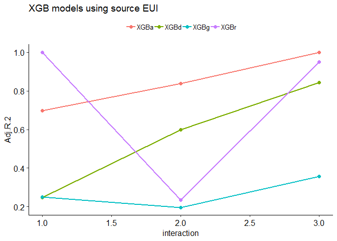
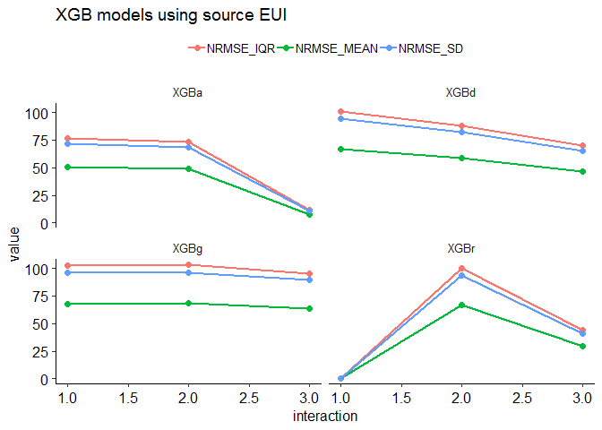
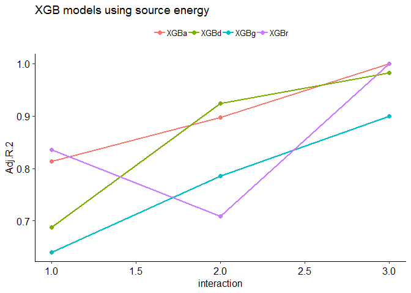
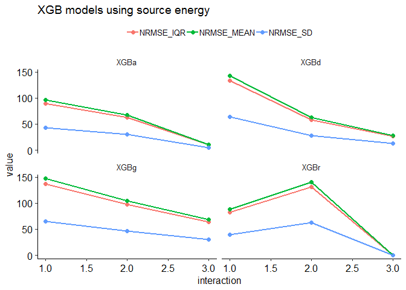
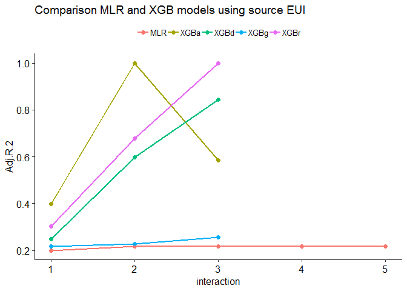
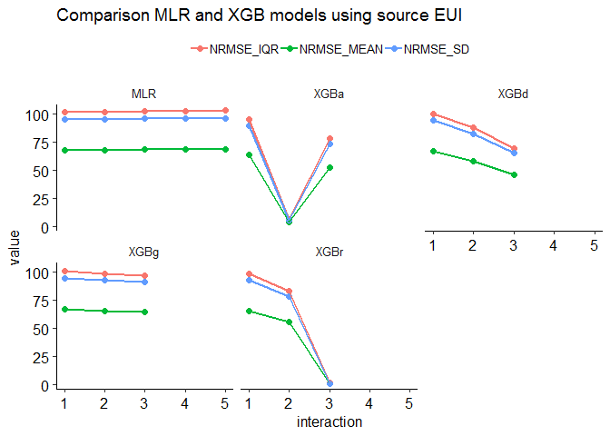
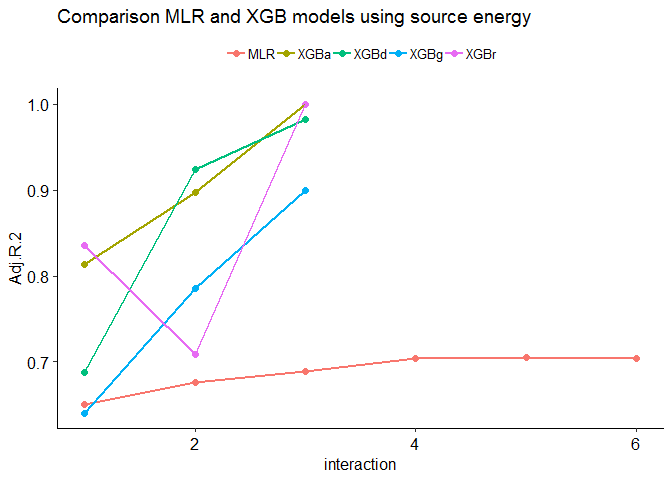
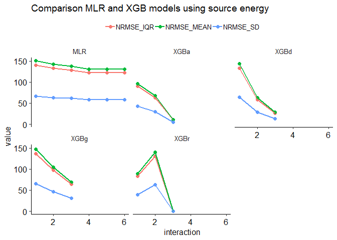

Benchmarking Office buildings
================
Pandarasamy Arjunan
3 June 2019

-   [Load dataset](#load-dataset)
-   [Apply filters](#apply-filters)
-   [Prepare features](#prepare-features)
-   [Descriptive statistics](#descriptive-statistics)
    -   [Data Frame Summary](#data-frame-summary)
-   [Build predictive models](#build-predictive-models)
    -   [Multiple Linear Regression (MLR)](#multiple-linear-regression-mlr)
    -   [Multiple Linear Regression (MLR) with Interaction terms](#multiple-linear-regression-mlr-with-interaction-terms)
    -   [Comparision of MLR models](#comparision-of-mlr-models)
    -   [Gradient Boosted Trees (XGBoost)](#gradient-boosted-trees-xgboost)
    -   [Comparision of XGB models](#comparision-of-xgb-models)
    -   [Comparision between MLR and XGB models](#comparision-between-mlr-and-xgb-models)

Load dataset
------------

``` r
building_type = "office"

filtered_dir = './data/cbecs/filtered/'
dir.create(filtered_dir, recursive = T, showWarnings = F)

features_dir = './data/cbecs/features/'
dir.create(features_dir, recursive = T, showWarnings = F)

results_dir = './results/cbecs/'
dir.create(results_dir, recursive = T, showWarnings = F)
```

``` r
cbecs = read.csv("data/cbecs/2012_public_use_data_aug2016.csv")

## list of building attributes relevant to office buildings 
columns = c( 'PBAPLUS', 'PBA', 'FINALWT', 
             'MFBTU', 'ELBTU', 'NGBTU', 'FKBTU', 'DHBTU',
             'ONEACT', 'ACT1', 'ACT2', 'ACT3', 'ACT1PCT', 'ACT2PCT', 'ACT3PCT',
             'PRAMTC', 'PRUNIT',
             'CWUSED', 'WOUSED', 'COUSED', 'SOUSED', 'PRUSED',
             'SQFT', 'NFLOOR', 'NELVTR', 'NESLTR', 'COURT', 
             'MONUSE', 'OPNWE',  'WKHRS', 'NWKER', 'COOK', 
             'MANU', 'HEATP',  'COOLP',  'SNACK', 'FASTFD', 'CAF',
             'FDPREP', 'KITCHN', 'BREAKRM', 'OTFDRM', 'LABEQP', 'MCHEQP',
             'POOL', 'HTPOOL', 'RFGWIN', 'RFGOPN', 'RFGCLN', 'RFGVNN',
             'RFGICN', 'PCTERMN', 'LAPTPN', 'PRNTRN', 'SERVERN', 'TVVIDEON',
             'RGSTRN', 'COPIERN', 'HDD65','CDD65')

offices = cbecs[, columns]
```

Apply filters
-------------

As per Energy Star's technical document [ENERGY STAR Score for Offices](https://www.energystar.gov/buildings/tools-and-resources/energy-star-score-offices), following filters are applied to define the peer group and to remove any outliers.

After applying each filter, the number of remaining buildings in the dataset (*Number Remaining: X*) and any difference (*Difference: X*) in count from the original Energy Star's technical documentation is also given.

1.  **Calculate source energy and source EUI**

    ``` r
    ## convert electricity, natural gas, fuel oil, and district heat to source energy
    o0 = offices %>% 
      mutate(ELBTU0 = ELBTU*2.80) %>%
      mutate(NGBTU0 = NGBTU*1.05) %>%
      mutate(FKBTU0 = FKBTU*1.01) %>%
      mutate(DHBTU0 = DHBTU*1.20) %>%
      mutate(SOURCE_ENERGY = rowSums(dplyr::select(., c(ELBTU0,NGBTU0,FKBTU0,DHBTU0)), na.rm = T)) %>% 
      mutate(SOURCE_EUI = round(SOURCE_ENERGY/SQFT, 2)) %>%
      mutate(SITE_EUI = round(MFBTU/SQFT, 2)) %>%
      mutate(NGBTU_PERCENT = round(NGBTU / SOURCE_ENERGY * 100, 2)) %>% 
      mutate(SUMBTU = rowSums(dplyr::select(., c(ELBTU,NGBTU,FKBTU,DHBTU)), na.rm = T))

    #Is MFBTU the sum of ELBTU,NGBTU,FKBTU,DHBTU? YES.
    #summary(o14$MFBTU - o14$SUMBTU)
    ```

2.  **PBAPLUS = 2, 3, 4 or 52** <br/>Building Type Filter – CBECS defines building types according to the variable “PBAPLUS.” Offices are coded as PBAPLUS=2 and 4; Bank/Financial Institutions are coded as PBAPLUS=3; and Courthouses are coded as PBAPLUS=52. <br/>Number Remaining: 1076. <br/>Difference: 0.

    ``` r
    o1 = o0 %>% filter(PBAPLUS %in% c(2, 3, 4, 52))
    ```

3.  **Must have at least 1 computer** <br/>EPA Program Filter – Baseline condition for being a functioning office building. <br/>Number Remaining: 1072. <br/>Difference: 0.

    ``` r
    o2 = o1 %>% 
      mutate(PC_TOT = 
               rowSums(dplyr::select(., c(PCTERMN,SERVERN,LAPTPN)), na.rm = T)) %>% 
      filter(PC_TOT >= 1)
    ```

4.  **Must have at least 1 worker** <br/>EPA Program Filter – Baseline condition for being a full time office building. <br/>Number Remaining: 1072. <br/>Difference: 0.

    ``` r
    o3 = o2 %>% filter(NWKER >= 1)
    ```

5.  **Must operate for at least 30 hours per week** <br/>EPA Program Filter – Baseline condition for being a full time office building. <br/>Number Remaining: 1065. <br/>Difference: 0.

    ``` r
    o4 = o3 %>% filter(WKHRS >= 30)
    ```

6.  **Must operate for at least 10 months per year** <br/>EPA Program Filter – Baseline condition for being a full time office building. <br/>Number Remaining: 1046. <br/>Difference: 0.

    ``` r
    o5 = o4 %>% filter(MONUSE >= 10)
    ```

7.  **A single activity must characterize greater than 50% of the floor space** <br/>EPA Program Filter – In order to be considered part of the office peer group, more than 50% of the building must be defined as an office, bank/financial institution, or courthouse. <br/>This filter is applied by a set of screens. If the variable ONEACT=1, then one activity occupies 75% or more of the building. If the variable ONEACT=2, then the activities in the building are defined by ACT1, ACT2, and ACT3. One of these activities must be coded as Office/Professional (PBAX=11) or Public Order and Safety (PBAX=23), with a corresponding percent (ACT1PCT, ACT2PCT, ACT3PCT) that is greater than 50. <br/>Number Remaining: 1003. <br/>Difference: 0.

    ``` r
    o6 = o5 %>% 
      filter( (ONEACT == 1) |
              (ONEACT == 2 & 
               ((ACT1 %in% c(11,23) & ACT1PCT > 50) | 
                  (ACT2 %in% c(11,23) & ACT2PCT > 50) | 
                  (ACT3 %in% c(11,23) & ACT3PCT > 50) )))
    ```

8.  **Must report energy usage** <br/>EPA Program Filter – Baseline condition for being a full time office building. <br/>Number Remaining: 1003. <br/>Difference: 0.

    ``` r
    o7 = o6 %>% filter(!is.na(MFBTU))
    ```

9.  **Must be less than or equal to 1,000,000 square feet** <br/>Data Limitation Filter – CBECS masks surveyed properties above 1,000,000 square feet by applying regional averages. <br/>Number Remaining: 972. <br/>Difference: 0.

    ``` r
    o8 = o7 %>% filter(SQFT <= 1000000)
    ```

10. **If propane is used, the amount category (PRAMTC) must equal 1, 2, or 3** <br/>Data Limitation Filter – Cannot estimate propane use if the quantity is “greater than 1000” or unknown. <br/>Number Remaining: 959. <br/>Difference: 0.

    ``` r
    o9 = o8 %>% filter(is.na(PRAMTC) | PRAMTC %in% c(1,2,3))
    ```

11. **If propane is used, the unit (PRUNIT) must be known** <br/>Data Limitation Filter – Cannot estimate propane use if the unit is unknown. <br/>Number Remaining: 959. <br/>Difference: 0.

    ``` r
    o10 = o9 %>% filter(is.na(PRUNIT) | PRUNIT %in% c(1,2))
    ```

12. **If propane is used, the maximum estimated propane amount must be 10% or less of the total source energy** <br/>Data Limitation Filter – Because propane values are estimated from a range, propane is restricted to 10% of the total source energy. <br/>Number Remaining: 957. <br/>Difference: 0.

    ``` r
    o11 = o10 %>% 
      filter( PRUSED == 2 | is.na(NGBTU_PERCENT) == T | 
            ( PRUSED == 1 & NGBTU_PERCENT <= 10))
    ```

13. **must not use chilled water, wood, coal, or solar** <br/>Data Limitation Filter – CBECS does not collect quantities of chilled water, wood, coal, or solar. <br/>Number Remaining: 897. <br/>Difference: +1.

    ``` r
    o12 = o11 %>% 
      filter(CWUSED == 2 & WOUSED == 2 & COUSED == 2 & SOUSED == 2)
    ```

14. **Server count must be known** <br/>Data Limitation Filter – CBECS codes missing responses for number of servers as ‘9995.’ <br/>Number Remaining: 893. <br/>Difference: +1.

    ``` r
    o13 = o12 %>% filter(SERVERN != 9995)
    ```

15. **Must have no more than 8 workers per 1,000 square feet** <br/>Analytical Filter – Values determined to be statistical outliers. <br/>Number Remaining: 889. <br/>Difference: +1.

    ``` r
    o14 = o13 %>% filter(NWKER  / SQFT * 1000 <= 8)
    ```

16. **Banks must have Source EUI greater than 50 kBtu/ft2** <br/>Analytical Filter – Values determined to be statistical outliers. <br/>Number Remaining: 887. <br/>Difference: +1.

    ``` r
    o15 = o14 %>% 
      filter( PBAPLUS != 3 | (PBAPLUS == 3 & SOURCE_EUI > 50))
    ```

**Save the filtered dataset**

``` r
write.csv(o15, paste0(filtered_dir, building_type, ".csv"), row.names = F)
```

Prepare features
----------------

The final regression equation includes the following variables: ï‚·

-   Square Footage
-   Weekly Operating Hours
-   Number of Workers per 1,000 Square Feet
-   Number of Computers per 1,000 Square Feet
-   Natural log of Cooling Degree Days times Percent of the Building that is Cooled
-   Whether or not the Building is a Bank Branch (1 = yes, 0 = no)

``` r
office = read.csv(paste0(filtered_dir, building_type, ".csv"))

data = office %>%
  mutate(NWKER_SQFT = NWKER/SQFT * 1000) %>%
  mutate(PCTERMN_TOT = rowSums(dplyr::select(., c(PCTERMN,SERVERN,LAPTPN)), na.rm = T)) %>% 
  mutate(PCTERMN_SQFT = PCTERMN_TOT/SQFT * 1000) %>%
  mutate(CDD65_COOLP = log(CDD65) * COOLP / 100) %>%
  mutate(IsBank = ifelse(PBAPLUS == 3, "Yes", "No")) %>%
  mutate_if(is.numeric, round, 3)

#data = data %>% filter(SOURCE_EUI <= 500)

ivars = c("SQFT", "WKHRS", "NWKER_SQFT", "PCTERMN_SQFT", 
          "CDD65_COOLP", "IsBank")
dvars  = c("SOURCE_EUI", "SOURCE_ENERGY", "FINALWT")

features = data[, c(ivars, dvars)]
features = features %>% na.omit()

write.csv(features, 
          paste0(features_dir, building_type, ".csv"), 
          row.names = F)
```

Descriptive statistics
----------------------

``` r
features1 = features

## summary of SQFT less than 100,000 only, as per Energy Star tech doc.
features1[features1$SQFT >= 100000, ]$SQFT = NA
features1 = features1 %>% dplyr::select(-one_of('SOURCE_ENERGY', 'FINALWT'))

summarytools::descr(features1, stats = "common", 
                    transpose = TRUE, 
                    headings = FALSE)
```

    Non-numerical variable(s) ignored: IsBank

|                   |      Mean|   Std.Dev|      Min|   Median|       Max|  N.Valid|  Pct.Valid|
|------------------:|---------:|---------:|--------:|--------:|---------:|--------:|----------:|
|   **CDD65\_COOLP**|      6.51|      1.47|     0.72|     6.94|      8.53|   882.00|     100.00|
|    **NWKER\_SQFT**|      2.16|      1.26|     0.08|     1.96|      7.99|   882.00|     100.00|
|  **PCTERMN\_SQFT**|      3.04|      2.04|     0.03|     2.57|     14.06|   882.00|     100.00|
|    **SOURCE\_EUI**|    182.03|    129.26|     4.74|   153.95|   1245.06|   882.00|     100.00|
|           **SQFT**|  21079.46|  25158.64|  1001.00|  7500.00|  99000.00|   635.00|      72.00|
|          **WKHRS**|     62.11|     33.27|    32.00|    50.00|    168.00|   882.00|     100.00|

``` r
dfSummary(features1, plain.ascii = FALSE, style = "grid", 
          graph.magnif = 0.75, valid.col = FALSE)
```

    text graphs are displayed; set 'tmp.img.dir' parameter to activate png graphs

### Data Frame Summary

**features1**
**Dimensions:** 882 x 7
**Duplicates:** 0

<table>
<colgroup>
<col width="4%" />
<col width="13%" />
<col width="27%" />
<col width="18%" />
<col width="27%" />
<col width="8%" />
</colgroup>
<thead>
<tr class="header">
<th>No</th>
<th>Variable</th>
<th>Stats / Values</th>
<th>Freqs (% of Valid)</th>
<th>Graph</th>
<th>Missing</th>
</tr>
</thead>
<tbody>
<tr class="odd">
<td><p>1</p></td>
<td><p>SQFT<br />
[numeric]</p></td>
<td><p>Mean (sd) : 21079.5 (25158.6)<br />
min &lt; med &lt; max:<br />
1001 &lt; 7500 &lt; 99000<br />
IQR (CV) : 29500 (1.2)</p></td>
<td><p>208 distinct values</p></td>
<td><p><br />
:<br />
:<br />
:<br />
:<br />
: : . . . . . .</p></td>
<td><p>247<br />
(28%)</p></td>
</tr>
<tr class="even">
<td><p>2</p></td>
<td><p>WKHRS<br />
[numeric]</p></td>
<td><p>Mean (sd) : 62.1 (33.3)<br />
min &lt; med &lt; max:<br />
32 &lt; 50 &lt; 168<br />
IQR (CV) : 15 (0.5)</p></td>
<td><p>56 distinct values</p></td>
<td><p><br />
:<br />
: : .<br />
: : :<br />
: : :<br />
: : : . .         :</p></td>
<td><p>0<br />
(0%)</p></td>
</tr>
<tr class="odd">
<td><p>3</p></td>
<td><p>NWKER_SQFT<br />
[numeric]</p></td>
<td><p>Mean (sd) : 2.2 (1.3)<br />
min &lt; med &lt; max:<br />
0.1 &lt; 2 &lt; 8<br />
IQR (CV) : 1.7 (0.6)</p></td>
<td><p>498 distinct values</p></td>
<td><p><br />
  :<br />
  : .<br />
: : :<br />
: : : :<br />
: : : : :</p></td>
<td><p>0<br />
(0%)</p></td>
</tr>
<tr class="even">
<td><p>4</p></td>
<td><p>PCTERMN_SQFT<br />
[numeric]</p></td>
<td><p>Mean (sd) : 3 (2)<br />
min &lt; med &lt; max:<br />
0 &lt; 2.6 &lt; 14.1<br />
IQR (CV) : 2.3 (0.7)</p></td>
<td><p>653 distinct values</p></td>
<td><p><br />
  :<br />
  :<br />
: : :<br />
: : : .<br />
: : : : . .</p></td>
<td><p>0<br />
(0%)</p></td>
</tr>
<tr class="odd">
<td><p>5</p></td>
<td><p>CDD65_COOLP<br />
[numeric]</p></td>
<td><p>Mean (sd) : 6.5 (1.5)<br />
min &lt; med &lt; max:<br />
0.7 &lt; 6.9 &lt; 8.5<br />
IQR (CV) : 1.6 (0.2)</p></td>
<td><p>771 distinct values</p></td>
<td><p><br />
              :<br />
            . :<br />
            : :<br />
          . : : .<br />
    . . : : : : :</p></td>
<td><p>0<br />
(0%)</p></td>
</tr>
<tr class="even">
<td><p>6</p></td>
<td><p>IsBank<br />
[character]</p></td>
<td><p>1. No<br />
2. Yes</p></td>
<td><p>810 (91.8%)<br />
72 ( 8.2%)</p></td>
<td><p>IIIIIIIIIIIIIIIIII<br />
I</p></td>
<td><p>0<br />
(0%)</p></td>
</tr>
<tr class="odd">
<td><p>7</p></td>
<td><p>SOURCE_EUI<br />
[numeric]</p></td>
<td><p>Mean (sd) : 182 (129.3)<br />
min &lt; med &lt; max:<br />
4.7 &lt; 153.9 &lt; 1245.1<br />
IQR (CV) : 121 (0.7)</p></td>
<td><p>865 distinct values</p></td>
<td><p><br />
  :<br />
: :<br />
: :<br />
: : .<br />
: : : .</p></td>
<td><p>0<br />
(0%)</p></td>
</tr>
</tbody>
</table>

**Extract R code from Rmd document**

``` r
#knitr::purl("office.Rmd", output = "office.R", documentation = 2)
```

Build predictive models
-----------------------

``` r
#source("models.R")
source("metrics.R")

data = read.csv(paste0(features_dir, building_type, ".csv"))

allMetrics = NULL

sourceEUI_attributes = setdiff(colnames(data),
                               c("SQFT", "FINALWT", "SOURCE_EUI", "SOURCE_ENERGY"))

sourceEnergy_attributes = setdiff(colnames(data), 
                               c("FINALWT", "SOURCE_EUI", "SOURCE_ENERGY"))
#cat(colnames(data))
knitr::kable(colnames(data), col.names = NULL)
```

    Warning in kable_markdown(x, padding = padding, ...): The table should have
    a header (column names)

|                |
|:---------------|
| SQFT           |
| WKHRS          |
| NWKER\_SQFT    |
| PCTERMN\_SQFT  |
| CDD65\_COOLP   |
| IsBank         |
| SOURCE\_EUI    |
| SOURCE\_ENERGY |
| FINALWT        |

### Multiple Linear Regression (MLR)

``` r
MLR.fit <- function(data, 
                    x, 
                    y, 
                    w, 
                    interaction,
                    centering = TRUE 
                    ) {
  
  print(paste(x, y, w, interaction))
  
  if(centering == TRUE){
    data = mean_center_data(data, x)  
  }
  
  if(interaction == 1) {  ### ordinary model
    model = paste(y, "~", paste(x, collapse = " + "))  
  } else {  ### interaction model
    allvars = paste(x, collapse = " + ")
    model = paste(y, "~ (", allvars, ") ^", interaction )
  }
  
  fit = lm(model, data = data, weights = data[, w])
  return (fit)
}

MLR.predict <- function(data, x, y, w, i) {
  
  print(paste(x, y, w, i))
  
  mlrFit = MLR.fit(data, x, y, w, i)
  
  wt   = data[, w]
  obs  = data[, y]
  pred = as.numeric(predict(mlrFit))
  
  mlrMetrics = getMLRmetrics(mlrFit, obs, pred, wt)
  mlrMetrics = data.frame(
    "model" = "MLR",
    "dependent" = y,
    "interaction" = i,
    "transform" = "meanCent",
    mlrMetrics)
  
  return(mlrMetrics)
}
```

#### Using SOURCE\_EUI as dependent variable

``` r
x = sourceEUI_attributes
y = "SOURCE_EUI"
w = "FINALWT"
interaction = 1

mlrMetrics = MLR.predict(data, x, y, w, interaction)
```

\[1\] "WKHRS SOURCE\_EUI FINALWT 1" "NWKER\_SQFT SOURCE\_EUI FINALWT 1"
\[3\] "PCTERMN\_SQFT SOURCE\_EUI FINALWT 1" "CDD65\_COOLP SOURCE\_EUI FINALWT 1" \[5\] "IsBank SOURCE\_EUI FINALWT 1"
\[1\] "WKHRS SOURCE\_EUI FINALWT 1" "NWKER\_SQFT SOURCE\_EUI FINALWT 1"
\[3\] "PCTERMN\_SQFT SOURCE\_EUI FINALWT 1" "CDD65\_COOLP SOURCE\_EUI FINALWT 1" \[5\] "IsBank SOURCE\_EUI FINALWT 1"

``` r
allMetrics = rbind(allMetrics, mlrMetrics)

knitr::kable(allMetrics, row.names = F)
```

| model | dependent   |  interaction| transform |  obs|  rank|  coef|    R.2|  Adj.R.2|       mse|     rmse|     mae|   mape|  nrmse\_iqr|  nrmse\_range|  nrmse\_mean|  nrmse\_sd|
|:------|:------------|------------:|:----------|----:|-----:|-----:|------:|--------:|---------:|--------:|-------:|------:|-----------:|-------------:|------------:|----------:|
| MLR   | SOURCE\_EUI |            1| meanCent  |  882|     6|     6|  0.204|    0.199|  15206.25|  123.314|  75.374|  0.565|     101.896|         9.942|       67.744|     95.398|

#### Using SOURCE\_ENERGY as dependent variable

``` r
x = sourceEnergy_attributes
y = "SOURCE_ENERGY"
w = "FINALWT"
interaction = 1

mlrMetrics = MLR.predict(data, x, y, w, interaction)
```

\[1\] "SQFT SOURCE\_ENERGY FINALWT 1"
\[2\] "WKHRS SOURCE\_ENERGY FINALWT 1"
\[3\] "NWKER\_SQFT SOURCE\_ENERGY FINALWT 1"
\[4\] "PCTERMN\_SQFT SOURCE\_ENERGY FINALWT 1" \[5\] "CDD65\_COOLP SOURCE\_ENERGY FINALWT 1" \[6\] "IsBank SOURCE\_ENERGY FINALWT 1"
\[1\] "SQFT SOURCE\_ENERGY FINALWT 1"
\[2\] "WKHRS SOURCE\_ENERGY FINALWT 1"
\[3\] "NWKER\_SQFT SOURCE\_ENERGY FINALWT 1"
\[4\] "PCTERMN\_SQFT SOURCE\_ENERGY FINALWT 1" \[5\] "CDD65\_COOLP SOURCE\_ENERGY FINALWT 1" \[6\] "IsBank SOURCE\_ENERGY FINALWT 1"

``` r
allMetrics = rbind(allMetrics, mlrMetrics)

knitr::kable(allMetrics, row.names = F)
```

| model | dependent      |  interaction| transform |  obs|  rank|  coef|    R.2|  Adj.R.2|           mse|          rmse|          mae|   mape|  nrmse\_iqr|  nrmse\_range|  nrmse\_mean|  nrmse\_sd|
|:------|:---------------|------------:|:----------|----:|-----:|-----:|------:|--------:|-------------:|-------------:|------------:|------:|-----------:|-------------:|------------:|----------:|
| MLR   | SOURCE\_EUI    |            1| meanCent  |  882|     6|     6|  0.204|    0.199|  1.520625e+04|       123.314|       75.374|  0.565|     101.896|         9.942|       67.744|     95.398|
| MLR   | SOURCE\_ENERGY |            1| meanCent  |  882|     7|     7|  0.653|    0.650|  9.244025e+14|  30403987.719|  7855736.665|  1.207|     139.889|         3.489|      150.142|     66.827|

### Multiple Linear Regression (MLR) with Interaction terms

#### Using SOURCE\_EUI as dependent variable

``` r
x = sourceEUI_attributes
y = "SOURCE_EUI"
w = "FINALWT"

intr_depth = length(x)

for (interaction in 2:intr_depth) {
  mlrMetrics = MLR.predict(data, x, y, w, interaction)
  allMetrics = rbind(allMetrics, mlrMetrics)
}
```

\[1\] "WKHRS SOURCE\_EUI FINALWT 2" "NWKER\_SQFT SOURCE\_EUI FINALWT 2"
\[3\] "PCTERMN\_SQFT SOURCE\_EUI FINALWT 2" "CDD65\_COOLP SOURCE\_EUI FINALWT 2" \[5\] "IsBank SOURCE\_EUI FINALWT 2"
\[1\] "WKHRS SOURCE\_EUI FINALWT 2" "NWKER\_SQFT SOURCE\_EUI FINALWT 2"
\[3\] "PCTERMN\_SQFT SOURCE\_EUI FINALWT 2" "CDD65\_COOLP SOURCE\_EUI FINALWT 2" \[5\] "IsBank SOURCE\_EUI FINALWT 2"
\[1\] "WKHRS SOURCE\_EUI FINALWT 3" "NWKER\_SQFT SOURCE\_EUI FINALWT 3"
\[3\] "PCTERMN\_SQFT SOURCE\_EUI FINALWT 3" "CDD65\_COOLP SOURCE\_EUI FINALWT 3" \[5\] "IsBank SOURCE\_EUI FINALWT 3"
\[1\] "WKHRS SOURCE\_EUI FINALWT 3" "NWKER\_SQFT SOURCE\_EUI FINALWT 3"
\[3\] "PCTERMN\_SQFT SOURCE\_EUI FINALWT 3" "CDD65\_COOLP SOURCE\_EUI FINALWT 3" \[5\] "IsBank SOURCE\_EUI FINALWT 3"
\[1\] "WKHRS SOURCE\_EUI FINALWT 4" "NWKER\_SQFT SOURCE\_EUI FINALWT 4"
\[3\] "PCTERMN\_SQFT SOURCE\_EUI FINALWT 4" "CDD65\_COOLP SOURCE\_EUI FINALWT 4" \[5\] "IsBank SOURCE\_EUI FINALWT 4"
\[1\] "WKHRS SOURCE\_EUI FINALWT 4" "NWKER\_SQFT SOURCE\_EUI FINALWT 4"
\[3\] "PCTERMN\_SQFT SOURCE\_EUI FINALWT 4" "CDD65\_COOLP SOURCE\_EUI FINALWT 4" \[5\] "IsBank SOURCE\_EUI FINALWT 4"
\[1\] "WKHRS SOURCE\_EUI FINALWT 5" "NWKER\_SQFT SOURCE\_EUI FINALWT 5"
\[3\] "PCTERMN\_SQFT SOURCE\_EUI FINALWT 5" "CDD65\_COOLP SOURCE\_EUI FINALWT 5" \[5\] "IsBank SOURCE\_EUI FINALWT 5"
\[1\] "WKHRS SOURCE\_EUI FINALWT 5" "NWKER\_SQFT SOURCE\_EUI FINALWT 5"
\[3\] "PCTERMN\_SQFT SOURCE\_EUI FINALWT 5" "CDD65\_COOLP SOURCE\_EUI FINALWT 5" \[5\] "IsBank SOURCE\_EUI FINALWT 5"

``` r
write.csv(allMetrics, 
          paste0(results_dir, building_type, ".csv"), 
          row.names = F)

allMetrics0 = allMetrics %>% filter(dependent == y)
knitr::kable(allMetrics0, row.names = F)
```

| model | dependent   |  interaction| transform |  obs|  rank|  coef|    R.2|  Adj.R.2|       mse|     rmse|     mae|   mape|  nrmse\_iqr|  nrmse\_range|  nrmse\_mean|  nrmse\_sd|
|:------|:------------|------------:|:----------|----:|-----:|-----:|------:|--------:|---------:|--------:|-------:|------:|-----------:|-------------:|------------:|----------:|
| MLR   | SOURCE\_EUI |            1| meanCent  |  882|     6|     6|  0.204|    0.199|  15206.25|  123.314|  75.374|  0.565|     101.896|         9.942|       67.744|     95.398|
| MLR   | SOURCE\_EUI |            2| meanCent  |  882|    16|    16|  0.230|    0.216|  15292.39|  123.662|  75.549|  0.564|     102.183|         9.970|       67.936|     95.668|
| MLR   | SOURCE\_EUI |            3| meanCent  |  882|    26|    26|  0.239|    0.217|  15546.34|  124.685|  75.536|  0.562|     103.028|        10.053|       68.498|     96.459|
| MLR   | SOURCE\_EUI |            4| meanCent  |  882|    31|    31|  0.244|    0.217|  15555.39|  124.721|  75.605|  0.562|     103.058|        10.056|       68.517|     96.487|
| MLR   | SOURCE\_EUI |            5| meanCent  |  882|    32|    32|  0.245|    0.217|  15584.65|  124.838|  75.612|  0.563|     103.155|        10.065|       68.582|     96.577|

#### Using SOURCE\_ENERGY as dependent variable\*\*

``` r
x = sourceEnergy_attributes
y = "SOURCE_ENERGY"
w = "FINALWT"

intr_depth = length(x)

for (interaction in 2:intr_depth) {
  mlrMetrics = MLR.predict(data, x, y, w, interaction)
  allMetrics = rbind(allMetrics, mlrMetrics)
}
```

\[1\] "SQFT SOURCE\_ENERGY FINALWT 2"
\[2\] "WKHRS SOURCE\_ENERGY FINALWT 2"
\[3\] "NWKER\_SQFT SOURCE\_ENERGY FINALWT 2"
\[4\] "PCTERMN\_SQFT SOURCE\_ENERGY FINALWT 2" \[5\] "CDD65\_COOLP SOURCE\_ENERGY FINALWT 2" \[6\] "IsBank SOURCE\_ENERGY FINALWT 2"
\[1\] "SQFT SOURCE\_ENERGY FINALWT 2"
\[2\] "WKHRS SOURCE\_ENERGY FINALWT 2"
\[3\] "NWKER\_SQFT SOURCE\_ENERGY FINALWT 2"
\[4\] "PCTERMN\_SQFT SOURCE\_ENERGY FINALWT 2" \[5\] "CDD65\_COOLP SOURCE\_ENERGY FINALWT 2" \[6\] "IsBank SOURCE\_ENERGY FINALWT 2"
\[1\] "SQFT SOURCE\_ENERGY FINALWT 3"
\[2\] "WKHRS SOURCE\_ENERGY FINALWT 3"
\[3\] "NWKER\_SQFT SOURCE\_ENERGY FINALWT 3"
\[4\] "PCTERMN\_SQFT SOURCE\_ENERGY FINALWT 3" \[5\] "CDD65\_COOLP SOURCE\_ENERGY FINALWT 3" \[6\] "IsBank SOURCE\_ENERGY FINALWT 3"
\[1\] "SQFT SOURCE\_ENERGY FINALWT 3"
\[2\] "WKHRS SOURCE\_ENERGY FINALWT 3"
\[3\] "NWKER\_SQFT SOURCE\_ENERGY FINALWT 3"
\[4\] "PCTERMN\_SQFT SOURCE\_ENERGY FINALWT 3" \[5\] "CDD65\_COOLP SOURCE\_ENERGY FINALWT 3" \[6\] "IsBank SOURCE\_ENERGY FINALWT 3"
\[1\] "SQFT SOURCE\_ENERGY FINALWT 4"
\[2\] "WKHRS SOURCE\_ENERGY FINALWT 4"
\[3\] "NWKER\_SQFT SOURCE\_ENERGY FINALWT 4"
\[4\] "PCTERMN\_SQFT SOURCE\_ENERGY FINALWT 4" \[5\] "CDD65\_COOLP SOURCE\_ENERGY FINALWT 4" \[6\] "IsBank SOURCE\_ENERGY FINALWT 4"
\[1\] "SQFT SOURCE\_ENERGY FINALWT 4"
\[2\] "WKHRS SOURCE\_ENERGY FINALWT 4"
\[3\] "NWKER\_SQFT SOURCE\_ENERGY FINALWT 4"
\[4\] "PCTERMN\_SQFT SOURCE\_ENERGY FINALWT 4" \[5\] "CDD65\_COOLP SOURCE\_ENERGY FINALWT 4" \[6\] "IsBank SOURCE\_ENERGY FINALWT 4"
\[1\] "SQFT SOURCE\_ENERGY FINALWT 5"
\[2\] "WKHRS SOURCE\_ENERGY FINALWT 5"
\[3\] "NWKER\_SQFT SOURCE\_ENERGY FINALWT 5"
\[4\] "PCTERMN\_SQFT SOURCE\_ENERGY FINALWT 5" \[5\] "CDD65\_COOLP SOURCE\_ENERGY FINALWT 5" \[6\] "IsBank SOURCE\_ENERGY FINALWT 5"
\[1\] "SQFT SOURCE\_ENERGY FINALWT 5"
\[2\] "WKHRS SOURCE\_ENERGY FINALWT 5"
\[3\] "NWKER\_SQFT SOURCE\_ENERGY FINALWT 5"
\[4\] "PCTERMN\_SQFT SOURCE\_ENERGY FINALWT 5" \[5\] "CDD65\_COOLP SOURCE\_ENERGY FINALWT 5" \[6\] "IsBank SOURCE\_ENERGY FINALWT 5"
\[1\] "SQFT SOURCE\_ENERGY FINALWT 6"
\[2\] "WKHRS SOURCE\_ENERGY FINALWT 6"
\[3\] "NWKER\_SQFT SOURCE\_ENERGY FINALWT 6"
\[4\] "PCTERMN\_SQFT SOURCE\_ENERGY FINALWT 6" \[5\] "CDD65\_COOLP SOURCE\_ENERGY FINALWT 6" \[6\] "IsBank SOURCE\_ENERGY FINALWT 6"
\[1\] "SQFT SOURCE\_ENERGY FINALWT 6"
\[2\] "WKHRS SOURCE\_ENERGY FINALWT 6"
\[3\] "NWKER\_SQFT SOURCE\_ENERGY FINALWT 6"
\[4\] "PCTERMN\_SQFT SOURCE\_ENERGY FINALWT 6" \[5\] "CDD65\_COOLP SOURCE\_ENERGY FINALWT 6" \[6\] "IsBank SOURCE\_ENERGY FINALWT 6"

``` r
write.csv(allMetrics, 
          paste0(results_dir, building_type, ".csv"), 
          row.names = F)

allMetrics0 = allMetrics %>% filter(dependent == y)
knitr::kable(allMetrics0, row.names = F)
```

| model | dependent      |  interaction| transform |  obs|  rank|  coef|    R.2|  Adj.R.2|           mse|      rmse|      mae|   mape|  nrmse\_iqr|  nrmse\_range|  nrmse\_mean|  nrmse\_sd|
|:------|:---------------|------------:|:----------|----:|-----:|-----:|------:|--------:|-------------:|---------:|--------:|------:|-----------:|-------------:|------------:|----------:|
| MLR   | SOURCE\_ENERGY |            1| meanCent  |  882|     7|     7|  0.653|    0.650|  9.244025e+14|  30403988|  7855737|  1.207|     139.889|         3.489|      150.142|     66.827|
| MLR   | SOURCE\_ENERGY |            2| meanCent  |  882|    22|    22|  0.684|    0.676|  8.322307e+14|  28848410|  7421792|  0.858|     132.732|         3.310|      142.460|     63.408|
| MLR   | SOURCE\_ENERGY |            3| meanCent  |  882|    42|    42|  0.704|    0.689|  7.771532e+14|  27877468|  7460931|  1.039|     128.264|         3.199|      137.666|     61.274|
| MLR   | SOURCE\_ENERGY |            4| meanCent  |  882|    57|    57|  0.723|    0.704|  7.038205e+14|  26529616|  6967648|  0.952|     122.063|         3.044|      131.010|     58.311|
| MLR   | SOURCE\_ENERGY |            5| meanCent  |  882|    63|    63|  0.725|    0.705|  7.046253e+14|  26544778|  6866007|  0.962|     122.133|         3.046|      131.085|     58.344|
| MLR   | SOURCE\_ENERGY |            6| meanCent  |  882|    64|    64|  0.725|    0.704|  7.046189e+14|  26544658|  6865841|  0.961|     122.132|         3.046|      131.084|     58.344|

### Comparision of MLR models

#### MLR plots using Source EUI

``` r
mytheme = theme(legend.title = element_blank(),
           legend.text=element_text(size=12),
           axis.text=element_text(size=12),
           text=element_text(size=12))

plotR2 <- function(df, titl) {
  
  df1 = melt(df, measure.vars = c("R.2", "Adj.R.2"))
  
  plot <- ggplot(df1, aes(x = interaction, y=value, 
                          group=variable, col=variable)) + 
  geom_point(size=2) + geom_line(size=1) +
    ggtitle(titl) + 
    theme_pubr(base_size=12) +
    theme(legend.position="top", legend.title = element_blank())
  
  return(plot)
}

plotNRMSE <- function(df, titl) {
  
  df1 = melt(df, measure.vars = c("nrmse_iqr", "nrmse_mean", 
                                        "nrmse_sd"))
  df1$variable = toupper(df1$variable)
  
  plot <- ggplot(df1, aes(x = interaction, y=value, 
                          group=variable, col=variable)) + 
  geom_point(size=2) + geom_line(size=1) +
    ggtitle(titl) + 
    theme_pubr(base_size=12) +
    theme(legend.position="top", legend.title = element_blank())
    
  
  return(plot)
}  
```

``` r
allMetrics0 = allMetrics %>%
  filter(stringr::str_detect(model, "MLR")) %>%
  filter(dependent == "SOURCE_EUI")

plot1 = plotR2(allMetrics0, "MLR models using source EUI")
plot2 = plotNRMSE(allMetrics0, "MLR models using source EUI")

print(plot1)
```


``` r
print(plot2)
```


#### MLR plots using Source Energy

``` r
allMetrics0 = allMetrics %>%
  filter(stringr::str_detect(model, "MLR")) %>%
  filter(dependent == "SOURCE_ENERGY")

plot1 = plotR2(allMetrics0, "MLR models using source energy")
plot2 = plotNRMSE(allMetrics0, "MLR models using source energy")

print(plot1)
```


``` r
print(plot2)
```


### Gradient Boosted Trees (XGBoost)

``` r
tuneXGBoost <- function(x,
                        y,
                        sample_weights,
                        search = "default",
                        tree_height = 2
                        ) {
  
  N = 10  # N-fold CV
  R = 2   # and R repeats
  
  tcDefault  <- trainControl(method = "repeatedcv", 
                            number = N, 
                            repeats = R)
  
  tcRandom   <- trainControl(method = "repeatedcv", 
                            search = "random",
                            number = N, 
                            repeats = R)
  
  tcAdaptive <- trainControl(method = "adaptive_cv", 
                            search = "random",
                            number = N, 
                            repeats = R,
                            adaptive = list(min = 5, 
                                            alpha = 0.05, 
                                            method = "gls",
                                            complete = TRUE))
  
  default_param = expand.grid(
    nrounds = 100,
    max_depth = tree_height,
    eta = 0.3,
    gamma = 0,
    colsample_bytree = 1,
    min_child_weight = 1,
    subsample = 1)
  
  # from https://github.com/topepo/caret/blob/master/models/files/xgbTree.R
  len = 10
  grid_param <- expand.grid(
    nrounds = floor((1:len) * 10),
    max_depth = tree_height,
    eta = c(.3, .4),
    gamma = 0,
    colsample_bytree = c(.6, .8),
    min_child_weight = c(1),
    subsample = seq(.25, 1, length = len))
  
  tuned = switch(search,
                 "default" = train(x, y,
                                   weights = sample_weights,
                                   method = "xgbTree", 
                                   tuneGrid = default_param,
                                   trControl = tcDefault,
                                   verbose = TRUE),
                 
                 "grid"     = train(x, y, 
                                   weights = sample_weights,
                                   method = "xgbTree", 
                                   tuneGrid = grid_param,
                                   trControl = tcDefault,
                                   verbose = TRUE),

                 "random"  = train(x, y, 
                                   weights = sample_weights,
                                   method = "xgbTree", 
                                   trControl = tcRandom,
                                   verbose = TRUE),
                 
                 "adaptive" = train(x, y, 
                                   weights = sample_weights,
                                   method = "xgbTree", 
                                   trControl = tcAdaptive,
                                   verbose = TRUE)
                 )
  
  return(tuned$finalModel)
}

XGBoost <- function( xdata, 
                     ydata,
                     sample_weights,
                     search = "default",
                     interaction = 2
                     ) {
  
  model = paste(y, "~", paste(x, collapse = " + "))
  dummy = dummyVars(model, data = data, fullRank = T)
  
  xdata = as.data.frame(predict(dummy, data))
  ydata = data[, y]
  
  xgfit = tuneXGBoost(xdata, ydata, 
                      sample_weights,
                      search, 
                      tree_height = interaction)
  return(xgfit)
} 


XGBoost.predict <- function(data, x, y, w, search) {

  model = paste(y, "~", paste(x, collapse = " + "))
  dummy = dummyVars(model, data = data, fullRank = T)
  xdata = as.data.frame(predict(dummy, data))
  ydata = data[, y]
  wt = data[, w]
  
  intr_depth = 3
  
  xgbMetricsAll = NULL
  
  for (intr in 1:intr_depth) {
    
    print(paste(Sys.time(), "xgboost", search, y, intr, "\n"))
    
    xgfit = XGBoost(xdata, ydata, wt, 
                    search = search, 
                    interaction = intr)
    
    pred = as.numeric(predict(xgfit, as.matrix(xdata)))
    
    xgbMetrics = getXgboostmetrics(xgfit, xdata, ydata, pred, wt)
    
    xgbMetrics = data.frame(
      "model" = paste0("XGB", substr(search, 1,1), intr),
      "dependent" = y, 
      "interaction" = intr, 
      "transform" = "None",
      xgbMetrics)
    
    xgbMetricsAll = rbind(xgbMetricsAll, xgbMetrics)
  }
  
  return(xgbMetricsAll)
}
```

``` r
# y = "SOURCE_EUI"
# w = "FINALWT"
# o = c("SOURCE_ENERGY", "SQFT")
# x = setdiff(colnames(data), c(y, w, o))
# wt = data[, w]
# 
# model = paste(y, "~", paste(x, collapse = " + "))
# dummy = dummyVars(model, data = data, fullRank = T)
# xdata = as.data.frame(predict(dummy, data))
# ydata = data[, y]
# intr_depth = 3
# 
# for (intr in 1:intr_depth) {
#   
#   print(paste(Sys.time(), "xgboost default search", y, intr, "\n"))
#   
#   xgfit = XGBoost(xdata, ydata, wt, 
#                   search = "default", 
#                   interaction = intr)
#   
#   pred = as.numeric(predict(xgfit, as.matrix(xdata)))
#   
#   xgbMetrics = getXgboostmetrics(xgfit, xdata, ydata, pred, wt)
#   
#   xgbMetrics = data.frame(
#     "model" = paste0("XGBd", intr),
#     "dependent" = y, 
#     "interaction" = intr, 
#     "transform" = "None",
#     xgbMetrics)
#   
#   allMetrics = rbind(allMetrics, xgbMetrics)
# }
# knitr::kable(allMetrics, row.names = F)
```

#### Using SOURCE\_EUI as dependent variable

``` r
library(doParallel)
```

    Loading required package: foreach

    Loading required package: iterators

    Loading required package: parallel

``` r
ncore = 4
registerDoParallel(cores = ncore)
```

##### Using default search

``` r
x = sourceEUI_attributes
y = "SOURCE_EUI"
w = "FINALWT"
search = "default"

xgbMetrics = XGBoost.predict(data, x, y, w, search)
```

\[1\] "2019-06-10 12:48:03 xgboost default SOURCE\_EUI 1 " \[1\] "2019-06-10 12:48:10 xgboost default SOURCE\_EUI 2 " \[1\] "2019-06-10 12:48:13 xgboost default SOURCE\_EUI 3 "

``` r
allMetrics = rbind(allMetrics, xgbMetrics)

knitr::kable(xgbMetrics, row.names = F)
```

| model | dependent   |  interaction| transform |  obs|  rank|  coef|    R.2|  Adj.R.2|        mse|     rmse|     mae|   mape|  nrmse\_iqr|  nrmse\_range|  nrmse\_mean|  nrmse\_sd|
|:------|:------------|------------:|:----------|----:|-----:|-----:|------:|--------:|----------:|--------:|-------:|------:|-----------:|-------------:|------------:|----------:|
| XGBd1 | SOURCE\_EUI |            1| None      |  882|     5|     5|  0.250|    0.247|  14835.734|  121.802|  73.639|  0.543|     100.646|         9.820|       66.914|     94.229|
| XGBd2 | SOURCE\_EUI |            2| None      |  882|     5|     5|  0.601|    0.599|  11366.735|  106.615|  63.407|  0.458|      88.097|         8.596|       58.571|     82.480|
| XGBd3 | SOURCE\_EUI |            3| None      |  882|     5|     5|  0.845|    0.844|   7138.016|   84.487|  48.384|  0.341|      69.812|         6.812|       46.414|     65.361|

##### Using grid search

``` r
x = sourceEUI_attributes
y = "SOURCE_EUI"
w = "FINALWT"
search = "grid"

xgbMetrics = XGBoost.predict(data, x, y, w, search)
```

\[1\] "2019-06-10 12:48:16 xgboost grid SOURCE\_EUI 1 " \[1\] "2019-06-10 12:49:07 xgboost grid SOURCE\_EUI 2 " \[1\] "2019-06-10 12:50:04 xgboost grid SOURCE\_EUI 3 "

``` r
allMetrics = rbind(allMetrics, xgbMetrics)

knitr::kable(xgbMetrics, row.names = F)
```

| model | dependent   |  interaction| transform |  obs|  rank|  coef|    R.2|  Adj.R.2|       mse|     rmse|     mae|   mape|  nrmse\_iqr|  nrmse\_range|  nrmse\_mean|  nrmse\_sd|
|:------|:------------|------------:|:----------|----:|-----:|-----:|------:|--------:|---------:|--------:|-------:|------:|-----------:|-------------:|------------:|----------:|
| XGBg1 | SOURCE\_EUI |            1| None      |  882|     5|     5|  0.253|    0.250|  15313.10|  123.746|  75.849|  0.553|     102.253|         9.977|       67.982|     95.733|
| XGBg2 | SOURCE\_EUI |            2| None      |  882|     5|     5|  0.200|    0.196|  15536.63|  124.646|  74.713|  0.532|     102.996|        10.050|       68.476|     96.429|
| XGBg3 | SOURCE\_EUI |            3| None      |  882|     5|     5|  0.359|    0.356|  13369.09|  115.625|  69.675|  0.510|      95.542|         9.322|       63.520|     89.450|

##### Using adaptive search

``` r
x = sourceEUI_attributes
y = "SOURCE_EUI"
w = "FINALWT"
search = "adaptive"

xgbMetrics = XGBoost.predict(data, x, y, w, search)
```

\[1\] "2019-06-10 12:51:15 xgboost adaptive SOURCE\_EUI 1 " \[1\] "2019-06-10 12:51:33 xgboost adaptive SOURCE\_EUI 2 " \[1\] "2019-06-10 12:51:43 xgboost adaptive SOURCE\_EUI 3 "

``` r
allMetrics = rbind(allMetrics, xgbMetrics)

knitr::kable(xgbMetrics, row.names = F)
```

| model | dependent   |  interaction| transform |  obs|  rank|  coef|    R.2|  Adj.R.2|       mse|    rmse|     mae|   mape|  nrmse\_iqr|  nrmse\_range|  nrmse\_mean|  nrmse\_sd|
|:------|:------------|------------:|:----------|----:|-----:|-----:|------:|--------:|---------:|-------:|-------:|------:|-----------:|-------------:|------------:|----------:|
| XGBa1 | SOURCE\_EUI |            1| None      |  882|     5|     5|  0.700|    0.699|  8590.282|  92.684|  58.027|  0.418|      76.586|         7.473|       50.917|     71.702|
| XGBa2 | SOURCE\_EUI |            2| None      |  882|     5|     5|  0.840|    0.839|  7836.697|  88.525|  49.454|  0.346|      73.149|         7.137|       48.633|     68.485|
| XGBa3 | SOURCE\_EUI |            3| None      |  882|     5|     5|  0.999|    0.999|   195.459|  13.981|   7.418|  0.051|      11.553|         1.127|        7.681|     10.816|

##### Using random search

``` r
x = sourceEUI_attributes
y = "SOURCE_EUI"
w = "FINALWT"
search = "random"

xgbMetrics = XGBoost.predict(data, x, y, w, search)
```

\[1\] "2019-06-10 12:52:05 xgboost random SOURCE\_EUI 1 " \[1\] "2019-06-10 12:53:09 xgboost random SOURCE\_EUI 2 " \[1\] "2019-06-10 12:53:48 xgboost random SOURCE\_EUI 3 "

``` r
allMetrics = rbind(allMetrics, xgbMetrics)

write.csv(allMetrics, 
          paste0(results_dir, building_type, ".csv"), 
          row.names = F)

allMetrics0 = allMetrics %>% filter(dependent == y)
knitr::kable(allMetrics0, row.names = F)
```

| model | dependent   |  interaction| transform |  obs|  rank|  coef|    R.2|  Adj.R.2|        mse|     rmse|     mae|   mape|  nrmse\_iqr|  nrmse\_range|  nrmse\_mean|  nrmse\_sd|
|:------|:------------|------------:|:----------|----:|-----:|-----:|------:|--------:|----------:|--------:|-------:|------:|-----------:|-------------:|------------:|----------:|
| MLR   | SOURCE\_EUI |            1| meanCent  |  882|     6|     6|  0.204|    0.199|  15206.251|  123.314|  75.374|  0.565|     101.896|         9.942|       67.744|     95.398|
| MLR   | SOURCE\_EUI |            2| meanCent  |  882|    16|    16|  0.230|    0.216|  15292.386|  123.662|  75.549|  0.564|     102.183|         9.970|       67.936|     95.668|
| MLR   | SOURCE\_EUI |            3| meanCent  |  882|    26|    26|  0.239|    0.217|  15546.342|  124.685|  75.536|  0.562|     103.028|        10.053|       68.498|     96.459|
| MLR   | SOURCE\_EUI |            4| meanCent  |  882|    31|    31|  0.244|    0.217|  15555.388|  124.721|  75.605|  0.562|     103.058|        10.056|       68.517|     96.487|
| MLR   | SOURCE\_EUI |            5| meanCent  |  882|    32|    32|  0.245|    0.217|  15584.649|  124.838|  75.612|  0.563|     103.155|        10.065|       68.582|     96.577|
| XGBd1 | SOURCE\_EUI |            1| None      |  882|     5|     5|  0.250|    0.247|  14835.734|  121.802|  73.639|  0.543|     100.646|         9.820|       66.914|     94.229|
| XGBd2 | SOURCE\_EUI |            2| None      |  882|     5|     5|  0.601|    0.599|  11366.735|  106.615|  63.407|  0.458|      88.097|         8.596|       58.571|     82.480|
| XGBd3 | SOURCE\_EUI |            3| None      |  882|     5|     5|  0.845|    0.844|   7138.016|   84.487|  48.384|  0.341|      69.812|         6.812|       46.414|     65.361|
| XGBg1 | SOURCE\_EUI |            1| None      |  882|     5|     5|  0.253|    0.250|  15313.098|  123.746|  75.849|  0.553|     102.253|         9.977|       67.982|     95.733|
| XGBg2 | SOURCE\_EUI |            2| None      |  882|     5|     5|  0.200|    0.196|  15536.629|  124.646|  74.713|  0.532|     102.996|        10.050|       68.476|     96.429|
| XGBg3 | SOURCE\_EUI |            3| None      |  882|     5|     5|  0.359|    0.356|  13369.087|  115.625|  69.675|  0.510|      95.542|         9.322|       63.520|     89.450|
| XGBa1 | SOURCE\_EUI |            1| None      |  882|     5|     5|  0.700|    0.699|   8590.282|   92.684|  58.027|  0.418|      76.586|         7.473|       50.917|     71.702|
| XGBa2 | SOURCE\_EUI |            2| None      |  882|     5|     5|  0.840|    0.839|   7836.697|   88.525|  49.454|  0.346|      73.149|         7.137|       48.633|     68.485|
| XGBa3 | SOURCE\_EUI |            3| None      |  882|     5|     5|  0.999|    0.999|    195.459|   13.981|   7.418|  0.051|      11.553|         1.127|        7.681|     10.816|
| XGBr1 | SOURCE\_EUI |            1| None      |  882|     5|     5|  1.000|    1.000|      0.151|    0.388|   0.050|  0.000|       0.321|         0.031|        0.213|      0.300|
| XGBr2 | SOURCE\_EUI |            2| None      |  882|     5|     5|  0.239|    0.235|  14637.051|  120.984|  72.808|  0.535|      99.970|         9.754|       66.464|     93.596|
| XGBr3 | SOURCE\_EUI |            3| None      |  882|     5|     5|  0.950|    0.950|   2814.409|   53.051|  32.735|  0.231|      43.837|         4.277|       29.144|     41.041|

#### Using SOURCE\_ENERGY as dependent variable

##### Using default search

``` r
x = sourceEnergy_attributes
y = "SOURCE_ENERGY"
w = "FINALWT"
search = "default"

xgbMetrics = XGBoost.predict(data, x, y, w, search)
```

\[1\] "2019-06-10 12:54:34 xgboost default SOURCE\_ENERGY 1 " \[1\] "2019-06-10 12:54:36 xgboost default SOURCE\_ENERGY 2 " \[1\] "2019-06-10 12:54:39 xgboost default SOURCE\_ENERGY 3 "

``` r
allMetrics = rbind(allMetrics, xgbMetrics)

knitr::kable(xgbMetrics, row.names = F)
```

| model | dependent      |  interaction| transform |  obs|  rank|  coef|    R.2|  Adj.R.2|           mse|      rmse|      mae|   mape|  nrmse\_iqr|  nrmse\_range|  nrmse\_mean|  nrmse\_sd|
|:------|:---------------|------------:|:----------|----:|-----:|-----:|------:|--------:|-------------:|---------:|--------:|------:|-----------:|-------------:|------------:|----------:|
| XGBd1 | SOURCE\_ENERGY |            1| None      |  882|     6|     6|  0.690|    0.688|  8.381887e+14|  28951489|  7747800|  0.772|     133.206|         3.322|      142.970|     63.634|
| XGBd2 | SOURCE\_ENERGY |            2| None      |  882|     6|     6|  0.925|    0.924|  1.619283e+14|  12725106|  4972673|  0.651|      58.548|         1.460|       62.840|     27.969|
| XGBd3 | SOURCE\_ENERGY |            3| None      |  882|     6|     6|  0.982|    0.982|  3.330192e+13|   5770782|  2729110|  0.481|      26.551|         0.662|       28.498|     12.684|

##### Using grid search

``` r
x = sourceEnergy_attributes
y = "SOURCE_ENERGY"
w = "FINALWT"
search = "grid"

xgbMetrics = XGBoost.predict(data, x, y, w, search)
```

\[1\] "2019-06-10 12:54:42 xgboost grid SOURCE\_ENERGY 1 " \[1\] "2019-06-10 12:55:22 xgboost grid SOURCE\_ENERGY 2 " \[1\] "2019-06-10 12:56:19 xgboost grid SOURCE\_ENERGY 3 "

``` r
allMetrics = rbind(allMetrics, xgbMetrics)

knitr::kable(xgbMetrics, row.names = F)
```

| model | dependent      |  interaction| transform |  obs|  rank|  coef|    R.2|  Adj.R.2|           mse|      rmse|      mae|   mape|  nrmse\_iqr|  nrmse\_range|  nrmse\_mean|  nrmse\_sd|
|:------|:---------------|------------:|:----------|----:|-----:|-----:|------:|--------:|-------------:|---------:|--------:|------:|-----------:|-------------:|------------:|----------:|
| XGBg1 | SOURCE\_ENERGY |            1| None      |  882|     5|     5|  0.609|    0.607|  9.439666e+14|  30724040|  8081383|  1.434|     141.362|         3.525|      151.723|     67.530|
| XGBg2 | SOURCE\_ENERGY |            2| None      |  882|     5|     5|  0.807|    0.806|  3.348046e+14|  18297667|  6551068|  1.088|      84.188|         2.099|       90.358|     40.218|
| XGBg3 | SOURCE\_ENERGY |            3| None      |  882|     6|     6|  0.873|    0.872|  2.326485e+14|  15252820|  6053779|  0.800|      70.178|         1.750|       75.322|     33.525|

##### Using adaptive search

``` r
x = sourceEnergy_attributes
y = "SOURCE_ENERGY"
w = "FINALWT"
search = "adaptive"

xgbMetrics = XGBoost.predict(data, x, y, w, search)
```

\[1\] "2019-06-10 12:57:32 xgboost adaptive SOURCE\_ENERGY 1 " \[1\] "2019-06-10 12:58:09 xgboost adaptive SOURCE\_ENERGY 2 " \[1\] "2019-06-10 12:58:31 xgboost adaptive SOURCE\_ENERGY 3 "

``` r
allMetrics = rbind(allMetrics, xgbMetrics)

knitr::kable(xgbMetrics, row.names = F)
```

| model | dependent      |  interaction| transform |  obs|  rank|  coef|    R.2|  Adj.R.2|           mse|      rmse|      mae|   mape|  nrmse\_iqr|  nrmse\_range|  nrmse\_mean|  nrmse\_sd|
|:------|:---------------|------------:|:----------|----:|-----:|-----:|------:|--------:|-------------:|---------:|--------:|------:|-----------:|-------------:|------------:|----------:|
| XGBa1 | SOURCE\_ENERGY |            1| None      |  882|     6|     6|  0.995|    0.995|  2.260676e+13|   4754657|  1590267|  0.490|      21.876|         0.546|       23.480|     10.451|
| XGBa2 | SOURCE\_ENERGY |            2| None      |  882|     6|     6|  0.902|    0.901|  2.012845e+14|  14187477|  5662406|  1.049|      65.277|         1.628|       70.061|     31.183|
| XGBa3 | SOURCE\_ENERGY |            3| None      |  882|     6|     6|  0.885|    0.885|  2.132728e+14|  14603863|  5794470|  0.798|      67.192|         1.676|       72.117|     32.099|

##### Using random search

``` r
x = sourceEnergy_attributes
y = "SOURCE_ENERGY"
w = "FINALWT"
search = "random"

xgbMetrics = XGBoost.predict(data, x, y, w, search)
```

\[1\] "2019-06-10 12:58:46 xgboost random SOURCE\_ENERGY 1 " \[1\] "2019-06-10 12:59:45 xgboost random SOURCE\_ENERGY 2 " \[1\] "2019-06-10 13:00:32 xgboost random SOURCE\_ENERGY 3 "

``` r
allMetrics = rbind(allMetrics, xgbMetrics)

write.csv(allMetrics, 
          paste0(results_dir, building_type, ".csv"), 
          row.names = F)

allMetrics0 = allMetrics %>% filter(dependent == y)
knitr::kable(allMetrics0, row.names = F)
```

| model | dependent      |  interaction| transform |  obs|  rank|  coef|    R.2|  Adj.R.2|           mse|        rmse|         mae|   mape|  nrmse\_iqr|  nrmse\_range|  nrmse\_mean|  nrmse\_sd|
|:------|:---------------|------------:|:----------|----:|-----:|-----:|------:|--------:|-------------:|-----------:|-----------:|------:|-----------:|-------------:|------------:|----------:|
| MLR   | SOURCE\_ENERGY |            1| meanCent  |  882|     7|     7|  0.653|    0.650|  9.244025e+14|  30403987.7|  7855736.67|  1.207|     139.889|         3.489|      150.142|     66.827|
| MLR   | SOURCE\_ENERGY |            2| meanCent  |  882|    22|    22|  0.684|    0.676|  8.322307e+14|  28848409.8|  7421791.51|  0.858|     132.732|         3.310|      142.460|     63.408|
| MLR   | SOURCE\_ENERGY |            3| meanCent  |  882|    42|    42|  0.704|    0.689|  7.771532e+14|  27877468.2|  7460930.95|  1.039|     128.264|         3.199|      137.666|     61.274|
| MLR   | SOURCE\_ENERGY |            4| meanCent  |  882|    57|    57|  0.723|    0.704|  7.038205e+14|  26529615.8|  6967648.46|  0.952|     122.063|         3.044|      131.010|     58.311|
| MLR   | SOURCE\_ENERGY |            5| meanCent  |  882|    63|    63|  0.725|    0.705|  7.046253e+14|  26544778.4|  6866006.73|  0.962|     122.133|         3.046|      131.085|     58.344|
| MLR   | SOURCE\_ENERGY |            6| meanCent  |  882|    64|    64|  0.725|    0.704|  7.046189e+14|  26544657.7|  6865841.49|  0.961|     122.132|         3.046|      131.084|     58.344|
| XGBd1 | SOURCE\_ENERGY |            1| None      |  882|     6|     6|  0.690|    0.688|  8.381887e+14|  28951489.4|  7747799.72|  0.772|     133.206|         3.322|      142.970|     63.634|
| XGBd2 | SOURCE\_ENERGY |            2| None      |  882|     6|     6|  0.925|    0.924|  1.619283e+14|  12725106.3|  4972673.47|  0.651|      58.548|         1.460|       62.840|     27.969|
| XGBd3 | SOURCE\_ENERGY |            3| None      |  882|     6|     6|  0.982|    0.982|  3.330192e+13|   5770781.9|  2729109.62|  0.481|      26.551|         0.662|       28.498|     12.684|
| XGBg1 | SOURCE\_ENERGY |            1| None      |  882|     5|     5|  0.609|    0.607|  9.439666e+14|  30724039.5|  8081383.19|  1.434|     141.362|         3.525|      151.723|     67.530|
| XGBg2 | SOURCE\_ENERGY |            2| None      |  882|     5|     5|  0.807|    0.806|  3.348046e+14|  18297667.1|  6551068.42|  1.088|      84.188|         2.099|       90.358|     40.218|
| XGBg3 | SOURCE\_ENERGY |            3| None      |  882|     6|     6|  0.873|    0.872|  2.326485e+14|  15252819.7|  6053778.60|  0.800|      70.178|         1.750|       75.322|     33.525|
| XGBa1 | SOURCE\_ENERGY |            1| None      |  882|     6|     6|  0.995|    0.995|  2.260676e+13|   4754657.0|  1590267.46|  0.490|      21.876|         0.546|       23.480|     10.451|
| XGBa2 | SOURCE\_ENERGY |            2| None      |  882|     6|     6|  0.902|    0.901|  2.012845e+14|  14187477.3|  5662406.05|  1.049|      65.277|         1.628|       70.061|     31.183|
| XGBa3 | SOURCE\_ENERGY |            3| None      |  882|     6|     6|  0.885|    0.885|  2.132728e+14|  14603862.8|  5794469.86|  0.798|      67.192|         1.676|       72.117|     32.099|
| XGBr1 | SOURCE\_ENERGY |            1| None      |  882|     6|     6|  1.000|    1.000|  2.757245e+11|    525094.7|    54014.65|  0.012|       2.416|         0.060|        2.593|      1.154|
| XGBr2 | SOURCE\_ENERGY |            2| None      |  882|     6|     6|  0.979|    0.979|  3.846627e+13|   6202118.2|  2895028.48|  0.801|      28.536|         0.712|       30.628|     13.632|
| XGBr3 | SOURCE\_ENERGY |            3| None      |  882|     6|     6|  0.995|    0.995|  2.751108e+13|   5245101.0|  1513824.88|  0.357|      24.133|         0.602|       25.902|     11.529|

### Comparision of XGB models

``` r
plotXgbR2 <- function(df, titl) {
  
  plot <- ggplot(df, aes(x = interaction, y=Adj.R.2, 
                          group=model, col=model)) + 
    geom_point(size=2) + geom_line(size=1) +  
    ggtitle(titl) + 
    theme_pubr(base_size=12) +
    theme(legend.position="top", legend.title = element_blank()) 

  return(plot)
}

plotXgbNRMSE <- function(df, titl) {
  
  df1 = melt(df, measure.vars = c("nrmse_iqr", "nrmse_mean", 
                                        "nrmse_sd"))
  df1$variable = toupper(df1$variable)
  plot <- ggplot(df1, aes(x = interaction, y=value, 
                          group=variable, col=variable)) + 
  geom_point(size=2) + geom_line(size=1) +
    facet_wrap(. ~ model, scales = "fixed", nrow=2) + 
    ggtitle(titl) + 
    theme_pubr(base_size=12) +
    theme(legend.position="top", legend.title = element_blank()) + 
    theme(strip.placement = "outside", strip.background = element_blank())
  
  return(plot)
}
```

#### XGB plots using Source EUI

``` r
allMetrics0 = allMetrics %>%
  mutate(model = substr(model, 1, 4)) %>%
  filter(stringr::str_detect(model, "XGB")) %>%
  filter(dependent == "SOURCE_EUI")

plot1 = plotXgbR2(allMetrics0, "XGB models using source EUI")
plot2 = plotXgbNRMSE(allMetrics0, "XGB models using source EUI")

print(plot1)
```



``` r
print(plot2)
```



#### XGB plots using Source Energy

``` r
allMetrics0 = allMetrics %>%
  mutate(model = substr(model, 1, 4)) %>%
  filter(stringr::str_detect(model, "XGB")) %>%
  filter(dependent == "SOURCE_ENERGY")

plot1 = plotXgbR2(allMetrics0, "XGB models using source energy")
plot2 = plotXgbNRMSE(allMetrics0, "XGB models using source energy")

print(plot1)
```



``` r
print(plot2)
```



### Comparision between MLR and XGB models

#### MLR and XGB plots using Source EUI

``` r
allMetrics0 = allMetrics %>%
  mutate(model = substr(model, 1, 4)) %>%
  #filter(stringr::str_detect(model, "XGB")) %>%
  filter(dependent == "SOURCE_EUI")

plot1 = plotXgbR2(allMetrics0, "Comparison MLR and XGB models using source EUI")
plot2 = plotXgbNRMSE(allMetrics0, "Comparison MLR and XGB models using source EUI")

print(plot1)
```



``` r
print(plot2)
```



#### MLR and XGB plots using Source Energy

``` r
allMetrics0 = allMetrics %>%
  mutate(model = substr(model, 1, 4)) %>%
  #filter(stringr::str_detect(model, "XGB")) %>%
  filter(dependent == "SOURCE_ENERGY")

plot1 = plotXgbR2(allMetrics0, "Comparison MLR and XGB models using source energy")
plot2 = plotXgbNRMSE(allMetrics0, "Comparison MLR and XGB models using source energy")

print(plot1)
```



``` r
print(plot2)
```


