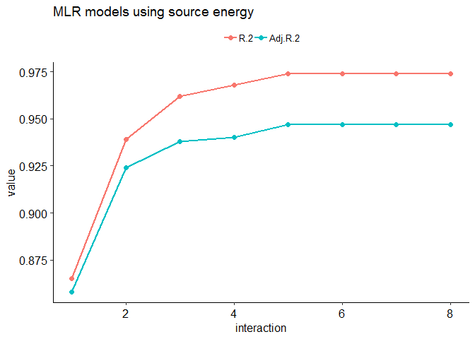
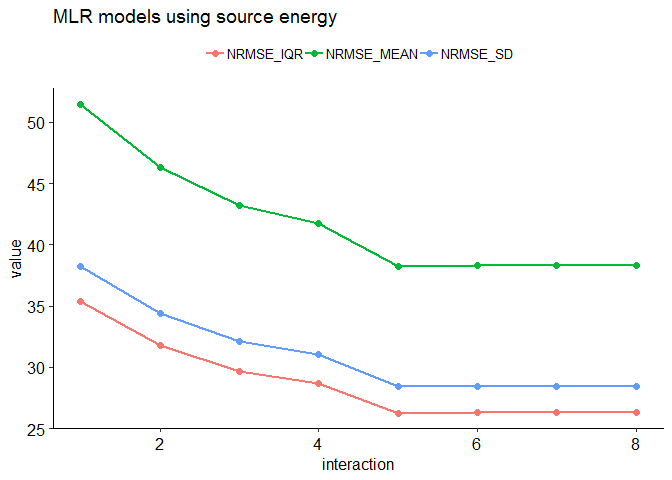
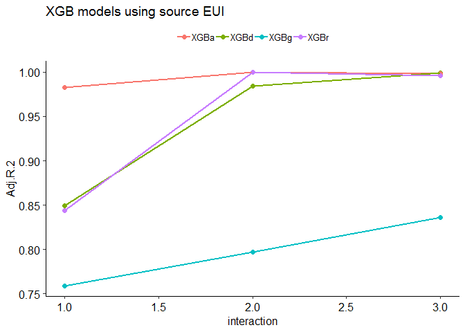
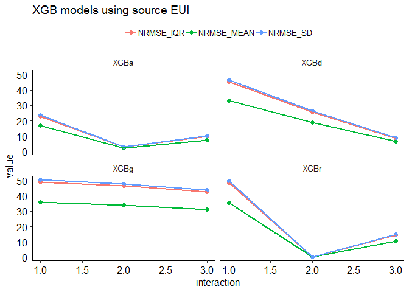
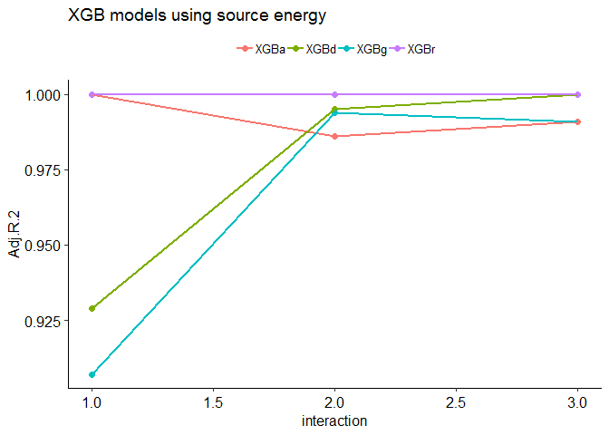
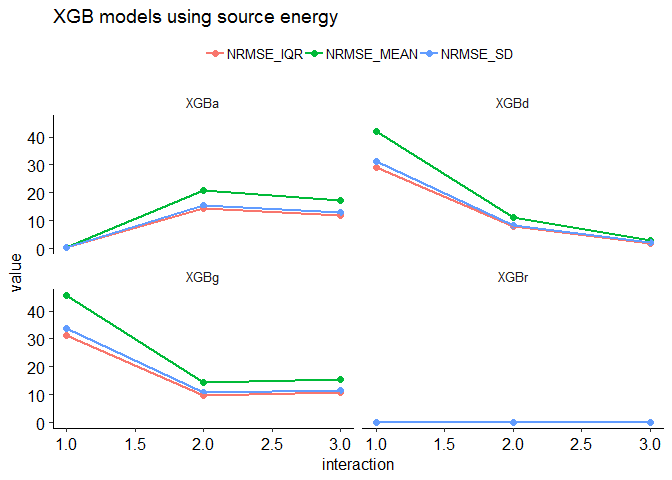
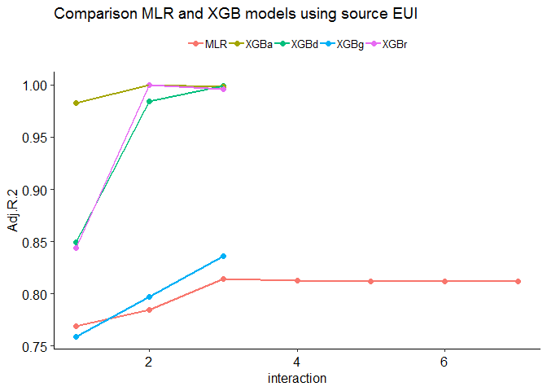
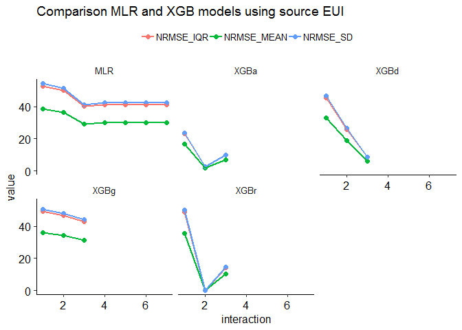
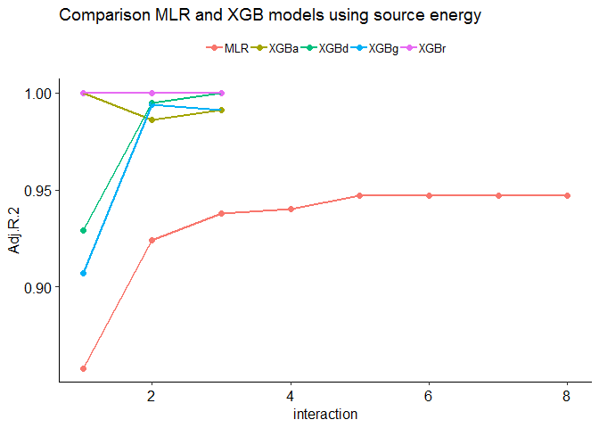
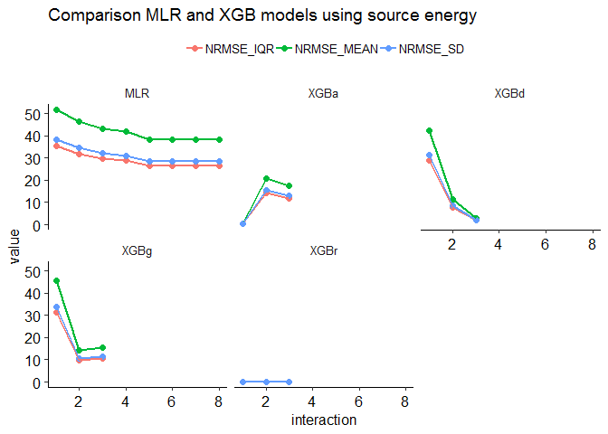

Benchmarking Retail stores and Supermarkets
================
Pandarasamy Arjunan
3 June 2019

-   [Load dataset](#load-dataset)
-   [Apply filters](#apply-filters)
-   [Prepare features](#prepare-features)
-   [Descriptive statistics](#descriptive-statistics)
    -   [Data Frame Summary](#data-frame-summary)
-   [Build predictive models](#build-predictive-models)
    -   [Multiple Linear Regression (MLR)](#multiple-linear-regression-mlr)
    -   [Multiple Linear Regression (MLR) with Interaction terms](#multiple-linear-regression-mlr-with-interaction-terms)
    -   [Comparision of MLR models](#comparision-of-mlr-models)
    -   [Gradient Boosted Trees (XGBoost)](#gradient-boosted-trees-xgboost)
    -   [Comparision of XGB models](#comparision-of-xgb-models)
    -   [Comparision between MLR and XGB models](#comparision-between-mlr-and-xgb-models)

Load dataset
------------

``` r
building_type = "retail"

filtered_dir = './data/cbecs/filtered/'
dir.create(filtered_dir, recursive = T, showWarnings = F)

features_dir = './data/cbecs/features/'
dir.create(features_dir, recursive = T, showWarnings = F)

results_dir = './results/cbecs/'
dir.create(results_dir, recursive = T, showWarnings = F)
```

``` r
cbecs = read.csv("data/cbecs/2012_public_use_data_aug2016.csv")

## list of building attributes relevant to office buildings 
var1 = c( 'SQFT', 'NFLOOR', 'NELVTR', 'NESLTR', 'COURT',
          'MONUSE', 'WKHRS', 'NWKER', 'COOK', 'HEATP',
          'COOLP', 'SNACK', 'FASTFD', 'CAF', 'FDPREP',
          'KITCHN', 'BREAKRM', 'OTFDRM', 'RFGSTO', 'RFGWIN',
          'RFGOPN', 'RFGCLN', 'RFGVNN', 'RFGICN', 'RFGSTP',
          'PCTERMN', 'LAPTPN', 'PRNTRN',  'SERVERN',
          'TVVIDEON', 'RGSTRN', 'COPIERN',  'HDD65', 'CDD65',
          'RFGRES')

var2 = c( "PBAPLUS", "PBA", "FINALWT",
          "MFBTU", 
          "ELBTU", "NGBTU", "FKBTU", "DHBTU",
          "ONEACT", "ACT1", "ACT2", "ACT3", "ACT1PCT", "ACT2PCT", "ACT3PCT",
          "PRAMTC", "PRUNIT",
          "CWUSED", "WOUSED", "COUSED", "SOUSED", "PRUSED")

var3 = c( "RFGRSN", "RFGCOMPN", "RFGWIN", "RFGOPN", "RFGCLN", "RFGVNN")

# imputed data details
var4 = c("ZWKHRS", "ZNWKER", "ZRFGWIN", "ZCOOLP", "ZHEATP")

# heat details
var5 = c("HEATP", "FURNP", "PKGHP", "BOILP", "STHWP", "HTPHP", "SLFCNP", "OTHTP")

retail = cbecs[, c(var1, var2, var3, var4, var5)]
```

Apply filters
-------------

As per Energy Star's technical document [ENERGY STAR Score for Retail Stores and Supermarkets](https://www.energystar.gov/buildings/tools-and-resources/energy-star-score-retail-stores), following filters are applied to define the peer group and to remove any outliers.

After applying each filter, the number of remaining buildings in the dataset (*Number Remaining: X*) and any difference (*Difference: X*) in count from the original Energy Star's technical documentation is also given.

1.  **Calculate source energy and source EUI**

    ``` r
    ## convert electricity, natural gas, fuel oil, and district heat to source energy
    r0 = retail %>% 
      mutate(ELBTU0 = ELBTU*2.80) %>%
      mutate(NGBTU0 = NGBTU*1.05) %>%
      mutate(FKBTU0 = FKBTU*1.01) %>%
      mutate(DHBTU0 = DHBTU*1.20) %>%
      mutate(SOURCE_ENERGY = rowSums(dplyr::select(., c(ELBTU0,NGBTU0,FKBTU0,DHBTU0)), na.rm = T)) %>% 
      mutate(SOURCE_EUI = round(SOURCE_ENERGY/SQFT, 2)) %>%
      mutate(SITE_EUI = round(MFBTU/SQFT, 2)) %>%
      mutate(NGBTU_PERCENT = round(NGBTU / SOURCE_ENERGY * 100, 2)) %>% 
      mutate(SUMBTU = rowSums(dplyr::select(., c(ELBTU,NGBTU,FKBTU,DHBTU)), na.rm = T))

    #Is MFBTU the sum of ELBTU,NGBTU,FKBTU,DHBTU? YES.
    #summary(o14$MFBTU - o14$SUMBTU)
    ```

2.  **PBAPLUS= 14 or 42** <br/>Building Filter – CBECS defines building types according to the variable “PBAPLUS.” Retail Stores are coded as PBAPLUS = 42 and Supermarkets are coded as PBAPLUS = 14. <br/>Number Remaining: 342. <br/>Difference: 0.

    ``` r
    r1 = r0 %>% filter(PBAPLUS %in% c(14, 42))
    ```

3.  **Must operate for at least 30 hours per week** <br/>EPA Program Filter – Baseline condition for being a full time retail store or supermarket. <br/>Number Remaining: 335. <br/>Difference: 0.

    ``` r
    r2 = r1 %>% filter(WKHRS >= 30)
    ```

4.  **Must have at least 1 worker** <br/>EPA Program Filter – Baseline condition for being a full time retail store or supermarket. <br/>Number Remaining: 335. <br/>Difference: 0.

    ``` r
    r3 = r2 %>% filter(NWKER >= 1)
    ```

5.  **Must have at least 1 computer or cash register** <br/>EPA Program Filter – Baseline condition for being a full time retail store or supermarket. <br/>Number Remaining: 323. <br/>Difference: 0.

    ``` r
    r4 = r3 %>% filter(PCTERMN >= 1 | RGSTRN >=1)
    ```

6.  **If building is a supermarket, must have refrigeration equipment** <br/>EPA Program Filter – Baseline condition for being a full time supermarket. <br/>Number Remaining: 323. <br/>Difference: 0.

    ``` r
    r5 = r4 %>% 
      filter( PBAPLUS != "03" | RFGRES == 1)
    ```

7.  **Must operate for at least 10 months per year** <br/>EPA Program Filter – Baseline condition for being a full time retail store. <br/>Number Remaining: 311. <br/>Difference: 0.

    ``` r
    r6 = r5 %>% filter(MONUSE >= 10)
    ```

8.  **A single activity must characterize more than 50% of the floor space** <br/>EPA Program Filter – In order to be considered part of the retail store and supermarket peer group, more than 50% of the building must be defined as a retail store or supermarket. <br/>If the variable ONEACT=1, this indicates that one activity occupies 75% or more of the building. If the variable ONEACT=2, then the building can specify up to 3 activities (ACT1, ACT2, ACT3). One of these activities must be Food Sales or Service (PBAX=14) or Retail (Other Than Mall) (PBAX=16), with a corresponding percent (ACT1PCT, ACT2PCT, ACT3PCT) that is greater than 50. <br/>Number Remaining: 306. <br/>Difference: +5.

    ``` r
    r7 = r6 %>% 
      filter( (ONEACT == 1) |
            (ONEACT == 2 & 
               ((ACT1 %in% c(14,16) & ACT1PCT > 50) | 
                  (ACT2 %in% c(14,16) & ACT2PCT > 50) | 
                  (ACT3 %in% c(14,16) & ACT3PCT > 50) )))
    ```

9.  **Must be less than or equal to 1,000,000 square feet** <br/>Data Limitation Filter – CBECS masks surveyed properties above 1,000,000 square feet by applying regional averages. <br/>Number Remaining: 306. <br/>Difference: +5.

    ``` r
    r8 = r7 %>% filter(SQFT <= 1000000)
    ```

10. **If propane is used, the amount category (PRAMTC) must equal 1, 2, or 3** <br/>Data Limitation Filter – Cannot estimate propane use if the quantity is “greater than 1000” or unknown. <br/>Number Remaining: 294. <br/>Difference: +5.

    ``` r
    r9 = r8 %>% filter(is.na(PRAMTC) | PRAMTC %in% c(1,2,3))
    ```

11. **If propane is used, the unit (PRUNIT) must be known** <br/>Data Limitation Filter – Cannot estimate propane use if the unit is unknown. <br/>Number Remaining: 292. <br/>Difference: +5.

    ``` r
    r10 = r9 %>% filter(is.na(PRUNIT) | PRUNIT %in% c(1,2))
    ```

12. **If propane is used, the maximum estimated propane amount must be 10% or less of the total source energy** <br/>Data Limitation Filter – Because propane values are estimated from a range, propane is restricted to 10% of the total source energy. <br/>Number Remaining: 289. <br/>Difference: +7.

    ``` r
    r11 = r10 %>% 
      filter( PRUSED == 2 | is.na(NGBTU_PERCENT) == T | 
                (PRUSED == 1 & NGBTU_PERCENT <= 10))
    ```

13. **must not use chilled water, wood, coal, or solar** <br/>Data Limitation Filter – CBECS does not collect quantities of chilled water, wood, coal, or solar. <br/>Number Remaining: 282. <br/>Difference: +8.

    ``` r
    r12 = r11 %>% 
      filter(CWUSED == 2) %>%
      filter(WOUSED == 2) %>% 
      filter(COUSED == 2) %>% 
      filter(SOUSED == 2)
    ```

14. **Must be at least 5,000 square feet** <br/>Analytical Limitation – Analysis could not model behavior for buildings smaller than 5,000 ft2. <br/>Number Remaining: 201. <br/>Difference: +5.

    ``` r
    r13 = r12 %>% filter(SQFT >= 5000)
    ```

15. **Must have fewer than 3 open or closed refrigeration/freezer cases per 1,000 square feet** <br/>Analytical Filter – Values determined to be statistical outliers. <br/>Number Remaining: 201. <br/>Difference: +6.

    ``` r
    r14 = r13 %>% filter( (is.na(RFGOPN) | (RFGOPN/SQFT * 1000 < 3)) | 
                          (is.na(RFGCLN) | (RFGCLN/SQFT * 1000 < 3)))
    ```

16. **Must have fewer than 0.7 walk-in refrigeration/freezer cases per 1,000 square feet** <br/>Analytical Filter – Values determined to be statistical outliers. <br/>Number Remaining: 201. <br/>Difference: +6.

    ``` r
    r15 = r14 %>% filter(is.na(RFGWIN) | (RFGWIN / SQFT * 1000 <= 0.7)) 
    ```

17. **Must have Source EUI greater than or equal to 20 kBtu/ft2** <br/>Analytical Filter – Values determined to be statistical outliers. <br/>Number Remaining: 196. <br/>Difference: +4.

    ``` r
    r16 = r15 %>% filter( SOURCE_EUI >= 20)
    ```

18. **If CDD is greater than 3,000, must be at least 60% cooled** <br/>Analytical Filter – Values determined to be statistical outliers. <br/>Number Remaining: 193. <br/>Difference: +4.

    ``` r
    r17 = r16 %>% filter( CDD65 <= 3000 | COOLP >= 60) 
    ```

**Save the filtered dataset**

``` r
write.csv(r17, paste0(filtered_dir, building_type, ".csv"), row.names = F)
```

Prepare features
----------------

The final regression equation includes the following variables: ï‚·

-   Weekly Operating Hours
-   Number of Workers per 1,000 Square Feet
-   Number of Commercial Refrigeration/Freezer Units per 1,000 Square Feet
-   Natural log of Heating Degree Days times Percent of the Building that is Heated
-   Natural log of Cooling Degree Days times Percent of the Building that is Cooled
-   Yes/No variable indicating whether the Building is a Supermarket (1 = yes, 0 = no)
-   Adjustment for the Number of Workers per 1,000 Square Feet for a Supermarket

``` r
retail = read.csv(paste0(filtered_dir, building_type, ".csv"))

data = retail %>%
  dplyr::mutate(NWKER_SQFT = NWKER/SQFT * 1000) %>%
  dplyr::mutate(RFG_TOT = rowSums(dplyr::select(., c(RFGRSN,RFGCOMPN,RFGWIN,RFGOPN,RFGCLN,RFGVNN)), na.rm = T)) %>% 
  dplyr::mutate(RFG_SQFT = RFG_TOT/SQFT * 1000) %>%
  dplyr::mutate(CDD65_COOLP = log(CDD65) * COOLP / 100) %>%
  dplyr::mutate(HDD65_HEATP = log(HDD65) * HEATP / 100) %>%
  dplyr::mutate(IsSuperMarket = ifelse(PBAPLUS == 14, "Yes", "No")) %>%
  dplyr::mutate(AdjNWKER_SQFTsuperMarket = ifelse(PBAPLUS == 14, 1, 0)) %>%
  dplyr::mutate(AdjNWKER_SQFTsuperMarket = AdjNWKER_SQFTsuperMarket * NWKER_SQFT) %>%
  dplyr::mutate_if(is.numeric, round, 3)

#TODO: Adjustment for the Number of Workers per 1,000 Square Feet for a Supermarket

ivars = c(
  "SQFT",
  "WKHRS", "NWKER_SQFT", "RFG_SQFT", 
          "HDD65_HEATP", "CDD65_COOLP", 
          "IsSuperMarket", "AdjNWKER_SQFTsuperMarket")

dvars  = c("SOURCE_EUI", "SOURCE_ENERGY", "FINALWT")

features = data[, c(ivars, dvars)]
features = features %>% na.omit()

write.csv(features, 
          paste0(features_dir, building_type, ".csv"), 
          row.names = F)
```

Descriptive statistics
----------------------

``` r
features1 = features
features1 = features1 %>% dplyr::select(-one_of('SOURCE_ENERGY', 'FINALWT'))

summarytools::descr(features1, stats = "common", 
                    transpose = TRUE, 
                    headings = FALSE)
```

    Non-numerical variable(s) ignored: IsSuperMarket

|                               |      Mean|   Std.Dev|      Min|    Median|        Max|
|------------------------------:|---------:|---------:|--------:|---------:|----------:|
|  **AdjNWKER\_SQFTsuperMarket**|      0.13|      0.37|     0.00|      0.00|       2.09|
|               **CDD65\_COOLP**|      6.10|      1.72|     0.07|      6.76|       8.63|
|               **HDD65\_HEATP**|      7.56|      1.43|     1.80|      8.14|       9.03|
|                **NWKER\_SQFT**|      0.81|      0.64|     0.07|      0.64|       4.12|
|                  **RFG\_SQFT**|      0.41|      0.61|     0.00|      0.19|       3.47|
|                **SOURCE\_EUI**|    213.48|    151.58|    22.89|    168.29|     731.36|
|                       **SQFT**|  66207.39|  84936.41|  5000.00|  30500.00|  700000.00|
|                      **WKHRS**|     89.50|     36.53|    35.00|     83.50|     168.00|

|                               |  N.Valid|  Pct.Valid|
|------------------------------:|--------:|----------:|
|  **AdjNWKER\_SQFTsuperMarket**|   176.00|     100.00|
|               **CDD65\_COOLP**|   176.00|     100.00|
|               **HDD65\_HEATP**|   176.00|     100.00|
|                **NWKER\_SQFT**|   176.00|     100.00|
|                  **RFG\_SQFT**|   176.00|     100.00|
|                **SOURCE\_EUI**|   176.00|     100.00|
|                       **SQFT**|   176.00|     100.00|
|                      **WKHRS**|   176.00|     100.00|

``` r
dfSummary(features1, plain.ascii = FALSE, style = "grid", 
          graph.magnif = 0.75, valid.col = FALSE)
```

    text graphs are displayed; set 'tmp.img.dir' parameter to activate png graphs

### Data Frame Summary

**features1**
**Dimensions:** 176 x 9
**Duplicates:** 0

<table>
<colgroup>
<col width="3%" />
<col width="21%" />
<col width="25%" />
<col width="16%" />
<col width="25%" />
<col width="7%" />
</colgroup>
<thead>
<tr class="header">
<th>No</th>
<th>Variable</th>
<th>Stats / Values</th>
<th>Freqs (% of Valid)</th>
<th>Graph</th>
<th>Missing</th>
</tr>
</thead>
<tbody>
<tr class="odd">
<td><p>1</p></td>
<td><p>SQFT<br />
[numeric]</p></td>
<td><p>Mean (sd) : 66207.4 (84936.4)<br />
min &lt; med &lt; max:<br />
5000 &lt; 30500 &lt; 7e+05<br />
IQR (CV) : 91062.5 (1.3)</p></td>
<td><p>108 distinct values</p></td>
<td><p><br />
:<br />
:<br />
:<br />
: .<br />
: : .</p></td>
<td><p>0<br />
(0%)</p></td>
</tr>
<tr class="even">
<td><p>2</p></td>
<td><p>WKHRS<br />
[numeric]</p></td>
<td><p>Mean (sd) : 89.5 (36.5)<br />
min &lt; med &lt; max:<br />
35 &lt; 83.5 &lt; 168<br />
IQR (CV) : 45 (0.4)</p></td>
<td><p>54 distinct values</p></td>
<td><p><br />
  :<br />
  : . :<br />
  : : : .<br />
  : : : :     :<br />
. : : : : :   :</p></td>
<td><p>0<br />
(0%)</p></td>
</tr>
<tr class="odd">
<td><p>3</p></td>
<td><p>NWKER_SQFT<br />
[numeric]</p></td>
<td><p>Mean (sd) : 0.8 (0.6)<br />
min &lt; med &lt; max:<br />
0.1 &lt; 0.6 &lt; 4.1<br />
IQR (CV) : 0.6 (0.8)</p></td>
<td><p>129 distinct values</p></td>
<td><p><br />
  :<br />
: :<br />
: :<br />
: : .<br />
: : : . .</p></td>
<td><p>0<br />
(0%)</p></td>
</tr>
<tr class="even">
<td><p>4</p></td>
<td><p>RFG_SQFT<br />
[numeric]</p></td>
<td><p>Mean (sd) : 0.4 (0.6)<br />
min &lt; med &lt; max:<br />
0 &lt; 0.2 &lt; 3.5<br />
IQR (CV) : 0.4 (1.5)</p></td>
<td><p>128 distinct values</p></td>
<td><p><br />
:<br />
:<br />
:<br />
:<br />
: . .</p></td>
<td><p>0<br />
(0%)</p></td>
</tr>
<tr class="odd">
<td><p>5</p></td>
<td><p>HDD65_HEATP<br />
[numeric]</p></td>
<td><p>Mean (sd) : 7.6 (1.4)<br />
min &lt; med &lt; max:<br />
1.8 &lt; 8.1 &lt; 9<br />
IQR (CV) : 1.5 (0.2)</p></td>
<td><p>170 distinct values</p></td>
<td><p><br />
              :<br />
              :<br />
              :<br />
            : :<br />
      . . : : :</p></td>
<td><p>0<br />
(0%)</p></td>
</tr>
<tr class="even">
<td><p>6</p></td>
<td><p>CDD65_COOLP<br />
[numeric]</p></td>
<td><p>Mean (sd) : 6.1 (1.7)<br />
min &lt; med &lt; max:<br />
0.1 &lt; 6.8 &lt; 8.6<br />
IQR (CV) : 2.1 (0.3)</p></td>
<td><p>173 distinct values</p></td>
<td><p><br />
            . :<br />
            : :<br />
          . : :<br />
          : : :<br />
  . . : : : : : :</p></td>
<td><p>0<br />
(0%)</p></td>
</tr>
<tr class="odd">
<td><p>7</p></td>
<td><p>IsSuperMarket<br />
[character]</p></td>
<td><p>1. No<br />
2. Yes</p></td>
<td><p>150 (85.2%)<br />
26 (14.8%)</p></td>
<td><p>IIIIIIIIIIIIIIIII<br />
II</p></td>
<td><p>0<br />
(0%)</p></td>
</tr>
<tr class="even">
<td><p>8</p></td>
<td><p>AdjNWKER_SQFTsuperMarket<br />
[numeric]</p></td>
<td><p>Mean (sd) : 0.1 (0.4)<br />
min &lt; med &lt; max:<br />
0 &lt; 0 &lt; 2.1<br />
IQR (CV) : 0 (2.8)</p></td>
<td><p>25 distinct values</p></td>
<td><p><br />
:<br />
:<br />
:<br />
:<br />
:     .</p></td>
<td><p>0<br />
(0%)</p></td>
</tr>
<tr class="odd">
<td><p>9</p></td>
<td><p>SOURCE_EUI<br />
[numeric]</p></td>
<td><p>Mean (sd) : 213.5 (151.6)<br />
min &lt; med &lt; max:<br />
22.9 &lt; 168.3 &lt; 731.4<br />
IQR (CV) : 155.7 (0.7)</p></td>
<td><p>176 distinct values</p></td>
<td><p><br />
  :<br />
  :<br />
: : .<br />
: : : .<br />
: : : : . :</p></td>
<td><p>0<br />
(0%)</p></td>
</tr>
</tbody>
</table>

**Extract R code from Rmd document**

``` r
#knitr::purl("retail.Rmd", output = "retail.R", documentation = 2)
```

Build predictive models
-----------------------

``` r
#source("models.R")
source("metrics.R")

data = read.csv(paste0(features_dir, building_type, ".csv"))

allMetrics = NULL

sourceEUI_attributes = setdiff(colnames(data),
                               c("SQFT", "FINALWT", "SOURCE_EUI", "SOURCE_ENERGY"))

sourceEnergy_attributes = setdiff(colnames(data), 
                               c("FINALWT", "SOURCE_EUI", "SOURCE_ENERGY"))
#cat(colnames(data))
knitr::kable(colnames(data), col.names = NULL)
```

    Warning in kable_markdown(x, padding = padding, ...): The table should have
    a header (column names)

|                           |
|:--------------------------|
| SQFT                      |
| WKHRS                     |
| NWKER\_SQFT               |
| RFG\_SQFT                 |
| HDD65\_HEATP              |
| CDD65\_COOLP              |
| IsSuperMarket             |
| AdjNWKER\_SQFTsuperMarket |
| SOURCE\_EUI               |
| SOURCE\_ENERGY            |
| FINALWT                   |

### Multiple Linear Regression (MLR)

``` r
MLR.fit <- function(data, 
                    x, 
                    y, 
                    w, 
                    interaction,
                    centering = TRUE 
                    ) {
  
  if(centering == TRUE){
    data = mean_center_data(data, x)  
  }
  
  if(interaction == 1) {  ### ordinary model
    model = paste(y, "~", paste(x, collapse = " + "))  
  } else {  ### interaction model
    allvars = paste(x, collapse = " + ")
    model = paste(y, "~ (", allvars, ") ^", interaction )
  }
  
  fit = lm(model, data = data, weights = data[, w])
  return (fit)
}

MLR.predict <- function(data, x, y, w, i) {
  
  mlrFit = MLR.fit(data, x, y, w, i)
  
  wt   = data[, w]
  obs  = data[, y]
  pred = as.numeric(predict(mlrFit))
  
  mlrMetrics = getMLRmetrics(mlrFit, obs, pred, wt)
  mlrMetrics = data.frame(
    "model" = "MLR",
    "dependent" = y,
    "interaction" = i,
    "transform" = "meanCent",
    mlrMetrics)
  
  return(mlrMetrics)
}
```

#### Using SOURCE\_EUI as dependent variable

``` r
x = sourceEUI_attributes
y = "SOURCE_EUI"
w = "FINALWT"
interaction = 1

mlrMetrics = MLR.predict(data, x, y, w, interaction)

allMetrics = rbind(allMetrics, mlrMetrics)

knitr::kable(allMetrics, row.names = F)
```

| model | dependent   |  interaction| transform |  obs|  rank|  coef|    R.2|  Adj.R.2|       mse|    rmse|     mae|   mape|  nrmse\_iqr|  nrmse\_range|  nrmse\_mean|  nrmse\_sd|
|:------|:------------|------------:|:----------|----:|-----:|-----:|------:|--------:|---------:|-------:|-------:|------:|-----------:|-------------:|------------:|----------:|
| MLR   | SOURCE\_EUI |            1| meanCent  |  176|     8|     8|  0.778|    0.769|  6750.372|  82.161|  58.659|  0.389|      52.784|        11.597|       38.486|     54.204|

#### Using SOURCE\_ENERGY as dependent variable

``` r
x = sourceEnergy_attributes
y = "SOURCE_ENERGY"
w = "FINALWT"
interaction = 1

mlrMetrics = MLR.predict(data, x, y, w, interaction)

allMetrics = rbind(allMetrics, mlrMetrics)

knitr::kable(allMetrics, row.names = F)
```

| model | dependent      |  interaction| transform |  obs|  rank|  coef|    R.2|  Adj.R.2|           mse|         rmse|          mae|   mape|  nrmse\_iqr|  nrmse\_range|  nrmse\_mean|  nrmse\_sd|
|:------|:---------------|------------:|:----------|----:|-----:|-----:|------:|--------:|-------------:|------------:|------------:|------:|-----------:|-------------:|------------:|----------:|
| MLR   | SOURCE\_EUI    |            1| meanCent  |  176|     8|     8|  0.778|    0.769|  6.750372e+03|       82.161|       58.659|  0.389|      52.784|        11.597|       38.486|     54.204|
| MLR   | SOURCE\_ENERGY |            1| meanCent  |  176|     9|     9|  0.865|    0.858|  5.961201e+13|  7720881.726|  4401407.541|  0.848|      35.350|         6.496|       51.458|     38.260|

### Multiple Linear Regression (MLR) with Interaction terms

#### Using SOURCE\_EUI as dependent variable

``` r
x = sourceEUI_attributes
y = "SOURCE_EUI"
w = "FINALWT"

intr_depth = length(x)

for (interaction in 2:intr_depth) {
  mlrMetrics = MLR.predict(data, x, y, w, interaction)
  allMetrics = rbind(allMetrics, mlrMetrics)
}

write.csv(allMetrics, 
          paste0(results_dir, building_type, ".csv"), 
          row.names = F)

allMetrics0 = allMetrics %>% filter(dependent == y)
knitr::kable(allMetrics0, row.names = F)
```

| model | dependent   |  interaction| transform |  obs|  rank|  coef|    R.2|  Adj.R.2|       mse|    rmse|     mae|   mape|  nrmse\_iqr|  nrmse\_range|  nrmse\_mean|  nrmse\_sd|
|:------|:------------|------------:|:----------|----:|-----:|-----:|------:|--------:|---------:|-------:|-------:|------:|-----------:|-------------:|------------:|----------:|
| MLR   | SOURCE\_EUI |            1| meanCent  |  176|     8|     8|  0.778|    0.769|  6750.372|  82.161|  58.659|  0.389|      52.784|        11.597|       38.486|     54.204|
| MLR   | SOURCE\_EUI |            2| meanCent  |  176|    27|    29|  0.817|    0.785|  6112.915|  78.185|  56.112|  0.384|      50.230|        11.036|       36.623|     51.581|
| MLR   | SOURCE\_EUI |            3| meanCent  |  176|    52|    64|  0.868|    0.814|  3913.240|  62.556|  41.046|  0.333|      40.189|         8.830|       29.302|     41.270|
| MLR   | SOURCE\_EUI |            4| meanCent  |  176|    57|    99|  0.873|    0.813|  4120.035|  64.188|  41.834|  0.338|      41.237|         9.060|       30.067|     42.347|
| MLR   | SOURCE\_EUI |            5| meanCent  |  176|    58|   120|  0.873|    0.812|  4105.324|  64.073|  41.632|  0.336|      41.163|         9.044|       30.013|     42.271|
| MLR   | SOURCE\_EUI |            6| meanCent  |  176|    58|   127|  0.873|    0.812|  4105.324|  64.073|  41.632|  0.336|      41.163|         9.044|       30.013|     42.271|
| MLR   | SOURCE\_EUI |            7| meanCent  |  176|    58|   128|  0.873|    0.812|  4105.324|  64.073|  41.632|  0.336|      41.163|         9.044|       30.013|     42.271|

#### Using SOURCE\_ENERGY as dependent variable\*\*

``` r
x = sourceEnergy_attributes
y = "SOURCE_ENERGY"
w = "FINALWT"

intr_depth = length(x)

for (interaction in 2:intr_depth) {
  mlrMetrics = MLR.predict(data, x, y, w, interaction)
  allMetrics = rbind(allMetrics, mlrMetrics)
}

write.csv(allMetrics, 
          paste0(results_dir, building_type, ".csv"), 
          row.names = F)

allMetrics0 = allMetrics %>% filter(dependent == y)
knitr::kable(allMetrics0, row.names = F)
```

| model | dependent      |  interaction| transform |  obs|  rank|  coef|    R.2|  Adj.R.2|           mse|     rmse|      mae|   mape|  nrmse\_iqr|  nrmse\_range|  nrmse\_mean|  nrmse\_sd|
|:------|:---------------|------------:|:----------|----:|-----:|-----:|------:|--------:|-------------:|--------:|--------:|------:|-----------:|-------------:|------------:|----------:|
| MLR   | SOURCE\_ENERGY |            1| meanCent  |  176|     9|     9|  0.865|    0.858|  5.961201e+13|  7720882|  4401408|  0.848|      35.350|         6.496|       51.458|     38.260|
| MLR   | SOURCE\_ENERGY |            2| meanCent  |  176|    35|    37|  0.939|    0.924|  4.819723e+13|  6942423|  3215281|  0.404|      31.786|         5.841|       46.270|     34.403|
| MLR   | SOURCE\_ENERGY |            3| meanCent  |  176|    68|    93|  0.962|    0.938|  4.207712e+13|  6486688|  2524342|  0.407|      29.700|         5.457|       43.232|     32.144|
| MLR   | SOURCE\_ENERGY |            4| meanCent  |  176|    83|   163|  0.968|    0.940|  3.923781e+13|  6264009|  2309261|  0.396|      28.680|         5.270|       41.748|     31.041|
| MLR   | SOURCE\_ENERGY |            5| meanCent  |  176|    89|   219|  0.974|    0.947|  3.286812e+13|  5733073|  1986398|  0.381|      26.249|         4.823|       38.210|     28.410|
| MLR   | SOURCE\_ENERGY |            6| meanCent  |  176|    90|   247|  0.974|    0.947|  3.302649e+13|  5746868|  1995820|  0.378|      26.312|         4.835|       38.302|     28.478|
| MLR   | SOURCE\_ENERGY |            7| meanCent  |  176|    90|   255|  0.974|    0.947|  3.302649e+13|  5746868|  1995820|  0.378|      26.312|         4.835|       38.302|     28.478|
| MLR   | SOURCE\_ENERGY |            8| meanCent  |  176|    90|   256|  0.974|    0.947|  3.302649e+13|  5746868|  1995820|  0.378|      26.312|         4.835|       38.302|     28.478|

### Comparision of MLR models

#### MLR plots using Source EUI

``` r
mytheme = theme(legend.title = element_blank(),
           legend.text=element_text(size=12),
           axis.text=element_text(size=12),
           text=element_text(size=12))

plotR2 <- function(df, titl) {
  
  df1 = melt(df, measure.vars = c("R.2", "Adj.R.2"))
  
  plot <- ggplot(df1, aes(x = interaction, y=value, 
                          group=variable, col=variable)) + 
  geom_point(size=2) + geom_line(size=1) +
    ggtitle(titl) + 
    theme_pubr(base_size=12) +
    theme(legend.position="top", legend.title = element_blank())
  
  return(plot)
}

plotNRMSE <- function(df, titl) {
  
  df1 = melt(df, measure.vars = c("nrmse_iqr", "nrmse_mean", 
                                        "nrmse_sd"))
  df1$variable = toupper(df1$variable)
  
  plot <- ggplot(df1, aes(x = interaction, y=value, 
                          group=variable, col=variable)) + 
  geom_point(size=2) + geom_line(size=1) +
    ggtitle(titl) + 
    theme_pubr(base_size=12) +
    theme(legend.position="top", legend.title = element_blank())
    
  
  return(plot)
}  
```

``` r
allMetrics0 = allMetrics %>%
  filter(stringr::str_detect(model, "MLR")) %>%
  filter(dependent == "SOURCE_EUI")

plot1 = plotR2(allMetrics0, "MLR models using source EUI")
plot2 = plotNRMSE(allMetrics0, "MLR models using source EUI")

print(plot1)
```


``` r
print(plot2)
```


#### MLR plots using Source Energy

``` r
allMetrics0 = allMetrics %>%
  filter(stringr::str_detect(model, "MLR")) %>%
  filter(dependent == "SOURCE_ENERGY")

plot1 = plotR2(allMetrics0, "MLR models using source energy")
plot2 = plotNRMSE(allMetrics0, "MLR models using source energy")

print(plot1)
```



``` r
print(plot2)
```



### Gradient Boosted Trees (XGBoost)

``` r
tuneXGBoost <- function(x,
                        y,
                        sample_weights,
                        search = "default",
                        tree_height = 2
                        ) {
  
  N = 10  # N-fold CV
  R = 2   # and R repeats
  
  tcDefault  <- trainControl(method = "repeatedcv", 
                            number = N, 
                            repeats = R)
  
  tcRandom   <- trainControl(method = "repeatedcv", 
                            search = "random",
                            number = N, 
                            repeats = R)
  
  tcAdaptive <- trainControl(method = "adaptive_cv", 
                            search = "random",
                            number = N, 
                            repeats = R,
                            adaptive = list(min = 5, 
                                            alpha = 0.05, 
                                            method = "gls",
                                            complete = TRUE))
  
  default_param = expand.grid(
    nrounds = 100,
    max_depth = tree_height,
    eta = 0.3,
    gamma = 0,
    colsample_bytree = 1,
    min_child_weight = 1,
    subsample = 1)
  
  # from https://github.com/topepo/caret/blob/master/models/files/xgbTree.R
  len = 10
  grid_param <- expand.grid(
    nrounds = floor((1:len) * 10),
    max_depth = tree_height,
    eta = c(.3, .4),
    gamma = 0,
    colsample_bytree = c(.6, .8),
    min_child_weight = c(1),
    subsample = seq(.25, 1, length = len))
  
  tuned = switch(search,
                 "default" = train(x, y,
                                   weights = sample_weights,
                                   method = "xgbTree", 
                                   tuneGrid = default_param,
                                   trControl = tcDefault,
                                   verbose = TRUE),
                 
                 "grid"     = train(x, y, 
                                   weights = sample_weights,
                                   method = "xgbTree", 
                                   tuneGrid = grid_param,
                                   trControl = tcDefault,
                                   verbose = TRUE),

                 "random"  = train(x, y, 
                                   weights = sample_weights,
                                   method = "xgbTree", 
                                   trControl = tcRandom,
                                   verbose = TRUE),
                 
                 "adaptive" = train(x, y, 
                                   weights = sample_weights,
                                   method = "xgbTree", 
                                   trControl = tcAdaptive,
                                   verbose = TRUE)
                 )
  
  return(tuned$finalModel)
}

XGBoost <- function( xdata, 
                     ydata,
                     sample_weights,
                     search = "default",
                     interaction = 2
                     ) {
  
  model = paste(y, "~", paste(x, collapse = " + "))
  dummy = dummyVars(model, data = data, fullRank = T)
  
  xdata = as.data.frame(predict(dummy, data))
  ydata = data[, y]
  
  xgfit = tuneXGBoost(xdata, ydata, 
                      sample_weights,
                      search, 
                      tree_height = interaction)
  return(xgfit)
} 


XGBoost.predict <- function(data, x, y, w, search) {

  model = paste(y, "~", paste(x, collapse = " + "))
  dummy = dummyVars(model, data = data, fullRank = T)
  xdata = as.data.frame(predict(dummy, data))
  ydata = data[, y]
  wt = data[, w]
  
  intr_depth = 3
  
  xgbMetricsAll = NULL
  
  for (intr in 1:intr_depth) {
    
    cat(paste(Sys.time(), "xgboost", search, y, intr, "\n"))
    
    xgfit = XGBoost(xdata, ydata, wt, 
                    search = search, 
                    interaction = intr)
    
    pred = as.numeric(predict(xgfit, as.matrix(xdata)))
    
    xgbMetrics = getXgboostmetrics(xgfit, xdata, ydata, pred, wt)
    
    xgbMetrics = data.frame(
      "model" = paste0("XGB", substr(search, 1,1), intr),
      "dependent" = y, 
      "interaction" = intr, 
      "transform" = "None",
      xgbMetrics)
    
    xgbMetricsAll = rbind(xgbMetricsAll, xgbMetrics)
  }
  
  return(xgbMetricsAll)
}
```

``` r
# y = "SOURCE_EUI"
# w = "FINALWT"
# o = c("SOURCE_ENERGY", "SQFT")
# x = setdiff(colnames(data), c(y, w, o))
# wt = data[, w]
# 
# model = paste(y, "~", paste(x, collapse = " + "))
# dummy = dummyVars(model, data = data, fullRank = T)
# xdata = as.data.frame(predict(dummy, data))
# ydata = data[, y]
# intr_depth = 3
# 
# for (intr in 1:intr_depth) {
#   
#   print(paste(Sys.time(), "xgboost default search", y, intr, "\n"))
#   
#   xgfit = XGBoost(xdata, ydata, wt, 
#                   search = "default", 
#                   interaction = intr)
#   
#   pred = as.numeric(predict(xgfit, as.matrix(xdata)))
#   
#   xgbMetrics = getXgboostmetrics(xgfit, xdata, ydata, pred, wt)
#   
#   xgbMetrics = data.frame(
#     "model" = paste0("XGBd", intr),
#     "dependent" = y, 
#     "interaction" = intr, 
#     "transform" = "None",
#     xgbMetrics)
#   
#   allMetrics = rbind(allMetrics, xgbMetrics)
# }
# knitr::kable(allMetrics, row.names = F)
```

#### Using SOURCE\_EUI as dependent variable

``` r
library(doParallel)
ncore = 4
registerDoParallel(cores = ncore)
```

##### Using default search

``` r
x = sourceEUI_attributes
y = "SOURCE_EUI"
w = "FINALWT"
search = "default"

xgbMetrics = XGBoost.predict(data, x, y, w, search)
```

2019-06-10 16:10:56 xgboost default SOURCE\_EUI 1 2019-06-10 16:11:35 xgboost default SOURCE\_EUI 2 2019-06-10 16:11:38 xgboost default SOURCE\_EUI 3

``` r
allMetrics = rbind(allMetrics, xgbMetrics)

knitr::kable(xgbMetrics, row.names = F)
```

| model | dependent   |  interaction| transform |  obs|  rank|  coef|    R.2|  Adj.R.2|       mse|    rmse|     mae|   mape|  nrmse\_iqr|  nrmse\_range|  nrmse\_mean|  nrmse\_sd|
|:------|:------------|------------:|:----------|----:|-----:|-----:|------:|--------:|---------:|-------:|-------:|------:|-----------:|-------------:|------------:|----------:|
| XGBd1 | SOURCE\_EUI |            1| None      |  176|     7|     7|  0.854|    0.849|  4992.148|  70.655|  49.390|  0.324|      45.392|         9.973|       33.096|     46.613|
| XGBd2 | SOURCE\_EUI |            2| None      |  176|     7|     7|  0.985|    0.984|  1597.464|  39.968|  22.969|  0.147|      25.677|         5.641|       18.722|     26.368|
| XGBd3 | SOURCE\_EUI |            3| None      |  176|     7|     7|  0.999|    0.999|   177.116|  13.309|   6.953|  0.042|       8.550|         1.879|        6.234|      8.780|

##### Using grid search

``` r
x = sourceEUI_attributes
y = "SOURCE_EUI"
w = "FINALWT"
search = "grid"

xgbMetrics = XGBoost.predict(data, x, y, w, search)
```

2019-06-10 16:11:41 xgboost grid SOURCE\_EUI 1 2019-06-10 16:12:19 xgboost grid SOURCE\_EUI 2 2019-06-10 16:13:10 xgboost grid SOURCE\_EUI 3

``` r
allMetrics = rbind(allMetrics, xgbMetrics)

knitr::kable(xgbMetrics, row.names = F)
```

| model | dependent   |  interaction| transform |  obs|  rank|  coef|    R.2|  Adj.R.2|       mse|    rmse|     mae|   mape|  nrmse\_iqr|  nrmse\_range|  nrmse\_mean|  nrmse\_sd|
|:------|:------------|------------:|:----------|----:|-----:|-----:|------:|--------:|---------:|-------:|-------:|------:|-----------:|-------------:|------------:|----------:|
| XGBg1 | SOURCE\_EUI |            1| None      |  176|     7|     7|  0.767|    0.759|  5878.892|  76.674|  56.069|  0.402|      49.259|        10.822|       35.916|     50.584|
| XGBg2 | SOURCE\_EUI |            2| None      |  176|     7|     7|  0.804|    0.797|  5297.036|  72.781|  52.919|  0.367|      46.758|        10.273|       34.092|     48.016|
| XGBg3 | SOURCE\_EUI |            3| None      |  176|     7|     7|  0.842|    0.836|  4466.388|  66.831|  48.768|  0.336|      42.935|         9.433|       31.305|     44.091|

##### Using adaptive search

``` r
x = sourceEUI_attributes
y = "SOURCE_EUI"
w = "FINALWT"
search = "adaptive"

xgbMetrics = XGBoost.predict(data, x, y, w, search)
```

2019-06-10 16:14:18 xgboost adaptive SOURCE\_EUI 1 2019-06-10 16:14:52 xgboost adaptive SOURCE\_EUI 2 2019-06-10 16:16:04 xgboost adaptive SOURCE\_EUI 3

``` r
allMetrics = rbind(allMetrics, xgbMetrics)

knitr::kable(xgbMetrics, row.names = F)
```

| model | dependent   |  interaction| transform |  obs|  rank|  coef|    R.2|  Adj.R.2|       mse|    rmse|     mae|   mape|  nrmse\_iqr|  nrmse\_range|  nrmse\_mean|  nrmse\_sd|
|:------|:------------|------------:|:----------|----:|-----:|-----:|------:|--------:|---------:|-------:|-------:|------:|-----------:|-------------:|------------:|----------:|
| XGBa1 | SOURCE\_EUI |            1| None      |  176|     7|     7|  0.984|    0.983|  1276.649|  35.730|  23.181|  0.158|      22.955|         5.043|       16.737|     23.572|
| XGBa2 | SOURCE\_EUI |            2| None      |  176|     7|     7|  1.000|    1.000|    17.347|   4.165|   3.035|  0.022|       2.676|         0.588|        1.951|      2.748|
| XGBa3 | SOURCE\_EUI |            3| None      |  176|     7|     7|  0.998|    0.998|   226.647|  15.055|   8.952|  0.059|       9.672|         2.125|        7.052|      9.932|

##### Using random search

``` r
x = sourceEUI_attributes
y = "SOURCE_EUI"
w = "FINALWT"
search = "random"

xgbMetrics = XGBoost.predict(data, x, y, w, search)
```

2019-06-10 16:16:20 xgboost random SOURCE\_EUI 1 2019-06-10 16:16:48 xgboost random SOURCE\_EUI 2 2019-06-10 16:17:40 xgboost random SOURCE\_EUI 3

``` r
allMetrics = rbind(allMetrics, xgbMetrics)

write.csv(allMetrics, 
          paste0(results_dir, building_type, ".csv"), 
          row.names = F)

allMetrics0 = allMetrics %>% filter(dependent == y)
knitr::kable(allMetrics0, row.names = F)
```

| model | dependent   |  interaction| transform |  obs|  rank|  coef|    R.2|  Adj.R.2|       mse|    rmse|     mae|   mape|  nrmse\_iqr|  nrmse\_range|  nrmse\_mean|  nrmse\_sd|
|:------|:------------|------------:|:----------|----:|-----:|-----:|------:|--------:|---------:|-------:|-------:|------:|-----------:|-------------:|------------:|----------:|
| MLR   | SOURCE\_EUI |            1| meanCent  |  176|     8|     8|  0.778|    0.769|  6750.372|  82.161|  58.659|  0.389|      52.784|        11.597|       38.486|     54.204|
| MLR   | SOURCE\_EUI |            2| meanCent  |  176|    27|    29|  0.817|    0.785|  6112.915|  78.185|  56.112|  0.384|      50.230|        11.036|       36.623|     51.581|
| MLR   | SOURCE\_EUI |            3| meanCent  |  176|    52|    64|  0.868|    0.814|  3913.240|  62.556|  41.046|  0.333|      40.189|         8.830|       29.302|     41.270|
| MLR   | SOURCE\_EUI |            4| meanCent  |  176|    57|    99|  0.873|    0.813|  4120.035|  64.188|  41.834|  0.338|      41.237|         9.060|       30.067|     42.347|
| MLR   | SOURCE\_EUI |            5| meanCent  |  176|    58|   120|  0.873|    0.812|  4105.324|  64.073|  41.632|  0.336|      41.163|         9.044|       30.013|     42.271|
| MLR   | SOURCE\_EUI |            6| meanCent  |  176|    58|   127|  0.873|    0.812|  4105.324|  64.073|  41.632|  0.336|      41.163|         9.044|       30.013|     42.271|
| MLR   | SOURCE\_EUI |            7| meanCent  |  176|    58|   128|  0.873|    0.812|  4105.324|  64.073|  41.632|  0.336|      41.163|         9.044|       30.013|     42.271|
| XGBd1 | SOURCE\_EUI |            1| None      |  176|     7|     7|  0.854|    0.849|  4992.148|  70.655|  49.390|  0.324|      45.392|         9.973|       33.096|     46.613|
| XGBd2 | SOURCE\_EUI |            2| None      |  176|     7|     7|  0.985|    0.984|  1597.464|  39.968|  22.969|  0.147|      25.677|         5.641|       18.722|     26.368|
| XGBd3 | SOURCE\_EUI |            3| None      |  176|     7|     7|  0.999|    0.999|   177.116|  13.309|   6.953|  0.042|       8.550|         1.879|        6.234|      8.780|
| XGBg1 | SOURCE\_EUI |            1| None      |  176|     7|     7|  0.767|    0.759|  5878.892|  76.674|  56.069|  0.402|      49.259|        10.822|       35.916|     50.584|
| XGBg2 | SOURCE\_EUI |            2| None      |  176|     7|     7|  0.804|    0.797|  5297.036|  72.781|  52.919|  0.367|      46.758|        10.273|       34.092|     48.016|
| XGBg3 | SOURCE\_EUI |            3| None      |  176|     7|     7|  0.842|    0.836|  4466.388|  66.831|  48.768|  0.336|      42.935|         9.433|       31.305|     44.091|
| XGBa1 | SOURCE\_EUI |            1| None      |  176|     7|     7|  0.984|    0.983|  1276.649|  35.730|  23.181|  0.158|      22.955|         5.043|       16.737|     23.572|
| XGBa2 | SOURCE\_EUI |            2| None      |  176|     7|     7|  1.000|    1.000|    17.347|   4.165|   3.035|  0.022|       2.676|         0.588|        1.951|      2.748|
| XGBa3 | SOURCE\_EUI |            3| None      |  176|     7|     7|  0.998|    0.998|   226.647|  15.055|   8.952|  0.059|       9.672|         2.125|        7.052|      9.932|
| XGBr1 | SOURCE\_EUI |            1| None      |  176|     7|     7|  0.849|    0.844|  5752.778|  75.847|  54.296|  0.375|      48.728|        10.706|       35.528|     50.039|
| XGBr2 | SOURCE\_EUI |            2| None      |  176|     7|     7|  1.000|    1.000|     0.001|   0.038|   0.024|  0.000|       0.024|         0.005|        0.018|      0.025|
| XGBr3 | SOURCE\_EUI |            3| None      |  176|     7|     7|  0.997|    0.996|   500.071|  22.362|  13.107|  0.086|      14.366|         3.156|       10.475|     14.753|

#### Using SOURCE\_ENERGY as dependent variable

##### Using default search

``` r
x = sourceEnergy_attributes
y = "SOURCE_ENERGY"
w = "FINALWT"
search = "default"

xgbMetrics = XGBoost.predict(data, x, y, w, search)
```

2019-06-10 16:18:18 xgboost default SOURCE\_ENERGY 1 2019-06-10 16:18:20 xgboost default SOURCE\_ENERGY 2 2019-06-10 16:18:22 xgboost default SOURCE\_ENERGY 3

``` r
allMetrics = rbind(allMetrics, xgbMetrics)

knitr::kable(xgbMetrics, row.names = F)
```

| model | dependent      |  interaction| transform |  obs|  rank|  coef|    R.2|  Adj.R.2|           mse|       rmse|        mae|   mape|  nrmse\_iqr|  nrmse\_range|  nrmse\_mean|  nrmse\_sd|
|:------|:---------------|------------:|:----------|----:|-----:|-----:|------:|--------:|-------------:|----------:|----------:|------:|-----------:|-------------:|------------:|----------:|
| XGBd1 | SOURCE\_ENERGY |            1| None      |  176|     7|     7|  0.932|    0.929|  3.996772e+13|  6322002.8|  3344749.9|  0.483|      28.946|         5.319|       42.135|     31.328|
| XGBd2 | SOURCE\_ENERGY |            2| None      |  176|     8|     8|  0.995|    0.995|  2.884925e+12|  1698506.6|  1007704.0|  0.195|       7.777|         1.429|       11.320|      8.417|
| XGBd3 | SOURCE\_ENERGY |            3| None      |  176|     8|     8|  1.000|    1.000|  1.744760e+11|   417703.2|   233765.2|  0.044|       1.912|         0.351|        2.784|      2.070|

##### Using grid search

``` r
x = sourceEnergy_attributes
y = "SOURCE_ENERGY"
w = "FINALWT"
search = "grid"

xgbMetrics = XGBoost.predict(data, x, y, w, search)
```

2019-06-10 16:18:25 xgboost grid SOURCE\_ENERGY 1 2019-06-10 16:19:05 xgboost grid SOURCE\_ENERGY 2 2019-06-10 16:19:57 xgboost grid SOURCE\_ENERGY 3

``` r
allMetrics = rbind(allMetrics, xgbMetrics)

knitr::kable(xgbMetrics, row.names = F)
```

| model | dependent      |  interaction| transform |  obs|  rank|  coef|    R.2|  Adj.R.2|           mse|     rmse|      mae|   mape|  nrmse\_iqr|  nrmse\_range|  nrmse\_mean|  nrmse\_sd|
|:------|:---------------|------------:|:----------|----:|-----:|-----:|------:|--------:|-------------:|--------:|--------:|------:|-----------:|-------------:|------------:|----------:|
| XGBg1 | SOURCE\_ENERGY |            1| None      |  176|     5|     5|  0.909|    0.907|  4.645707e+13|  6815943|  3874392|  0.552|      31.207|         5.734|       45.427|     33.776|
| XGBg2 | SOURCE\_ENERGY |            2| None      |  176|     8|     8|  0.994|    0.994|  4.616906e+12|  2148699|  1170397|  0.203|       9.838|         1.808|       14.321|     10.648|
| XGBg3 | SOURCE\_ENERGY |            3| None      |  176|     8|     8|  0.992|    0.991|  5.414116e+12|  2326825|  1318188|  0.265|      10.653|         1.958|       15.508|     11.530|

##### Using adaptive search

``` r
x = sourceEnergy_attributes
y = "SOURCE_ENERGY"
w = "FINALWT"
search = "adaptive"

xgbMetrics = XGBoost.predict(data, x, y, w, search)
```

2019-06-10 16:21:08 xgboost adaptive SOURCE\_ENERGY 1 2019-06-10 16:21:35 xgboost adaptive SOURCE\_ENERGY 2 2019-06-10 16:21:51 xgboost adaptive SOURCE\_ENERGY 3

``` r
allMetrics = rbind(allMetrics, xgbMetrics)

knitr::kable(xgbMetrics, row.names = F)
```

| model | dependent      |  interaction| transform |  obs|  rank|  coef|    R.2|  Adj.R.2|           mse|        rmse|         mae|   mape|  nrmse\_iqr|  nrmse\_range|  nrmse\_mean|  nrmse\_sd|
|:------|:---------------|------------:|:----------|----:|-----:|-----:|------:|--------:|-------------:|-----------:|-----------:|------:|-----------:|-------------:|------------:|----------:|
| XGBa1 | SOURCE\_ENERGY |            1| None      |  176|     8|     8|  1.000|    1.000|  3.108455e+09|    55753.52|    28419.49|  0.008|       0.255|         0.047|        0.372|      0.276|
| XGBa2 | SOURCE\_ENERGY |            2| None      |  176|     8|     8|  0.987|    0.986|  9.771595e+12|  3125955.12|  1713820.56|  0.334|      14.312|         2.630|       20.834|     15.491|
| XGBa3 | SOURCE\_ENERGY |            3| None      |  176|     8|     8|  0.991|    0.991|  6.765233e+12|  2601006.15|  1384273.25|  0.332|      11.909|         2.188|       17.335|     12.889|

##### Using random search

``` r
x = sourceEnergy_attributes
y = "SOURCE_ENERGY"
w = "FINALWT"
search = "random"

xgbMetrics = XGBoost.predict(data, x, y, w, search)
```

2019-06-10 16:22:31 xgboost random SOURCE\_ENERGY 1 2019-06-10 16:24:14 xgboost random SOURCE\_ENERGY 2 2019-06-10 16:25:03 xgboost random SOURCE\_ENERGY 3

``` r
allMetrics = rbind(allMetrics, xgbMetrics)

write.csv(allMetrics, 
          paste0(results_dir, building_type, ".csv"), 
          row.names = F)

allMetrics0 = allMetrics %>% filter(dependent == y)
knitr::kable(allMetrics0, row.names = F)
```

| model | dependent      |  interaction| transform |  obs|  rank|  coef|    R.2|  Adj.R.2|           mse|         rmse|          mae|   mape|  nrmse\_iqr|  nrmse\_range|  nrmse\_mean|  nrmse\_sd|
|:------|:---------------|------------:|:----------|----:|-----:|-----:|------:|--------:|-------------:|------------:|------------:|------:|-----------:|-------------:|------------:|----------:|
| MLR   | SOURCE\_ENERGY |            1| meanCent  |  176|     9|     9|  0.865|    0.858|  5.961201e+13|  7720881.726|  4401407.541|  0.848|      35.350|         6.496|       51.458|     38.260|
| MLR   | SOURCE\_ENERGY |            2| meanCent  |  176|    35|    37|  0.939|    0.924|  4.819723e+13|  6942422.582|  3215281.300|  0.404|      31.786|         5.841|       46.270|     34.403|
| MLR   | SOURCE\_ENERGY |            3| meanCent  |  176|    68|    93|  0.962|    0.938|  4.207712e+13|  6486688.275|  2524342.357|  0.407|      29.700|         5.457|       43.232|     32.144|
| MLR   | SOURCE\_ENERGY |            4| meanCent  |  176|    83|   163|  0.968|    0.940|  3.923781e+13|  6264008.714|  2309261.057|  0.396|      28.680|         5.270|       41.748|     31.041|
| MLR   | SOURCE\_ENERGY |            5| meanCent  |  176|    89|   219|  0.974|    0.947|  3.286812e+13|  5733072.752|  1986397.858|  0.381|      26.249|         4.823|       38.210|     28.410|
| MLR   | SOURCE\_ENERGY |            6| meanCent  |  176|    90|   247|  0.974|    0.947|  3.302649e+13|  5746867.649|  1995819.704|  0.378|      26.312|         4.835|       38.302|     28.478|
| MLR   | SOURCE\_ENERGY |            7| meanCent  |  176|    90|   255|  0.974|    0.947|  3.302649e+13|  5746867.649|  1995819.704|  0.378|      26.312|         4.835|       38.302|     28.478|
| MLR   | SOURCE\_ENERGY |            8| meanCent  |  176|    90|   256|  0.974|    0.947|  3.302649e+13|  5746867.649|  1995819.704|  0.378|      26.312|         4.835|       38.302|     28.478|
| XGBd1 | SOURCE\_ENERGY |            1| None      |  176|     7|     7|  0.932|    0.929|  3.996772e+13|  6322002.790|  3344749.880|  0.483|      28.946|         5.319|       42.135|     31.328|
| XGBd2 | SOURCE\_ENERGY |            2| None      |  176|     8|     8|  0.995|    0.995|  2.884925e+12|  1698506.623|  1007703.973|  0.195|       7.777|         1.429|       11.320|      8.417|
| XGBd3 | SOURCE\_ENERGY |            3| None      |  176|     8|     8|  1.000|    1.000|  1.744760e+11|   417703.204|   233765.168|  0.044|       1.912|         0.351|        2.784|      2.070|
| XGBg1 | SOURCE\_ENERGY |            1| None      |  176|     5|     5|  0.909|    0.907|  4.645707e+13|  6815942.550|  3874391.998|  0.552|      31.207|         5.734|       45.427|     33.776|
| XGBg2 | SOURCE\_ENERGY |            2| None      |  176|     8|     8|  0.994|    0.994|  4.616906e+12|  2148698.678|  1170397.210|  0.203|       9.838|         1.808|       14.321|     10.648|
| XGBg3 | SOURCE\_ENERGY |            3| None      |  176|     8|     8|  0.992|    0.991|  5.414116e+12|  2326825.282|  1318188.309|  0.265|      10.653|         1.958|       15.508|     11.530|
| XGBa1 | SOURCE\_ENERGY |            1| None      |  176|     8|     8|  1.000|    1.000|  3.108455e+09|    55753.524|    28419.495|  0.008|       0.255|         0.047|        0.372|      0.276|
| XGBa2 | SOURCE\_ENERGY |            2| None      |  176|     8|     8|  0.987|    0.986|  9.771595e+12|  3125955.123|  1713820.560|  0.334|      14.312|         2.630|       20.834|     15.491|
| XGBa3 | SOURCE\_ENERGY |            3| None      |  176|     8|     8|  0.991|    0.991|  6.765233e+12|  2601006.145|  1384273.248|  0.332|      11.909|         2.188|       17.335|     12.889|
| XGBr1 | SOURCE\_ENERGY |            1| None      |  176|     8|     8|  1.000|    1.000|  1.273200e+01|        3.568|        1.837|  0.000|       0.000|         0.000|        0.000|      0.000|
| XGBr2 | SOURCE\_ENERGY |            2| None      |  176|     8|     8|  1.000|    1.000|  9.259364e+06|     3042.920|     2033.208|  0.001|       0.014|         0.003|        0.020|      0.015|
| XGBr3 | SOURCE\_ENERGY |            3| None      |  176|     8|     8|  1.000|    1.000|  1.508500e+01|        3.884|        2.575|  0.000|       0.000|         0.000|        0.000|      0.000|

### Comparision of XGB models

``` r
plotXgbR2 <- function(df, titl) {
  
  plot <- ggplot(df, aes(x = interaction, y=Adj.R.2, 
                          group=model, col=model)) + 
    geom_point(size=2) + geom_line(size=1) +  
    ggtitle(titl) + 
    theme_pubr(base_size=12) +
    theme(legend.position="top", legend.title = element_blank()) 

  return(plot)
}

plotXgbNRMSE <- function(df, titl) {
  
  df1 = melt(df, measure.vars = c("nrmse_iqr", "nrmse_mean", 
                                        "nrmse_sd"))
  df1$variable = toupper(df1$variable)
  plot <- ggplot(df1, aes(x = interaction, y=value, 
                          group=variable, col=variable)) + 
  geom_point(size=2) + geom_line(size=1) +
    facet_wrap(. ~ model, scales = "fixed", nrow=2) + 
    ggtitle(titl) + 
    theme_pubr(base_size=12) +
    theme(legend.position="top", legend.title = element_blank()) + 
    theme(strip.placement = "outside", strip.background = element_blank())
  
  return(plot)
}
```

#### XGB plots using Source EUI

``` r
allMetrics0 = allMetrics %>%
  mutate(model = substr(model, 1, 4)) %>%
  filter(stringr::str_detect(model, "XGB")) %>%
  filter(dependent == "SOURCE_EUI")

plot1 = plotXgbR2(allMetrics0, "XGB models using source EUI")
plot2 = plotXgbNRMSE(allMetrics0, "XGB models using source EUI")

print(plot1)
```



``` r
print(plot2)
```



#### XGB plots using Source Energy

``` r
allMetrics0 = allMetrics %>%
  mutate(model = substr(model, 1, 4)) %>%
  filter(stringr::str_detect(model, "XGB")) %>%
  filter(dependent == "SOURCE_ENERGY")

plot1 = plotXgbR2(allMetrics0, "XGB models using source energy")
plot2 = plotXgbNRMSE(allMetrics0, "XGB models using source energy")

print(plot1)
```



``` r
print(plot2)
```



### Comparision between MLR and XGB models

#### MLR and XGB plots using Source EUI

``` r
allMetrics0 = allMetrics %>%
  mutate(model = substr(model, 1, 4)) %>%
  #filter(stringr::str_detect(model, "XGB")) %>%
  filter(dependent == "SOURCE_EUI")

plot1 = plotXgbR2(allMetrics0, "Comparison MLR and XGB models using source EUI")
plot2 = plotXgbNRMSE(allMetrics0, "Comparison MLR and XGB models using source EUI")

print(plot1)
```



``` r
print(plot2)
```



#### MLR and XGB plots using Source Energy

``` r
allMetrics0 = allMetrics %>%
  mutate(model = substr(model, 1, 4)) %>%
  #filter(stringr::str_detect(model, "XGB")) %>%
  filter(dependent == "SOURCE_ENERGY")

plot1 = plotXgbR2(allMetrics0, "Comparison MLR and XGB models using source energy")
plot2 = plotXgbNRMSE(allMetrics0, "Comparison MLR and XGB models using source energy")

print(plot1)
```



``` r
print(plot2)
```


