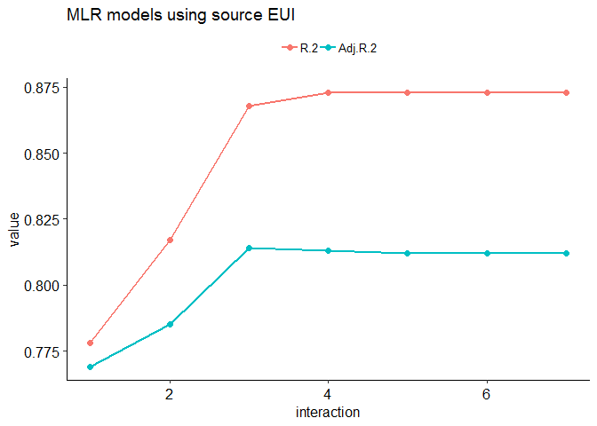
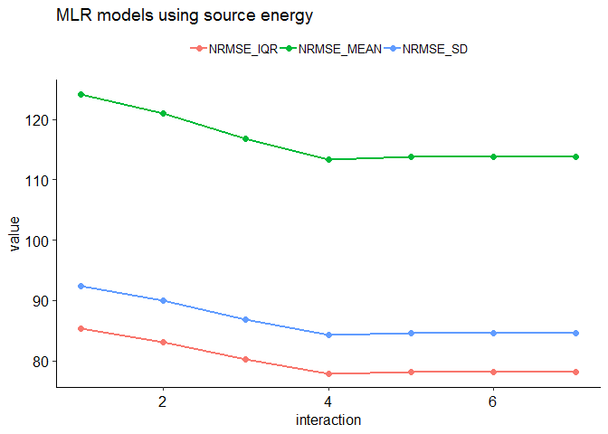

Benchmarking Retail stores and Supermarkets
================
Pandarasamy Arjunan
3 June 2019

-   [Load dataset](#load-dataset)
-   [Apply filters](#apply-filters)
-   [Prepare features](#prepare-features)
-   [Descriptive statistics](#descriptive-statistics)
    -   [Data Frame Summary](#data-frame-summary)
-   [Build predictive models](#build-predictive-models)
    -   [Multiple Linear Regression (MLR)](#multiple-linear-regression-mlr)
    -   [Multiple Linear Regression (MLR) with Interaction terms](#multiple-linear-regression-mlr-with-interaction-terms)
    -   [Comparision of MLR models](#comparision-of-mlr-models)

Load dataset
------------

``` r
building_type = "retail"

filtered_dir = './data/cbecs/filtered/'
dir.create(filtered_dir, recursive = T, showWarnings = F)

features_dir = './data/cbecs/features/'
dir.create(features_dir, recursive = T, showWarnings = F)

results_dir = './results/cbecs/'
dir.create(results_dir, recursive = T, showWarnings = F)
```

``` r
cbecs = read.csv("data/cbecs/2012_public_use_data_aug2016.csv")

## list of building attributes relevant to office buildings 
var1 = c( 'SQFT', 'NFLOOR', 'NELVTR', 'NESLTR', 'COURT',
          'MONUSE', 'WKHRS', 'NWKER', 'COOK', 'HEATP',
          'COOLP', 'SNACK', 'FASTFD', 'CAF', 'FDPREP',
          'KITCHN', 'BREAKRM', 'OTFDRM', 'RFGSTO', 'RFGWIN',
          'RFGOPN', 'RFGCLN', 'RFGVNN', 'RFGICN', 'RFGSTP',
          'PCTERMN', 'LAPTPN', 'PRNTRN',  'SERVERN',
          'TVVIDEON', 'RGSTRN', 'COPIERN',  'HDD65', 'CDD65',
          'RFGRES')

var2 = c( "PBAPLUS", "PBA", "FINALWT",
          "MFBTU", 
          "ELBTU", "NGBTU", "FKBTU", "DHBTU",
          "ONEACT", "ACT1", "ACT2", "ACT3", "ACT1PCT", "ACT2PCT", "ACT3PCT",
          "PRAMTC", "PRUNIT",
          "CWUSED", "WOUSED", "COUSED", "SOUSED", "PRUSED")

var3 = c( "RFGRSN", "RFGCOMPN", "RFGWIN", "RFGOPN", "RFGCLN", "RFGVNN")

# imputed data details
var4 = c("ZWKHRS", "ZNWKER", "ZRFGWIN", "ZCOOLP", "ZHEATP")

# heat details
var5 = c("HEATP", "FURNP", "PKGHP", "BOILP", "STHWP", "HTPHP", "SLFCNP", "OTHTP")

retail = cbecs[, c(var1, var2, var3, var4, var5)]
```

Apply filters
-------------

As per Energy Star's technical document [ENERGY STAR Score for Retail Stores and Supermarkets](https://www.energystar.gov/buildings/tools-and-resources/energy-star-score-retail-stores), following filters are applied to define the peer group and to remove any outliers.

After applying each filter, the number of remaining buildings in the dataset (*Number Remaining: X*) and any difference (*Difference: X*) in count from the original Energy Star's technical documentation is also given.

1.  **Calculate source energy and source EUI**

    ``` r
    ## convert electricity, natural gas, fuel oil, and district heat to source energy
    r0 = retail %>% 
      mutate(ELBTU0 = ELBTU*2.80) %>%
      mutate(NGBTU0 = NGBTU*1.05) %>%
      mutate(FKBTU0 = FKBTU*1.01) %>%
      mutate(DHBTU0 = DHBTU*1.20) %>%
      mutate(SOURCE_ENERGY = rowSums(dplyr::select(., c(ELBTU0,NGBTU0,FKBTU0,DHBTU0)), na.rm = T)) %>% 
      mutate(SOURCE_EUI = round(SOURCE_ENERGY/SQFT, 2)) %>%
      mutate(SITE_EUI = round(MFBTU/SQFT, 2)) %>%
      mutate(NGBTU_PERCENT = round(NGBTU / SOURCE_ENERGY * 100, 2)) %>% 
      mutate(SUMBTU = rowSums(dplyr::select(., c(ELBTU,NGBTU,FKBTU,DHBTU)), na.rm = T))

    #Is MFBTU the sum of ELBTU,NGBTU,FKBTU,DHBTU? YES.
    #summary(o14$MFBTU - o14$SUMBTU)
    ```

2.  **PBAPLUS= 14 or 42** <br/>Building Filter – CBECS defines building types according to the variable “PBAPLUS.” Retail Stores are coded as PBAPLUS = 42 and Supermarkets are coded as PBAPLUS = 14. <br/>Number Remaining: 342. <br/>Difference: 0.

    ``` r
    r1 = r0 %>% filter(PBAPLUS %in% c(14, 42))
    ```

3.  **Must operate for at least 30 hours per week** <br/>EPA Program Filter – Baseline condition for being a full time retail store or supermarket. <br/>Number Remaining: 335. <br/>Difference: 0.

    ``` r
    r2 = r1 %>% filter(WKHRS >= 30)
    ```

4.  **Must have at least 1 worker** <br/>EPA Program Filter – Baseline condition for being a full time retail store or supermarket. <br/>Number Remaining: 335. <br/>Difference: 0.

    ``` r
    r3 = r2 %>% filter(NWKER >= 1)
    ```

5.  **Must have at least 1 computer or cash register** <br/>EPA Program Filter – Baseline condition for being a full time retail store or supermarket. <br/>Number Remaining: 323. <br/>Difference: 0.

    ``` r
    r4 = r3 %>% filter(PCTERMN >= 1 | RGSTRN >=1)
    ```

6.  **If building is a supermarket, must have refrigeration equipment** <br/>EPA Program Filter – Baseline condition for being a full time supermarket. <br/>Number Remaining: 323. <br/>Difference: 0.

    ``` r
    r5 = r4 %>% 
      filter( PBAPLUS != "03" | RFGRES == 1)
    ```

7.  **Must operate for at least 10 months per year** <br/>EPA Program Filter – Baseline condition for being a full time retail store. <br/>Number Remaining: 311. <br/>Difference: 0.

    ``` r
    r6 = r5 %>% filter(MONUSE >= 10)
    ```

8.  **A single activity must characterize more than 50% of the floor space** <br/>EPA Program Filter – In order to be considered part of the retail store and supermarket peer group, more than 50% of the building must be defined as a retail store or supermarket. <br/>If the variable ONEACT=1, this indicates that one activity occupies 75% or more of the building. If the variable ONEACT=2, then the building can specify up to 3 activities (ACT1, ACT2, ACT3). One of these activities must be Food Sales or Service (PBAX=14) or Retail (Other Than Mall) (PBAX=16), with a corresponding percent (ACT1PCT, ACT2PCT, ACT3PCT) that is greater than 50. <br/>Number Remaining: 306. <br/>Difference: +5.

    ``` r
    r7 = r6 %>% 
      filter( (ONEACT == 1) |
            (ONEACT == 2 & 
               ((ACT1 %in% c(14,16) & ACT1PCT > 50) | 
                  (ACT2 %in% c(14,16) & ACT2PCT > 50) | 
                  (ACT3 %in% c(14,16) & ACT3PCT > 50) )))
    ```

9.  **Must be less than or equal to 1,000,000 square feet** <br/>Data Limitation Filter – CBECS masks surveyed properties above 1,000,000 square feet by applying regional averages. <br/>Number Remaining: 306. <br/>Difference: +5.

    ``` r
    r8 = r7 %>% filter(SQFT <= 1000000)
    ```

10. **If propane is used, the amount category (PRAMTC) must equal 1, 2, or 3** <br/>Data Limitation Filter – Cannot estimate propane use if the quantity is “greater than 1000” or unknown. <br/>Number Remaining: 294. <br/>Difference: +5.

    ``` r
    r9 = r8 %>% filter(is.na(PRAMTC) | PRAMTC %in% c(1,2,3))
    ```

11. **If propane is used, the unit (PRUNIT) must be known** <br/>Data Limitation Filter – Cannot estimate propane use if the unit is unknown. <br/>Number Remaining: 292. <br/>Difference: +5.

    ``` r
    r10 = r9 %>% filter(is.na(PRUNIT) | PRUNIT %in% c(1,2))
    ```

12. **If propane is used, the maximum estimated propane amount must be 10% or less of the total source energy** <br/>Data Limitation Filter – Because propane values are estimated from a range, propane is restricted to 10% of the total source energy. <br/>Number Remaining: 289. <br/>Difference: +7.

    ``` r
    r11 = r10 %>% 
      filter( PRUSED == 2 | is.na(NGBTU_PERCENT) == T | 
                (PRUSED == 1 & NGBTU_PERCENT <= 10))
    ```

13. **must not use chilled water, wood, coal, or solar** <br/>Data Limitation Filter – CBECS does not collect quantities of chilled water, wood, coal, or solar. <br/>Number Remaining: 282. <br/>Difference: +8.

    ``` r
    r12 = r11 %>% 
      filter(CWUSED == 2) %>%
      filter(WOUSED == 2) %>% 
      filter(COUSED == 2) %>% 
      filter(SOUSED == 2)
    ```

14. **Must be at least 5,000 square feet** <br/>Analytical Limitation – Analysis could not model behavior for buildings smaller than 5,000 ft2. <br/>Number Remaining: 201. <br/>Difference: +5.

    ``` r
    r13 = r12 %>% filter(SQFT >= 5000)
    ```

15. **Must have fewer than 3 open or closed refrigeration/freezer cases per 1,000 square feet** <br/>Analytical Filter – Values determined to be statistical outliers. <br/>Number Remaining: 201. <br/>Difference: +6.

    ``` r
    r14 = r13 %>% filter( (is.na(RFGOPN) | (RFGOPN/SQFT * 1000 < 3)) | 
                          (is.na(RFGCLN) | (RFGCLN/SQFT * 1000 < 3)))
    ```

16. **Must have fewer than 0.7 walk-in refrigeration/freezer cases per 1,000 square feet** <br/>Analytical Filter – Values determined to be statistical outliers. <br/>Number Remaining: 201. <br/>Difference: +6.

    ``` r
    r15 = r14 %>% filter(is.na(RFGWIN) | (RFGWIN / SQFT * 1000 <= 0.7)) 
    ```

17. **Must have Source EUI greater than or equal to 20 kBtu/ft2** <br/>Analytical Filter – Values determined to be statistical outliers. <br/>Number Remaining: 196. <br/>Difference: +4.

    ``` r
    r16 = r15 %>% filter( SOURCE_EUI >= 20)
    ```

18. **If CDD is greater than 3,000, must be at least 60% cooled** <br/>Analytical Filter – Values determined to be statistical outliers. <br/>Number Remaining: 193. <br/>Difference: +4.

    ``` r
    r17 = r16 %>% filter( CDD65 <= 3000 | COOLP >= 60) 
    ```

**Save the filtered dataset**

``` r
write.csv(r17, paste0(filtered_dir, building_type, ".csv"), row.names = F)
```

Prepare features
----------------

The final regression equation includes the following variables: 

-   Weekly Operating Hours
-   Number of Workers per 1,000 Square Feet
-   Number of Commercial Refrigeration/Freezer Units per 1,000 Square Feet
-   Natural log of Heating Degree Days times Percent of the Building that is Heated
-   Natural log of Cooling Degree Days times Percent of the Building that is Cooled
-   Yes/No variable indicating whether the Building is a Supermarket (1 = yes, 0 = no)
-   Adjustment for the Number of Workers per 1,000 Square Feet for a Supermarket

``` r
retail = read.csv(paste0(filtered_dir, building_type, ".csv"))

data = retail %>%
  dplyr::mutate(NWKER_SQFT = NWKER/SQFT * 1000) %>%
  dplyr::mutate(RFG_TOT = rowSums(dplyr::select(., c(RFGRSN,RFGCOMPN,RFGWIN,RFGOPN,RFGCLN,RFGVNN)), na.rm = T)) %>% 
  dplyr::mutate(RFG_SQFT = RFG_TOT/SQFT * 1000) %>%
  dplyr::mutate(CDD65_COOLP = log(CDD65) * COOLP / 100) %>%
  dplyr::mutate(HDD65_HEATP = log(HDD65) * HEATP / 100) %>%
  dplyr::mutate(IsSuperMarket = ifelse(PBAPLUS == 14, "Yes", "No")) %>%
  dplyr::mutate(AdjNWKER_SQFTsuperMarket = ifelse(PBAPLUS == 14, 1, 0)) %>%
  dplyr::mutate(AdjNWKER_SQFTsuperMarket = AdjNWKER_SQFTsuperMarket * NWKER_SQFT) %>%
  dplyr::mutate_if(is.numeric, round, 3)

#TODO: Adjustment for the Number of Workers per 1,000 Square Feet for a Supermarket

ivars = c(
  #"SQFT",
  "WKHRS", "NWKER_SQFT", "RFG_SQFT", 
          "HDD65_HEATP", "CDD65_COOLP", 
          "IsSuperMarket", "AdjNWKER_SQFTsuperMarket")

dvars  = c("SOURCE_EUI", "SOURCE_ENERGY", "FINALWT")

features = data[, c(ivars, dvars)]
features = features %>% na.omit()

write.csv(features, 
          paste0(features_dir, building_type, ".csv"), 
          row.names = F)
```

Descriptive statistics
----------------------

``` r
features1 = features
features1 = features1 %>% dplyr::select(-one_of('SOURCE_ENERGY', 'FINALWT'))

summarytools::descr(features1, stats = "common", 
                    transpose = TRUE, 
                    headings = FALSE)
```

    Non-numerical variable(s) ignored: IsSuperMarket

|                               |    Mean|  Std.Dev|    Min|  Median|     Max|  N.Valid|  Pct.Valid|
|------------------------------:|-------:|--------:|------:|-------:|-------:|--------:|----------:|
|  **AdjNWKER\_SQFTsuperMarket**|    0.13|     0.37|   0.00|    0.00|    2.09|   176.00|     100.00|
|               **CDD65\_COOLP**|    6.10|     1.72|   0.07|    6.76|    8.63|   176.00|     100.00|
|               **HDD65\_HEATP**|    7.56|     1.43|   1.80|    8.14|    9.03|   176.00|     100.00|
|                **NWKER\_SQFT**|    0.81|     0.64|   0.07|    0.64|    4.12|   176.00|     100.00|
|                  **RFG\_SQFT**|    0.41|     0.61|   0.00|    0.19|    3.47|   176.00|     100.00|
|                **SOURCE\_EUI**|  213.48|   151.58|  22.89|  168.29|  731.36|   176.00|     100.00|
|                      **WKHRS**|   89.50|    36.53|  35.00|   83.50|  168.00|   176.00|     100.00|

``` r
dfSummary(features1, plain.ascii = FALSE, style = "grid", 
          graph.magnif = 0.75, valid.col = FALSE)
```

    text graphs are displayed; set 'tmp.img.dir' parameter to activate png graphs

### Data Frame Summary

**features1**
**Dimensions:** 176 x 8
**Duplicates:** 0

<table>
<colgroup>
<col width="3%" />
<col width="22%" />
<col width="22%" />
<col width="17%" />
<col width="25%" />
<col width="7%" />
</colgroup>
<thead>
<tr class="header">
<th>No</th>
<th>Variable</th>
<th>Stats / Values</th>
<th>Freqs (% of Valid)</th>
<th>Graph</th>
<th>Missing</th>
</tr>
</thead>
<tbody>
<tr class="odd">
<td><p>1</p></td>
<td><p>WKHRS<br />
[numeric]</p></td>
<td><p>Mean (sd) : 89.5 (36.5)<br />
min &lt; med &lt; max:<br />
35 &lt; 83.5 &lt; 168<br />
IQR (CV) : 45 (0.4)</p></td>
<td><p>54 distinct values</p></td>
<td><p><br />
  :<br />
  : . :<br />
  : : : .<br />
  : : : :     :<br />
. : : : : :   :</p></td>
<td><p>0<br />
(0%)</p></td>
</tr>
<tr class="even">
<td><p>2</p></td>
<td><p>NWKER_SQFT<br />
[numeric]</p></td>
<td><p>Mean (sd) : 0.8 (0.6)<br />
min &lt; med &lt; max:<br />
0.1 &lt; 0.6 &lt; 4.1<br />
IQR (CV) : 0.6 (0.8)</p></td>
<td><p>129 distinct values</p></td>
<td><p><br />
  :<br />
: :<br />
: :<br />
: : .<br />
: : : . .</p></td>
<td><p>0<br />
(0%)</p></td>
</tr>
<tr class="odd">
<td><p>3</p></td>
<td><p>RFG_SQFT<br />
[numeric]</p></td>
<td><p>Mean (sd) : 0.4 (0.6)<br />
min &lt; med &lt; max:<br />
0 &lt; 0.2 &lt; 3.5<br />
IQR (CV) : 0.4 (1.5)</p></td>
<td><p>128 distinct values</p></td>
<td><p><br />
:<br />
:<br />
:<br />
:<br />
: . .</p></td>
<td><p>0<br />
(0%)</p></td>
</tr>
<tr class="even">
<td><p>4</p></td>
<td><p>HDD65_HEATP<br />
[numeric]</p></td>
<td><p>Mean (sd) : 7.6 (1.4)<br />
min &lt; med &lt; max:<br />
1.8 &lt; 8.1 &lt; 9<br />
IQR (CV) : 1.5 (0.2)</p></td>
<td><p>170 distinct values</p></td>
<td><p><br />
              :<br />
              :<br />
              :<br />
            : :<br />
      . . : : :</p></td>
<td><p>0<br />
(0%)</p></td>
</tr>
<tr class="odd">
<td><p>5</p></td>
<td><p>CDD65_COOLP<br />
[numeric]</p></td>
<td><p>Mean (sd) : 6.1 (1.7)<br />
min &lt; med &lt; max:<br />
0.1 &lt; 6.8 &lt; 8.6<br />
IQR (CV) : 2.1 (0.3)</p></td>
<td><p>173 distinct values</p></td>
<td><p><br />
            . :<br />
            : :<br />
          . : :<br />
          : : :<br />
  . . : : : : : :</p></td>
<td><p>0<br />
(0%)</p></td>
</tr>
<tr class="even">
<td><p>6</p></td>
<td><p>IsSuperMarket<br />
[character]</p></td>
<td><p>1. No<br />
2. Yes</p></td>
<td><p>150 (85.2%)<br />
26 (14.8%)</p></td>
<td><p>IIIIIIIIIIIIIIIII<br />
II</p></td>
<td><p>0<br />
(0%)</p></td>
</tr>
<tr class="odd">
<td><p>7</p></td>
<td><p>AdjNWKER_SQFTsuperMarket<br />
[numeric]</p></td>
<td><p>Mean (sd) : 0.1 (0.4)<br />
min &lt; med &lt; max:<br />
0 &lt; 0 &lt; 2.1<br />
IQR (CV) : 0 (2.8)</p></td>
<td><p>25 distinct values</p></td>
<td><p><br />
:<br />
:<br />
:<br />
:<br />
:     .</p></td>
<td><p>0<br />
(0%)</p></td>
</tr>
<tr class="even">
<td><p>8</p></td>
<td><p>SOURCE_EUI<br />
[numeric]</p></td>
<td><p>Mean (sd) : 213.5 (151.6)<br />
min &lt; med &lt; max:<br />
22.9 &lt; 168.3 &lt; 731.4<br />
IQR (CV) : 155.7 (0.7)</p></td>
<td><p>176 distinct values</p></td>
<td><p><br />
  :<br />
  :<br />
: : .<br />
: : : .<br />
: : : : . :</p></td>
<td><p>0<br />
(0%)</p></td>
</tr>
</tbody>
</table>

**Extract R code from Rmd document**

``` r
#knitr::purl("retail.Rmd", output = "retail.R", documentation = 2)
```

Build predictive models
-----------------------

``` r
source("models.R")
source("metrics.R")

data = read.csv(paste0(features_dir, building_type, ".csv"))

cat(colnames(data))
```

WKHRS NWKER\_SQFT RFG\_SQFT HDD65\_HEATP CDD65\_COOLP IsSuperMarket AdjNWKER\_SQFTsuperMarket SOURCE\_EUI SOURCE\_ENERGY FINALWT

``` r
allMetrics = NULL
```

### Multiple Linear Regression (MLR)

#### Using SOURCE\_EUI as dependent variable

``` r
y = "SOURCE_EUI"
w = "FINALWT"
o = c("SOURCE_ENERGY", "SQFT")
x = setdiff(colnames(data), c(y, w, o))
wt = data[, w]
intr = 1

mlrFit = MLR(data, x, y, w, interaction = intr)

obs  = data[, y]
pred = as.numeric(predict(mlrFit))

mlrMetrics1 = getMLRmetrics(mlrFit, obs, pred, wt)
mlrMetrics1 = data.frame(
  "model" = "MLR",
  "dependent" = y,
  "interaction" = intr,
  "transform" = "meanCent",
  mlrMetrics1)

allMetrics = rbind(allMetrics, mlrMetrics1)

knitr::kable(mlrMetrics1, row.names = F)
```

| model | dependent   |  interaction| transform |  obs|  rank|  coef|    R.2|  Adj.R.2|       mse|    rmse|     mae|   mape|  nrmse\_iqr|  nrmse\_range|  nrmse\_mean|  nrmse\_sd|
|:------|:------------|------------:|:----------|----:|-----:|-----:|------:|--------:|---------:|-------:|-------:|------:|-----------:|-------------:|------------:|----------:|
| MLR   | SOURCE\_EUI |            1| meanCent  |  176|     8|     8|  0.778|    0.769|  6750.372|  82.161|  58.659|  0.389|      52.784|        11.597|       38.486|     54.204|

#### Using SOURCE\_ENERGY as dependent variable\*\*

``` r
y = "SOURCE_ENERGY"
w = "FINALWT"
o = c("SOURCE_EUI")
x = setdiff(colnames(data), c(y, w, o))
wt = data[, w]
intr = 1

mlrFit = MLR(data, x, y, w, interaction = intr)

obs  = data[, y]
pred = as.numeric(predict(mlrFit))

mlrMetrics2 = getMLRmetrics(mlrFit, obs, pred, wt)
mlrMetrics2 = data.frame(
  "model" = "MLR",
  "dependent" = y,
  "interaction" = intr,
  "transform" = "meanCent",
  mlrMetrics2)
allMetrics = rbind(allMetrics, mlrMetrics2)
knitr::kable(allMetrics, row.names = F)
```

| model | dependent      |  interaction| transform |  obs|  rank|  coef|    R.2|  Adj.R.2|           mse|          rmse|           mae|   mape|  nrmse\_iqr|  nrmse\_range|  nrmse\_mean|  nrmse\_sd|
|:------|:---------------|------------:|:----------|----:|-----:|-----:|------:|--------:|-------------:|-------------:|-------------:|------:|-----------:|-------------:|------------:|----------:|
| MLR   | SOURCE\_EUI    |            1| meanCent  |  176|     8|     8|  0.778|    0.769|  6.750372e+03|        82.161|        58.659|  0.389|      52.784|        11.597|       38.486|     54.204|
| MLR   | SOURCE\_ENERGY |            1| meanCent  |  176|     8|     8|  0.366|    0.339|  3.472188e+14|  18633807.418|  10190980.614|  1.493|      85.316|        15.677|      124.190|     92.339|

### Multiple Linear Regression (MLR) with Interaction terms

#### Using SOURCE\_EUI as dependent variable

``` r
y = "SOURCE_EUI"
w = "FINALWT"
o = c("SOURCE_ENERGY", "SQFT")
x = setdiff(colnames(data), c(y, w, o))
wt = data[, w]

intr_depth = length(x)

for (intr in 2:intr_depth) {
  
  mlrFit = MLR(data, x, y, w, interaction = intr)
  obs  = data[, y]
  pred = as.numeric(predict(mlrFit))
  
  mlrMetrics = getMLRmetrics(mlrFit, obs, pred, wt)
  mlrMetrics = data.frame(
    "model" = paste0("MLRi", intr),
    "dependent" = y,
    "interaction" = intr,
    "transform" = "meanCent",
    mlrMetrics)
  
  allMetrics = rbind(allMetrics, mlrMetrics)
}

allMetrics0 = allMetrics %>% filter(dependent == y)
knitr::kable(allMetrics0, row.names = F)
```

| model | dependent   |  interaction| transform |  obs|  rank|  coef|    R.2|  Adj.R.2|       mse|    rmse|     mae|   mape|  nrmse\_iqr|  nrmse\_range|  nrmse\_mean|  nrmse\_sd|
|:------|:------------|------------:|:----------|----:|-----:|-----:|------:|--------:|---------:|-------:|-------:|------:|-----------:|-------------:|------------:|----------:|
| MLR   | SOURCE\_EUI |            1| meanCent  |  176|     8|     8|  0.778|    0.769|  6750.372|  82.161|  58.659|  0.389|      52.784|        11.597|       38.486|     54.204|
| MLRi2 | SOURCE\_EUI |            2| meanCent  |  176|    27|    29|  0.817|    0.785|  6112.915|  78.185|  56.112|  0.384|      50.230|        11.036|       36.623|     51.581|
| MLRi3 | SOURCE\_EUI |            3| meanCent  |  176|    52|    64|  0.868|    0.814|  3913.240|  62.556|  41.046|  0.333|      40.189|         8.830|       29.302|     41.270|
| MLRi4 | SOURCE\_EUI |            4| meanCent  |  176|    57|    99|  0.873|    0.813|  4120.035|  64.188|  41.834|  0.338|      41.237|         9.060|       30.067|     42.347|
| MLRi5 | SOURCE\_EUI |            5| meanCent  |  176|    58|   120|  0.873|    0.812|  4105.324|  64.073|  41.632|  0.336|      41.163|         9.044|       30.013|     42.271|
| MLRi6 | SOURCE\_EUI |            6| meanCent  |  176|    58|   127|  0.873|    0.812|  4105.324|  64.073|  41.632|  0.336|      41.163|         9.044|       30.013|     42.271|
| MLRi7 | SOURCE\_EUI |            7| meanCent  |  176|    58|   128|  0.873|    0.812|  4105.324|  64.073|  41.632|  0.336|      41.163|         9.044|       30.013|     42.271|

#### Using SOURCE\_ENERGY as dependent variable\*\*

``` r
y = "SOURCE_ENERGY"
w = "FINALWT"
o = c("SOURCE_EUI")
x = setdiff(colnames(data), c(y, w, o))
wt = data[, w]
intr_depth = length(x)

for (intr in 2:intr_depth) {
  
  mlrFit = MLR(data, x, y, w, interaction = intr)
  obs  = data[, y]
  pred = as.numeric(predict(mlrFit))
  
  mlrMetrics = getMLRmetrics(mlrFit, obs, pred, wt)
  mlrMetrics = data.frame(
    "model" = paste0("MLRi", intr),
    "dependent" = y,
    "interaction" = intr,
    "transform" = "meanCent",
    mlrMetrics)
  
  allMetrics = rbind(allMetrics, mlrMetrics)
}

write.csv(allMetrics, 
          paste0(results_dir, building_type, ".csv"), 
          row.names = F)

allMetrics0 = allMetrics %>% filter(dependent == y)
knitr::kable(allMetrics0, row.names = F)
```

| model | dependent      |  interaction| transform |  obs|  rank|  coef|    R.2|  Adj.R.2|           mse|      rmse|       mae|   mape|  nrmse\_iqr|  nrmse\_range|  nrmse\_mean|  nrmse\_sd|
|:------|:---------------|------------:|:----------|----:|-----:|-----:|------:|--------:|-------------:|---------:|---------:|------:|-----------:|-------------:|------------:|----------:|
| MLR   | SOURCE\_ENERGY |            1| meanCent  |  176|     8|     8|  0.366|    0.339|  3.472188e+14|  18633807|  10190981|  1.493|      85.316|        15.677|      124.190|     92.339|
| MLRi2 | SOURCE\_ENERGY |            2| meanCent  |  176|    27|    29|  0.518|    0.434|  3.298412e+14|  18161530|   9479326|  1.294|      83.153|        15.279|      121.043|     89.998|
| MLRi3 | SOURCE\_ENERGY |            3| meanCent  |  176|    52|    64|  0.598|    0.432|  3.070415e+14|  17522600|   8375169|  1.454|      80.228|        14.742|      116.784|     86.832|
| MLRi4 | SOURCE\_ENERGY |            4| meanCent  |  176|    57|    99|  0.620|    0.441|  2.891866e+14|  17005488|   8200215|  1.413|      77.860|        14.307|      113.338|     84.270|
| MLRi5 | SOURCE\_ENERGY |            5| meanCent  |  176|    58|   120|  0.621|    0.438|  2.917769e+14|  17081478|   8190605|  1.402|      78.208|        14.371|      113.844|     84.646|
| MLRi6 | SOURCE\_ENERGY |            6| meanCent  |  176|    58|   127|  0.621|    0.438|  2.917769e+14|  17081478|   8190605|  1.402|      78.208|        14.371|      113.844|     84.646|
| MLRi7 | SOURCE\_ENERGY |            7| meanCent  |  176|    58|   128|  0.621|    0.438|  2.917769e+14|  17081478|   8190605|  1.402|      78.208|        14.371|      113.844|     84.646|

### Comparision of MLR models

#### MLR plots using Source EUI

``` r
mytheme = theme(legend.title = element_blank(),
           legend.text=element_text(size=12),
           axis.text=element_text(size=12),
           text=element_text(size=12))

plotR2 <- function(df, titl) {
  
  df1 = melt(df, measure.vars = c("R.2", "Adj.R.2"))
  
  plot <- ggplot(df1, aes(x = interaction, y=value, 
                          group=variable, col=variable)) + 
  geom_point(size=2) + geom_line(size=1) +
    ggtitle(titl) + 
    theme_pubr(base_size=12) +
    theme(legend.position="top", legend.title = element_blank())
  
  return(plot)
}

plotNRMSE <- function(df, titl) {
  
  df1 = melt(df, measure.vars = c("nrmse_iqr", "nrmse_mean", 
                                        "nrmse_sd"))
  df1$variable = toupper(df1$variable)
  
  plot <- ggplot(df1, aes(x = interaction, y=value, 
                          group=variable, col=variable)) + 
  geom_point(size=2) + geom_line(size=1) +
    ggtitle(titl) + 
    theme_pubr(base_size=12) +
    theme(legend.position="top", legend.title = element_blank())
    
  
  return(plot)
}  
```

``` r
allMetrics0 = allMetrics %>%
  filter(stringr::str_detect(model, "MLR")) %>%
  filter(dependent == "SOURCE_EUI")

plot1 = plotR2(allMetrics0, "MLR models using source EUI")
plot2 = plotNRMSE(allMetrics0, "MLR models using source EUI")

print(plot1)
```



``` r
print(plot2)
```


#### MLR plots using Source Energy

``` r
allMetrics0 = allMetrics %>%
  filter(stringr::str_detect(model, "MLR")) %>%
  filter(dependent == "SOURCE_ENERGY")

plot1 = plotR2(allMetrics0, "MLR models using source energy")
plot2 = plotNRMSE(allMetrics0, "MLR models using source energy")

print(plot1)
```


``` r
print(plot2)
```


