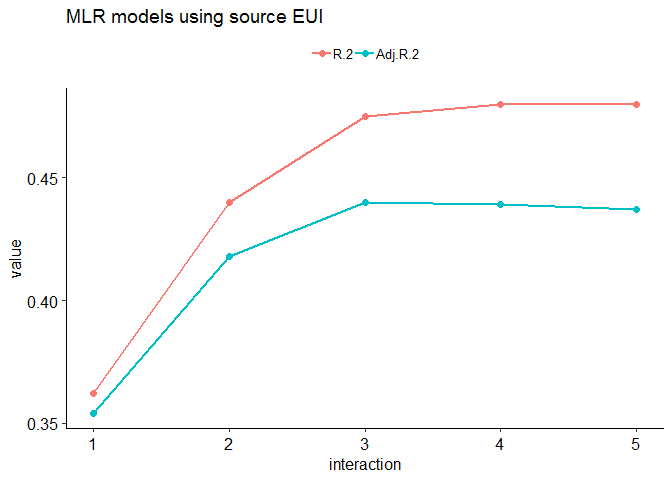
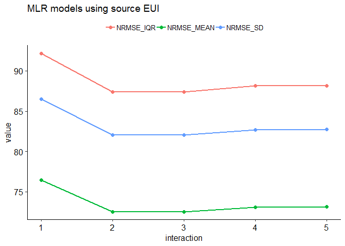
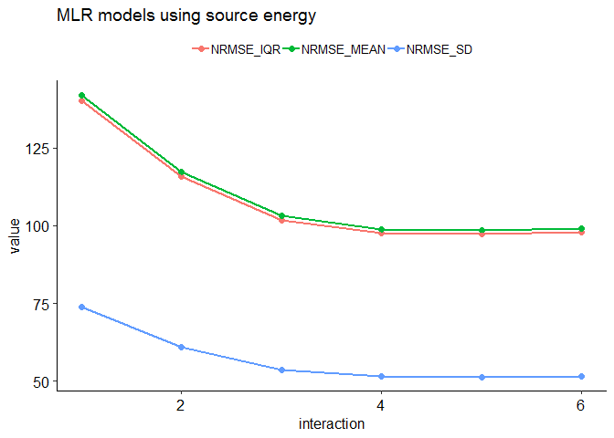

Benchmarking Warehouses
================
Pandarasamy Arjunan
3 June 2019

-   [Load dataset](#load-dataset)
-   [Apply filters](#apply-filters)
-   [Prepare features](#prepare-features)
-   [Descriptive statistics](#descriptive-statistics)
    -   [Data Frame Summary](#data-frame-summary)
-   [Build predictive models](#build-predictive-models)
    -   [Multiple Linear Regression (MLR)](#multiple-linear-regression-mlr)
    -   [Multiple Linear Regression (MLR) with Interaction terms](#multiple-linear-regression-mlr-with-interaction-terms)
    -   [Comparision of MLR models](#comparision-of-mlr-models)

Load dataset
------------

``` r
building_type = "warehouse"

filtered_dir = './data/cbecs/filtered/'
dir.create(filtered_dir, recursive = T, showWarnings = F)

features_dir = './data/cbecs/features/'
dir.create(features_dir, recursive = T, showWarnings = F)

results_dir = './results/cbecs/'
dir.create(results_dir, recursive = T, showWarnings = F)
```

``` r
cbecs = read.csv("data/cbecs/2012_public_use_data_aug2016.csv")

var1 = c( 'SQFT', 'NFLOOR', 'NELVTR', 'NESLTR', 'COURT', 
          'MONUSE', 'OPNWE',  'WKHRS', 'NWKER', 'COOK', 
          'MANU', 'HEATP',  'COOLP',  'SNACK', 'FASTFD', 'CAF',
          'FDPREP', 'KITCHN', 'BREAKRM', 'OTFDRM', 'LABEQP', 'MCHEQP',
          'POOL', 'HTPOOL', 'RFGWIN', 'RFGOPN', 'RFGCLN', 'RFGVNN',
          'RFGICN', 'PCTERMN', 'LAPTPN', 'PRNTRN', 'SERVERN', 'TVVIDEON',
          'RGSTRN', 'COPIERN', 'HDD65','CDD65')

var2 = c( "PBAPLUS", "PBA", "FINALWT",
          "MFBTU", 
          "ELBTU", "NGBTU", "FKBTU", "DHBTU",
          "ONEACT", "ACT1", "ACT2", "ACT3", "ACT1PCT", "ACT2PCT", "ACT3PCT",
          "PRAMTC", "PRUNIT",
          "CWUSED", "WOUSED", "COUSED", "SOUSED", "PRUSED",
          "RFGSTP")

warehouses = cbecs[, c(var1, var2)]
```

Apply filters
-------------

As per Energy Star's technical document [ENERGY STAR Score for Warehouses](https://www.energystar.gov/buildings/tools-and-resources/energy-star-score-warehouses), following filters are applied to define the peer group and to remove any outliers.

After applying each filter, the number of remaining buildings in the dataset (*Number Remaining: X*) and any difference (*Difference: X*) in count from the original Energy Star's technical documentation is also given.

1.  **Calculate source energy and source EUI**

    ``` r
    ## convert electricity, natural gas, fuel oil, and district heat to source energy
    w0 = warehouses %>% 
      mutate(ELBTU0 = ELBTU*2.80) %>%
      mutate(NGBTU0 = NGBTU*1.05) %>%
      mutate(FKBTU0 = FKBTU*1.01) %>%
      mutate(DHBTU0 = DHBTU*1.20) %>%
      mutate(SOURCE_ENERGY = rowSums(dplyr::select(., c(ELBTU0,NGBTU0,FKBTU0,DHBTU0)), na.rm = T)) %>% 
      mutate(SOURCE_EUI = round(SOURCE_ENERGY/SQFT, 2)) %>%
      mutate(SITE_EUI = round(MFBTU/SQFT, 2)) %>%
      mutate(NGBTU_PERCENT = round(NGBTU / SOURCE_ENERGY * 100, 2)) %>% 
      mutate(SUMBTU = rowSums(dplyr::select(., c(ELBTU,NGBTU,FKBTU,DHBTU)), na.rm = T))

    #Is MFBTU the sum of ELBTU,NGBTU,FKBTU,DHBTU? YES.
    #summary(o14$MFBTU - o14$SUMBTU)
    ```

2.  **PBAPLUS = 9, 10, or 20** Building Type Filter – CBECS defines building types according to the variable “PBAPLUS.” Distribution/Shipping Centers are coded as PBAPLUS=9; Non-Refrigerated Warehouses are coded as PBAPLUS=10; and Refrigerated Warehouses are coded as PBAPLUS=20. <br/>Number Remaining: 678. <br/>Difference: 0.

    ``` r
    w1 = w0 %>% filter(PBAPLUS %in% c(9, 10, 20))
    ```

3.  **Must operate for at least 30 hours per week** <br/>EPA Program Filter – Baseline condition for being a full time warehouse. <br/>Number Remaining: 621. <br/>Difference: 0.

    ``` r
    w2 = w1 %>% filter(WKHRS >= 30)
    ```

4.  **Must have at least 1 worker** <br/>EPA Program Filter – Baseline condition for being a full time warehouse <br/>Number Remaining: 597. <br/>Difference: 0.

    ``` r
    w3 = w2 %>% filter(NWKER >= 1)
    ```

5.  **Must operate for at least 10 months per year** <br/>EPA Program Filter – Baseline condition for being a full time warehouse. <br/>Number Remaining: 580. <br/>Difference: 0.

    ``` r
    w4 = w3 %>% filter(MONUSE >= 10)
    ```

6.  **A single activity must characterize greater than 50% of the floor space** <br/>EPA Program Filter – In order to be considered part of the warehouse peer group, more than 50% of the building must be defined as distribution/shipping center, non-refrigerated warehouse, or refrigerated warehouse. <br/>Number Remaining: 568. <br/>Difference: +25

    ``` r
    w5 = w4 %>% 
      filter( (ONEACT == 1) |
                (ONEACT == 2 & 
                   ((ACT1 %in% c(13) & ACT1PCT > 50) | 
                    (ACT2 %in% c(13) & ACT2PCT > 50) | 
                    (ACT3 %in% c(13) & ACT3PCT > 50) )))

    # test code to verify the above filter
    # w51 = w4 %>% filter(ONEACT == 1)
    # w5a = w4 %>% filter(ONEACT == 2 & ACT1 == 13 & ACT1PCT > 50)
    # w5b = w4 %>% filter(ONEACT == 2 & ACT2 == 13 & ACT2PCT > 50)
    # w5c = w4 %>% filter(ONEACT == 2 & ACT3 == 13 & ACT3PCT > 50)
    # #select(c(ONEACT, ACT1, ACT2, ACT3, ACT1PCT, ACT2PCT, ACT3PCT)) %>% 
    # print(nrow(w51) + nrow(w5a) + nrow(w5b) + nrow(w5c))
    ```

7.  **Must report energy usage** <br/>EPA Program Filter – Baseline condition for being a full time warehouse. <br/>Number Remaining: 562. <br/>Difference: +19.

    ``` r
    w6 = w5 %>% filter(!is.na(MFBTU))
    ```

8.  **Must be less than or equal to 1,000,000 square feet** <br/>Data Limitation Filter – CBECS masks surveyed properties above 1,000,000 square feet by applying regional averages. <br/>Number Remaining: 555. <br/>Difference: +19.

    ``` r
    w7 = w6 %>% filter(SQFT <= 1000000)
    ```

9.  **If propane is used, the amount category (PRAMTC) must equal 1, 2, or 3** <br/>Data Limitation Filter – Cannot estimate propane use if the quantity is “greater than 1000” or unknown. <br/>Number Remaining: 530. <br/>Difference: +19.

    ``` r
    w8 = w7 %>% filter(is.na(PRAMTC) | PRAMTC %in% c(1,2,3))
    ```

10. **If propane is used, the unit (PRUNIT) must be known** <br/>Data Limitation Filter – Cannot estimate propane use if the unit is unknown. <br/>Number Remaining: 526. <br/>Difference: +19.

    ``` r
    w9 = w8 %>% filter(is.na(PRUNIT) | PRUNIT %in% c(1,2))
    ```

11. **If propane is used, the maximum estimated propane amount must be 10% or less of the total source energy** <br/>Data Limitation Filter – Because propane values are estimated from a range, propane is restricted to 10% of the total source energy. <br/>Number Remaining: 510. <br/>Difference: +6.

    ``` r
    w10 = w9 %>% 
      filter(PRUSED == 2 | is.na(NGBTU_PERCENT) == T | 
            (PRUSED == 1 & NGBTU_PERCENT <= 10))
    ```

12. **Must not use chilled water, wood, coal, or solar** <br/>Data Limitation Filter – CBECS does not collect quantities of chilled water, wood, coal, or solar. <br/>Number Remaining: 499. <br/>Difference: +6.

    ``` r
    w11 = w10 %>% 
      filter(CWUSED == 2) %>%
      filter(WOUSED == 2) %>% 
      filter(COUSED == 2) %>% 
      filter(SOUSED == 2)
    ```

13. **Must have no more than 2.8 workers per 1,000 square feet** <br/>Analytical Filter – Values determined to be statistical outliers. <br/>Number Remaining: 487. <br/>Difference: +4.

    ``` r
    w12 = w11 %>% filter(NWKER  / SQFT * 1000 <= 2.8)
    ```

14. **Source EUI cannot be greater than 500 kBtu/ft2** <br/>Analytical Filter – Values determined to be statistical outliers. <br/>Number Remaining: 483. <br/>Difference: +3.

    ``` r
    w13 = w12 %>% filter(SOURCE_EUI <= 500)
    ```

15. **Percent Cooled plus Percent Cold Storage must be less than or equal to 100%** <br/>Analytical Filter – Values exceed what is physically expected to be possible. <br/>Number Remaining: 477. <br/>Difference: +3.

    ``` r
    w14 = w13 %>% 
      dplyr::mutate(COLD_SUM = 
                      rowSums(dplyr::select(., c(COOLP,RFGSTP)), na.rm = T)) %>%
      filter(COLD_SUM <= 100)
    ```

16. **Percent Heated plus Percent Cold Storage must be less than or equal to 100%** <br/>Analytical Filter – Values exceed what is physically expected to be possible. <br/>Number Remaining: 475. <br/>Difference: +3.

    ``` r
    w15 = w14 %>% 
      dplyr::mutate(HEAT_SUM = 
                      rowSums(dplyr::select(., c(HEATP,RFGSTP)), na.rm = T)) %>%
      filter(HEAT_SUM <= 100)
    ```

**Save the filtered dataset**

``` r
write.csv(w15, paste0(filtered_dir, building_type, ".csv"), row.names = F)
```

Prepare features
----------------

The final regression equation includes the following variables: 

-   Weekly Operating Hours
-   Number of Workers per 1,000 Square Feet
-   Percent Cold Storage
-   Heating Degree Days times Percent of the Building that is Heated
-   Cooling Degree Days times (Percent of the Building that is Cooled plus Percent Cold Storage)

``` r
warehouse = read.csv(paste0(filtered_dir, building_type, ".csv"))

data = warehouse %>%
  mutate(NWKER_SQFT = NWKER/SQFT * 1000) %>%
  mutate(HDD65_HEATP = HDD65 * HEATP / 100) %>%
  mutate(CDD65_COLD_SUM = CDD65 * COLD_SUM / 100) %>%
  mutate_if(is.numeric, round, 3)

ivars = c(
  #"RFGSTP", ## too many missing values
  "COLD_SUM", 
  "SQFT", 
  "WKHRS", "NWKER_SQFT", 
  "HDD65_HEATP", "CDD65_COLD_SUM")

dvars  = c("SOURCE_EUI", "SOURCE_ENERGY", "FINALWT")

features = data[, c(ivars, dvars)]
#summary(features)
features = features %>% na.omit()

write.csv(features, 
          paste0(features_dir, building_type, ".csv"), 
          row.names = F)
```

Descriptive statistics
----------------------

``` r
features1 = features
features1 = features1 %>% dplyr::select(-one_of('SOURCE_ENERGY', 'FINALWT'))

summarytools::descr(features1, stats = "common", 
                    transpose = TRUE, 
                    headings = FALSE)
```

|                      |       Mean|    Std.Dev|      Min|    Median|         Max|  N.Valid|
|---------------------:|----------:|----------:|--------:|---------:|-----------:|--------:|
|  **CDD65\_COLD\_SUM**|     611.66|     812.69|     0.00|    347.45|     5283.90|   404.00|
|         **COLD\_SUM**|      32.88|      32.48|     0.00|     24.50|      100.00|   404.00|
|      **HDD65\_HEATP**|    2101.00|    2141.40|     0.00|   1147.38|     8532.00|   404.00|
|       **NWKER\_SQFT**|       0.66|       0.59|     0.01|      0.47|        2.67|   404.00|
|       **SOURCE\_EUI**|      74.98|      66.28|     4.04|     58.17|      473.16|   404.00|
|              **SQFT**|  120074.64|  167568.49|  1100.00|  44750.00|  1000000.00|   404.00|
|             **WKHRS**|      67.72|      37.64|    32.00|     50.00|      168.00|   404.00|

|                      |  Pct.Valid|
|---------------------:|----------:|
|  **CDD65\_COLD\_SUM**|     100.00|
|         **COLD\_SUM**|     100.00|
|      **HDD65\_HEATP**|     100.00|
|       **NWKER\_SQFT**|     100.00|
|       **SOURCE\_EUI**|     100.00|
|              **SQFT**|     100.00|
|             **WKHRS**|     100.00|

``` r
dfSummary(features1, plain.ascii = FALSE, style = "grid", 
          graph.magnif = 0.75, valid.col = FALSE)
```

    text graphs are displayed; set 'tmp.img.dir' parameter to activate png graphs

### Data Frame Summary

**features1**
**Dimensions:** 404 x 7
**Duplicates:** 0

<table>
<colgroup>
<col width="4%" />
<col width="14%" />
<col width="28%" />
<col width="17%" />
<col width="28%" />
<col width="8%" />
</colgroup>
<thead>
<tr class="header">
<th>No</th>
<th>Variable</th>
<th>Stats / Values</th>
<th>Freqs (% of Valid)</th>
<th>Graph</th>
<th>Missing</th>
</tr>
</thead>
<tbody>
<tr class="odd">
<td><p>1</p></td>
<td><p>COLD_SUM<br />
[numeric]</p></td>
<td><p>Mean (sd) : 32.9 (32.5)<br />
min &lt; med &lt; max:<br />
0 &lt; 24.5 &lt; 100<br />
IQR (CV) : 30.5 (1)</p></td>
<td><p>42 distinct values</p></td>
<td><p><br />
:<br />
:<br />
: . .<br />
: : :             :<br />
: : : : . .   .   :</p></td>
<td><p>0<br />
(0%)</p></td>
</tr>
<tr class="even">
<td><p>2</p></td>
<td><p>SQFT<br />
[numeric]</p></td>
<td><p>Mean (sd) : 120074.6 (167568.5)<br />
min &lt; med &lt; max:<br />
1100 &lt; 44750 &lt; 1e+06<br />
IQR (CV) : 168500 (1.4)</p></td>
<td><p>192 distinct values</p></td>
<td><p><br />
:<br />
:<br />
:<br />
: .<br />
: : :</p></td>
<td><p>0<br />
(0%)</p></td>
</tr>
<tr class="odd">
<td><p>3</p></td>
<td><p>WKHRS<br />
[numeric]</p></td>
<td><p>Mean (sd) : 67.7 (37.6)<br />
min &lt; med &lt; max:<br />
32 &lt; 50 &lt; 168<br />
IQR (CV) : 23.5 (0.6)</p></td>
<td><p>55 distinct values</p></td>
<td><dl>
<dt></dt>
<dd>.<br />

</dd>
<dd>:<br />

</dd>
<dd>: :<br />

</dd>
<dd>: :             .<br />

</dd>
<dd>: : . .   .     :
</dd>
</dl></td>
<td><p>0<br />
(0%)</p></td>
</tr>
<tr class="even">
<td><p>4</p></td>
<td><p>NWKER_SQFT<br />
[numeric]</p></td>
<td><p>Mean (sd) : 0.7 (0.6)<br />
min &lt; med &lt; max:<br />
0 &lt; 0.5 &lt; 2.7<br />
IQR (CV) : 0.7 (0.9)</p></td>
<td><p>250 distinct values</p></td>
<td><p><br />
:<br />
: :<br />
: : .<br />
: : : .<br />
: : : : : . . .   .</p></td>
<td><p>0<br />
(0%)</p></td>
</tr>
<tr class="odd">
<td><p>5</p></td>
<td><p>HDD65_HEATP<br />
[numeric]</p></td>
<td><p>Mean (sd) : 2101 (2141.4)<br />
min &lt; med &lt; max:<br />
0 &lt; 1147.4 &lt; 8532<br />
IQR (CV) : 3799.1 (1)</p></td>
<td><p>399 distinct values</p></td>
<td><p><br />
:<br />
:<br />
:<br />
:<br />
: : : . : : .</p></td>
<td><p>0<br />
(0%)</p></td>
</tr>
<tr class="even">
<td><p>6</p></td>
<td><p>CDD65_COLD_SUM<br />
[numeric]</p></td>
<td><p>Mean (sd) : 611.7 (812.7)<br />
min &lt; med &lt; max:<br />
0 &lt; 347.4 &lt; 5283.9<br />
IQR (CV) : 637.4 (1.3)</p></td>
<td><p>380 distinct values</p></td>
<td><p><br />
:<br />
:<br />
:<br />
: .<br />
: : . .</p></td>
<td><p>0<br />
(0%)</p></td>
</tr>
<tr class="odd">
<td><p>7</p></td>
<td><p>SOURCE_EUI<br />
[numeric]</p></td>
<td><p>Mean (sd) : 75 (66.3)<br />
min &lt; med &lt; max:<br />
4 &lt; 58.2 &lt; 473.2<br />
IQR (CV) : 62.2 (0.9)</p></td>
<td><p>397 distinct values</p></td>
<td><p><br />
:<br />
: .<br />
: :<br />
: : .<br />
: : : .</p></td>
<td><p>0<br />
(0%)</p></td>
</tr>
</tbody>
</table>

**Extract R code from Rmd document**

``` r
#knitr::purl("warehouse.Rmd", output = "warehouse.R", documentation = 2)
```

Build predictive models
-----------------------

``` r
source("models.R")
source("metrics.R")

data = read.csv(paste0(features_dir, building_type, ".csv"))

cat(colnames(data))
```

COLD\_SUM SQFT WKHRS NWKER\_SQFT HDD65\_HEATP CDD65\_COLD\_SUM SOURCE\_EUI SOURCE\_ENERGY FINALWT

``` r
allMetrics = NULL
```

### Multiple Linear Regression (MLR)

#### Using SOURCE\_EUI as dependent variable

``` r
y = "SOURCE_EUI"
w = "FINALWT"
o = c("SOURCE_ENERGY", "SQFT")
x = setdiff(colnames(data), c(y, w, o))
wt = data[, w]
intr = 1

mlrFit = MLR(data, x, y, w, interaction = intr)

obs  = data[, y]
pred = as.numeric(predict(mlrFit))

mlrMetrics1 = getMLRmetrics(mlrFit, obs, pred, wt)
mlrMetrics1 = data.frame(
  "model" = "MLR",
  "dependent" = y,
  "interaction" = intr,
  "transform" = "meanCent",
  mlrMetrics1)

allMetrics = rbind(allMetrics, mlrMetrics1)

knitr::kable(mlrMetrics1, row.names = F)
```

| model | dependent   |  interaction| transform |  obs|  rank|  coef|    R.2|  Adj.R.2|       mse|    rmse|     mae|   mape|  nrmse\_iqr|  nrmse\_range|  nrmse\_mean|  nrmse\_sd|
|:------|:------------|------------:|:----------|----:|-----:|-----:|------:|--------:|---------:|-------:|-------:|------:|-----------:|-------------:|------------:|----------:|
| MLR   | SOURCE\_EUI |            1| meanCent  |  404|     6|     6|  0.362|    0.354|  3287.568|  57.337|  37.043|  1.025|      92.163|        12.222|       76.471|      86.51|

#### Using SOURCE\_ENERGY as dependent variable\*\*

``` r
y = "SOURCE_ENERGY"
w = "FINALWT"
o = c("SOURCE_EUI")
x = setdiff(colnames(data), c(y, w, o))
wt = data[, w]
intr = 1

mlrFit = MLR(data, x, y, w, interaction = intr)

obs  = data[, y]
pred = as.numeric(predict(mlrFit))

mlrMetrics2 = getMLRmetrics(mlrFit, obs, pred, wt)
mlrMetrics2 = data.frame(
  "model" = "MLR",
  "dependent" = y,
  "interaction" = intr,
  "transform" = "meanCent",
  mlrMetrics2)
allMetrics = rbind(allMetrics, mlrMetrics2)
knitr::kable(allMetrics, row.names = F)
```

| model | dependent      |  interaction| transform |  obs|  rank|  coef|    R.2|  Adj.R.2|           mse|          rmse|          mae|   mape|  nrmse\_iqr|  nrmse\_range|  nrmse\_mean|  nrmse\_sd|
|:------|:---------------|------------:|:----------|----:|-----:|-----:|------:|--------:|-------------:|-------------:|------------:|------:|-----------:|-------------:|------------:|----------:|
| MLR   | SOURCE\_EUI    |            1| meanCent  |  404|     6|     6|  0.362|    0.354|  3.287568e+03|        57.337|       37.043|  1.025|      92.163|        12.222|       76.471|     86.510|
| MLR   | SOURCE\_ENERGY |            1| meanCent  |  404|     7|     7|  0.510|    0.502|  1.495968e+14|  12230977.252|  5951650.641|  2.070|     140.289|         8.564|      141.960|     73.879|

### Multiple Linear Regression (MLR) with Interaction terms

#### Using SOURCE\_EUI as dependent variable

``` r
y = "SOURCE_EUI"
w = "FINALWT"
o = c("SOURCE_ENERGY", "SQFT")
x = setdiff(colnames(data), c(y, w, o))
wt = data[, w]

intr_depth = length(x)

for (intr in 2:intr_depth) {
  
  mlrFit = MLR(data, x, y, w, interaction = intr)
  obs  = data[, y]
  pred = as.numeric(predict(mlrFit))
  
  mlrMetrics = getMLRmetrics(mlrFit, obs, pred, wt)
  mlrMetrics = data.frame(
    "model" = paste0("MLRi", intr),
    "dependent" = y,
    "interaction" = intr,
    "transform" = "meanCent",
    mlrMetrics)
  
  allMetrics = rbind(allMetrics, mlrMetrics)
}

allMetrics0 = allMetrics %>% filter(dependent == y)
knitr::kable(allMetrics0, row.names = F)
```

| model | dependent   |  interaction| transform |  obs|  rank|  coef|    R.2|  Adj.R.2|       mse|    rmse|     mae|   mape|  nrmse\_iqr|  nrmse\_range|  nrmse\_mean|  nrmse\_sd|
|:------|:------------|------------:|:----------|----:|-----:|-----:|------:|--------:|---------:|-------:|-------:|------:|-----------:|-------------:|------------:|----------:|
| MLR   | SOURCE\_EUI |            1| meanCent  |  404|     6|     6|  0.362|    0.354|  3287.568|  57.337|  37.043|  1.025|      92.163|        12.222|       76.471|     86.510|
| MLRi2 | SOURCE\_EUI |            2| meanCent  |  404|    16|    16|  0.440|    0.418|  2956.825|  54.377|  36.162|  0.977|      87.405|        11.591|       72.523|     82.044|
| MLRi3 | SOURCE\_EUI |            3| meanCent  |  404|    26|    26|  0.475|    0.440|  2956.973|  54.378|  35.776|  0.953|      87.407|        11.591|       72.525|     82.045|
| MLRi4 | SOURCE\_EUI |            4| meanCent  |  404|    31|    31|  0.480|    0.439|  3005.242|  54.820|  35.816|  0.972|      88.117|        11.686|       73.114|     82.712|
| MLRi5 | SOURCE\_EUI |            5| meanCent  |  404|    32|    32|  0.480|    0.437|  3006.293|  54.830|  35.826|  0.972|      88.133|        11.688|       73.127|     82.727|

#### Using SOURCE\_ENERGY as dependent variable\*\*

``` r
y = "SOURCE_ENERGY"
w = "FINALWT"
o = c("SOURCE_EUI")
x = setdiff(colnames(data), c(y, w, o))
wt = data[, w]
intr_depth = length(x)

for (intr in 2:intr_depth) {
  
  mlrFit = MLR(data, x, y, w, interaction = intr)
  obs  = data[, y]
  pred = as.numeric(predict(mlrFit))
  
  mlrMetrics = getMLRmetrics(mlrFit, obs, pred, wt)
  mlrMetrics = data.frame(
    "model" = paste0("MLRi", intr),
    "dependent" = y,
    "interaction" = intr,
    "transform" = "meanCent",
    mlrMetrics)
  
  allMetrics = rbind(allMetrics, mlrMetrics)
}

write.csv(allMetrics, 
          paste0(results_dir, building_type, ".csv"), 
          row.names = F)

allMetrics0 = allMetrics %>% filter(dependent == y)
knitr::kable(allMetrics0, row.names = F)
```

| model | dependent      |  interaction| transform |  obs|  rank|  coef|    R.2|  Adj.R.2|           mse|      rmse|      mae|   mape|  nrmse\_iqr|  nrmse\_range|  nrmse\_mean|  nrmse\_sd|
|:------|:---------------|------------:|:----------|----:|-----:|-----:|------:|--------:|-------------:|---------:|--------:|------:|-----------:|-------------:|------------:|----------:|
| MLR   | SOURCE\_ENERGY |            1| meanCent  |  404|     7|     7|  0.510|    0.502|  1.495968e+14|  12230977|  5951651|  2.070|     140.289|         8.564|      141.960|     73.879|
| MLRi2 | SOURCE\_ENERGY |            2| meanCent  |  404|    22|    22|  0.715|    0.699|  1.020236e+14|  10100671|  4497670|  1.411|     115.854|         7.072|      117.234|     61.011|
| MLRi3 | SOURCE\_ENERGY |            3| meanCent  |  404|    42|    42|  0.810|    0.789|  7.883690e+13|   8879015|  4054083|  1.028|     101.842|         6.217|      103.055|     53.632|
| MLRi4 | SOURCE\_ENERGY |            4| meanCent  |  404|    57|    57|  0.846|    0.821|  7.247630e+13|   8513301|  3786385|  0.975|      97.647|         5.961|       98.810|     51.423|
| MLRi5 | SOURCE\_ENERGY |            5| meanCent  |  404|    63|    63|  0.851|    0.824|  7.209354e+13|   8490791|  3806019|  0.940|      97.389|         5.945|       98.549|     51.287|
| MLRi6 | SOURCE\_ENERGY |            6| meanCent  |  404|    64|    64|  0.852|    0.825|  7.265773e+13|   8523950|  3815729|  0.934|      97.769|         5.968|       98.934|     51.487|

### Comparision of MLR models

#### MLR plots using Source EUI

``` r
mytheme = theme(legend.title = element_blank(),
           legend.text=element_text(size=12),
           axis.text=element_text(size=12),
           text=element_text(size=12))

plotR2 <- function(df, titl) {
  
  df1 = melt(df, measure.vars = c("R.2", "Adj.R.2"))
  
  plot <- ggplot(df1, aes(x = interaction, y=value, 
                          group=variable, col=variable)) + 
  geom_point(size=2) + geom_line(size=1) +
    ggtitle(titl) + 
    theme_pubr(base_size=12) +
    theme(legend.position="top", legend.title = element_blank())
  
  return(plot)
}

plotNRMSE <- function(df, titl) {
  
  df1 = melt(df, measure.vars = c("nrmse_iqr", "nrmse_mean", 
                                        "nrmse_sd"))
  df1$variable = toupper(df1$variable)
  
  plot <- ggplot(df1, aes(x = interaction, y=value, 
                          group=variable, col=variable)) + 
  geom_point(size=2) + geom_line(size=1) +
    ggtitle(titl) + 
    theme_pubr(base_size=12) +
    theme(legend.position="top", legend.title = element_blank())
    
  
  return(plot)
}  
```

``` r
allMetrics0 = allMetrics %>%
  filter(stringr::str_detect(model, "MLR")) %>%
  filter(dependent == "SOURCE_EUI")

plot1 = plotR2(allMetrics0, "MLR models using source EUI")
plot2 = plotNRMSE(allMetrics0, "MLR models using source EUI")

print(plot1)
```



``` r
print(plot2)
```



#### MLR plots using Source Energy

``` r
allMetrics0 = allMetrics %>%
  filter(stringr::str_detect(model, "MLR")) %>%
  filter(dependent == "SOURCE_ENERGY")

plot1 = plotR2(allMetrics0, "MLR models using source energy")
plot2 = plotNRMSE(allMetrics0, "MLR models using source energy")

print(plot1)
```


``` r
print(plot2)
```


