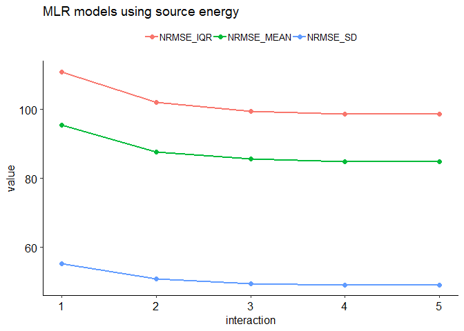
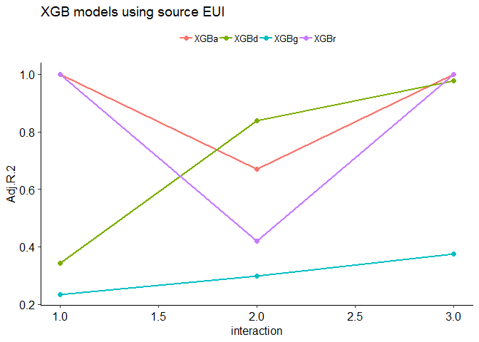
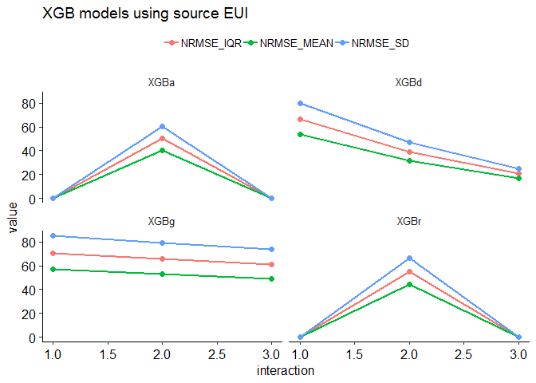
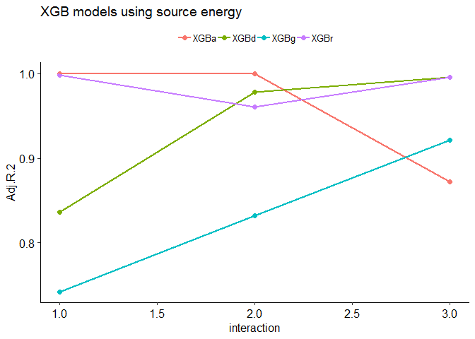
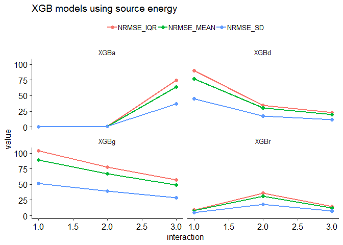
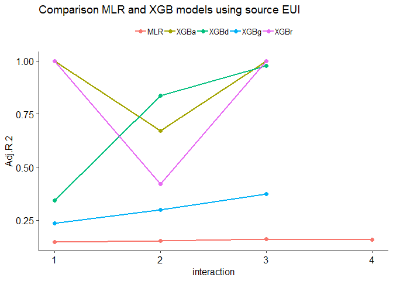
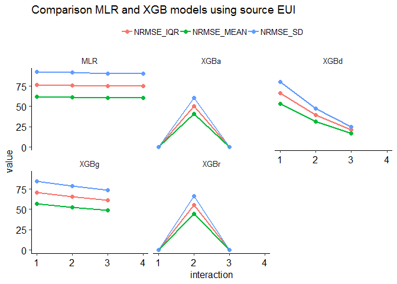
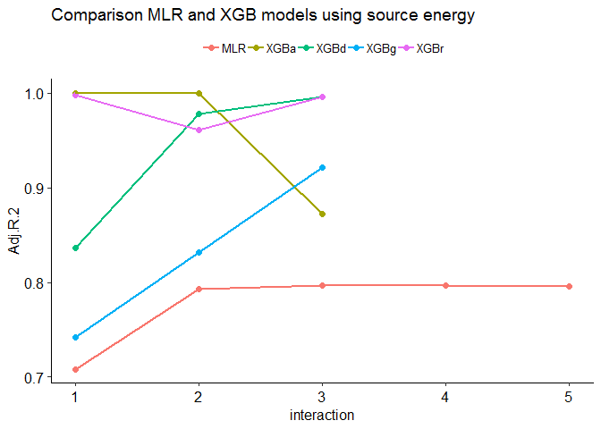
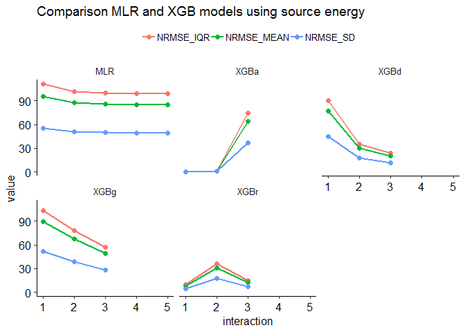

Benchmarking Worship facilities
================
Pandarasamy Arjunan
3 June 2019

-   [Load dataset](#load-dataset)
-   [Apply filters](#apply-filters)
-   [Prepare features](#prepare-features)
-   [Descriptive statistics](#descriptive-statistics)
    -   [Data Frame Summary](#data-frame-summary)
-   [Build predictive models](#build-predictive-models)
    -   [Multiple Linear Regression (MLR)](#multiple-linear-regression-mlr)
    -   [Multiple Linear Regression (MLR) with Interaction terms](#multiple-linear-regression-mlr-with-interaction-terms)
    -   [Comparision of MLR models](#comparision-of-mlr-models)
    -   [Gradient Boosted Trees (XGBoost)](#gradient-boosted-trees-xgboost)
    -   [Comparision of XGB models](#comparision-of-xgb-models)
    -   [Comparision between MLR and XGB models](#comparision-between-mlr-and-xgb-models)

Load dataset
------------

``` r
building_type = "worship"

filtered_dir = './data/cbecs/filtered/'
dir.create(filtered_dir, recursive = T, showWarnings = F)

features_dir = './data/cbecs/features/'
dir.create(features_dir, recursive = T, showWarnings = F)

results_dir = './results/cbecs/'
dir.create(results_dir, recursive = T, showWarnings = F)
```

``` r
cbecs = read.csv("data/cbecs/2012_public_use_data_aug2016.csv")

var1 = c( 'SQFT', 'NFLOOR', 'NELVTR', 'NESLTR', 'COURT', 
          'MONUSE', 'OPNWE',  'WKHRS', 'NWKER', 'COOK', 
          'MANU', 'HEATP',  'COOLP',  'SNACK', 'FASTFD', 'CAF',
          'FDPREP', 'KITCHN', 'BREAKRM', 'OTFDRM', 'LABEQP', 'MCHEQP',
          'POOL', 'HTPOOL', 'RFGWIN', 'RFGOPN', 'RFGCLN', 'RFGVNN',
          'RFGICN', 'PCTERMN', 'LAPTPN', 'PRNTRN', 'SERVERN', 'TVVIDEON',
          'RGSTRN', 'COPIERN', 'HDD65','CDD65')

var2 = c( "PBAPLUS", "PBA", "FINALWT",
          "MFBTU", 
          "ELBTU", "NGBTU", "FKBTU", "DHBTU",
          "ONEACT", "ACT1", "ACT2", "ACT3", "ACT1PCT", "ACT2PCT", "ACT3PCT",
          "PRAMTC", "PRUNIT",
          "CWUSED", "WOUSED", "COUSED", "SOUSED", "PRUSED", 
          "RFGSTP")

var3 = c("RWSEAT")

worships = cbecs[, c(var1, var2, var3)]
```

Apply filters
-------------

As per Energy Star's technical document [ENERGY STAR Score for Worship Facilities](https://www.energystar.gov/buildings/tools-and-resources/energy-star-score-worship-facilities), following filters are applied to define the peer group and to remove any outliers.

After applying each filter, the number of remaining buildings in the dataset (*Number Remaining: X*) and any difference (*Difference: X*) in count from the original Energy Star's technical documentation is also given.

1.  **Calculate source energy and source EUI**

    ``` r
    ## convert electricity, natural gas, fuel oil, and district heat to source energy
    w0 = worships %>% 
      mutate(ELBTU0 = ELBTU*2.80) %>%
      mutate(NGBTU0 = NGBTU*1.05) %>%
      mutate(FKBTU0 = FKBTU*1.01) %>%
      mutate(DHBTU0 = DHBTU*1.20) %>%
      mutate(SOURCE_ENERGY = rowSums(dplyr::select(., c(ELBTU0,NGBTU0,FKBTU0,DHBTU0)), na.rm = T)) %>% 
      mutate(SOURCE_EUI = round(SOURCE_ENERGY/SQFT, 2)) %>%
      mutate(SITE_EUI = round(MFBTU/SQFT, 2)) %>%
      mutate(NGBTU_PERCENT = round(NGBTU / SOURCE_ENERGY * 100, 2)) %>% 
      mutate(SUMBTU = rowSums(dplyr::select(., c(ELBTU,NGBTU,FKBTU,DHBTU)), na.rm = T))

    #Is MFBTU the sum of ELBTU,NGBTU,FKBTU,DHBTU? YES.
    #summary(o14$MFBTU - o14$SUMBTU)
    ```

2.  **PBAPLUS = 21** <br/>Building Type Filter – CBECS defines building types according to the variable “PBAPLUS.” Religious Worship is coded as PBAPBLUS= 21. <br/>Number Remaining: 352. <br/>Difference: 0.

    ``` r
    w1 = w0 %>% filter(PBAPLUS == 21)
    ```

3.  **Must operate for at least 30 hours per week** <br/>EPA Program Filter – Baseline condition for being a full time worship facility. <br/>Number Remaining: 351. <br/>Difference: 0.

    ``` r
    w2 = w1 %>% filter(WKHRS >= 1)
    ```

4.  **Must have at least 1 seat** <br/>EPA Program Filter – Baseline condition for being a full time worship facility. <br/>Number Remaining: 351. <br/>Difference: 0.

    ``` r
    w3 = w2 %>% filter(RWSEAT >= 1)
    ```

5.  **Must operate for at least 10 months per year** <br/>EPA Program Filter – Baseline condition for being a full time worship facility. <br/>Number Remaining: 339. <br/>Difference: 0.

    ``` r
    w4 = w3 %>% filter(MONUSE >= 10)
    ```

6.  **A single activity must characterize greater than 50% of the floor space** <br/>EPA Program Filter – In order to be considered part of the worship facility peer group, more than 50% of the building must be defined as religious worship. <br/>This filter is applied by a set of screens. If the variable ONEACT=1, then one activity occupies 75% or more of the building. If the variable ONEACT=2, then the activities in the building are defined by ACT1, ACT2, and ACT3. One of these activities must be coded as religious worship (PBA=18), with a corresponding percent (ACT1PCT, ACT2PCT, ACT3PCT) that is greater than 50. <br/>Number Remaining: 329. <br/>Difference: +2.

    ``` r
    w5 = w4 %>% 
      filter( (ONEACT == 1) |
            (ONEACT == 2 & 
               ((ACT1 %in% c(18) & ACT1PCT > 50) | 
                  (ACT2 %in% c(18) & ACT2PCT > 50) | 
                  (ACT3 %in% c(18) & ACT3PCT > 50) )))
    ```

7.  **Must report energy usage** <br/>EPA Program Filter – Baseline condition for being a full time worship facility. <br/>Number Remaining: 329. <br/>Difference: +2.

    ``` r
    w6 = w5 %>% filter(!is.na(MFBTU))
    ```

8.  **Must be less than or equal to 1,000,000 square feet** <br/>Data Limitation Filter – CBECS masks surveyed properties above 1,000,000 square feet by applying regional averages. <br/>Number Remaining: 329. <br/>Difference: +2.

    ``` r
    w7 = w6 %>% filter(SQFT <= 1000000)
    ```

9.  **If propane is used, the amount category (PRAMTC) must equal 1, 2, or 3** <br/>Data Limitation Filter – Cannot estimate propane use if the quantity is “greater than 1000” or unknown. <br/>Number Remaining: 314. <br/>Difference: +2.

    ``` r
    w8 = w7 %>% filter(is.na(PRAMTC) | PRAMTC %in% c(1,2,3))
    ```

10. **If propane is used, the unit (PRUNIT) must be known** <br/>Data Limitation Filter – Cannot estimate propane use if the unit is unknown. <br/>Number Remaining: 314. <br/>Difference: +2.

    ``` r
    w9 = w8 %>% filter(is.na(PRUNIT) | PRUNIT %in% c(1,2))
    ```

11. **If propane is used, the maximum estimated propane amount must be 10% or less of the total source energy** <br/>Data Limitation Filter – Because propane values are estimated from a range, propane is restricted to 10% of the total source energy. <br/>Number Remaining: 314. <br/>Difference: +22.

    ``` r
    w10 = w9 %>% 
      filter( PRUSED == 2 | is.na(NGBTU_PERCENT) == T | 
            (PRUSED == 1 & NGBTU_PERCENT <= 10))
    ```

12. **must not use chilled water, wood, coal, or solar** <br/>Data Limitation Filter – CBECS does not collect quantities of chilled water, wood, coal, or solar. <br/>Number Remaining: 310. <br/>Difference: +22.

    ``` r
    w11 = w10 %>% 
      filter(CWUSED == 2 & WOUSED == 2 & COUSED == 2 & SOUSED == 2)
    ```

13. **If space within the building is used for food preparation, then square footage used for this purpose (FDPREPSFR) must be reported.** <br/>Data Limitation Filter – Cannot calculate percentage of square footage used for food preparation if square footage value is not reported. <br/>Number Remaining: 310. <br/>Difference: +22. <br/>**TODO: FDPREPSFR is not available in the dataset**

    ``` r
    w12 = w11 
    ```

14. **Must have no more than 250 seats per 1,000 square feet** <br/>Analytical Filter – Values determined to be statistical outliers. <br/>Number Remaining: 303. <br/>Difference: +32.

    ``` r
    w13 = w12 %>% filter(RWSEAT / SQFT * 1000 <= 250)
    ```

15. **Must have no more than 2.5 workers per 1,000 square feet** <br/>Analytical Filter – Values determined to be statistical outliers. <br/>Number Remaining: 292. <br/>Difference: +29.

    ``` r
    w14 = w13 %>% filter(NWKER  / SQFT * 1000 <= 2.5)
    ```

16. **Must not operate 168 hours/week** <br/>Analytical Filter – Values determined to be statistical outliers. <br/>Number Remaining: 279. <br/>Difference: +26.

    ``` r
    w15 = w14 %>% filter(WKHRS != 168)
    ```

17. **Must have Source EUI less than or equal to 250 kBtu/ft2** <br/>Analytical Filter – Values determined to be statistical outliers. <br/>Number Remaining: 273. <br/>Difference: +26.

    ``` r
    w16 = w15 %>% filter(SOURCE_EUI <= 250)
    ```

18. **Must have Source EUI greater than or equal to 10 kBtu/ft2** <br/>Analytical Filter – Values determined to be statistical outliers. <br/>Number Remaining: 265. <br/>Difference: +22.

    ``` r
    w17 = w16 %>% filter(SOURCE_EUI >= 10)
    ```

**Save the filtered dataset**

``` r
write.csv(w17, paste0(filtered_dir, building_type, ".csv"), row.names = F)
```

Prepare features
----------------

The final regression equation includes the following variables: ï‚·

-   Weekly Operating Hours
-   Number of Religious Worship Seats per 1,000 Square Feet
-   Percent of Square Footage Used for Food Preparation
-   Heating Degree Days times Percent of the Building that is Heated
-   Cooling Degree Days times Percent of the Building that is Cooled

``` r
worship = read.csv(paste0(filtered_dir, building_type, ".csv"))

data = worship %>%
  mutate(RWSEAT_SQFT = RWSEAT/SQFT * 1000) %>%
  mutate(HDD65_HEATP = HDD65 * HEATP / 100) %>%
  mutate(CDD65_COOLP = CDD65 * COOLP / 100) %>%
  mutate_if(is.numeric, round, 3)

ivars = c(
  "SQFT",
  "WKHRS", "RWSEAT_SQFT",
          "HDD65_HEATP", "CDD65_COOLP")

dvars  = c("SOURCE_EUI", "SOURCE_ENERGY", "FINALWT")

features = data[, c(ivars, dvars)]
#summary(features)

features = features %>% na.omit()

write.csv(features, 
          paste0(features_dir, building_type, ".csv"), 
          row.names = F)
```

Descriptive statistics
----------------------

``` r
features1 = features

features1 = features1 %>% dplyr::select(-one_of('SOURCE_ENERGY', 'FINALWT'))

summarytools::descr(features1, stats = "common", 
                    transpose = TRUE, 
                    headings = FALSE)
```

|                  |      Mean|   Std.Dev|      Min|    Median|        Max|  N.Valid|  Pct.Valid|
|-----------------:|---------:|---------:|--------:|---------:|----------:|--------:|----------:|
|  **CDD65\_COOLP**|   1474.41|    925.94|    31.89|   1348.00|    5221.00|   249.00|     100.00|
|  **HDD65\_HEATP**|   3224.50|   1836.81|   191.00|   3215.00|    7355.00|   249.00|     100.00|
|  **RWSEAT\_SQFT**|     33.72|     24.14|     2.50|     26.47|     140.00|   249.00|     100.00|
|   **SOURCE\_EUI**|     71.03|     47.54|    10.32|     58.88|     237.81|   249.00|     100.00|
|          **SQFT**|  18246.80|  21635.00|  1200.00|  11500.00|  120000.00|   249.00|     100.00|
|         **WKHRS**|     30.57|     24.98|     1.00|     20.00|     105.00|   249.00|     100.00|

``` r
dfSummary(features1, plain.ascii = FALSE, style = "grid", 
          graph.magnif = 0.75, valid.col = FALSE)
```

    text graphs are displayed; set 'tmp.img.dir' parameter to activate png graphs

### Data Frame Summary

**features1**
**Dimensions:** 249 x 6
**Duplicates:** 0

<table>
<colgroup>
<col width="4%" />
<col width="14%" />
<col width="28%" />
<col width="20%" />
<col width="22%" />
<col width="9%" />
</colgroup>
<thead>
<tr class="header">
<th>No</th>
<th>Variable</th>
<th>Stats / Values</th>
<th>Freqs (% of Valid)</th>
<th>Graph</th>
<th>Missing</th>
</tr>
</thead>
<tbody>
<tr class="odd">
<td><p>1</p></td>
<td><p>SQFT<br />
[numeric]</p></td>
<td><p>Mean (sd) : 18246.8 (21635)<br />
min &lt; med &lt; max:<br />
1200 &lt; 11500 &lt; 120000<br />
IQR (CV) : 18000 (1.2)</p></td>
<td><p>120 distinct values</p></td>
<td><p><br />
:<br />
:<br />
:<br />
: :<br />
: : :</p></td>
<td><p>0<br />
(0%)</p></td>
</tr>
<tr class="even">
<td><p>2</p></td>
<td><p>WKHRS<br />
[numeric]</p></td>
<td><p>Mean (sd) : 30.6 (25)<br />
min &lt; med &lt; max:<br />
1 &lt; 20 &lt; 105<br />
IQR (CV) : 40 (0.8)</p></td>
<td><p>59 distinct values</p></td>
<td><dl>
<dt></dt>
<dd>.<br />

</dd>
<dd>:<br />

</dd>
<dd>:<br />

</dd>
<dd>: : . :<br />

</dd>
<dd>: : : : : : :   .
</dd>
</dl></td>
<td><p>0<br />
(0%)</p></td>
</tr>
<tr class="odd">
<td><p>3</p></td>
<td><p>RWSEAT_SQFT<br />
[numeric]</p></td>
<td><p>Mean (sd) : 33.7 (24.1)<br />
min &lt; med &lt; max:<br />
2.5 &lt; 26.5 &lt; 140<br />
IQR (CV) : 28.9 (0.7)</p></td>
<td><p>159 distinct values</p></td>
<td><p><br />
. :<br />
: :<br />
: : .<br />
: : :<br />
: : : : .   .</p></td>
<td><p>0<br />
(0%)</p></td>
</tr>
<tr class="even">
<td><p>4</p></td>
<td><p>HDD65_HEATP<br />
[numeric]</p></td>
<td><p>Mean (sd) : 3224.5 (1836.8)<br />
min &lt; med &lt; max:<br />
191 &lt; 3215 &lt; 7355<br />
IQR (CV) : 2906 (0.6)</p></td>
<td><p>247 distinct values</p></td>
<td><p><br />
  . : : :<br />
: : : : :<br />
: : : : : :<br />
: : : : : : :<br />
: : : : : : : .</p></td>
<td><p>0<br />
(0%)</p></td>
</tr>
<tr class="odd">
<td><p>5</p></td>
<td><p>CDD65_COOLP<br />
[numeric]</p></td>
<td><p>Mean (sd) : 1474.4 (925.9)<br />
min &lt; med &lt; max:<br />
31.9 &lt; 1348 &lt; 5221<br />
IQR (CV) : 1125 (0.6)</p></td>
<td><p>246 distinct values</p></td>
<td><p><br />
  :<br />
  : . :<br />
. : : :<br />
: : : : .<br />
: : : : : : :</p></td>
<td><p>0<br />
(0%)</p></td>
</tr>
<tr class="even">
<td><p>6</p></td>
<td><p>SOURCE_EUI<br />
[numeric]</p></td>
<td><p>Mean (sd) : 71 (47.5)<br />
min &lt; med &lt; max:<br />
10.3 &lt; 58.9 &lt; 237.8<br />
IQR (CV) : 57.3 (0.7)</p></td>
<td><p>248 distinct values</p></td>
<td><p><br />
  :<br />
: : :<br />
: : : .<br />
: : : :<br />
: : : : : : . .</p></td>
<td><p>0<br />
(0%)</p></td>
</tr>
</tbody>
</table>

**Extract R code from Rmd document**

``` r
#knitr::purl("worship.Rmd", output = "worship.R", documentation = 2)
```

Build predictive models
-----------------------

``` r
#source("models.R")
source("metrics.R")

data = read.csv(paste0(features_dir, building_type, ".csv"))

allMetrics = NULL

sourceEUI_attributes = setdiff(colnames(data),
                               c("SQFT", "FINALWT", "SOURCE_EUI", "SOURCE_ENERGY"))

sourceEnergy_attributes = setdiff(colnames(data), 
                               c("FINALWT", "SOURCE_EUI", "SOURCE_ENERGY"))
#cat(colnames(data))
knitr::kable(colnames(data), col.names = NULL)
```

    Warning in kable_markdown(x, padding = padding, ...): The table should have
    a header (column names)

|                |
|:---------------|
| SQFT           |
| WKHRS          |
| RWSEAT\_SQFT   |
| HDD65\_HEATP   |
| CDD65\_COOLP   |
| SOURCE\_EUI    |
| SOURCE\_ENERGY |
| FINALWT        |

### Multiple Linear Regression (MLR)

``` r
MLR.fit <- function(data, 
                    x, 
                    y, 
                    w, 
                    interaction,
                    centering = TRUE 
                    ) {
  
  if(centering == TRUE){
    data = mean_center_data(data, x)  
  }
  
  if(interaction == 1) {  ### ordinary model
    model = paste(y, "~", paste(x, collapse = " + "))  
  } else {  ### interaction model
    allvars = paste(x, collapse = " + ")
    model = paste(y, "~ (", allvars, ") ^", interaction )
  }
  
  fit = lm(model, data = data, weights = data[, w])
  return (fit)
}

MLR.predict <- function(data, x, y, w, i) {
  
  mlrFit = MLR.fit(data, x, y, w, i)
  
  wt   = data[, w]
  obs  = data[, y]
  pred = as.numeric(predict(mlrFit))
  
  mlrMetrics = getMLRmetrics(mlrFit, obs, pred, wt)
  mlrMetrics = data.frame(
    "model" = "MLR",
    "dependent" = y,
    "interaction" = i,
    "transform" = "meanCent",
    mlrMetrics)
  
  return(mlrMetrics)
}
```

#### Using SOURCE\_EUI as dependent variable

``` r
x = sourceEUI_attributes
y = "SOURCE_EUI"
w = "FINALWT"
interaction = 1

mlrMetrics = MLR.predict(data, x, y, w, interaction)

allMetrics = rbind(allMetrics, mlrMetrics)

knitr::kable(allMetrics, row.names = F)
```

| model | dependent   |  interaction| transform |  obs|  rank|  coef|    R.2|  Adj.R.2|       mse|    rmse|     mae|   mape|  nrmse\_iqr|  nrmse\_range|  nrmse\_mean|  nrmse\_sd|
|:------|:------------|------------:|:----------|----:|-----:|-----:|------:|--------:|---------:|-------:|-------:|------:|-----------:|-------------:|------------:|----------:|
| MLR   | SOURCE\_EUI |            1| meanCent  |  249|     5|     5|  0.161|    0.147|  1924.033|  43.864|  32.496|  0.685|      76.605|        19.282|       61.754|     92.264|

#### Using SOURCE\_ENERGY as dependent variable

``` r
x = sourceEnergy_attributes
y = "SOURCE_ENERGY"
w = "FINALWT"
interaction = 1

mlrMetrics = MLR.predict(data, x, y, w, interaction)

allMetrics = rbind(allMetrics, mlrMetrics)

knitr::kable(allMetrics, row.names = F)
```

| model | dependent      |  interaction| transform |  obs|  rank|  coef|    R.2|  Adj.R.2|           mse|         rmse|         mae|   mape|  nrmse\_iqr|  nrmse\_range|  nrmse\_mean|  nrmse\_sd|
|:------|:---------------|------------:|:----------|----:|-----:|-----:|------:|--------:|-------------:|------------:|-----------:|------:|-----------:|-------------:|------------:|----------:|
| MLR   | SOURCE\_EUI    |            1| meanCent  |  249|     5|     5|  0.161|    0.147|  1.924033e+03|       43.864|      32.496|  0.685|      76.605|        19.282|       61.754|     92.264|
| MLR   | SOURCE\_ENERGY |            1| meanCent  |  249|     6|     6|  0.714|    0.708|  1.924860e+12|  1387393.165|  658508.238|  0.832|     110.900|         7.303|       95.402|     55.241|

### Multiple Linear Regression (MLR) with Interaction terms

#### Using SOURCE\_EUI as dependent variable

``` r
x = sourceEUI_attributes
y = "SOURCE_EUI"
w = "FINALWT"

intr_depth = length(x)

for (interaction in 2:intr_depth) {
  mlrMetrics = MLR.predict(data, x, y, w, interaction)
  allMetrics = rbind(allMetrics, mlrMetrics)
}

write.csv(allMetrics, 
          paste0(results_dir, building_type, ".csv"), 
          row.names = F)

allMetrics0 = allMetrics %>% filter(dependent == y)
knitr::kable(allMetrics0, row.names = F)
```

| model | dependent   |  interaction| transform |  obs|  rank|  coef|    R.2|  Adj.R.2|       mse|    rmse|     mae|   mape|  nrmse\_iqr|  nrmse\_range|  nrmse\_mean|  nrmse\_sd|
|:------|:------------|------------:|:----------|----:|-----:|-----:|------:|--------:|---------:|-------:|-------:|------:|-----------:|-------------:|------------:|----------:|
| MLR   | SOURCE\_EUI |            1| meanCent  |  249|     5|     5|  0.161|    0.147|  1924.033|  43.864|  32.496|  0.685|      76.605|        19.282|       61.754|     92.264|
| MLR   | SOURCE\_EUI |            2| meanCent  |  249|    11|    11|  0.185|    0.151|  1895.424|  43.536|  32.343|  0.676|      76.032|        19.138|       61.292|     91.574|
| MLR   | SOURCE\_EUI |            3| meanCent  |  249|    15|    15|  0.208|    0.161|  1847.425|  42.982|  31.872|  0.665|      75.065|        18.894|       60.512|     90.408|
| MLR   | SOURCE\_EUI |            4| meanCent  |  249|    16|    16|  0.208|    0.157|  1846.693|  42.973|  31.871|  0.665|      75.049|        18.890|       60.500|     90.389|

#### Using SOURCE\_ENERGY as dependent variable\*\*

``` r
x = sourceEnergy_attributes
y = "SOURCE_ENERGY"
w = "FINALWT"

intr_depth = length(x)

for (interaction in 2:intr_depth) {
  mlrMetrics = MLR.predict(data, x, y, w, interaction)
  allMetrics = rbind(allMetrics, mlrMetrics)
}

write.csv(allMetrics, 
          paste0(results_dir, building_type, ".csv"), 
          row.names = F)

allMetrics0 = allMetrics %>% filter(dependent == y)
knitr::kable(allMetrics0, row.names = F)
```

| model | dependent      |  interaction| transform |  obs|  rank|  coef|    R.2|  Adj.R.2|           mse|     rmse|       mae|   mape|  nrmse\_iqr|  nrmse\_range|  nrmse\_mean|  nrmse\_sd|
|:------|:---------------|------------:|:----------|----:|-----:|-----:|------:|--------:|-------------:|--------:|---------:|------:|-----------:|-------------:|------------:|----------:|
| MLR   | SOURCE\_ENERGY |            1| meanCent  |  249|     6|     6|  0.714|    0.708|  1.924860e+12|  1387393|  658508.2|  0.832|     110.900|         7.303|       95.402|     55.241|
| MLR   | SOURCE\_ENERGY |            2| meanCent  |  249|    16|    16|  0.806|    0.793|  1.629286e+12|  1276435|  575211.9|  0.691|     102.031|         6.719|       87.772|     50.823|
| MLR   | SOURCE\_ENERGY |            3| meanCent  |  249|    26|    26|  0.818|    0.797|  1.551240e+12|  1245488|  566291.2|  0.672|      99.557|         6.556|       85.644|     49.591|
| MLR   | SOURCE\_ENERGY |            4| meanCent  |  249|    31|    31|  0.821|    0.797|  1.521526e+12|  1233501|  558468.8|  0.653|      98.599|         6.493|       84.820|     49.114|
| MLR   | SOURCE\_ENERGY |            5| meanCent  |  249|    32|    32|  0.822|    0.796|  1.523799e+12|  1234422|  558680.3|  0.656|      98.672|         6.498|       84.883|     49.151|

### Comparision of MLR models

#### MLR plots using Source EUI

``` r
mytheme = theme(legend.title = element_blank(),
           legend.text=element_text(size=12),
           axis.text=element_text(size=12),
           text=element_text(size=12))

plotR2 <- function(df, titl) {
  
  df1 = melt(df, measure.vars = c("R.2", "Adj.R.2"))
  
  plot <- ggplot(df1, aes(x = interaction, y=value, 
                          group=variable, col=variable)) + 
  geom_point(size=2) + geom_line(size=1) +
    ggtitle(titl) + 
    theme_pubr(base_size=12) +
    theme(legend.position="top", legend.title = element_blank())
  
  return(plot)
}

plotNRMSE <- function(df, titl) {
  
  df1 = melt(df, measure.vars = c("nrmse_iqr", "nrmse_mean", 
                                        "nrmse_sd"))
  df1$variable = toupper(df1$variable)
  
  plot <- ggplot(df1, aes(x = interaction, y=value, 
                          group=variable, col=variable)) + 
  geom_point(size=2) + geom_line(size=1) +
    ggtitle(titl) + 
    theme_pubr(base_size=12) +
    theme(legend.position="top", legend.title = element_blank())
    
  
  return(plot)
}  
```

``` r
allMetrics0 = allMetrics %>%
  filter(stringr::str_detect(model, "MLR")) %>%
  filter(dependent == "SOURCE_EUI")

plot1 = plotR2(allMetrics0, "MLR models using source EUI")
plot2 = plotNRMSE(allMetrics0, "MLR models using source EUI")

print(plot1)
```


``` r
print(plot2)
```


#### MLR plots using Source Energy

``` r
allMetrics0 = allMetrics %>%
  filter(stringr::str_detect(model, "MLR")) %>%
  filter(dependent == "SOURCE_ENERGY")

plot1 = plotR2(allMetrics0, "MLR models using source energy")
plot2 = plotNRMSE(allMetrics0, "MLR models using source energy")

print(plot1)
```


``` r
print(plot2)
```



### Gradient Boosted Trees (XGBoost)

``` r
tuneXGBoost <- function(x,
                        y,
                        sample_weights,
                        search = "default",
                        tree_height = 2
                        ) {
  
  N = 10  # N-fold CV
  R = 2   # and R repeats
  
  tcDefault  <- trainControl(method = "repeatedcv", 
                            number = N, 
                            repeats = R)
  
  tcRandom   <- trainControl(method = "repeatedcv", 
                            search = "random",
                            number = N, 
                            repeats = R)
  
  tcAdaptive <- trainControl(method = "adaptive_cv", 
                            search = "random",
                            number = N, 
                            repeats = R,
                            adaptive = list(min = 5, 
                                            alpha = 0.05, 
                                            method = "gls",
                                            complete = TRUE))
  
  default_param = expand.grid(
    nrounds = 100,
    max_depth = tree_height,
    eta = 0.3,
    gamma = 0,
    colsample_bytree = 1,
    min_child_weight = 1,
    subsample = 1)
  
  # from https://github.com/topepo/caret/blob/master/models/files/xgbTree.R
  len = 10
  grid_param <- expand.grid(
    nrounds = floor((1:len) * 10),
    max_depth = tree_height,
    eta = c(.3, .4),
    gamma = 0,
    colsample_bytree = c(.6, .8),
    min_child_weight = c(1),
    subsample = seq(.25, 1, length = len))
  
  tuned = switch(search,
                 "default" = train(x, y,
                                   weights = sample_weights,
                                   method = "xgbTree", 
                                   tuneGrid = default_param,
                                   trControl = tcDefault,
                                   verbose = TRUE),
                 
                 "grid"     = train(x, y, 
                                   weights = sample_weights,
                                   method = "xgbTree", 
                                   tuneGrid = grid_param,
                                   trControl = tcDefault,
                                   verbose = TRUE),

                 "random"  = train(x, y, 
                                   weights = sample_weights,
                                   method = "xgbTree", 
                                   trControl = tcRandom,
                                   verbose = TRUE),
                 
                 "adaptive" = train(x, y, 
                                   weights = sample_weights,
                                   method = "xgbTree", 
                                   trControl = tcAdaptive,
                                   verbose = TRUE)
                 )
  
  return(tuned$finalModel)
}

XGBoost <- function( xdata, 
                     ydata,
                     sample_weights,
                     search = "default",
                     interaction = 2
                     ) {
  
  model = paste(y, "~", paste(x, collapse = " + "))
  dummy = dummyVars(model, data = data, fullRank = T)
  
  xdata = as.data.frame(predict(dummy, data))
  ydata = data[, y]
  
  xgfit = tuneXGBoost(xdata, ydata, 
                      sample_weights,
                      search, 
                      tree_height = interaction)
  return(xgfit)
} 


XGBoost.predict <- function(data, x, y, w, search) {

  model = paste(y, "~", paste(x, collapse = " + "))
  dummy = dummyVars(model, data = data, fullRank = T)
  xdata = as.data.frame(predict(dummy, data))
  ydata = data[, y]
  wt = data[, w]
  
  intr_depth = 3
  
  xgbMetricsAll = NULL
  
  for (intr in 1:intr_depth) {
    
    cat(paste(Sys.time(), "xgboost", search, y, intr, "\n"))
    
    xgfit = XGBoost(xdata, ydata, wt, 
                    search = search, 
                    interaction = intr)
    
    pred = as.numeric(predict(xgfit, as.matrix(xdata)))
    
    xgbMetrics = getXgboostmetrics(xgfit, xdata, ydata, pred, wt)
    
    xgbMetrics = data.frame(
      "model" = paste0("XGB", substr(search, 1,1), intr),
      "dependent" = y, 
      "interaction" = intr, 
      "transform" = "None",
      xgbMetrics)
    
    xgbMetricsAll = rbind(xgbMetricsAll, xgbMetrics)
  }
  
  return(xgbMetricsAll)
}
```

``` r
# y = "SOURCE_EUI"
# w = "FINALWT"
# o = c("SOURCE_ENERGY", "SQFT")
# x = setdiff(colnames(data), c(y, w, o))
# wt = data[, w]
# 
# model = paste(y, "~", paste(x, collapse = " + "))
# dummy = dummyVars(model, data = data, fullRank = T)
# xdata = as.data.frame(predict(dummy, data))
# ydata = data[, y]
# intr_depth = 3
# 
# for (intr in 1:intr_depth) {
#   
#   print(paste(Sys.time(), "xgboost default search", y, intr, "\n"))
#   
#   xgfit = XGBoost(xdata, ydata, wt, 
#                   search = "default", 
#                   interaction = intr)
#   
#   pred = as.numeric(predict(xgfit, as.matrix(xdata)))
#   
#   xgbMetrics = getXgboostmetrics(xgfit, xdata, ydata, pred, wt)
#   
#   xgbMetrics = data.frame(
#     "model" = paste0("XGBd", intr),
#     "dependent" = y, 
#     "interaction" = intr, 
#     "transform" = "None",
#     xgbMetrics)
#   
#   allMetrics = rbind(allMetrics, xgbMetrics)
# }
# knitr::kable(allMetrics, row.names = F)
```

#### Using SOURCE\_EUI as dependent variable

``` r
library(doParallel)
ncore = 4
registerDoParallel(cores = ncore)
```

##### Using default search

``` r
x = sourceEUI_attributes
y = "SOURCE_EUI"
w = "FINALWT"
search = "default"

xgbMetrics = XGBoost.predict(data, x, y, w, search)
```

2019-06-10 16:42:34 xgboost default SOURCE\_EUI 1 2019-06-10 16:43:57 xgboost default SOURCE\_EUI 2 2019-06-10 16:43:59 xgboost default SOURCE\_EUI 3

``` r
allMetrics = rbind(allMetrics, xgbMetrics)

knitr::kable(xgbMetrics, row.names = F)
```

| model | dependent   |  interaction| transform |  obs|  rank|  coef|    R.2|  Adj.R.2|       mse|    rmse|     mae|   mape|  nrmse\_iqr|  nrmse\_range|  nrmse\_mean|  nrmse\_sd|
|:------|:------------|------------:|:----------|----:|-----:|-----:|------:|--------:|---------:|-------:|-------:|------:|-----------:|-------------:|------------:|----------:|
| XGBd1 | SOURCE\_EUI |            1| None      |  249|     4|     4|  0.350|    0.342|  1444.194|  38.003|  28.170|  0.562|      66.369|        16.705|       53.503|     79.936|
| XGBd2 | SOURCE\_EUI |            2| None      |  249|     4|     4|  0.840|    0.838|   500.775|  22.378|  15.554|  0.309|      39.081|         9.837|       31.505|     47.070|
| XGBd3 | SOURCE\_EUI |            3| None      |  249|     4|     4|  0.977|    0.977|   142.934|  11.956|   6.848|  0.133|      20.880|         5.256|       16.832|     25.148|

##### Using grid search

``` r
x = sourceEUI_attributes
y = "SOURCE_EUI"
w = "FINALWT"
search = "grid"

xgbMetrics = XGBoost.predict(data, x, y, w, search)
```

2019-06-10 16:44:09 xgboost grid SOURCE\_EUI 1 2019-06-10 16:44:47 xgboost grid SOURCE\_EUI 2 2019-06-10 16:45:39 xgboost grid SOURCE\_EUI 3

``` r
allMetrics = rbind(allMetrics, xgbMetrics)

knitr::kable(xgbMetrics, row.names = F)
```

| model | dependent   |  interaction| transform |  obs|  rank|  coef|    R.2|  Adj.R.2|       mse|    rmse|     mae|   mape|  nrmse\_iqr|  nrmse\_range|  nrmse\_mean|  nrmse\_sd|
|:------|:------------|------------:|:----------|----:|-----:|-----:|------:|--------:|---------:|-------:|-------:|------:|-----------:|-------------:|------------:|----------:|
| XGBg1 | SOURCE\_EUI |            1| None      |  249|     4|     4|  0.243|    0.234|  1629.145|  40.363|  29.724|  0.597|      70.491|        17.743|       56.825|     84.900|
| XGBg2 | SOURCE\_EUI |            2| None      |  249|     4|     4|  0.307|    0.298|  1410.061|  37.551|  27.784|  0.574|      65.580|        16.507|       52.866|     78.985|
| XGBg3 | SOURCE\_EUI |            3| None      |  249|     4|     4|  0.382|    0.374|  1219.743|  34.925|  25.852|  0.522|      60.994|        15.352|       49.169|     73.461|

##### Using adaptive search

``` r
x = sourceEUI_attributes
y = "SOURCE_EUI"
w = "FINALWT"
search = "adaptive"

xgbMetrics = XGBoost.predict(data, x, y, w, search)
```

2019-06-10 16:46:56 xgboost adaptive SOURCE\_EUI 1 2019-06-10 16:48:06 xgboost adaptive SOURCE\_EUI 2 2019-06-10 16:48:20 xgboost adaptive SOURCE\_EUI 3

``` r
allMetrics = rbind(allMetrics, xgbMetrics)

knitr::kable(xgbMetrics, row.names = F)
```

| model | dependent   |  interaction| transform |  obs|  rank|  coef|    R.2|  Adj.R.2|      mse|    rmse|     mae|   mape|  nrmse\_iqr|  nrmse\_range|  nrmse\_mean|  nrmse\_sd|
|:------|:------------|------------:|:----------|----:|-----:|-----:|------:|--------:|--------:|-------:|-------:|------:|-----------:|-------------:|------------:|----------:|
| XGBa1 | SOURCE\_EUI |            1| None      |  249|     4|     4|  1.000|    1.000|    0.002|   0.046|   0.016|  0.000|       0.080|         0.020|        0.065|      0.097|
| XGBa2 | SOURCE\_EUI |            2| None      |  249|     4|     4|  0.675|    0.671|  828.765|  28.788|  21.175|  0.416|      50.276|        12.655|       40.529|     60.553|
| XGBa3 | SOURCE\_EUI |            3| None      |  249|     4|     4|  1.000|    1.000|    0.005|   0.074|   0.043|  0.001|       0.129|         0.033|        0.104|      0.156|

##### Using random search

``` r
x = sourceEUI_attributes
y = "SOURCE_EUI"
w = "FINALWT"
search = "random"

xgbMetrics = XGBoost.predict(data, x, y, w, search)
```

2019-06-10 16:49:35 xgboost random SOURCE\_EUI 1 2019-06-10 16:50:20 xgboost random SOURCE\_EUI 2 2019-06-10 16:50:59 xgboost random SOURCE\_EUI 3

``` r
allMetrics = rbind(allMetrics, xgbMetrics)

write.csv(allMetrics, 
          paste0(results_dir, building_type, ".csv"), 
          row.names = F)

allMetrics0 = allMetrics %>% filter(dependent == y)
knitr::kable(allMetrics0, row.names = F)
```

| model | dependent   |  interaction| transform |  obs|  rank|  coef|    R.2|  Adj.R.2|       mse|    rmse|     mae|   mape|  nrmse\_iqr|  nrmse\_range|  nrmse\_mean|  nrmse\_sd|
|:------|:------------|------------:|:----------|----:|-----:|-----:|------:|--------:|---------:|-------:|-------:|------:|-----------:|-------------:|------------:|----------:|
| MLR   | SOURCE\_EUI |            1| meanCent  |  249|     5|     5|  0.161|    0.147|  1924.033|  43.864|  32.496|  0.685|      76.605|        19.282|       61.754|     92.264|
| MLR   | SOURCE\_EUI |            2| meanCent  |  249|    11|    11|  0.185|    0.151|  1895.424|  43.536|  32.343|  0.676|      76.032|        19.138|       61.292|     91.574|
| MLR   | SOURCE\_EUI |            3| meanCent  |  249|    15|    15|  0.208|    0.161|  1847.425|  42.982|  31.872|  0.665|      75.065|        18.894|       60.512|     90.408|
| MLR   | SOURCE\_EUI |            4| meanCent  |  249|    16|    16|  0.208|    0.157|  1846.693|  42.973|  31.871|  0.665|      75.049|        18.890|       60.500|     90.389|
| XGBd1 | SOURCE\_EUI |            1| None      |  249|     4|     4|  0.350|    0.342|  1444.194|  38.003|  28.170|  0.562|      66.369|        16.705|       53.503|     79.936|
| XGBd2 | SOURCE\_EUI |            2| None      |  249|     4|     4|  0.840|    0.838|   500.775|  22.378|  15.554|  0.309|      39.081|         9.837|       31.505|     47.070|
| XGBd3 | SOURCE\_EUI |            3| None      |  249|     4|     4|  0.977|    0.977|   142.934|  11.956|   6.848|  0.133|      20.880|         5.256|       16.832|     25.148|
| XGBg1 | SOURCE\_EUI |            1| None      |  249|     4|     4|  0.243|    0.234|  1629.145|  40.363|  29.724|  0.597|      70.491|        17.743|       56.825|     84.900|
| XGBg2 | SOURCE\_EUI |            2| None      |  249|     4|     4|  0.307|    0.298|  1410.061|  37.551|  27.784|  0.574|      65.580|        16.507|       52.866|     78.985|
| XGBg3 | SOURCE\_EUI |            3| None      |  249|     4|     4|  0.382|    0.374|  1219.743|  34.925|  25.852|  0.522|      60.994|        15.352|       49.169|     73.461|
| XGBa1 | SOURCE\_EUI |            1| None      |  249|     4|     4|  1.000|    1.000|     0.002|   0.046|   0.016|  0.000|       0.080|         0.020|        0.065|      0.097|
| XGBa2 | SOURCE\_EUI |            2| None      |  249|     4|     4|  0.675|    0.671|   828.765|  28.788|  21.175|  0.416|      50.276|        12.655|       40.529|     60.553|
| XGBa3 | SOURCE\_EUI |            3| None      |  249|     4|     4|  1.000|    1.000|     0.005|   0.074|   0.043|  0.001|       0.129|         0.033|        0.104|      0.156|
| XGBr1 | SOURCE\_EUI |            1| None      |  249|     4|     4|  1.000|    1.000|     0.003|   0.054|   0.031|  0.001|       0.094|         0.024|        0.076|      0.114|
| XGBr2 | SOURCE\_EUI |            2| None      |  249|     4|     4|  0.426|    0.419|   995.262|  31.548|  24.236|  0.480|      55.096|        13.868|       44.415|     66.358|
| XGBr3 | SOURCE\_EUI |            3| None      |  249|     4|     4|  1.000|    1.000|     0.000|   0.016|   0.009|  0.000|       0.028|         0.007|        0.023|      0.034|

#### Using SOURCE\_ENERGY as dependent variable

##### Using default search

``` r
x = sourceEnergy_attributes
y = "SOURCE_ENERGY"
w = "FINALWT"
search = "default"

xgbMetrics = XGBoost.predict(data, x, y, w, search)
```

2019-06-10 16:51:38 xgboost default SOURCE\_ENERGY 1 2019-06-10 16:51:40 xgboost default SOURCE\_ENERGY 2 2019-06-10 16:51:43 xgboost default SOURCE\_ENERGY 3

``` r
allMetrics = rbind(allMetrics, xgbMetrics)

knitr::kable(xgbMetrics, row.names = F)
```

| model | dependent      |  interaction| transform |  obs|  rank|  coef|    R.2|  Adj.R.2|           mse|       rmse|       mae|   mape|  nrmse\_iqr|  nrmse\_range|  nrmse\_mean|  nrmse\_sd|
|:------|:---------------|------------:|:----------|----:|-----:|-----:|------:|--------:|-------------:|----------:|---------:|------:|-----------:|-------------:|------------:|----------:|
| XGBd1 | SOURCE\_ENERGY |            1| None      |  249|     5|     5|  0.838|    0.836|  1.264514e+12|  1124506.3|  506736.4|  0.636|      89.886|         5.919|       77.325|     44.774|
| XGBd2 | SOURCE\_ENERGY |            2| None      |  249|     5|     5|  0.978|    0.978|  1.898019e+11|   435662.6|  234114.6|  0.372|      34.824|         2.293|       29.958|     17.347|
| XGBd3 | SOURCE\_ENERGY |            3| None      |  249|     5|     5|  0.996|    0.996|  8.484840e+10|   291287.5|  105489.1|  0.181|      23.284|         1.533|       20.030|     11.598|

##### Using grid search

``` r
x = sourceEnergy_attributes
y = "SOURCE_ENERGY"
w = "FINALWT"
search = "grid"

xgbMetrics = XGBoost.predict(data, x, y, w, search)
```

2019-06-10 16:51:46 xgboost grid SOURCE\_ENERGY 1 2019-06-10 16:52:24 xgboost grid SOURCE\_ENERGY 2 2019-06-10 16:53:16 xgboost grid SOURCE\_ENERGY 3

``` r
allMetrics = rbind(allMetrics, xgbMetrics)

knitr::kable(xgbMetrics, row.names = F)
```

| model | dependent      |  interaction| transform |  obs|  rank|  coef|    R.2|  Adj.R.2|           mse|       rmse|       mae|   mape|  nrmse\_iqr|  nrmse\_range|  nrmse\_mean|  nrmse\_sd|
|:------|:---------------|------------:|:----------|----:|-----:|-----:|------:|--------:|-------------:|----------:|---------:|------:|-----------:|-------------:|------------:|----------:|
| XGBg1 | SOURCE\_ENERGY |            1| None      |  249|     4|     4|  0.745|    0.742|  1.680822e+12|  1296465.1|  601110.4|  0.949|     103.632|         6.824|       89.150|     51.621|
| XGBg2 | SOURCE\_ENERGY |            2| None      |  249|     5|     5|  0.834|    0.832|  9.556830e+11|   977590.4|  515241.2|  0.812|      78.143|         5.146|       67.223|     38.924|
| XGBg3 | SOURCE\_ENERGY |            3| None      |  249|     5|     5|  0.923|    0.921|  5.099477e+11|   714106.2|  394413.4|  0.669|      57.081|         3.759|       49.105|     28.433|

##### Using adaptive search

``` r
x = sourceEnergy_attributes
y = "SOURCE_ENERGY"
w = "FINALWT"
search = "adaptive"

xgbMetrics = XGBoost.predict(data, x, y, w, search)
```

2019-06-10 16:54:26 xgboost adaptive SOURCE\_ENERGY 1 2019-06-10 16:55:45 xgboost adaptive SOURCE\_ENERGY 2 2019-06-10 16:56:31 xgboost adaptive SOURCE\_ENERGY 3

``` r
allMetrics = rbind(allMetrics, xgbMetrics)

knitr::kable(xgbMetrics, row.names = F)
```

| model | dependent      |  interaction| transform |  obs|  rank|  coef|    R.2|  Adj.R.2|           mse|        rmse|         mae|   mape|  nrmse\_iqr|  nrmse\_range|  nrmse\_mean|  nrmse\_sd|
|:------|:---------------|------------:|:----------|----:|-----:|-----:|------:|--------:|-------------:|-----------:|-----------:|------:|-----------:|-------------:|------------:|----------:|
| XGBa1 | SOURCE\_ENERGY |            1| None      |  249|     5|     5|  1.000|    1.000|  2.641000e+00|       1.625|       0.467|  0.000|       0.000|         0.000|        0.000|      0.000|
| XGBa2 | SOURCE\_ENERGY |            2| None      |  249|     5|     5|  1.000|    1.000|  1.580251e+08|   12570.804|    3100.906|  0.007|       1.005|         0.066|        0.864|      0.501|
| XGBa3 | SOURCE\_ENERGY |            3| None      |  249|     5|     5|  0.874|    0.872|  8.707276e+11|  933127.872|  478319.847|  0.749|      74.589|         4.912|       64.165|     37.154|

##### Using random search

``` r
x = sourceEnergy_attributes
y = "SOURCE_ENERGY"
w = "FINALWT"
search = "random"

xgbMetrics = XGBoost.predict(data, x, y, w, search)
```

2019-06-10 16:57:26 xgboost random SOURCE\_ENERGY 1 2019-06-10 16:58:00 xgboost random SOURCE\_ENERGY 2 2019-06-10 16:58:17 xgboost random SOURCE\_ENERGY 3

``` r
allMetrics = rbind(allMetrics, xgbMetrics)

write.csv(allMetrics, 
          paste0(results_dir, building_type, ".csv"), 
          row.names = F)

allMetrics0 = allMetrics %>% filter(dependent == y)
knitr::kable(allMetrics0, row.names = F)
```

| model | dependent      |  interaction| transform |  obs|  rank|  coef|    R.2|  Adj.R.2|           mse|         rmse|         mae|   mape|  nrmse\_iqr|  nrmse\_range|  nrmse\_mean|  nrmse\_sd|
|:------|:---------------|------------:|:----------|----:|-----:|-----:|------:|--------:|-------------:|------------:|-----------:|------:|-----------:|-------------:|------------:|----------:|
| MLR   | SOURCE\_ENERGY |            1| meanCent  |  249|     6|     6|  0.714|    0.708|  1.924860e+12|  1387393.165|  658508.238|  0.832|     110.900|         7.303|       95.402|     55.241|
| MLR   | SOURCE\_ENERGY |            2| meanCent  |  249|    16|    16|  0.806|    0.793|  1.629286e+12|  1276434.800|  575211.943|  0.691|     102.031|         6.719|       87.772|     50.823|
| MLR   | SOURCE\_ENERGY |            3| meanCent  |  249|    26|    26|  0.818|    0.797|  1.551240e+12|  1245487.847|  566291.192|  0.672|      99.557|         6.556|       85.644|     49.591|
| MLR   | SOURCE\_ENERGY |            4| meanCent  |  249|    31|    31|  0.821|    0.797|  1.521526e+12|  1233501.442|  558468.811|  0.653|      98.599|         6.493|       84.820|     49.114|
| MLR   | SOURCE\_ENERGY |            5| meanCent  |  249|    32|    32|  0.822|    0.796|  1.523799e+12|  1234422.472|  558680.343|  0.656|      98.672|         6.498|       84.883|     49.151|
| XGBd1 | SOURCE\_ENERGY |            1| None      |  249|     5|     5|  0.838|    0.836|  1.264514e+12|  1124506.306|  506736.396|  0.636|      89.886|         5.919|       77.325|     44.774|
| XGBd2 | SOURCE\_ENERGY |            2| None      |  249|     5|     5|  0.978|    0.978|  1.898019e+11|   435662.599|  234114.616|  0.372|      34.824|         2.293|       29.958|     17.347|
| XGBd3 | SOURCE\_ENERGY |            3| None      |  249|     5|     5|  0.996|    0.996|  8.484840e+10|   291287.483|  105489.107|  0.181|      23.284|         1.533|       20.030|     11.598|
| XGBg1 | SOURCE\_ENERGY |            1| None      |  249|     4|     4|  0.745|    0.742|  1.680822e+12|  1296465.141|  601110.428|  0.949|     103.632|         6.824|       89.150|     51.621|
| XGBg2 | SOURCE\_ENERGY |            2| None      |  249|     5|     5|  0.834|    0.832|  9.556830e+11|   977590.395|  515241.247|  0.812|      78.143|         5.146|       67.223|     38.924|
| XGBg3 | SOURCE\_ENERGY |            3| None      |  249|     5|     5|  0.923|    0.921|  5.099477e+11|   714106.229|  394413.421|  0.669|      57.081|         3.759|       49.105|     28.433|
| XGBa1 | SOURCE\_ENERGY |            1| None      |  249|     5|     5|  1.000|    1.000|  2.641000e+00|        1.625|       0.467|  0.000|       0.000|         0.000|        0.000|      0.000|
| XGBa2 | SOURCE\_ENERGY |            2| None      |  249|     5|     5|  1.000|    1.000|  1.580251e+08|    12570.804|    3100.906|  0.007|       1.005|         0.066|        0.864|      0.501|
| XGBa3 | SOURCE\_ENERGY |            3| None      |  249|     5|     5|  0.874|    0.872|  8.707276e+11|   933127.872|  478319.847|  0.749|      74.589|         4.912|       64.165|     37.154|
| XGBr1 | SOURCE\_ENERGY |            1| None      |  249|     5|     5|  0.998|    0.998|  1.379008e+10|   117431.186|   66861.354|  0.128|       9.387|         0.618|        8.075|      4.676|
| XGBr2 | SOURCE\_ENERGY |            2| None      |  249|     5|     5|  0.961|    0.961|  2.030188e+11|   450576.114|  295684.144|  0.558|      36.016|         2.372|       30.983|     17.940|
| XGBr3 | SOURCE\_ENERGY |            3| None      |  249|     5|     5|  0.996|    0.996|  3.411262e+10|   184696.025|  111201.288|  0.237|      14.764|         0.972|       12.700|      7.354|

### Comparision of XGB models

``` r
plotXgbR2 <- function(df, titl) {
  
  plot <- ggplot(df, aes(x = interaction, y=Adj.R.2, 
                          group=model, col=model)) + 
    geom_point(size=2) + geom_line(size=1) +  
    ggtitle(titl) + 
    theme_pubr(base_size=12) +
    theme(legend.position="top", legend.title = element_blank()) 

  return(plot)
}

plotXgbNRMSE <- function(df, titl) {
  
  df1 = melt(df, measure.vars = c("nrmse_iqr", "nrmse_mean", 
                                        "nrmse_sd"))
  df1$variable = toupper(df1$variable)
  plot <- ggplot(df1, aes(x = interaction, y=value, 
                          group=variable, col=variable)) + 
  geom_point(size=2) + geom_line(size=1) +
    facet_wrap(. ~ model, scales = "fixed", nrow=2) + 
    ggtitle(titl) + 
    theme_pubr(base_size=12) +
    theme(legend.position="top", legend.title = element_blank()) + 
    theme(strip.placement = "outside", strip.background = element_blank())
  
  return(plot)
}
```

#### XGB plots using Source EUI

``` r
allMetrics0 = allMetrics %>%
  mutate(model = substr(model, 1, 4)) %>%
  filter(stringr::str_detect(model, "XGB")) %>%
  filter(dependent == "SOURCE_EUI")

plot1 = plotXgbR2(allMetrics0, "XGB models using source EUI")
plot2 = plotXgbNRMSE(allMetrics0, "XGB models using source EUI")

print(plot1)
```



``` r
print(plot2)
```



#### XGB plots using Source Energy

``` r
allMetrics0 = allMetrics %>%
  mutate(model = substr(model, 1, 4)) %>%
  filter(stringr::str_detect(model, "XGB")) %>%
  filter(dependent == "SOURCE_ENERGY")

plot1 = plotXgbR2(allMetrics0, "XGB models using source energy")
plot2 = plotXgbNRMSE(allMetrics0, "XGB models using source energy")

print(plot1)
```



``` r
print(plot2)
```



### Comparision between MLR and XGB models

#### MLR and XGB plots using Source EUI

``` r
allMetrics0 = allMetrics %>%
  mutate(model = substr(model, 1, 4)) %>%
  #filter(stringr::str_detect(model, "XGB")) %>%
  filter(dependent == "SOURCE_EUI")

plot1 = plotXgbR2(allMetrics0, "Comparison MLR and XGB models using source EUI")
plot2 = plotXgbNRMSE(allMetrics0, "Comparison MLR and XGB models using source EUI")

print(plot1)
```



``` r
print(plot2)
```



#### MLR and XGB plots using Source Energy

``` r
allMetrics0 = allMetrics %>%
  mutate(model = substr(model, 1, 4)) %>%
  #filter(stringr::str_detect(model, "XGB")) %>%
  filter(dependent == "SOURCE_ENERGY")

plot1 = plotXgbR2(allMetrics0, "Comparison MLR and XGB models using source energy")
plot2 = plotXgbNRMSE(allMetrics0, "Comparison MLR and XGB models using source energy")

print(plot1)
```



``` r
print(plot2)
```


